```R
# Parameters
bcmap = "pipeline/240207_VH00964_44_AAAYC2LM5/"

```

## DMS Barcode Mapping Report

1. [Sequencing Quality Metrics](#part1)
2. [Read Sampling Distributions](#part2)
3. [Library Complexity and Coverage](#part3)
4. [RY Barcoding](#part4)

### Sequencing Quality Metrics <a name="part1"></a>

#### Sequencing Depth 


    

    


    
    
    |sample     | read count|
    |:----------|----------:|
    |10A_1_R1   |   23544506|
    |10A_2_R1   |   26741607|
    |1672A_1_R1 |   57094140|
    |1672A_2_R1 |  118604523|
    |167A_1_R1  |   32679755|
    |167A_2_R1  |   24930129|
    |16A_1_R1   |   16575258|
    |16A_2_R1   |   17007529|


#### R1/R2 Joining


    
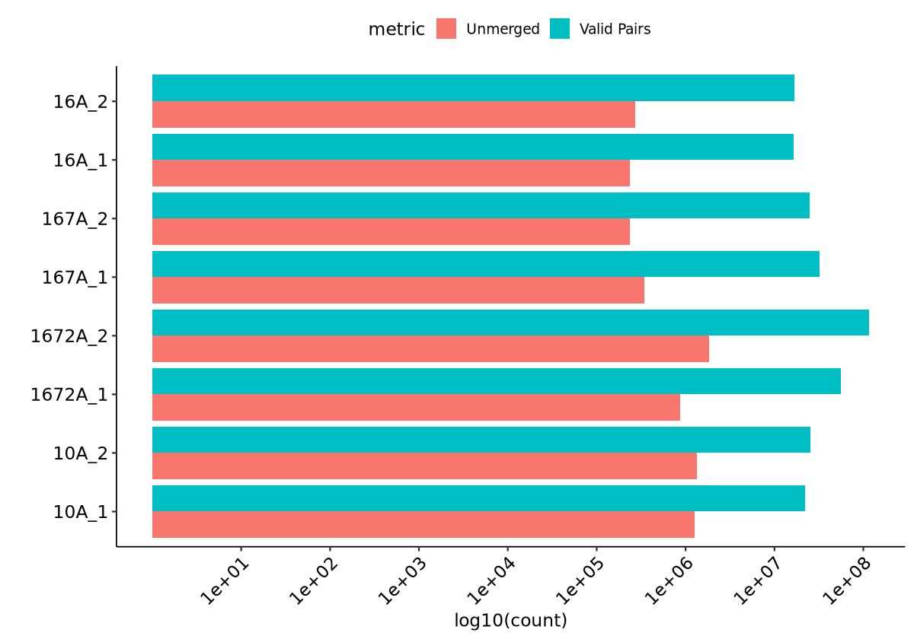
    


#### Merged Fragment Lengths


    
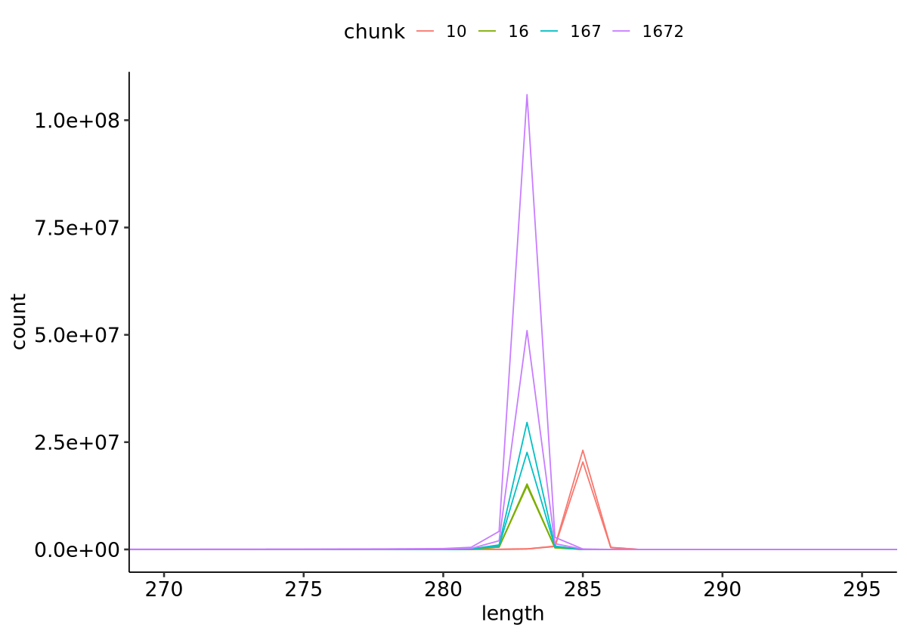
    


#### Unique Alignment Rate <a name="part2c"></a>


    
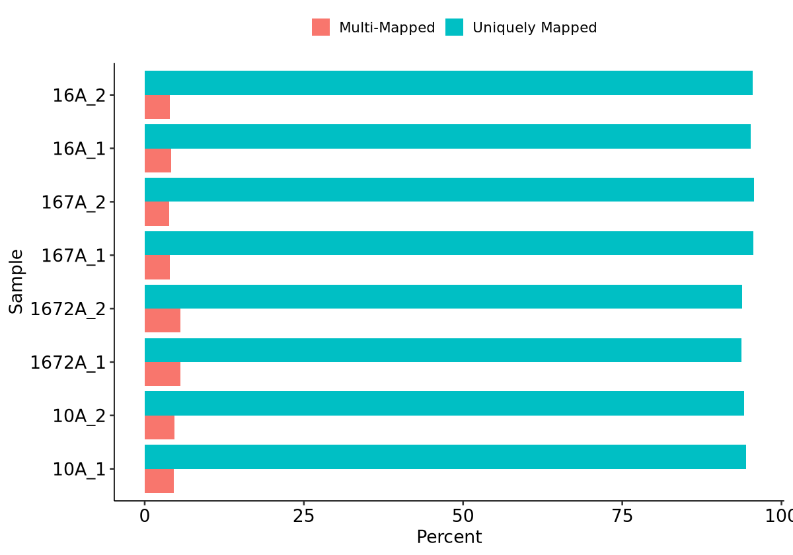
    


#### Edit Distance Distributions


    
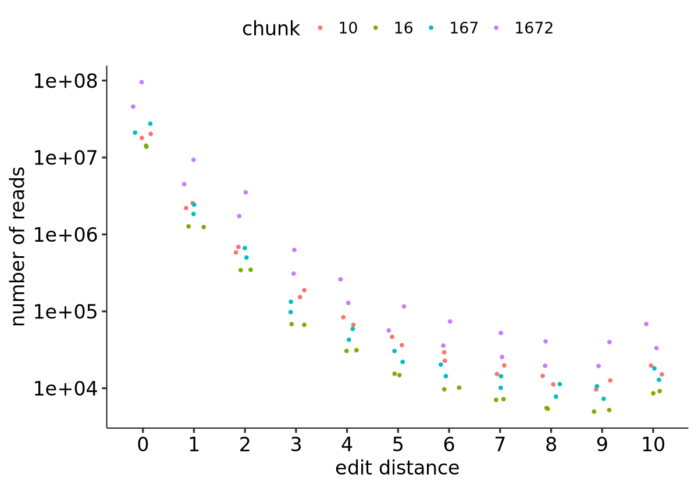
    


#### Edit Distance Proportion Distributions


    
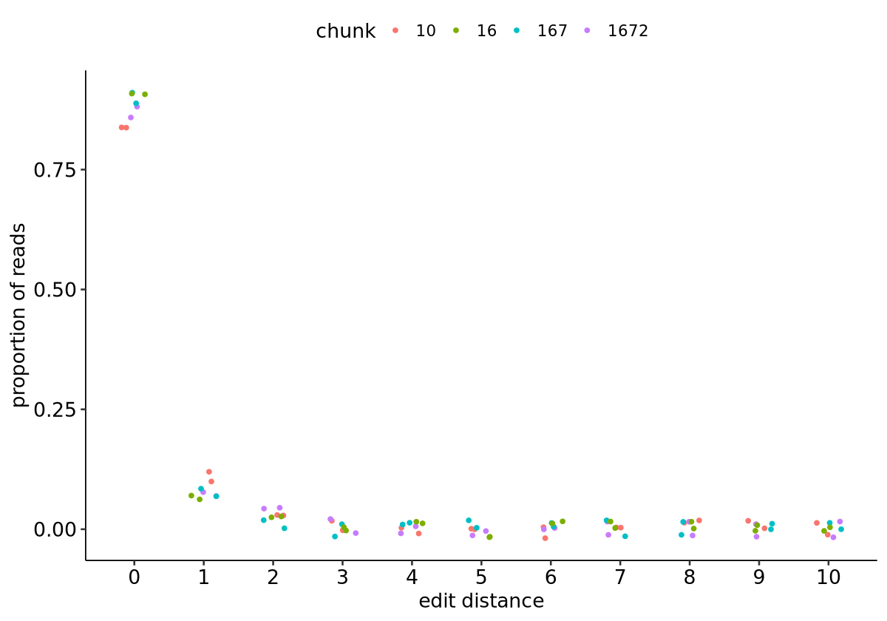
    


#### Reproduced Associations Per Barcode Sequence


    
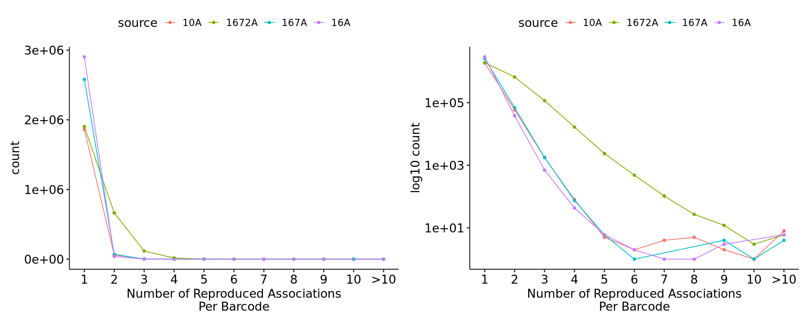
    


#### Filtered Barcode Counts Per Replicate Group


    
    
    |sample               |n       |
    |:--------------------|:-------|
    |10A.bcmap-filtered   |1648178 |
    |1672A.bcmap-filtered |1710239 |
    |167A.bcmap-filtered  |2306058 |
    |16A.bcmap-filtered   |2591696 |


### Read Sampling Distributions <a name="part3"></a>

#### Reads Per Barcode Without Binning


    
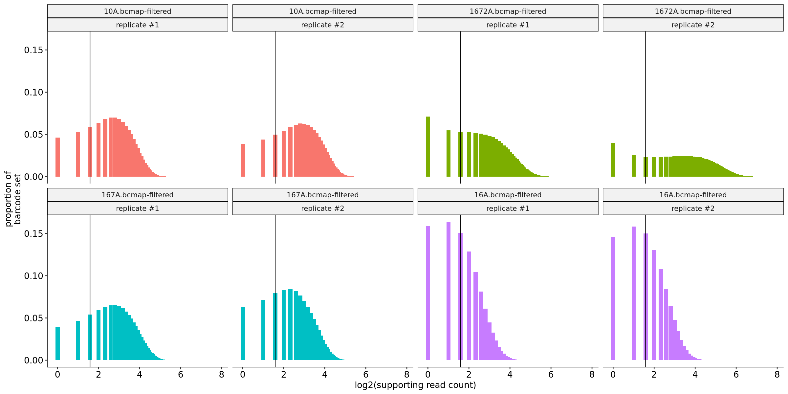
    


#### Reads Per Barcode With Binning


    
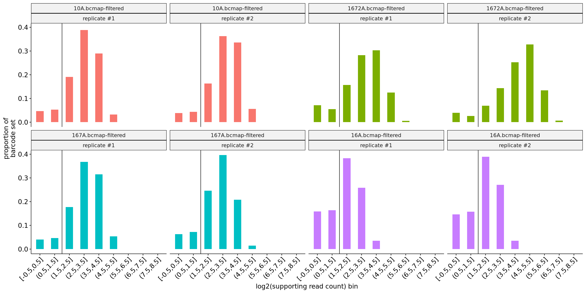
    


#### Barcode Purity Distributions


    
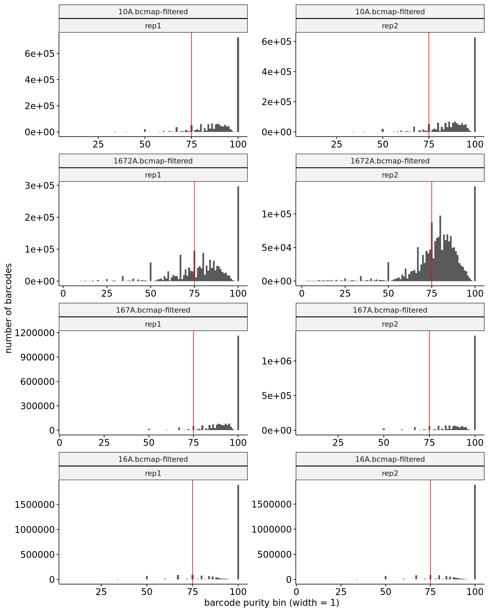
    


#### Barcode Counts Per Final Joined Map


    
    
    |sample               |final barcode count |
    |:--------------------|:-------------------|
    |10.bcmap-final.tsv   |1250578             |
    |16.bcmap-final.tsv   |1238272             |
    |167.bcmap-final.tsv  |1780352             |
    |1672.bcmap-final.tsv |741685              |


### Library Complexity and Coverage <a name="part4"></a>

#### Unique Barcodes Per Residue


    
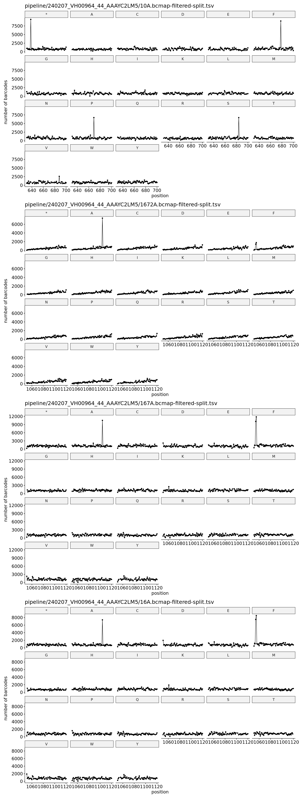
    


#### Unique Barcodes Per Residue, log10


    
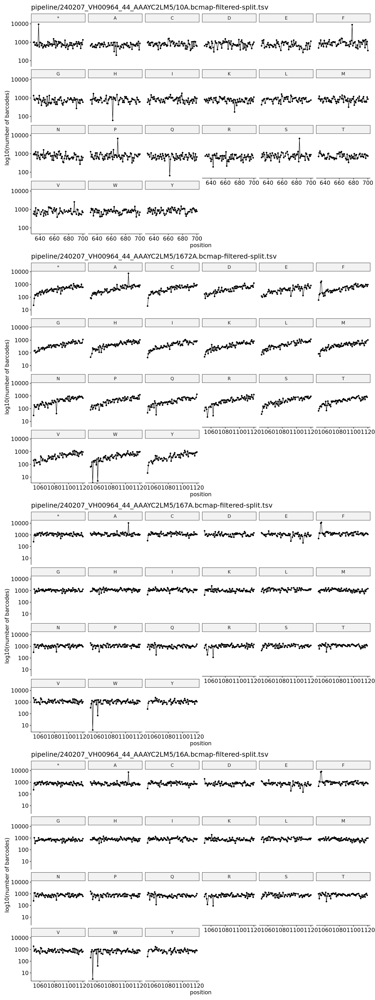
    


### RY Barcoding <a name="part5"></a>


    
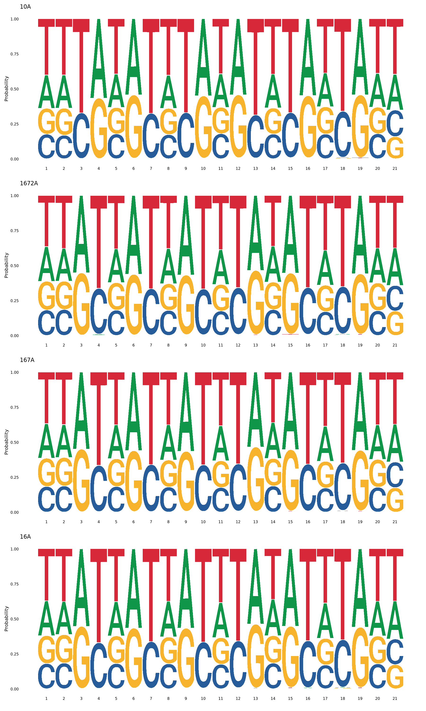
    

