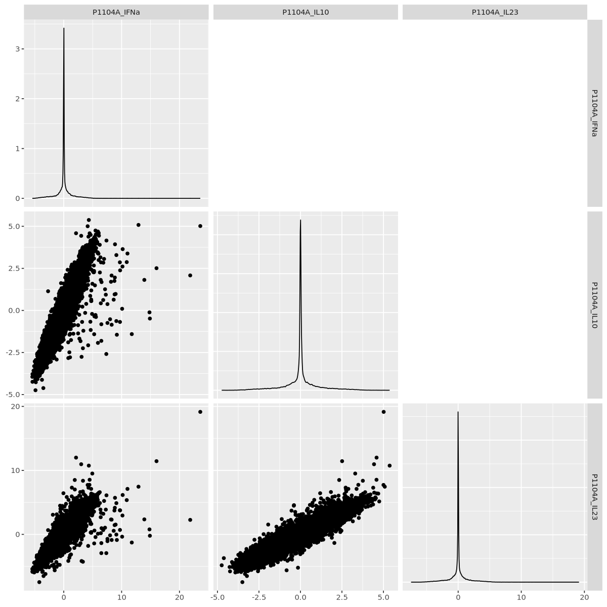
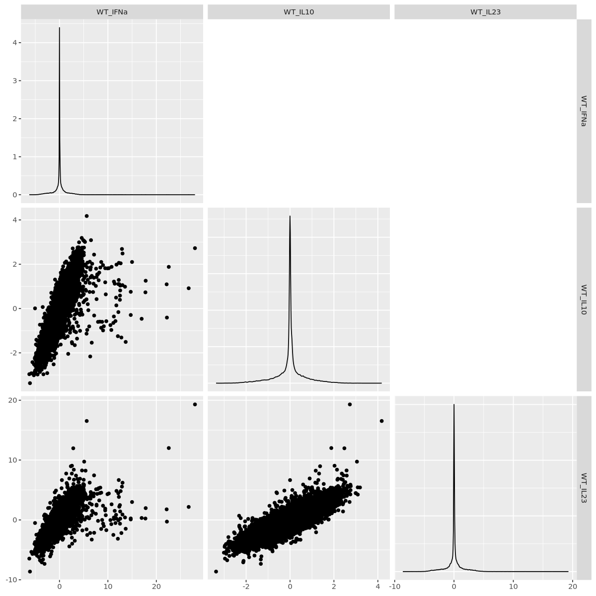
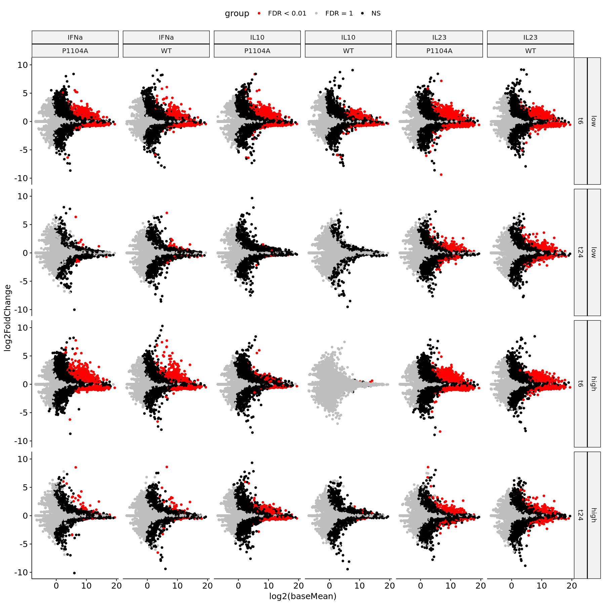

### TYK2 IL-23 RNA-seq Assay Combined Analysis


```R
library(ggpubr)
library(tximport)
library(DESeq2)
library(ggcorrplot)
library(furrr)
library(ggbiplot)
library(fs)
library(patchwork)
library(GGally)
library(rhdf5)
library(ComplexHeatmap)
library(tidyverse)
```

#### Dataset Properties <a name="part1"></a>


```R
alignments <- read_tsv("../pipeline/RNASEQ/diffexp/multiqc_data/multiqc_star.txt") %>%
    mutate(id = as.numeric(gsub("_.*", "", Sample)))

count_summary <- read_tsv("../pipeline/RNASEQ/diffexp/multiqc_data/multiqc_featureCounts.txt")  %>%
    mutate(id = as.numeric(gsub("_.*", "", Sample)))
```


```R
options(repr.plot.width = 8, repr.plot.height = 18)
alignments %>%
    ggplot() +
        geom_bar(aes(x = total_reads, y = reorder(Sample, -id)), stat = "identity") +
        theme_pubr(base_size = 16, x.text.angle = 45) +
        xlab("Total Read Depth") + ylab("") +
        ggtitle("Total Read Depth")
```


    

    


```R
alignments %>%
    ggplot() +
        geom_bar(aes(x = uniquely_mapped_percent/100, y = reorder(Sample, -1*as.numeric(id))), stat = "identity") +
        theme_pubr(base_size = 16, x.text.angle = 45) +
        xlab("Unique Alignment Rate") + ylab("") +
        ggtitle("Unique Alignment Rate")
```


    

    


```R
count_summary %>%
    ggplot() +
        geom_bar(aes(x = percent_assigned/100, y = reorder(Sample, -1*as.numeric(id))), stat = "identity") +
        theme_pubr(base_size = 16, x.text.angle = 45) +
        xlab("Gene Assignment Rate") + ylab("") +
        ggtitle("Gene Assignment Rate")
```


    

    


#### Unsupervised Profiles <a name="part2"></a>


```R
paths <- str_c("../pipeline/RNASEQ/diffexp/",
                    alignments$Sample,
                    ".counts.tsv")
names(paths) <- paths

df <- map_dfr(paths,
              ~read_tsv(.x,
                        col_names = NULL,
                        skip = 2,
                        col_select = c(1,7)),
              .id = "sample") %>%
    rename("gene" = "X1",
           "count" = "X7") %>%
    mutate(sample = gsub("../pipeline/RNASEQ/diffexp/|.counts.tsv", "", sample))

df_id <- df %>%
    mutate(id = as.character(gsub("_.*", "", sample))) %>%
    select(-sample) %>%
    arrange(id)
```


```R
samp_prop <- read_tsv("../sumstats/RNASEQ/run2/sample-properties-il23.tsv") %>%
    arrange(sample_id) %>%
    mutate(rep = rep(c(1,2), 40),
           covariate = as.factor(str_c(group, "_", cytokine, "_", dosage, "_", time)),
           sample_id = as.character(sample_id))
rownames(samp_prop) <- samp_prop$sample_id
```


```R
count_matrix <- inner_join(df_id, samp_prop, by = c("id" = "sample_id")) %>%
    filter(!is.na(covariate)) %>%
    arrange(time, group, cytokine, dosage, rep) %>%
    select(gene, covariate, rep, count)

count_matrix %>%
    count(gene) %>%
    dim()
```


<style>
.list-inline {list-style: none; margin:0; padding: 0}
.list-inline>li {display: inline-block}
.list-inline>li:not(:last-child)::after {content: "\00b7"; padding: 0 .5ex}
</style>
<ol class=list-inline><li>60607</li><li>2</li></ol>


```R
count_matrix_nonzero <- count_matrix %>%
    group_by(gene) %>%
    filter(sum(count) > 0)

count_matrix_nonzero %>%
    count(gene) %>%
    dim()
```


<style>
.list-inline {list-style: none; margin:0; padding: 0}
.list-inline>li {display: inline-block}
.list-inline>li:not(:last-child)::after {content: "\00b7"; padding: 0 .5ex}
</style>
<ol class=list-inline><li>35605</li><li>2</li></ol>


```R
count_matrix_thresh <- count_matrix_nonzero %>%
    group_by(gene) %>%
    filter(sum(count > 100) >= 2)

count_matrix_thresh %>%
    count(gene) %>%
    dim()
```


<style>
.list-inline {list-style: none; margin:0; padding: 0}
.list-inline>li {display: inline-block}
.list-inline>li:not(:last-child)::after {content: "\00b7"; padding: 0 .5ex}
</style>
<ol class=list-inline><li>10105</li><li>2</li></ol>


```R
options(repr.plot.width = 15, repr.plot.height = 15)
count_matrix_thresh %>%
    pivot_wider(names_from = rep, values_from = count) %>%
    ggplot() +
        geom_point(aes(x = `1`, y = `2`)) +
        theme_pubr() +
        facet_wrap(~covariate)
```


    

    


```R
options(repr.plot.width = 15, repr.plot.height = 15)
count_matrix_thresh %>%
    pivot_wider(names_from = rep, values_from = count) %>%
    ggplot() +
        geom_point(aes(x = log2(`1`+1), y = log2(`2`+1))) +
        theme_pubr() +
        facet_wrap(~covariate)
```


    

    


```R
count_matrix_wide <- count_matrix_thresh %>%
    mutate(count = log2(count+1)) %>%
    pivot_wider(names_from = covariate:rep, values_from = count)

cor_mat <- cor(count_matrix_wide[,-1], use = "pairwise.complete.obs")
```


```R
options(repr.plot.width = 12, repr.plot.height = 12)
ggcorrplot(cor_mat, hc.order = FALSE, type = "upper", show.diag = TRUE) +
    scale_fill_gradient2(limit = c(0.8,1), low = "blue", high =  "red", mid = "white", midpoint = 0.9)
```

    Scale for fill is already present.
    Adding another scale for fill, which will replace the existing scale.


    

    


```R
count_matrix_tr <- t(as.matrix(count_matrix_wide[,-1]))
pca_obj <- prcomp(count_matrix_tr)
pca_coords <- as_tibble(pca_obj$x) %>%
    mutate(sample = rownames(pca_obj$x)) %>%
    separate(sample, c("background", "cytokine", "dosage", "time", "rep"), "_")

options(repr.plot.width = 8, repr.plot.height = 8)
ggplot(pca_coords) +
    geom_point(aes(x = PC1, y = PC2,
                   color = time), size = 3) +
    theme_pubr(base_size = 16)
```


    

    


```R
idx_t6 <- grepl("t6", rownames(count_matrix_tr))

pca_obj_t6 <- prcomp(count_matrix_tr[idx_t6,])
pca_obj_t24 <- prcomp(count_matrix_tr[!idx_t6,])

pca_coords_t6 <- as_tibble(pca_obj_t6$x) %>%
    mutate(sample = rownames(pca_obj_t6$x)) %>%
    separate(sample, c("background", "cytokine", "dosage", "time", "rep"), "_")

pca_coords_t24 <- as_tibble(pca_obj_t24$x) %>%
    mutate(sample = rownames(pca_obj_t24$x)) %>%
    separate(sample, c("background", "cytokine", "dosage", "time", "rep"), "_")

pca_coords_dual <- bind_rows(pca_coords_t6,
                             pca_coords_t24)

options(repr.plot.width = 10, repr.plot.height = 5)
ggplot(pca_coords_dual) +
    geom_text(aes(x = PC1, y = PC2,
                  color = background,
                  label = str_c(cytokine, " ", dosage)),
              size = 3) +
    theme_pubr(base_size = 16) +
    facet_wrap(~time)
```


    

    


#### Statistical Modeling <a name="part3"></a>


```R
de_prop <- samp_prop %>%
    filter(!is.na(cytokine)) %>%
    arrange(covariate)
rownames(de_prop) <- str_c(de_prop$covariate, "_", de_prop$rep)

de_data <- df_id %>%
    inner_join(de_prop %>% select(sample_id, covariate, rep), by = c("id" = "sample_id")) %>%
    select(-id) %>%
    filter(!is.na(covariate)) %>%
    arrange(covariate, rep) %>%
    pivot_wider(names_from = covariate:rep, values_from = count)

log2_cpm <- de_data %>%
    pivot_longer(names_to = "sample", values_to = "count", -gene) %>%
    group_by(sample) %>%
    mutate(count = log2(count * 1000000 / sum(count, na.rm = TRUE)),
           count = if_else(is.infinite(count), NA, count)) %>%
    pivot_wider(names_from = sample, values_from = count)

write_tsv(de_data, "../sumstats/RNASEQ/run2/combined/raw-counts.tsv")
write_tsv(log2_cpm, "../sumstats/RNASEQ/run2/combined/log2-cpm.tsv")
```


```R
deobj_counts <- DESeqDataSetFromMatrix(countData = de_data %>% select(-gene),
    colData = de_prop,
    design = ~covariate)

deresult <- DESeq(deobj_counts)
```


```R
cov_group <- de_prop %>%
    filter(!grepl("none", covariate)) %>%
    distinct(covariate) %>%
    pull(covariate) %>%
    as.character()

none_group <- gsub("IFNa|IL10|IL23|low|high", "none", cov_group) %>%
    as.character()

plan(multicore, workers = 25)
norm_result <- future_map2(.x = cov_group,
                    .y = none_group,
                    ~results(deresult,
                             contrast = c("covariate", .x, .y),
                             independentFiltering = FALSE))

sumstats <- map2_dfr(norm_result,
                     cov_group,
                     ~bind_cols("gene" = de_data$gene,
                                            as_tibble(.x),
                                            "condition" = .y))

sumstats %>%
    separate(condition, c("background", "cytokine", "dosage", "time"), "_") %>%
    write_tsv("../sumstats/RNASEQ/run2/combined/deseq2-sumstats-vs-none.tsv")
```


```R
sumstats <- read_tsv( "../sumstats/RNASEQ/run2/combined/deseq2-sumstats-vs-none.tsv.gz")
split_sumstats <- sumstats %>%
    mutate(group = case_when(padj == 1 ~ "FDR = 1",
                             padj < 0.01 ~ "FDR < 0.01",
                             TRUE ~ "NS")) %>%
    mutate(time = relevel(as.factor(time), ref = "t6"),
           dosage = relevel(as.factor(dosage), ref = "low"))

ma_grid <- split_sumstats %>%
    ggplot() +
        geom_point(aes(x = log2(baseMean),
                       y = log2FoldChange,
                       color = group)) +
        theme_pubr(base_size = 15) +
        facet_grid(rows = vars(dosage, time),
                   cols = vars(cytokine, background)) +
        scale_color_manual(values = c("FDR = 1" = "gray",
                                      "NS" = "black",
                                      "FDR < 0.01" = "red"))
```


```R
options(repr.plot.width = 20, repr.plot.height = 20, warn = -1)
ma_grid
```


    

    


```R
volcano_grid <- split_sumstats %>%
    ggplot() +
        geom_point(aes(x = log2FoldChange,
                       y = -log10(pvalue),
                       color = group)) +
        theme_pubr(base_size = 15) +
        facet_grid(rows = vars(dosage, time),
                   cols = vars(cytokine, background)) +
        scale_color_manual(values = c("FDR = 1" = "gray",
                                      "NS" = "black",
                                      "FDR < 0.01" = "red")) +
        coord_cartesian(ylim = c(0, 50))

options(repr.plot.width = 20, repr.plot.height = 20, warn = -1)
volcano_grid
```


    

    


```R
sumstats_marg_dose <- sumstats %>%
    filter(time == "t6") %>%
    select(gene, log2FoldChange, lfcSE, background, cytokine, dosage) %>%
    pivot_wider(names_from = dosage, values_from = log2FoldChange:lfcSE) %>%
    drop_na() %>%
    mutate(effect = (log2FoldChange_high + log2FoldChange_low)/2,
           error = sqrt(lfcSE_high^2 + lfcSE_low^2),
           stat = effect/error) %>%
    select(gene, background, cytokine, effect, error, stat)
```


```R
sumstats_marg_dose_wide <- sumstats_marg_dose %>%
    select(-effect, -error) %>%
    pivot_wider(names_from = background:cytokine, values_from = stat) %>%
    arrange(-WT_IFNa)

sumstats_marg_dose_wide %>% head(10)
```


<table class="dataframe">
<caption>A tibble: 10 × 7</caption>
<thead>
	<tr><th scope=col>gene</th><th scope=col>P1104A_IFNa</th><th scope=col>P1104A_IL10</th><th scope=col>P1104A_IL23</th><th scope=col>WT_IFNa</th><th scope=col>WT_IL10</th><th scope=col>WT_IL23</th></tr>
	<tr><th scope=col>&lt;chr&gt;</th><th scope=col>&lt;dbl&gt;</th><th scope=col>&lt;dbl&gt;</th><th scope=col>&lt;dbl&gt;</th><th scope=col>&lt;dbl&gt;</th><th scope=col>&lt;dbl&gt;</th><th scope=col>&lt;dbl&gt;</th></tr>
</thead>
<tbody>
	<tr><td>STAT1 </td><td>23.599133</td><td> 5.01561536</td><td>19.14449444</td><td>27.98012</td><td> 2.7249167</td><td>19.2985085</td></tr>
	<tr><td>OAS2  </td><td>21.856462</td><td> 2.08089756</td><td> 2.26733494</td><td>26.68315</td><td> 0.9163157</td><td> 2.1712295</td></tr>
	<tr><td>PARP9 </td><td>16.032478</td><td> 2.51016469</td><td>11.44241518</td><td>22.57178</td><td> 1.8807420</td><td>12.0084712</td></tr>
	<tr><td>OAS1  </td><td>14.887134</td><td>-0.48186751</td><td>-0.21105494</td><td>22.18690</td><td>-0.4086254</td><td>-0.2835280</td></tr>
	<tr><td>EPSTI1</td><td>14.817647</td><td>-0.11348439</td><td> 0.78074351</td><td>22.13383</td><td> 1.0934202</td><td> 1.7674827</td></tr>
	<tr><td>SLFN5 </td><td>13.927253</td><td> 1.81420980</td><td> 2.34521737</td><td>17.80204</td><td> 1.2544153</td><td> 1.9709722</td></tr>
	<tr><td>HERC5 </td><td> 9.090210</td><td>-0.63184119</td><td>-0.02765965</td><td>17.74987</td><td> 0.7318314</td><td> 0.2346673</td></tr>
	<tr><td>CMPK2 </td><td>11.758464</td><td>-1.40688100</td><td>-1.26991568</td><td>16.97115</td><td>-0.4629770</td><td> 0.3230340</td></tr>
	<tr><td>EHD4  </td><td> 8.758219</td><td> 1.75091307</td><td> 3.73227426</td><td>14.98585</td><td> 2.1011319</td><td> 2.9903967</td></tr>
	<tr><td>RSAD2 </td><td>10.091023</td><td> 0.09748118</td><td>-0.35989935</td><td>14.71690</td><td>-0.2909626</td><td> 0.2465795</td></tr>
</tbody>
</table>


```R
options(repr.plot.width = 10, repr.plot.height = 10)
sumstats_marg_dose_wide %>%
    ggplot() +
        geom_text(aes(x = WT_IFNa, y = P1104A_IFNa, label = gene)) +
        theme_pubr()

sumstats_marg_dose_wide %>%
    ggplot() +
        geom_text(aes(x = WT_IL10, y = P1104A_IL10, label = gene)) +
        theme_pubr()

sumstats_marg_dose_wide %>%
    ggplot() +
        geom_text(aes(x = WT_IL23, y = P1104A_IL23, label = gene)) +
        theme_pubr()
```


    

    


    

    


    

    


```R
ggpairs(sumstats_marg_dose_wide[,2:4], upper = NULL)
```


    

    


```R
ggpairs(sumstats_marg_dose_wide[,5:7], upper = NULL)
```


    

    


```R
sumstats_marg_dose_wide %>%
    arrange(-WT_IL10) %>%
    head(10)
```


<table class="dataframe">
<caption>A tibble: 10 × 7</caption>
<thead>
	<tr><th scope=col>gene</th><th scope=col>P1104A_IFNa</th><th scope=col>P1104A_IL10</th><th scope=col>P1104A_IL23</th><th scope=col>WT_IFNa</th><th scope=col>WT_IL10</th><th scope=col>WT_IL23</th></tr>
	<tr><th scope=col>&lt;chr&gt;</th><th scope=col>&lt;dbl&gt;</th><th scope=col>&lt;dbl&gt;</th><th scope=col>&lt;dbl&gt;</th><th scope=col>&lt;dbl&gt;</th><th scope=col>&lt;dbl&gt;</th><th scope=col>&lt;dbl&gt;</th></tr>
</thead>
<tbody>
	<tr><td>PIM2  </td><td>2.124315</td><td>4.587469</td><td>11.998500</td><td>5.625667</td><td>4.176378</td><td>16.529604</td></tr>
	<tr><td>TFDP2 </td><td>5.667282</td><td>4.078956</td><td> 5.315371</td><td>4.595962</td><td>3.186488</td><td> 5.421322</td></tr>
	<tr><td>GVINP1</td><td>5.050956</td><td>2.315285</td><td> 3.412359</td><td>6.509803</td><td>3.086291</td><td> 4.240134</td></tr>
	<tr><td>LYRM7 </td><td>5.907984</td><td>4.688827</td><td> 6.377483</td><td>4.905800</td><td>3.084944</td><td> 5.440464</td></tr>
	<tr><td>STAT3 </td><td>4.333774</td><td>5.374815</td><td>10.744343</td><td>5.102312</td><td>3.048512</td><td> 9.734332</td></tr>
	<tr><td>GUCD1 </td><td>4.191879</td><td>3.369569</td><td> 4.608511</td><td>5.266288</td><td>3.006026</td><td> 4.449300</td></tr>
	<tr><td>CRCP  </td><td>2.937008</td><td>2.393677</td><td> 3.933511</td><td>4.044725</td><td>2.989337</td><td> 4.478554</td></tr>
	<tr><td>GNL2  </td><td>3.724021</td><td>2.933552</td><td> 5.425862</td><td>3.957386</td><td>2.764499</td><td> 5.640857</td></tr>
	<tr><td>BRCC3 </td><td>4.120881</td><td>3.076480</td><td> 5.186462</td><td>3.743955</td><td>2.756610</td><td> 4.972321</td></tr>
	<tr><td>CLPB  </td><td>5.381783</td><td>4.376700</td><td> 4.671957</td><td>5.060909</td><td>2.751558</td><td> 5.884119</td></tr>
</tbody>
</table>


```R
sumstats_marg_dose_wide %>%
    arrange(-WT_IL23) %>%
    head(10)
```


<table class="dataframe">
<caption>A tibble: 10 × 7</caption>
<thead>
	<tr><th scope=col>gene</th><th scope=col>P1104A_IFNa</th><th scope=col>P1104A_IL10</th><th scope=col>P1104A_IL23</th><th scope=col>WT_IFNa</th><th scope=col>WT_IL10</th><th scope=col>WT_IL23</th></tr>
	<tr><th scope=col>&lt;chr&gt;</th><th scope=col>&lt;dbl&gt;</th><th scope=col>&lt;dbl&gt;</th><th scope=col>&lt;dbl&gt;</th><th scope=col>&lt;dbl&gt;</th><th scope=col>&lt;dbl&gt;</th><th scope=col>&lt;dbl&gt;</th></tr>
</thead>
<tbody>
	<tr><td>STAT1  </td><td>23.599133</td><td>5.015615</td><td>19.144494</td><td>27.980124</td><td>2.724917</td><td>19.298509</td></tr>
	<tr><td>PIM2   </td><td> 2.124315</td><td>4.587469</td><td>11.998500</td><td> 5.625667</td><td>4.176378</td><td>16.529604</td></tr>
	<tr><td>PARP9  </td><td>16.032478</td><td>2.510165</td><td>11.442415</td><td>22.571785</td><td>1.880742</td><td>12.008471</td></tr>
	<tr><td>FNIP2  </td><td> 3.014875</td><td>4.434060</td><td>10.963870</td><td> 2.845747</td><td>2.475783</td><td>11.970651</td></tr>
	<tr><td>STAT3  </td><td> 4.333774</td><td>5.374815</td><td>10.744343</td><td> 5.102312</td><td>3.048512</td><td> 9.734332</td></tr>
	<tr><td>BCL3   </td><td> 1.401788</td><td>2.725364</td><td> 7.306666</td><td> 2.580103</td><td>2.028368</td><td> 9.052718</td></tr>
	<tr><td>PPP2R2B</td><td> 1.903606</td><td>2.334381</td><td> 8.500779</td><td> 2.350946</td><td>1.369216</td><td> 8.968227</td></tr>
	<tr><td>NPHP4  </td><td> 3.323257</td><td>3.759732</td><td> 8.380475</td><td> 2.956448</td><td>2.139827</td><td> 8.392867</td></tr>
	<tr><td>IL2RA  </td><td> 4.935191</td><td>3.299908</td><td> 9.509920</td><td> 4.653971</td><td>2.575930</td><td> 8.263397</td></tr>
	<tr><td>RNF144A</td><td> 4.734620</td><td>2.886194</td><td> 7.110421</td><td> 5.383636</td><td>1.170984</td><td> 8.229390</td></tr>
</tbody>
</table>


```R

```

#### Differentially Expressed Genes <a name="part4"></a>


```R
vsd <- assay(vst(deresult, blind = FALSE))
vsd <- cbind(vsd, "row_var" = rowVars(vsd, na.rm = TRUE))

vsd_gene <- bind_cols("gene" = de_data$gene,
                      vsd) %>%
    pivot_longer(names_to = "sample", values_to = "norm_value", P1104A_IFNa_high_t24_1:WT_none_none_t6_2) %>%
    inner_join(de_prop %>% mutate(sample_id = str_c(covariate, "_", rep)),
               by = c("sample" = "sample_id")) %>%
    arrange(cytokine, group, dosage, time, rep)

var_genes <- vsd_gene %>%
    select(gene, row_var) %>%
    distinct() %>%
    arrange(-row_var) %>%
    head(500) %>%
    pull(gene)

vsd_gene_wide_sig <- vsd_gene %>%
    filter(gene %in% var_genes) %>%
    mutate(sample_name = str_c(cytokine, " ", dosage, " ", group, " ", time, " ", rep)) %>%
    select(gene, sample_name, norm_value) %>%
    pivot_wider(names_from = sample_name, values_from = norm_value)

vsd_gene_wide_all <- vsd_gene %>%
    mutate(sample_name = str_c(cytokine, " ", dosage, " ", group, " ", time, " ", rep)) %>%
    select(gene, sample_name, norm_value) %>%
    pivot_wider(names_from = sample_name, values_from = norm_value)

vsd_format <- vsd_gene_wide_all
names(vsd_format)[-1] <- gsub(" ", "_", names(vsd_format)[-1])
vsd_format %>% write_tsv("../sumstats/RNASEQ/run2/combined/deseq2-variance-stabilized-quants.tsv")
```


```R
options(repr.plot.width = 13.5, repr.plot.height = 12)
Heatmap(t(as.matrix(vsd_gene_wide_sig[,-1])),
        column_title = "Top 500 Most Variable Genes",
        cluster_columns = TRUE,
        cluster_rows = FALSE,
        row_split = gsub(" .*", "", names(vsd_gene_wide_sig[,-1])),
        use_raster = TRUE,
        raster_by_magick = TRUE,
        name = "Variance\nStabilized\nLog-Mean")
```

    Loading required namespace: magick
    


    

    


#### Results from Kallisto Quantifications


```R
tx2gene_df <- read_tsv("../data/reference/hg38/kallisto/gencode.v41.pc_transcripts.luciferase.tx2gene.tsv")
abundance_files <- dir_ls(path = "../pipeline/RNASEQ/diffexp/kallisto/",
                          regexp = ".*_kallisto/abundance.h5",
                          recurse = TRUE)
names(abundance_files) <- gsub("../pipeline/RNASEQ/diffexp/kallisto/|_kallisto/abundance.h5",
                               "",
                               abundance_files)
```

    Rows: 110224 Columns: 2
    ── Column specification ────────────────────────────────────────────────────────
    Delimiter: "\t"
    chr (2): ENST00000641515.2, OR4F5
    
    ℹ Use `spec()` to retrieve the full column specification for this data.
    ℹ Specify the column types or set `show_col_types = FALSE` to quiet this message.


```R
kallisto_import <- tximport(abundance_files,
                            type = "kallisto",
                            tx2gene = tx2gene_df,
                            ignoreAfterBar = TRUE)
```

    1 
    2 
    3 
    4 
    5 
    6 
    7 
    8 
    9 
    10 
    11 
    12 
    13 
    14 
    15 
    16 
    17 
    18 
    19 
    20 
    21 
    22 
    23 
    24 
    25 
    26 
    27 
    28 
    29 
    30 
    31 
    32 
    33 
    34 
    35 
    36 
    37 
    38 
    39 
    40 
    41 
    42 
    43 
    44 
    45 
    46 
    47 
    48 
    49 
    50 
    51 
    52 
    53 
    54 
    55 
    56 
    
    
    transcripts missing from tx2gene: 1
    
    summarizing abundance
    
    summarizing counts
    
    summarizing length
    


```R
abundances <- as_tibble(kallisto_import$abundance) %>%
    mutate(gene = rownames(kallisto_import$abundance)) %>%
    pivot_longer(names_to = "sample", values_to = "abundance", -gene)

de_prop <- samp_prop %>%
    filter(!is.na(cytokine)) %>%
    arrange(covariate)
rownames(de_prop) <- str_c(de_prop$sample_id, "_", de_prop$covariate)

de_prop <- de_prop %>% arrange(match(rownames(de_prop), colnames(kallisto_import$counts)))
```

    Warning message:
    “Setting row names on a tibble is deprecated.”


```R
deobj_counts <- DESeqDataSetFromTximport(kallisto_import,
    colData = de_prop,
    design = ~covariate)
```


```R
deresult <- DESeq(deobj_counts)
```

    estimating size factors
    
    using 'avgTxLength' from assays(dds), correcting for library size
    
    estimating dispersions
    
    gene-wise dispersion estimates
    
    mean-dispersion relationship
    
    final dispersion estimates
    
    fitting model and testing
    


```R
cov_group <- de_prop %>%
    filter(!grepl("none", covariate)) %>%
    distinct(covariate) %>%
    pull(covariate) %>%
    as.character()

none_group <- gsub("IFNa|IL10|IL23|low|high", "none", cov_group) %>%
    as.character()

plan(multicore, workers = 25)
norm_result <- future_map2(.x = cov_group,
                    .y = none_group,
                    ~results(deresult,
                             contrast = c("covariate", .x, .y),
                             independentFiltering = FALSE))
```


```R
sumstats <- map2_dfr(norm_result,
                     cov_group,
                     ~bind_cols("gene" = rownames(kallisto_import$counts),
                                            as_tibble(.x),
                                            "condition" = .y))
```


```R
sumstats %>%
    separate(condition, c("background", "cytokine", "dosage", "time"), "_") %>%
    write_tsv("../sumstats/RNASEQ/run2/combined/deseq2-kallisto-sumstats-vs-none.tsv")
```


```R
split_sumstats <- sumstats %>%
    separate(condition, c("background", "cytokine", "dosage", "time"), "_") %>%
    mutate(group = case_when(padj == 1 ~ "FDR = 1",
                             padj < 0.01 ~ "FDR < 0.01",
                             TRUE ~ "NS")) %>%
    mutate(time = relevel(as.factor(time), ref = "t6"),
           dosage = relevel(as.factor(dosage), ref = "low"))

ma_grid <- split_sumstats %>%
    ggplot() +
        geom_point(aes(x = log2(baseMean),
                       y = log2FoldChange,
                       color = group)) +
        theme_pubr(base_size = 15) +
        facet_grid(rows = vars(dosage, time),
                   cols = vars(cytokine, background)) +
        scale_color_manual(values = c("FDR = 1" = "gray",
                                      "NS" = "black",
                                      "FDR < 0.01" = "red"))
```


```R
options(repr.plot.width = 15, repr.plot.height = 15)
ma_grid
```

    Warning message:
    “Removed 55416 rows containing missing values (`geom_point()`).”


    

    


```R

```


```R

```
