### TYK2 IL-23 RNA-seq Assay Combined Analysis

1. [Dataset Properties](#part1)
2. [Unsupervised Profiles](#part2)
3. [Statistical Modeling](#part3)
4. [DEG Heatmaps](#part4)
5. [Results from Kallisto Quantifications](#part5)
6. [WT vs P1104A Direct Comparisons](#part6)


```R
library(ggpubr)
library(tximport)
library(DESeq2)
library(ggcorrplot)
library(furrr)
library(ggbiplot)
library(fs)
library(patchwork)
library(GGally)
library(rhdf5)
library(ComplexHeatmap)
library(tidyverse)
```

#### Dataset Properties <a name="part1"></a>


```R
alignments <- read_tsv("../pipeline/RNASEQ/diffexp/multiqc_data/multiqc_star.txt") %>%
    mutate(id = as.numeric(gsub("_.*", "", Sample)))

count_summary <- read_tsv("../pipeline/RNASEQ/diffexp/multiqc_data/multiqc_featureCounts.txt")  %>%
    mutate(id = as.numeric(gsub("_.*", "", Sample)))
```


```R
options(repr.plot.width = 8, repr.plot.height = 18)
alignments %>%
    ggplot() +
        geom_bar(aes(x = total_reads, y = reorder(Sample, -id)), stat = "identity") +
        theme_pubr(base_size = 16, x.text.angle = 45) +
        xlab("Total Read Depth") + ylab("") +
        ggtitle("Total Read Depth")
```


    
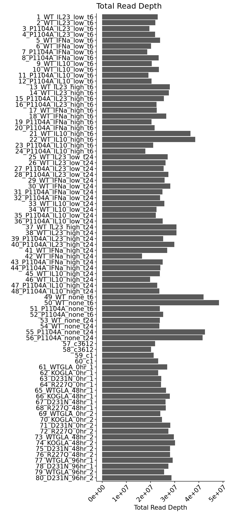
    


```R
alignments %>%
    ggplot() +
        geom_bar(aes(x = uniquely_mapped_percent/100, y = reorder(Sample, -1*as.numeric(id))), stat = "identity") +
        theme_pubr(base_size = 16, x.text.angle = 45) +
        xlab("Unique Alignment Rate") + ylab("") +
        ggtitle("Unique Alignment Rate")
```


    

    


```R
count_summary %>%
    ggplot() +
        geom_bar(aes(x = percent_assigned/100, y = reorder(Sample, -1*as.numeric(id))), stat = "identity") +
        theme_pubr(base_size = 16, x.text.angle = 45) +
        xlab("Gene Assignment Rate") + ylab("") +
        ggtitle("Gene Assignment Rate")
```


    
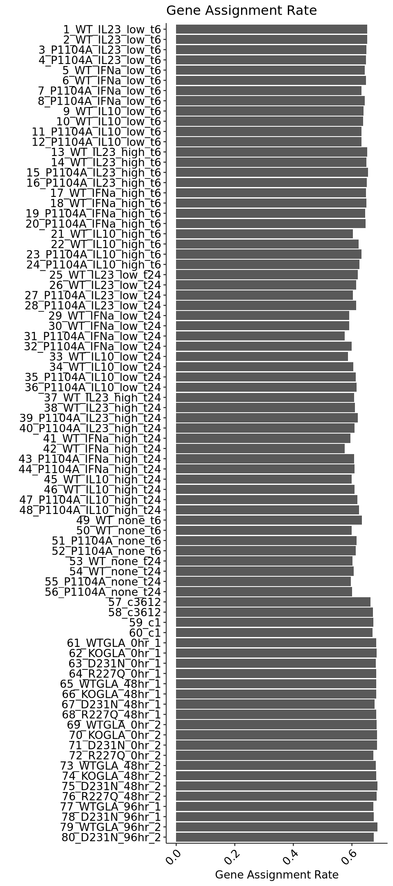
    


#### Unsupervised Profiles <a name="part2"></a>


```R
paths <- str_c("../pipeline/RNASEQ/diffexp/",
                    alignments$Sample,
                    ".counts.tsv")
names(paths) <- paths

df <- map_dfr(paths,
              ~read_tsv(.x,
                        col_names = NULL,
                        skip = 2,
                        col_select = c(1,7)),
              .id = "sample") %>%
    rename("gene" = "X1",
           "count" = "X7") %>%
    mutate(sample = gsub("../pipeline/RNASEQ/diffexp/|.counts.tsv", "", sample))

df_id <- df %>%
    mutate(id = as.character(gsub("_.*", "", sample))) %>%
    select(-sample) %>%
    arrange(id)
```


```R
samp_prop <- read_tsv("../sumstats/RNASEQ/run2/sample-properties-il23.tsv") %>%
    arrange(sample_id) %>%
    mutate(rep = rep(c(1,2), 40),
           covariate = as.factor(str_c(group, "_", cytokine, "_", dosage, "_", time)),
           sample_id = as.character(sample_id))
rownames(samp_prop) <- samp_prop$sample_id
```


```R
count_matrix <- inner_join(df_id, samp_prop, by = c("id" = "sample_id")) %>%
    filter(!is.na(covariate)) %>%
    arrange(time, group, cytokine, dosage, rep) %>%
    select(gene, covariate, rep, count)

count_matrix %>%
    count(gene) %>%
    dim()
```


<style>
.list-inline {list-style: none; margin:0; padding: 0}
.list-inline>li {display: inline-block}
.list-inline>li:not(:last-child)::after {content: "\00b7"; padding: 0 .5ex}
</style>
<ol class=list-inline><li>60607</li><li>2</li></ol>


```R
count_matrix_nonzero <- count_matrix %>%
    group_by(gene) %>%
    filter(sum(count) > 0)

count_matrix_nonzero %>%
    count(gene) %>%
    dim()
```


<style>
.list-inline {list-style: none; margin:0; padding: 0}
.list-inline>li {display: inline-block}
.list-inline>li:not(:last-child)::after {content: "\00b7"; padding: 0 .5ex}
</style>
<ol class=list-inline><li>35605</li><li>2</li></ol>


```R
count_matrix_thresh <- count_matrix_nonzero %>%
    group_by(gene) %>%
    filter(sum(count > 100) >= 2)

count_matrix_thresh %>%
    count(gene) %>%
    dim()
```


<style>
.list-inline {list-style: none; margin:0; padding: 0}
.list-inline>li {display: inline-block}
.list-inline>li:not(:last-child)::after {content: "\00b7"; padding: 0 .5ex}
</style>
<ol class=list-inline><li>10105</li><li>2</li></ol>


```R
options(repr.plot.width = 15, repr.plot.height = 15)
count_matrix_thresh %>%
    pivot_wider(names_from = rep, values_from = count) %>%
    ggplot() +
        geom_point(aes(x = `1`, y = `2`)) +
        theme_pubr() +
        facet_wrap(~covariate)
```


    
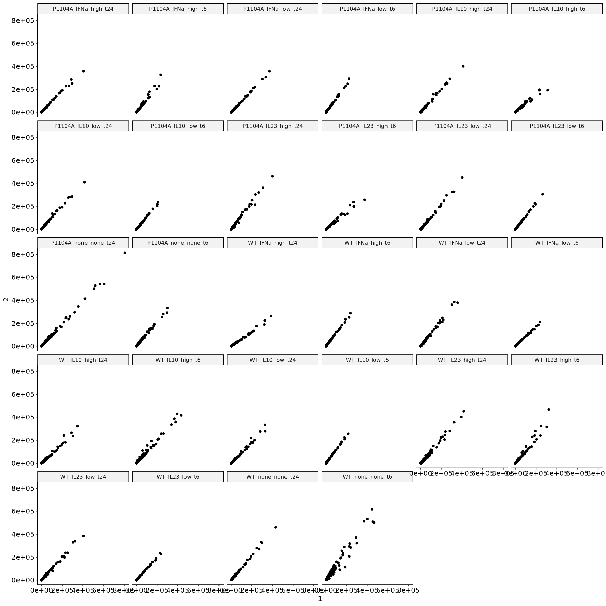
    


```R
options(repr.plot.width = 15, repr.plot.height = 15)
count_matrix_thresh %>%
    pivot_wider(names_from = rep, values_from = count) %>%
    ggplot() +
        geom_point(aes(x = log2(`1`+1), y = log2(`2`+1))) +
        theme_pubr() +
        facet_wrap(~covariate)
```


    
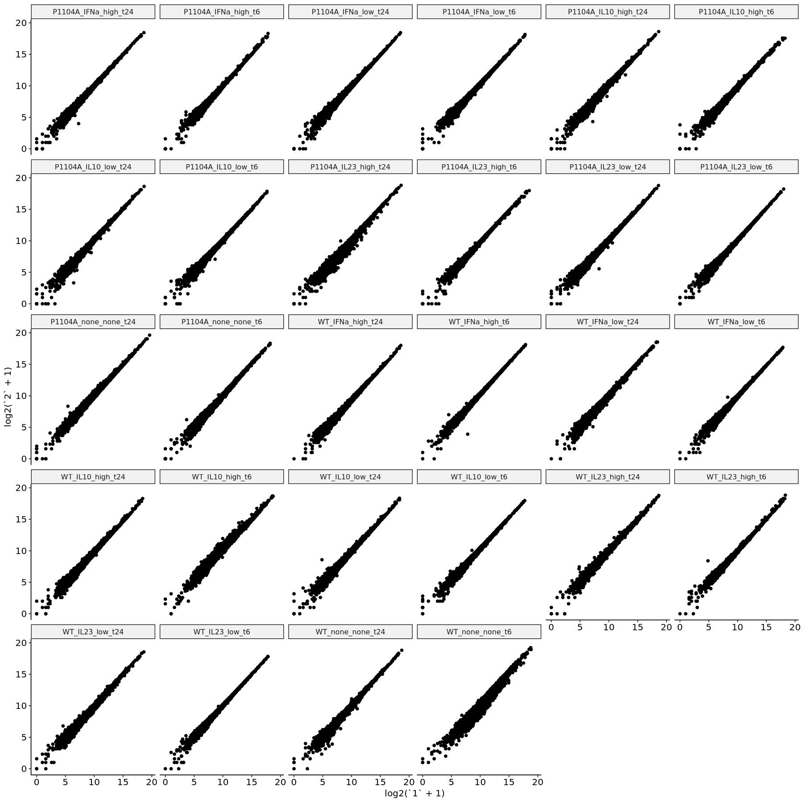
    


```R
count_matrix_wide <- count_matrix_thresh %>%
    mutate(count = log2(count+1)) %>%
    pivot_wider(names_from = covariate:rep, values_from = count)

cor_mat <- cor(count_matrix_wide[,-1], use = "pairwise.complete.obs")
```


```R
options(repr.plot.width = 12, repr.plot.height = 12)
ggcorrplot(cor_mat, hc.order = FALSE, type = "upper", show.diag = TRUE) +
    scale_fill_gradient2(limit = c(0.8,1), low = "blue", high =  "red", mid = "white", midpoint = 0.9)
```

    Scale for fill is already present.
    Adding another scale for fill, which will replace the existing scale.


    
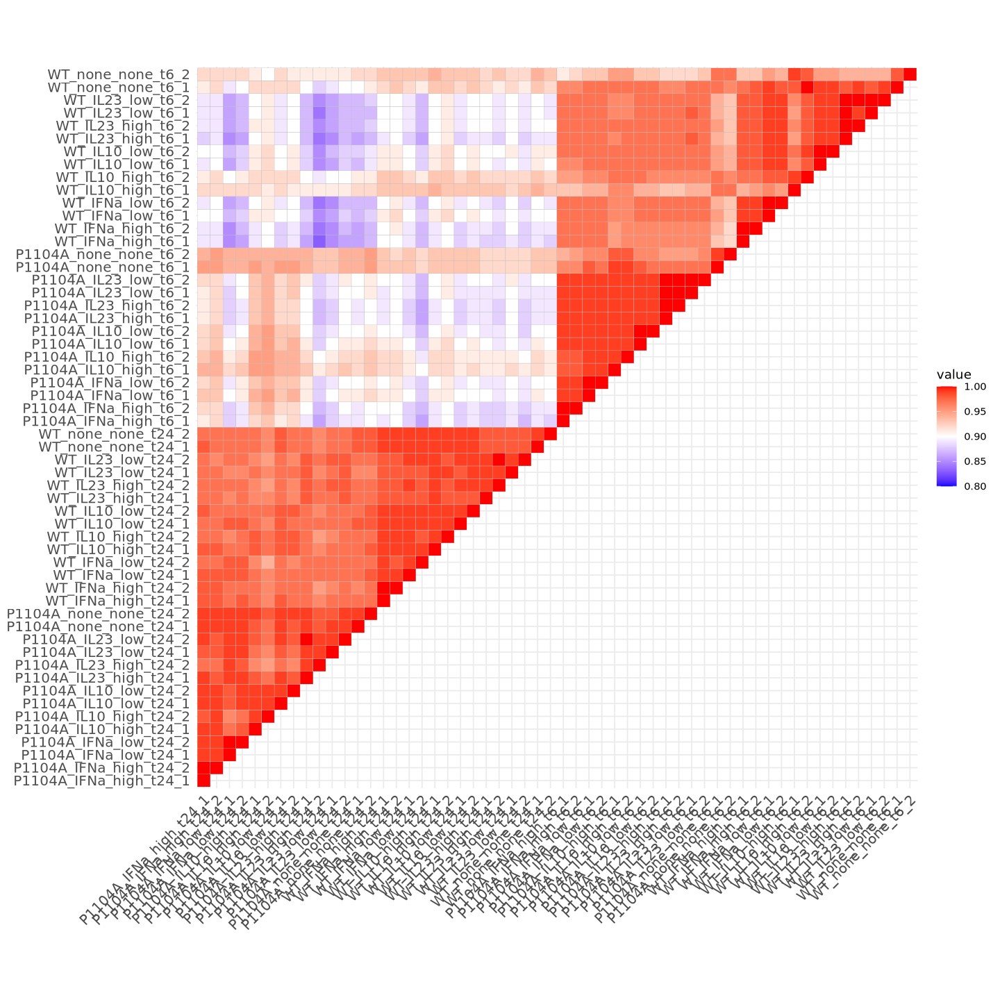
    


```R
count_matrix_tr <- t(as.matrix(count_matrix_wide[,-1]))
pca_obj <- prcomp(count_matrix_tr)
pca_coords <- as_tibble(pca_obj$x) %>%
    mutate(sample = rownames(pca_obj$x)) %>%
    separate(sample, c("background", "cytokine", "dosage", "time", "rep"), "_")

options(repr.plot.width = 8, repr.plot.height = 8)
ggplot(pca_coords) +
    geom_point(aes(x = PC1, y = PC2,
                   color = time), size = 3) +
    theme_pubr(base_size = 16)
```


    
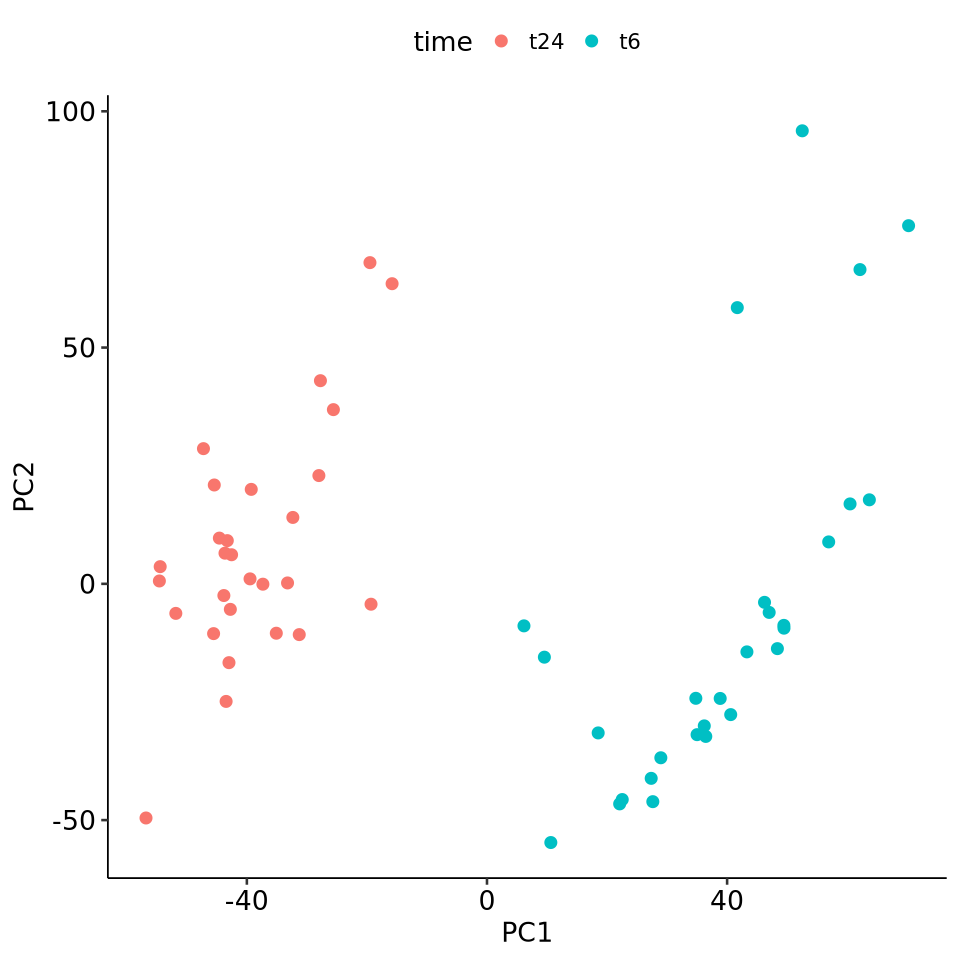
    


```R
idx_t6 <- grepl("t6", rownames(count_matrix_tr))

pca_obj_t6 <- prcomp(count_matrix_tr[idx_t6,])
pca_obj_t24 <- prcomp(count_matrix_tr[!idx_t6,])

pca_coords_t6 <- as_tibble(pca_obj_t6$x) %>%
    mutate(sample = rownames(pca_obj_t6$x)) %>%
    separate(sample, c("background", "cytokine", "dosage", "time", "rep"), "_")

pca_coords_t24 <- as_tibble(pca_obj_t24$x) %>%
    mutate(sample = rownames(pca_obj_t24$x)) %>%
    separate(sample, c("background", "cytokine", "dosage", "time", "rep"), "_")

pca_coords_dual <- bind_rows(pca_coords_t6,
                             pca_coords_t24)

options(repr.plot.width = 10, repr.plot.height = 5)
ggplot(pca_coords_dual) +
    geom_text(aes(x = PC1, y = PC2,
                  color = background,
                  label = str_c(cytokine, " ", dosage)),
              size = 3) +
    theme_pubr(base_size = 16) +
    facet_wrap(~time)
```


    
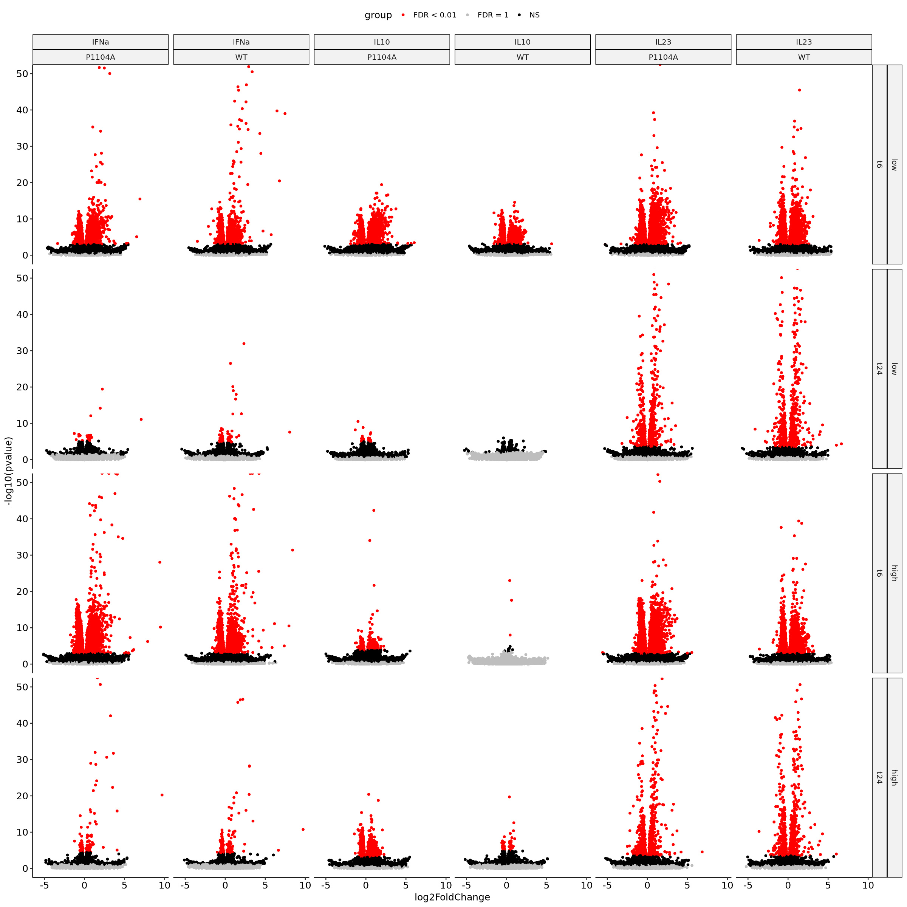
    


#### Statistical Modeling <a name="part3"></a>


```R
de_prop <- samp_prop %>%
    filter(!is.na(cytokine)) %>%
    arrange(covariate)
rownames(de_prop) <- str_c(de_prop$covariate, "_", de_prop$rep)

de_data <- df_id %>%
    inner_join(de_prop %>% select(sample_id, covariate, rep), by = c("id" = "sample_id")) %>%
    select(-id) %>%
    filter(!is.na(covariate)) %>%
    arrange(covariate, rep) %>%
    pivot_wider(names_from = covariate:rep, values_from = count)

log2_cpm <- de_data %>%
    pivot_longer(names_to = "sample", values_to = "count", -gene) %>%
    group_by(sample) %>%
    mutate(count = log2(count * 1000000 / sum(count, na.rm = TRUE)),
           count = if_else(is.infinite(count), NA, count)) %>%
    pivot_wider(names_from = sample, values_from = count)

#write_tsv(de_data, "../sumstats/RNASEQ/run2/combined/raw-counts.tsv")
#write_tsv(log2_cpm, "../sumstats/RNASEQ/run2/combined/log2-cpm.tsv")
```


```R
de_prop
```


<table class="dataframe">
<caption>A tibble: 56 × 7</caption>
<thead>
	<tr><th></th><th scope=col>sample_id</th><th scope=col>group</th><th scope=col>cytokine</th><th scope=col>dosage</th><th scope=col>time</th><th scope=col>rep</th><th scope=col>covariate</th></tr>
	<tr><th></th><th scope=col>&lt;chr&gt;</th><th scope=col>&lt;chr&gt;</th><th scope=col>&lt;chr&gt;</th><th scope=col>&lt;chr&gt;</th><th scope=col>&lt;chr&gt;</th><th scope=col>&lt;dbl&gt;</th><th scope=col>&lt;fct&gt;</th></tr>
</thead>
<tbody>
	<tr><th scope=row>P1104A_IFNa_high_t24_1</th><td>43</td><td>P1104A</td><td>IFNa</td><td>high</td><td>t24</td><td>1</td><td>P1104A_IFNa_high_t24</td></tr>
	<tr><th scope=row>P1104A_IFNa_high_t24_2</th><td>44</td><td>P1104A</td><td>IFNa</td><td>high</td><td>t24</td><td>2</td><td>P1104A_IFNa_high_t24</td></tr>
	<tr><th scope=row>P1104A_IFNa_high_t6_1</th><td>19</td><td>P1104A</td><td>IFNa</td><td>high</td><td>t6 </td><td>1</td><td>P1104A_IFNa_high_t6 </td></tr>
	<tr><th scope=row>P1104A_IFNa_high_t6_2</th><td>20</td><td>P1104A</td><td>IFNa</td><td>high</td><td>t6 </td><td>2</td><td>P1104A_IFNa_high_t6 </td></tr>
	<tr><th scope=row>P1104A_IFNa_low_t24_1</th><td>31</td><td>P1104A</td><td>IFNa</td><td>low </td><td>t24</td><td>1</td><td>P1104A_IFNa_low_t24 </td></tr>
	<tr><th scope=row>P1104A_IFNa_low_t24_2</th><td>32</td><td>P1104A</td><td>IFNa</td><td>low </td><td>t24</td><td>2</td><td>P1104A_IFNa_low_t24 </td></tr>
	<tr><th scope=row>P1104A_IFNa_low_t6_1</th><td>7 </td><td>P1104A</td><td>IFNa</td><td>low </td><td>t6 </td><td>1</td><td>P1104A_IFNa_low_t6  </td></tr>
	<tr><th scope=row>P1104A_IFNa_low_t6_2</th><td>8 </td><td>P1104A</td><td>IFNa</td><td>low </td><td>t6 </td><td>2</td><td>P1104A_IFNa_low_t6  </td></tr>
	<tr><th scope=row>P1104A_IL10_high_t24_1</th><td>47</td><td>P1104A</td><td>IL10</td><td>high</td><td>t24</td><td>1</td><td>P1104A_IL10_high_t24</td></tr>
	<tr><th scope=row>P1104A_IL10_high_t24_2</th><td>48</td><td>P1104A</td><td>IL10</td><td>high</td><td>t24</td><td>2</td><td>P1104A_IL10_high_t24</td></tr>
	<tr><th scope=row>P1104A_IL10_high_t6_1</th><td>23</td><td>P1104A</td><td>IL10</td><td>high</td><td>t6 </td><td>1</td><td>P1104A_IL10_high_t6 </td></tr>
	<tr><th scope=row>P1104A_IL10_high_t6_2</th><td>24</td><td>P1104A</td><td>IL10</td><td>high</td><td>t6 </td><td>2</td><td>P1104A_IL10_high_t6 </td></tr>
	<tr><th scope=row>P1104A_IL10_low_t24_1</th><td>35</td><td>P1104A</td><td>IL10</td><td>low </td><td>t24</td><td>1</td><td>P1104A_IL10_low_t24 </td></tr>
	<tr><th scope=row>P1104A_IL10_low_t24_2</th><td>36</td><td>P1104A</td><td>IL10</td><td>low </td><td>t24</td><td>2</td><td>P1104A_IL10_low_t24 </td></tr>
	<tr><th scope=row>P1104A_IL10_low_t6_1</th><td>11</td><td>P1104A</td><td>IL10</td><td>low </td><td>t6 </td><td>1</td><td>P1104A_IL10_low_t6  </td></tr>
	<tr><th scope=row>P1104A_IL10_low_t6_2</th><td>12</td><td>P1104A</td><td>IL10</td><td>low </td><td>t6 </td><td>2</td><td>P1104A_IL10_low_t6  </td></tr>
	<tr><th scope=row>P1104A_IL23_high_t24_1</th><td>39</td><td>P1104A</td><td>IL23</td><td>high</td><td>t24</td><td>1</td><td>P1104A_IL23_high_t24</td></tr>
	<tr><th scope=row>P1104A_IL23_high_t24_2</th><td>40</td><td>P1104A</td><td>IL23</td><td>high</td><td>t24</td><td>2</td><td>P1104A_IL23_high_t24</td></tr>
	<tr><th scope=row>P1104A_IL23_high_t6_1</th><td>15</td><td>P1104A</td><td>IL23</td><td>high</td><td>t6 </td><td>1</td><td>P1104A_IL23_high_t6 </td></tr>
	<tr><th scope=row>P1104A_IL23_high_t6_2</th><td>16</td><td>P1104A</td><td>IL23</td><td>high</td><td>t6 </td><td>2</td><td>P1104A_IL23_high_t6 </td></tr>
	<tr><th scope=row>P1104A_IL23_low_t24_1</th><td>27</td><td>P1104A</td><td>IL23</td><td>low </td><td>t24</td><td>1</td><td>P1104A_IL23_low_t24 </td></tr>
	<tr><th scope=row>P1104A_IL23_low_t24_2</th><td>28</td><td>P1104A</td><td>IL23</td><td>low </td><td>t24</td><td>2</td><td>P1104A_IL23_low_t24 </td></tr>
	<tr><th scope=row>P1104A_IL23_low_t6_1</th><td>3 </td><td>P1104A</td><td>IL23</td><td>low </td><td>t6 </td><td>1</td><td>P1104A_IL23_low_t6  </td></tr>
	<tr><th scope=row>P1104A_IL23_low_t6_2</th><td>4 </td><td>P1104A</td><td>IL23</td><td>low </td><td>t6 </td><td>2</td><td>P1104A_IL23_low_t6  </td></tr>
	<tr><th scope=row>P1104A_none_none_t24_1</th><td>55</td><td>P1104A</td><td>none</td><td>none</td><td>t24</td><td>1</td><td>P1104A_none_none_t24</td></tr>
	<tr><th scope=row>P1104A_none_none_t24_2</th><td>56</td><td>P1104A</td><td>none</td><td>none</td><td>t24</td><td>2</td><td>P1104A_none_none_t24</td></tr>
	<tr><th scope=row>P1104A_none_none_t6_1</th><td>51</td><td>P1104A</td><td>none</td><td>none</td><td>t6 </td><td>1</td><td>P1104A_none_none_t6 </td></tr>
	<tr><th scope=row>P1104A_none_none_t6_2</th><td>52</td><td>P1104A</td><td>none</td><td>none</td><td>t6 </td><td>2</td><td>P1104A_none_none_t6 </td></tr>
	<tr><th scope=row>WT_IFNa_high_t24_1</th><td>41</td><td>WT    </td><td>IFNa</td><td>high</td><td>t24</td><td>1</td><td>WT_IFNa_high_t24    </td></tr>
	<tr><th scope=row>WT_IFNa_high_t24_2</th><td>42</td><td>WT    </td><td>IFNa</td><td>high</td><td>t24</td><td>2</td><td>WT_IFNa_high_t24    </td></tr>
	<tr><th scope=row>WT_IFNa_high_t6_1</th><td>17</td><td>WT    </td><td>IFNa</td><td>high</td><td>t6 </td><td>1</td><td>WT_IFNa_high_t6     </td></tr>
	<tr><th scope=row>WT_IFNa_high_t6_2</th><td>18</td><td>WT    </td><td>IFNa</td><td>high</td><td>t6 </td><td>2</td><td>WT_IFNa_high_t6     </td></tr>
	<tr><th scope=row>WT_IFNa_low_t24_1</th><td>29</td><td>WT    </td><td>IFNa</td><td>low </td><td>t24</td><td>1</td><td>WT_IFNa_low_t24     </td></tr>
	<tr><th scope=row>WT_IFNa_low_t24_2</th><td>30</td><td>WT    </td><td>IFNa</td><td>low </td><td>t24</td><td>2</td><td>WT_IFNa_low_t24     </td></tr>
	<tr><th scope=row>WT_IFNa_low_t6_1</th><td>5 </td><td>WT    </td><td>IFNa</td><td>low </td><td>t6 </td><td>1</td><td>WT_IFNa_low_t6      </td></tr>
	<tr><th scope=row>WT_IFNa_low_t6_2</th><td>6 </td><td>WT    </td><td>IFNa</td><td>low </td><td>t6 </td><td>2</td><td>WT_IFNa_low_t6      </td></tr>
	<tr><th scope=row>WT_IL10_high_t24_1</th><td>45</td><td>WT    </td><td>IL10</td><td>high</td><td>t24</td><td>1</td><td>WT_IL10_high_t24    </td></tr>
	<tr><th scope=row>WT_IL10_high_t24_2</th><td>46</td><td>WT    </td><td>IL10</td><td>high</td><td>t24</td><td>2</td><td>WT_IL10_high_t24    </td></tr>
	<tr><th scope=row>WT_IL10_high_t6_1</th><td>21</td><td>WT    </td><td>IL10</td><td>high</td><td>t6 </td><td>1</td><td>WT_IL10_high_t6     </td></tr>
	<tr><th scope=row>WT_IL10_high_t6_2</th><td>22</td><td>WT    </td><td>IL10</td><td>high</td><td>t6 </td><td>2</td><td>WT_IL10_high_t6     </td></tr>
	<tr><th scope=row>WT_IL10_low_t24_1</th><td>33</td><td>WT    </td><td>IL10</td><td>low </td><td>t24</td><td>1</td><td>WT_IL10_low_t24     </td></tr>
	<tr><th scope=row>WT_IL10_low_t24_2</th><td>34</td><td>WT    </td><td>IL10</td><td>low </td><td>t24</td><td>2</td><td>WT_IL10_low_t24     </td></tr>
	<tr><th scope=row>WT_IL10_low_t6_1</th><td>9 </td><td>WT    </td><td>IL10</td><td>low </td><td>t6 </td><td>1</td><td>WT_IL10_low_t6      </td></tr>
	<tr><th scope=row>WT_IL10_low_t6_2</th><td>10</td><td>WT    </td><td>IL10</td><td>low </td><td>t6 </td><td>2</td><td>WT_IL10_low_t6      </td></tr>
	<tr><th scope=row>WT_IL23_high_t24_1</th><td>37</td><td>WT    </td><td>IL23</td><td>high</td><td>t24</td><td>1</td><td>WT_IL23_high_t24    </td></tr>
	<tr><th scope=row>WT_IL23_high_t24_2</th><td>38</td><td>WT    </td><td>IL23</td><td>high</td><td>t24</td><td>2</td><td>WT_IL23_high_t24    </td></tr>
	<tr><th scope=row>WT_IL23_high_t6_1</th><td>13</td><td>WT    </td><td>IL23</td><td>high</td><td>t6 </td><td>1</td><td>WT_IL23_high_t6     </td></tr>
	<tr><th scope=row>WT_IL23_high_t6_2</th><td>14</td><td>WT    </td><td>IL23</td><td>high</td><td>t6 </td><td>2</td><td>WT_IL23_high_t6     </td></tr>
	<tr><th scope=row>WT_IL23_low_t24_1</th><td>25</td><td>WT    </td><td>IL23</td><td>low </td><td>t24</td><td>1</td><td>WT_IL23_low_t24     </td></tr>
	<tr><th scope=row>WT_IL23_low_t24_2</th><td>26</td><td>WT    </td><td>IL23</td><td>low </td><td>t24</td><td>2</td><td>WT_IL23_low_t24     </td></tr>
	<tr><th scope=row>WT_IL23_low_t6_1</th><td>1 </td><td>WT    </td><td>IL23</td><td>low </td><td>t6 </td><td>1</td><td>WT_IL23_low_t6      </td></tr>
	<tr><th scope=row>WT_IL23_low_t6_2</th><td>2 </td><td>WT    </td><td>IL23</td><td>low </td><td>t6 </td><td>2</td><td>WT_IL23_low_t6      </td></tr>
	<tr><th scope=row>WT_none_none_t24_1</th><td>53</td><td>WT    </td><td>none</td><td>none</td><td>t24</td><td>1</td><td>WT_none_none_t24    </td></tr>
	<tr><th scope=row>WT_none_none_t24_2</th><td>54</td><td>WT    </td><td>none</td><td>none</td><td>t24</td><td>2</td><td>WT_none_none_t24    </td></tr>
	<tr><th scope=row>WT_none_none_t6_1</th><td>49</td><td>WT    </td><td>none</td><td>none</td><td>t6 </td><td>1</td><td>WT_none_none_t6     </td></tr>
	<tr><th scope=row>WT_none_none_t6_2</th><td>50</td><td>WT    </td><td>none</td><td>none</td><td>t6 </td><td>2</td><td>WT_none_none_t6     </td></tr>
</tbody>
</table>


```R
deobj_counts <- DESeqDataSetFromMatrix(countData = de_data %>% select(-gene),
    colData = de_prop,
    design = ~ -1 + covariate)

deresult <- DESeq(deobj_counts)
```


```R
contrast_vec <- rep(0, length(groupings))
idx1 <- grepl("t6", groupings) & grepl("IFNa", groupings) & grepl("low|none", groupings)
idx2 <- grepl("t6", groupings) & !grepl("IFNa", groupings) & grepl("low|none", groupings)
contrast_vec[idx1] <- 1/sum(idx1)
contrast_vec[idx2] <- -1/sum(idx2)
contr_result <- results(deresult, contrast = contrast_vec, independentFiltering = FALSE)

sumstats_ifna <- bind_cols("gene" = de_data$gene,
           as_tibble(contr_result),
           "cytokine" = "IFNa")
```


```R
contrast_vec <- rep(0, length(groupings))
idx1 <- grepl("t6", groupings) & grepl("IL10", groupings) & grepl("low|none", groupings)
idx2 <- grepl("t6", groupings) & !grepl("IL10", groupings) & grepl("low|none", groupings)
contrast_vec[idx1] <- 1/sum(idx1)
contrast_vec[idx2] <- -1/sum(idx2)
contr_result <- results(deresult, contrast = contrast_vec, independentFiltering = FALSE)

sumstats_il10 <- bind_cols("gene" = de_data$gene,
           as_tibble(contr_result),
           "cytokine" = "IL10")
```


```R
contrast_vec <- rep(0, length(groupings))
idx1 <- grepl("t6", groupings) & grepl("IL23", groupings) & grepl("low|none", groupings)
idx2 <- grepl("t6", groupings) & !grepl("IL23", groupings) & grepl("low|none", groupings)
contrast_vec[idx1] <- 1/sum(idx1)
contrast_vec[idx2] <- -1/sum(idx2)
contr_result <- results(deresult, contrast = contrast_vec, independentFiltering = FALSE)

sumstats_il23 <- bind_cols("gene" = de_data$gene,
           as_tibble(contr_result),
           "cytokine" = "IL23")
```


```R
bind_rows(sumstats_ifna,
          sumstats_il10,
          sumstats_il23) %>%
    write_tsv("../sumstats/RNASEQ/run2/combined/deseq2-sumstats-cytokine-mean.tsv")
```


```R
sumstats_cyto <- bind_rows(sumstats_ifna,
          sumstats_il10,
          sumstats_il23)
```


```R
sumstats_ifna %>% 
    filter(stat > 0) %>%
    arrange(padj) %>%
    head()

sumstats_il23 %>% 
    filter(stat > 0) %>%
    arrange(padj) %>%
    head()

sumstats_il10 %>%
    filter(stat > 0) %>%
    arrange(padj) %>%
    head()
```


<table class="dataframe">
<caption>A tibble: 6 × 8</caption>
<thead>
	<tr><th scope=col>gene</th><th scope=col>baseMean</th><th scope=col>log2FoldChange</th><th scope=col>lfcSE</th><th scope=col>stat</th><th scope=col>pvalue</th><th scope=col>padj</th><th scope=col>cytokine</th></tr>
	<tr><th scope=col>&lt;chr&gt;</th><th scope=col>&lt;dbl&gt;</th><th scope=col>&lt;dbl&gt;</th><th scope=col>&lt;dbl&gt;</th><th scope=col>&lt;dbl&gt;</th><th scope=col>&lt;dbl&gt;</th><th scope=col>&lt;dbl&gt;</th><th scope=col>&lt;chr&gt;</th></tr>
</thead>
<tbody>
	<tr><td>OAS1  </td><td>  314.8033</td><td>4.074449</td><td>0.10339689</td><td>39.40591</td><td> 0.000000e+00</td><td> 0.000000e+00</td><td>IFNa</td></tr>
	<tr><td>OAS2  </td><td> 2438.3507</td><td>2.480921</td><td>0.05619574</td><td>44.14784</td><td> 0.000000e+00</td><td> 0.000000e+00</td><td>IFNa</td></tr>
	<tr><td>EPSTI1</td><td>  470.8643</td><td>2.247219</td><td>0.06419433</td><td>35.00651</td><td>1.791209e-268</td><td>2.125867e-264</td><td>IFNa</td></tr>
	<tr><td>STAT1 </td><td>17743.0065</td><td>1.298708</td><td>0.04078231</td><td>31.84488</td><td>1.549849e-222</td><td>1.379559e-218</td><td>IFNa</td></tr>
	<tr><td>SLFN5 </td><td>  386.9486</td><td>2.321488</td><td>0.08141696</td><td>28.51357</td><td>7.952838e-179</td><td>5.663216e-175</td><td>IFNa</td></tr>
	<tr><td>CMPK2 </td><td>  198.5426</td><td>2.727575</td><td>0.10192866</td><td>26.75964</td><td>9.536510e-158</td><td>5.659124e-154</td><td>IFNa</td></tr>
</tbody>
</table>


<table class="dataframe">
<caption>A tibble: 6 × 8</caption>
<thead>
	<tr><th scope=col>gene</th><th scope=col>baseMean</th><th scope=col>log2FoldChange</th><th scope=col>lfcSE</th><th scope=col>stat</th><th scope=col>pvalue</th><th scope=col>padj</th><th scope=col>cytokine</th></tr>
	<tr><th scope=col>&lt;chr&gt;</th><th scope=col>&lt;dbl&gt;</th><th scope=col>&lt;dbl&gt;</th><th scope=col>&lt;dbl&gt;</th><th scope=col>&lt;dbl&gt;</th><th scope=col>&lt;dbl&gt;</th><th scope=col>&lt;dbl&gt;</th><th scope=col>&lt;chr&gt;</th></tr>
</thead>
<tbody>
	<tr><td>PIM2   </td><td>11645.806</td><td>0.7371540</td><td>0.02225398</td><td>33.12460</td><td>1.315027e-240</td><td>4.682153e-236</td><td>IL23</td></tr>
	<tr><td>STAT1  </td><td>17743.007</td><td>1.3312379</td><td>0.04076501</td><td>32.65639</td><td>6.503801e-234</td><td>1.157839e-229</td><td>IL23</td></tr>
	<tr><td>FNIP2  </td><td> 1692.087</td><td>1.1761525</td><td>0.04885087</td><td>24.07639</td><td>4.418796e-128</td><td>5.244374e-124</td><td>IL23</td></tr>
	<tr><td>STAT3  </td><td> 2347.664</td><td>1.1973397</td><td>0.05855488</td><td>20.44816</td><td> 6.238152e-93</td><td> 5.552735e-89</td><td>IL23</td></tr>
	<tr><td>PPP2R2B</td><td> 1203.400</td><td>0.7799336</td><td>0.03877172</td><td>20.11604</td><td> 5.340546e-90</td><td> 3.803003e-86</td><td>IL23</td></tr>
	<tr><td>PARP9  </td><td> 1127.822</td><td>0.8806255</td><td>0.04441745</td><td>19.82612</td><td> 1.772046e-87</td><td> 1.051562e-83</td><td>IL23</td></tr>
</tbody>
</table>


<table class="dataframe">
<caption>A tibble: 6 × 8</caption>
<thead>
	<tr><th scope=col>gene</th><th scope=col>baseMean</th><th scope=col>log2FoldChange</th><th scope=col>lfcSE</th><th scope=col>stat</th><th scope=col>pvalue</th><th scope=col>padj</th><th scope=col>cytokine</th></tr>
	<tr><th scope=col>&lt;chr&gt;</th><th scope=col>&lt;dbl&gt;</th><th scope=col>&lt;dbl&gt;</th><th scope=col>&lt;dbl&gt;</th><th scope=col>&lt;dbl&gt;</th><th scope=col>&lt;dbl&gt;</th><th scope=col>&lt;dbl&gt;</th><th scope=col>&lt;chr&gt;</th></tr>
</thead>
<tbody>
	<tr><td>TSC1  </td><td> 295.4059</td><td>0.5138662</td><td>0.08608376</td><td>5.969375</td><td>2.381646e-09</td><td>3.686891e-06</td><td>IL10</td></tr>
	<tr><td>CLPB  </td><td> 445.5707</td><td>0.4214627</td><td>0.07543745</td><td>5.586916</td><td>2.311381e-08</td><td>2.662731e-05</td><td>IL10</td></tr>
	<tr><td>SLC1A4</td><td>6038.9354</td><td>0.1604475</td><td>0.02928096</td><td>5.479582</td><td>4.263312e-08</td><td>4.599856e-05</td><td>IL10</td></tr>
	<tr><td>TFDP2 </td><td> 282.5414</td><td>0.3910315</td><td>0.07191528</td><td>5.437392</td><td>5.406622e-08</td><td>5.661847e-05</td><td>IL10</td></tr>
	<tr><td>SEMA4B</td><td> 361.5432</td><td>0.3607252</td><td>0.06922472</td><td>5.210930</td><td>1.878966e-07</td><td>1.631722e-04</td><td>IL10</td></tr>
	<tr><td>DENND3</td><td>1257.0743</td><td>0.3239188</td><td>0.06379998</td><td>5.077100</td><td>3.832402e-07</td><td>2.784748e-04</td><td>IL10</td></tr>
</tbody>
</table>


```R
cov_group <- de_prop %>%
    filter(!grepl("none", covariate)) %>%
    distinct(covariate) %>%
    pull(covariate) %>%
    as.character()

none_group <- gsub("IFNa|IL10|IL23|low|high", "none", cov_group) %>%
    as.character()

plan(multicore, workers = 25)
norm_result <- future_map2(.x = cov_group,
                    .y = none_group,
                    ~results(deresult,
                             contrast = c("covariate", .x, .y),
                             independentFiltering = FALSE))

sumstats <- map2_dfr(norm_result,
                     cov_group,
                     ~bind_cols("gene" = de_data$gene,
                                            as_tibble(.x),
                                            "condition" = .y))

sumstats %>%
    separate(condition, c("background", "cytokine", "dosage", "time"), "_") %>%
    write_tsv("../sumstats/RNASEQ/run2/combined/deseq2-sumstats-vs-none.tsv")
```


```R
sumstats <- read_tsv( "../sumstats/RNASEQ/run2/combined/deseq2-sumstats-vs-none.tsv.gz")
split_sumstats <- sumstats %>%
    mutate(group = case_when(padj == 1 ~ "FDR = 1",
                             padj < 0.01 ~ "FDR < 0.01",
                             TRUE ~ "NS")) %>%
    mutate(time = relevel(as.factor(time), ref = "t6"),
           dosage = relevel(as.factor(dosage), ref = "low"))

ma_grid <- split_sumstats %>%
    ggplot() +
        geom_point(aes(x = log2(baseMean),
                       y = log2FoldChange,
                       color = group)) +
        theme_pubr(base_size = 15) +
        facet_grid(rows = vars(dosage, time),
                   cols = vars(cytokine, background)) +
        scale_color_manual(values = c("FDR = 1" = "gray",
                                      "NS" = "black",
                                      "FDR < 0.01" = "red"))
```


```R
options(repr.plot.width = 20, repr.plot.height = 20, warn = -1)
ma_grid
```


    
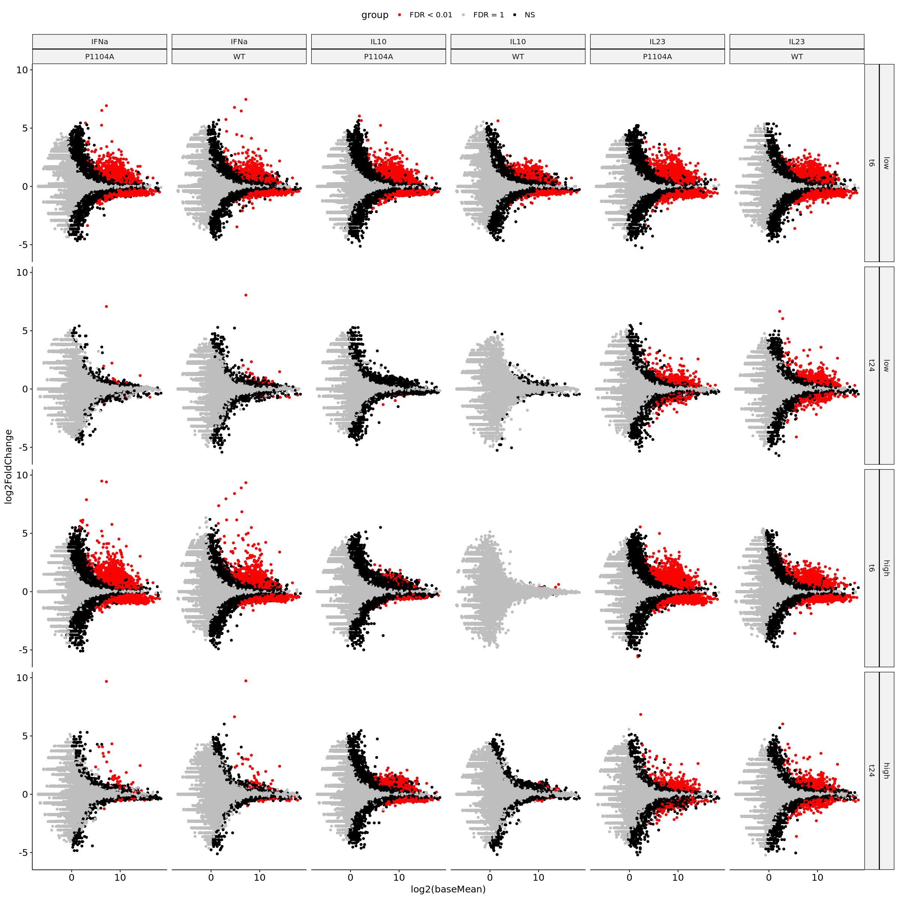
    


```R
volcano_grid <- split_sumstats %>%
    ggplot() +
        geom_point(aes(x = log2FoldChange,
                       y = -log10(pvalue),
                       color = group)) +
        theme_pubr(base_size = 15) +
        facet_grid(rows = vars(dosage, time),
                   cols = vars(cytokine, background)) +
        scale_color_manual(values = c("FDR = 1" = "gray",
                                      "NS" = "black",
                                      "FDR < 0.01" = "red")) +
        coord_cartesian(ylim = c(0, 50))

options(repr.plot.width = 20, repr.plot.height = 20, warn = -1)
volcano_grid
```


    

    


```R
sumstats_marg_dose <- sumstats %>%
    filter(time == "t6") %>%
    select(gene, log2FoldChange, lfcSE, background, cytokine, dosage) %>%
    pivot_wider(names_from = dosage, values_from = log2FoldChange:lfcSE) %>%
    drop_na() %>%
    mutate(effect = (log2FoldChange_high + log2FoldChange_low)/2,
           error = sqrt(lfcSE_high^2 + lfcSE_low^2),
           stat = effect/error) %>%
    select(gene, background, cytokine, effect, error, stat)
```


```R
sumstats_marg_dose_wide <- sumstats_marg_dose %>%
    select(-effect, -error) %>%
    pivot_wider(names_from = background:cytokine, values_from = stat) %>%
    arrange(-WT_IFNa)

sumstats_marg_dose_wide %>% head(10)
```


<table class="dataframe">
<caption>A tibble: 10 × 7</caption>
<thead>
	<tr><th scope=col>gene</th><th scope=col>P1104A_IFNa</th><th scope=col>P1104A_IL10</th><th scope=col>P1104A_IL23</th><th scope=col>WT_IFNa</th><th scope=col>WT_IL10</th><th scope=col>WT_IL23</th></tr>
	<tr><th scope=col>&lt;chr&gt;</th><th scope=col>&lt;dbl&gt;</th><th scope=col>&lt;dbl&gt;</th><th scope=col>&lt;dbl&gt;</th><th scope=col>&lt;dbl&gt;</th><th scope=col>&lt;dbl&gt;</th><th scope=col>&lt;dbl&gt;</th></tr>
</thead>
<tbody>
	<tr><td>STAT1 </td><td>23.599133</td><td> 5.01561536</td><td>19.14449444</td><td>27.98012</td><td> 2.7249167</td><td>19.2985085</td></tr>
	<tr><td>OAS2  </td><td>21.856462</td><td> 2.08089756</td><td> 2.26733494</td><td>26.68315</td><td> 0.9163157</td><td> 2.1712295</td></tr>
	<tr><td>PARP9 </td><td>16.032478</td><td> 2.51016469</td><td>11.44241518</td><td>22.57178</td><td> 1.8807420</td><td>12.0084712</td></tr>
	<tr><td>OAS1  </td><td>14.887134</td><td>-0.48186751</td><td>-0.21105494</td><td>22.18690</td><td>-0.4086254</td><td>-0.2835280</td></tr>
	<tr><td>EPSTI1</td><td>14.817647</td><td>-0.11348439</td><td> 0.78074351</td><td>22.13383</td><td> 1.0934202</td><td> 1.7674827</td></tr>
	<tr><td>SLFN5 </td><td>13.927253</td><td> 1.81420980</td><td> 2.34521737</td><td>17.80204</td><td> 1.2544153</td><td> 1.9709722</td></tr>
	<tr><td>HERC5 </td><td> 9.090210</td><td>-0.63184119</td><td>-0.02765965</td><td>17.74987</td><td> 0.7318314</td><td> 0.2346673</td></tr>
	<tr><td>CMPK2 </td><td>11.758464</td><td>-1.40688100</td><td>-1.26991568</td><td>16.97115</td><td>-0.4629770</td><td> 0.3230340</td></tr>
	<tr><td>EHD4  </td><td> 8.758219</td><td> 1.75091307</td><td> 3.73227426</td><td>14.98585</td><td> 2.1011319</td><td> 2.9903967</td></tr>
	<tr><td>RSAD2 </td><td>10.091023</td><td> 0.09748118</td><td>-0.35989935</td><td>14.71690</td><td>-0.2909626</td><td> 0.2465795</td></tr>
</tbody>
</table>


```R
options(repr.plot.width = 10, repr.plot.height = 10)
sumstats_marg_dose_wide %>%
    ggplot() +
        geom_text(aes(x = WT_IFNa, y = P1104A_IFNa, label = gene)) +
        theme_pubr()

sumstats_marg_dose_wide %>%
    ggplot() +
        geom_text(aes(x = WT_IL10, y = P1104A_IL10, label = gene)) +
        theme_pubr()

sumstats_marg_dose_wide %>%
    ggplot() +
        geom_text(aes(x = WT_IL23, y = P1104A_IL23, label = gene)) +
        theme_pubr()
```


    
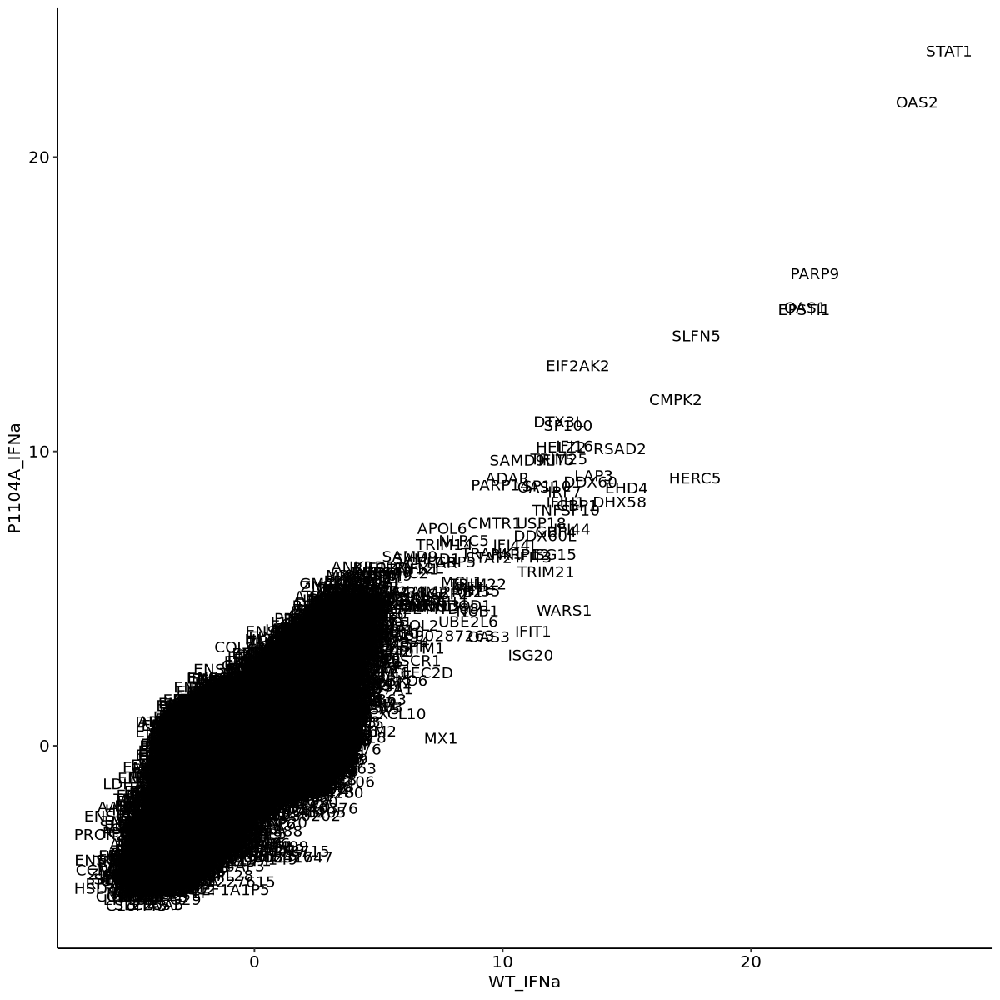
    


    

    


    

    


```R
ggpairs(sumstats_marg_dose_wide[,2:4], upper = NULL)
```


    

    


```R
ggpairs(sumstats_marg_dose_wide[,5:7], upper = NULL)
```


    

    


#### DEG Heatmaps <a name="part4"></a>


```R
vsd <- assay(vst(deresult, blind = FALSE))
vsd <- cbind(vsd, "row_var" = rowVars(vsd, na.rm = TRUE))

vsd_gene <- bind_cols("gene" = de_data$gene,
                      vsd) %>%
    pivot_longer(names_to = "sample", values_to = "norm_value", P1104A_IFNa_high_t24_1:WT_none_none_t6_2) %>%
    inner_join(de_prop %>% mutate(sample_id = str_c(covariate, "_", rep)),
               by = c("sample" = "sample_id")) %>%
    arrange(cytokine, group, dosage, time, rep)

var_genes <- vsd_gene %>%
    select(gene, row_var) %>%
    distinct() %>%
    arrange(-row_var) %>%
    head(500) %>%
    pull(gene)

vsd_gene_wide_sig <- vsd_gene %>%
    filter(gene %in% var_genes) %>%
    mutate(sample_name = str_c(cytokine, " ", dosage, " ", group, " ", time, " ", rep)) %>%
    select(gene, sample_name, norm_value) %>%
    pivot_wider(names_from = sample_name, values_from = norm_value)

vsd_gene_wide_all <- vsd_gene %>%
    mutate(sample_name = str_c(cytokine, " ", dosage, " ", group, " ", time, " ", rep)) %>%
    select(gene, sample_name, norm_value) %>%
    pivot_wider(names_from = sample_name, values_from = norm_value)

vsd_format <- vsd_gene_wide_all
names(vsd_format)[-1] <- gsub(" ", "_", names(vsd_format)[-1])
vsd_format %>% write_tsv("../sumstats/RNASEQ/run2/combined/deseq2-variance-stabilized-quants.tsv")
```


```R
options(repr.plot.width = 13.5, repr.plot.height = 12)
Heatmap(t(as.matrix(vsd_gene_wide_sig[,-1])),
        column_title = "Top 500 Most Variable Genes",
        cluster_columns = TRUE,
        cluster_rows = FALSE,
        row_split = gsub(" .*", "", names(vsd_gene_wide_sig[,-1])),
        use_raster = TRUE,
        raster_by_magick = TRUE,
        name = "Variance\nStabilized\nLog-Mean")
```

    Loading required namespace: magick
    


    

    


#### Results from Kallisto Quantifications <a name="part5"></a>


```R
tx2gene_df <- read_tsv("../data/reference/hg38/kallisto/gencode.v41.pc_transcripts.luciferase.tx2gene.tsv")
abundance_files <- dir_ls(path = "../pipeline/RNASEQ/diffexp/kallisto/",
                          regexp = ".*_kallisto/abundance.h5",
                          recurse = TRUE)
names(abundance_files) <- gsub("../pipeline/RNASEQ/diffexp/kallisto/|_kallisto/abundance.h5",
                               "",
                               abundance_files)
```

    Rows: 110224 Columns: 2
    ── Column specification ────────────────────────────────────────────────────────
    Delimiter: "\t"
    chr (2): ENST00000641515.2, OR4F5
    
    ℹ Use `spec()` to retrieve the full column specification for this data.
    ℹ Specify the column types or set `show_col_types = FALSE` to quiet this message.


```R
kallisto_import <- tximport(abundance_files,
                            type = "kallisto",
                            tx2gene = tx2gene_df,
                            ignoreAfterBar = TRUE)
```

    1 
    2 
    3 
    4 
    5 
    6 
    7 
    8 
    9 
    10 
    11 
    12 
    13 
    14 
    15 
    16 
    17 
    18 
    19 
    20 
    21 
    22 
    23 
    24 
    25 
    26 
    27 
    28 
    29 
    30 
    31 
    32 
    33 
    34 
    35 
    36 
    37 
    38 
    39 
    40 
    41 
    42 
    43 
    44 
    45 
    46 
    47 
    48 
    49 
    50 
    51 
    52 
    53 
    54 
    55 
    56 
    
    
    transcripts missing from tx2gene: 1
    
    summarizing abundance
    
    summarizing counts
    
    summarizing length
    


```R
abundances <- as_tibble(kallisto_import$abundance) %>%
    mutate(gene = rownames(kallisto_import$abundance)) %>%
    pivot_longer(names_to = "sample", values_to = "abundance", -gene)

de_prop <- samp_prop %>%
    filter(!is.na(cytokine)) %>%
    arrange(covariate)
rownames(de_prop) <- str_c(de_prop$sample_id, "_", de_prop$covariate)

de_prop <- de_prop %>% arrange(match(rownames(de_prop), colnames(kallisto_import$counts)))
```

    Warning message:
    “Setting row names on a tibble is deprecated.”


```R
deobj_counts <- DESeqDataSetFromTximport(kallisto_import,
    colData = de_prop,
    design = ~covariate)
```


```R
deresult <- DESeq(deobj_counts)
```

    estimating size factors
    
    using 'avgTxLength' from assays(dds), correcting for library size
    
    estimating dispersions
    
    gene-wise dispersion estimates
    
    mean-dispersion relationship
    
    final dispersion estimates
    
    fitting model and testing
    


```R
cov_group <- de_prop %>%
    filter(!grepl("none", covariate)) %>%
    distinct(covariate) %>%
    pull(covariate) %>%
    as.character()

none_group <- gsub("IFNa|IL10|IL23|low|high", "none", cov_group) %>%
    as.character()

plan(multicore, workers = 25)
norm_result <- future_map2(.x = cov_group,
                    .y = none_group,
                    ~results(deresult,
                             contrast = c("covariate", .x, .y),
                             independentFiltering = FALSE))
```


```R
sumstats <- map2_dfr(norm_result,
                     cov_group,
                     ~bind_cols("gene" = rownames(kallisto_import$counts),
                                            as_tibble(.x),
                                            "condition" = .y))
```


```R
sumstats %>%
    separate(condition, c("background", "cytokine", "dosage", "time"), "_") %>%
    write_tsv("../sumstats/RNASEQ/run2/combined/deseq2-kallisto-sumstats-vs-none.tsv")
```


```R
split_sumstats <- sumstats %>%
    separate(condition, c("background", "cytokine", "dosage", "time"), "_") %>%
    mutate(group = case_when(padj == 1 ~ "FDR = 1",
                             padj < 0.01 ~ "FDR < 0.01",
                             TRUE ~ "NS")) %>%
    mutate(time = relevel(as.factor(time), ref = "t6"),
           dosage = relevel(as.factor(dosage), ref = "low"))

ma_grid <- split_sumstats %>%
    ggplot() +
        geom_point(aes(x = log2(baseMean),
                       y = log2FoldChange,
                       color = group)) +
        theme_pubr(base_size = 15) +
        facet_grid(rows = vars(dosage, time),
                   cols = vars(cytokine, background)) +
        scale_color_manual(values = c("FDR = 1" = "gray",
                                      "NS" = "black",
                                      "FDR < 0.01" = "red"))
```


```R
options(repr.plot.width = 15, repr.plot.height = 15)
ma_grid
```

    Warning message:
    “Removed 55416 rows containing missing values (`geom_point()`).”


    

    


#### WT vs P1104A Direct Comparisons <a name="part6"></a>


```R
deobj_counts <- DESeqDataSetFromMatrix(countData = de_data %>% select(-gene),
    colData = de_prop,
    design = ~ -1 + covariate)

deresult <- DESeq(deobj_counts)
```

    converting counts to integer mode
    
    estimating size factors
    
    estimating dispersions
    
    gene-wise dispersion estimates
    
    mean-dispersion relationship
    
    final dispersion estimates
    
    fitting model and testing
    


```R
extract_results <- function(deo, c_vec, genes){

    res <- as_tibble(results(deo, contrast = c_vec)) %>%
        mutate("comparison" = str_c(c_vec[2], " minus ", c_vec[3]))

    res$gene <- genes
    
    return(res)
}
```


```R
wt_vs_p1104a_sumstats <- bind_rows(
    extract_results(deresult, c("covariate", "WT_none_none_t6", "P1104A_none_none_t6"), de_data$gene),
    extract_results(deresult, c("covariate", "WT_none_none_t24", "P1104A_none_none_t24"), de_data$gene),
    extract_results(deresult, c("covariate", "WT_IL10_low_t6", "P1104A_IL10_low_t6"), de_data$gene),
    extract_results(deresult, c("covariate", "WT_IL10_low_t24", "P1104A_IL10_low_t24"), de_data$gene),
    extract_results(deresult, c("covariate", "WT_IL23_low_t6", "P1104A_IL23_low_t6"), de_data$gene),
    extract_results(deresult, c("covariate", "WT_IL23_low_t24", "P1104A_IL23_low_t24"), de_data$gene),
    extract_results(deresult, c("covariate", "WT_IFNa_low_t6", "P1104A_IFNa_low_t6"), de_data$gene),
    extract_results(deresult, c("covariate", "WT_IFNa_low_t24", "P1104A_IFNa_low_t24"), de_data$gene)
)
```


```R
write_tsv(wt_vs_p1104a_sumstats, "../sumstats/RNASEQ/run2/combined/deseq2-wt-vs-p1104a-sumstats.tsv.gz")
```


```R
options(repr.plot.width = 18, repr.plot.height = 6)
wt_vs_p1104a_sumstats %>%
    mutate(comparison = gsub(" ", "\n", comparison)) %>%
    ggplot() +
        geom_point(aes(x = log2FoldChange,
                       y = -log10(pvalue))) +
        theme_pubr(base_size = 15) +
        facet_wrap(~comparison, nrow = 1)
```

    Warning message:
    “Removed 200016 rows containing missing values (`geom_point()`).”


    
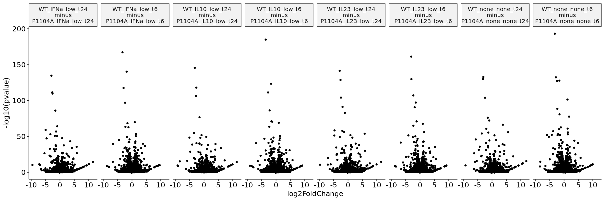
    


```R
wt_vs_p1104a_sumstats %>%
    filter(stat < 0) %>%
    arrange(padj) %>%
    head(n=20)
```


<table class="dataframe">
<caption>A tibble: 20 × 8</caption>
<thead>
	<tr><th scope=col>baseMean</th><th scope=col>log2FoldChange</th><th scope=col>lfcSE</th><th scope=col>stat</th><th scope=col>pvalue</th><th scope=col>padj</th><th scope=col>comparison</th><th scope=col>gene</th></tr>
	<tr><th scope=col>&lt;dbl&gt;</th><th scope=col>&lt;dbl&gt;</th><th scope=col>&lt;dbl&gt;</th><th scope=col>&lt;dbl&gt;</th><th scope=col>&lt;dbl&gt;</th><th scope=col>&lt;dbl&gt;</th><th scope=col>&lt;chr&gt;</th><th scope=col>&lt;chr&gt;</th></tr>
</thead>
<tbody>
	<tr><td> 928.4987</td><td>-3.212814</td><td>0.10812670</td><td>-29.71342</td><td>5.151421e-194</td><td>7.040447e-190</td><td>WT_none_none_t6 minus P1104A_none_none_t6  </td><td>ADGRL3</td></tr>
	<tr><td> 928.4987</td><td>-3.592270</td><td>0.12361248</td><td>-29.06074</td><td>1.125872e-185</td><td>1.538729e-181</td><td>WT_IL10_low_t6 minus P1104A_IL10_low_t6    </td><td>ADGRL3</td></tr>
	<tr><td> 928.4987</td><td>-3.296144</td><td>0.11932107</td><td>-27.62416</td><td>5.705523e-168</td><td>7.797738e-164</td><td>WT_IFNa_low_t6 minus P1104A_IFNa_low_t6    </td><td>ADGRL3</td></tr>
	<tr><td> 928.4987</td><td>-3.059708</td><td>0.11281252</td><td>-27.12206</td><td>5.409804e-162</td><td>7.393579e-158</td><td>WT_IL23_low_t6 minus P1104A_IL23_low_t6    </td><td>ADGRL3</td></tr>
	<tr><td> 928.4987</td><td>-3.212308</td><td>0.12472661</td><td>-25.75479</td><td>2.848807e-146</td><td>3.893465e-142</td><td>WT_IL10_low_t24 minus P1104A_IL10_low_t24  </td><td>ADGRL3</td></tr>
	<tr><td> 928.4987</td><td>-2.925051</td><td>0.11521686</td><td>-25.38735</td><td>3.478500e-142</td><td>4.522746e-138</td><td>WT_IL23_low_t24 minus P1104A_IL23_low_t24  </td><td>ADGRL3</td></tr>
	<tr><td>2027.4328</td><td>-1.841146</td><td>0.07281660</td><td>-25.28470</td><td>4.706233e-141</td><td>3.216004e-137</td><td>WT_IFNa_low_t6 minus P1104A_IFNa_low_t6    </td><td>IL7R  </td></tr>
	<tr><td> 928.4987</td><td>-2.954225</td><td>0.11929471</td><td>-24.76409</td><td>2.186211e-135</td><td>2.842512e-131</td><td>WT_IFNa_low_t24 minus P1104A_IFNa_low_t24  </td><td>ADGRL3</td></tr>
	<tr><td> 928.4987</td><td>-3.023423</td><td>0.12292586</td><td>-24.59550</td><td>1.411408e-133</td><td>1.835112e-129</td><td>WT_none_none_t24 minus P1104A_none_none_t24</td><td>ADGRL3</td></tr>
	<tr><td> 676.0837</td><td>-2.842996</td><td>0.11579829</td><td>-24.55128</td><td>4.191020e-133</td><td>2.863933e-129</td><td>WT_none_none_t6 minus P1104A_none_none_t6  </td><td>CTNNA2</td></tr>
	<tr><td> 693.0451</td><td>-3.099206</td><td>0.12743804</td><td>-24.31931</td><td>1.224889e-130</td><td>7.963000e-127</td><td>WT_none_none_t24 minus P1104A_none_none_t24</td><td>CNTN1 </td></tr>
	<tr><td> 676.0837</td><td>-2.998029</td><td>0.12327845</td><td>-24.31917</td><td>1.229255e-130</td><td>8.400113e-127</td><td>WT_IL23_low_t6 minus P1104A_IL23_low_t6    </td><td>CTNNA2</td></tr>
	<tr><td> 693.0451</td><td>-2.602969</td><td>0.10753790</td><td>-24.20513</td><td>1.964426e-129</td><td>1.277074e-125</td><td>WT_IL23_low_t24 minus P1104A_IL23_low_t24  </td><td>CNTN1 </td></tr>
	<tr><td>2027.4328</td><td>-1.642783</td><td>0.06811246</td><td>-24.11869</td><td>1.591882e-128</td><td>7.252086e-125</td><td>WT_none_none_t6 minus P1104A_none_none_t6  </td><td>IL7R  </td></tr>
	<tr><td> 693.0451</td><td>-2.408119</td><td>0.10002125</td><td>-24.07608</td><td>4.452202e-128</td><td>1.521206e-124</td><td>WT_none_none_t6 minus P1104A_none_none_t6  </td><td>CNTN1 </td></tr>
	<tr><td>2027.4328</td><td>-1.725272</td><td>0.07276198</td><td>-23.71118</td><td>2.765027e-124</td><td>1.889481e-120</td><td>WT_IL10_low_t6 minus P1104A_IL10_low_t6    </td><td>IL7R  </td></tr>
	<tr><td> 676.0837</td><td>-2.664068</td><td>0.11497938</td><td>-23.16997</td><td>9.147265e-119</td><td>6.250783e-115</td><td>WT_IL10_low_t24 minus P1104A_IL10_low_t24  </td><td>CTNNA2</td></tr>
	<tr><td> 676.0837</td><td>-2.922076</td><td>0.12639474</td><td>-23.11865</td><td>3.006128e-118</td><td>1.369492e-114</td><td>WT_IFNa_low_t6 minus P1104A_IFNa_low_t6    </td><td>CTNNA2</td></tr>
	<tr><td> 676.0837</td><td>-2.764365</td><td>0.12289772</td><td>-22.49321</td><td>4.836600e-112</td><td>2.203394e-108</td><td>WT_IL10_low_t6 minus P1104A_IL10_low_t6    </td><td>CTNNA2</td></tr>
	<tr><td> 693.0451</td><td>-2.664139</td><td>0.11841178</td><td>-22.49894</td><td>4.251112e-112</td><td>2.763648e-108</td><td>WT_IFNa_low_t24 minus P1104A_IFNa_low_t24  </td><td>CNTN1 </td></tr>
</tbody>
</table>


```R
wt_vs_p1104a_sumstats %>%
    filter(stat > 0) %>%
    arrange(padj) %>%
    head(n=20)
```


<table class="dataframe">
<caption>A tibble: 20 × 8</caption>
<thead>
	<tr><th scope=col>baseMean</th><th scope=col>log2FoldChange</th><th scope=col>lfcSE</th><th scope=col>stat</th><th scope=col>pvalue</th><th scope=col>padj</th><th scope=col>comparison</th><th scope=col>gene</th></tr>
	<tr><th scope=col>&lt;dbl&gt;</th><th scope=col>&lt;dbl&gt;</th><th scope=col>&lt;dbl&gt;</th><th scope=col>&lt;dbl&gt;</th><th scope=col>&lt;dbl&gt;</th><th scope=col>&lt;dbl&gt;</th><th scope=col>&lt;chr&gt;</th><th scope=col>&lt;chr&gt;</th></tr>
</thead>
<tbody>
	<tr><td>26469.1253</td><td>1.1748733</td><td>0.05474640</td><td>21.46028</td><td>3.660610e-102</td><td>1.000591e-98</td><td>WT_none_none_t6 minus P1104A_none_none_t6  </td><td>TFRC    </td></tr>
	<tr><td>  790.8882</td><td>1.7342168</td><td>0.09252185</td><td>18.74386</td><td> 2.172672e-78</td><td>3.711738e-75</td><td>WT_none_none_t6 minus P1104A_none_none_t6  </td><td>ATXN7L3B</td></tr>
	<tr><td>26469.1253</td><td>0.9758476</td><td>0.05492797</td><td>17.76595</td><td> 1.297244e-70</td><td>3.545887e-67</td><td>WT_IFNa_low_t6 minus P1104A_IFNa_low_t6    </td><td>TFRC    </td></tr>
	<tr><td>26469.1253</td><td>0.9705687</td><td>0.05494558</td><td>17.66418</td><td> 7.915141e-70</td><td>1.545375e-66</td><td>WT_IL10_low_t6 minus P1104A_IL10_low_t6    </td><td>TFRC    </td></tr>
	<tr><td>26469.1253</td><td>0.9585084</td><td>0.05486558</td><td>17.47012</td><td> 2.419690e-68</td><td>4.724272e-65</td><td>WT_IL23_low_t6 minus P1104A_IL23_low_t6    </td><td>TFRC    </td></tr>
	<tr><td>  139.2160</td><td>3.7776301</td><td>0.21817976</td><td>17.31430</td><td> 3.669478e-67</td><td>7.951758e-64</td><td>WT_none_none_t24 minus P1104A_none_none_t24</td><td>SH2D1B  </td></tr>
	<tr><td> 6802.9291</td><td>1.2231130</td><td>0.07381727</td><td>16.56947</td><td> 1.158447e-61</td><td>1.583250e-58</td><td>WT_none_none_t6 minus P1104A_none_none_t6  </td><td>EID1    </td></tr>
	<tr><td> 1082.7333</td><td>1.4205613</td><td>0.08949679</td><td>15.87276</td><td> 9.783937e-57</td><td>1.485745e-53</td><td>WT_IL23_low_t6 minus P1104A_IL23_low_t6    </td><td>TAF7    </td></tr>
	<tr><td>  167.5455</td><td>5.5695582</td><td>0.35138767</td><td>15.85018</td><td> 1.401768e-56</td><td>2.278224e-53</td><td>WT_none_none_t24 minus P1104A_none_none_t24</td><td>SAMSN1  </td></tr>
	<tr><td> 1082.7333</td><td>1.3306686</td><td>0.08416941</td><td>15.80941</td><td> 2.679682e-56</td><td>2.817170e-53</td><td>WT_none_none_t6 minus P1104A_none_none_t6  </td><td>TAF7    </td></tr>
	<tr><td>  167.5455</td><td>5.7828039</td><td>0.37166910</td><td>15.55901</td><td> 1.382164e-54</td><td>1.996766e-51</td><td>WT_IL23_low_t24 minus P1104A_IL23_low_t24  </td><td>SAMSN1  </td></tr>
	<tr><td>  790.8882</td><td>1.4713271</td><td>0.09492137</td><td>15.50048</td><td> 3.442904e-54</td><td>5.228241e-51</td><td>WT_IFNa_low_t6 minus P1104A_IFNa_low_t6    </td><td>ATXN7L3B</td></tr>
	<tr><td> 1432.8358</td><td>1.2818676</td><td>0.08315644</td><td>15.41513</td><td> 1.295042e-53</td><td>1.179956e-50</td><td>WT_none_none_t6 minus P1104A_none_none_t6  </td><td>PNMA1   </td></tr>
	<tr><td>26469.1253</td><td>0.8385463</td><td>0.05495974</td><td>15.25747</td><td> 1.468422e-52</td><td>1.909242e-49</td><td>WT_IL23_low_t24 minus P1104A_IL23_low_t24  </td><td>TFRC    </td></tr>
	<tr><td>26469.1253</td><td>0.8359538</td><td>0.05495318</td><td>15.21211</td><td> 2.939196e-52</td><td>3.474130e-49</td><td>WT_none_none_t24 minus P1104A_none_none_t24</td><td>TFRC    </td></tr>
	<tr><td> 1082.7333</td><td>1.3308090</td><td>0.08850534</td><td>15.03648</td><td> 4.234603e-51</td><td>5.787432e-48</td><td>WT_IFNa_low_t6 minus P1104A_IFNa_low_t6    </td><td>TAF7    </td></tr>
	<tr><td> 1082.7333</td><td>1.3463893</td><td>0.08950131</td><td>15.04324</td><td> 3.823904e-51</td><td>5.806811e-48</td><td>WT_IL10_low_t6 minus P1104A_IL10_low_t6    </td><td>TAF7    </td></tr>
	<tr><td>26469.1253</td><td>0.8227941</td><td>0.05532518</td><td>14.87196</td><td> 5.012043e-50</td><td>9.785656e-47</td><td>WT_IL10_low_t24 minus P1104A_IL10_low_t24  </td><td>TFRC    </td></tr>
	<tr><td>  638.1558</td><td>1.5119115</td><td>0.10272275</td><td>14.71837</td><td> 4.913543e-49</td><td>4.914299e-46</td><td>WT_IL23_low_t24 minus P1104A_IL23_low_t24  </td><td>REPS2   </td></tr>
	<tr><td>26469.1253</td><td>0.8065559</td><td>0.05519279</td><td>14.61343</td><td> 2.306142e-48</td><td>2.725860e-45</td><td>WT_IFNa_low_t24 minus P1104A_IFNa_low_t24  </td><td>TFRC    </td></tr>
</tbody>
</table>


```R
vsd <- assay(vst(deresult, blind = FALSE))
vsd <- cbind(vsd, "row_var" = rowVars(vsd, na.rm = TRUE))

vsd_gene <- bind_cols("gene" = de_data$gene,
                      vsd) %>%
    pivot_longer(names_to = "sample", values_to = "norm_value", P1104A_IFNa_high_t24_1:WT_none_none_t6_2) %>%
    inner_join(de_prop %>% mutate(sample_id = str_c(covariate, "_", rep)),
               by = c("sample" = "sample_id")) %>%
    arrange(cytokine, group, dosage, time, rep)
```


```R
plot_gene_vsd <- function(gene_id) {

    the_plot <- vsd_gene %>%
        filter(gene == gene_id) %>%
        mutate(dosage = relevel(as.factor(dosage), ref = "low")) %>%
        ggplot() +
            geom_point(aes(x = dosage,
                           y = norm_value,
                           color = group),
                       size = 3,
                       position = position_jitterdodge(jitter.width = 0.1,
                                                       dodge.width = 0.5)) +
            theme_pubr(base_size = 16,
                       x.text.angle = 45) +
            ggtitle(gene_id) +
            facet_grid(cols = vars(cytokine, time), scales = "free_x") +
            ylab("variance stabilized\nabundance")

    return(the_plot)
    
}

options(repr.plot.width = 15, repr.plot.height = 18)
plot_gene_vsd("ADGRL3") /
    plot_gene_vsd("IL7R") /
    plot_gene_vsd("CNTN1") /
    plot_gene_vsd("CTNNA2")

plot_gene_vsd("TFRC") /
    plot_gene_vsd("ATXN7L3B") /
    plot_gene_vsd("EID1") /
    plot_gene_vsd("TAF7")
```


    
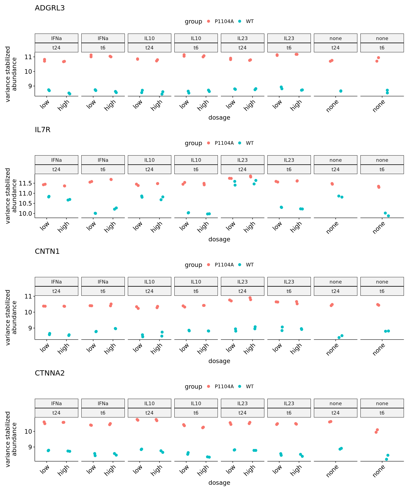
    


    
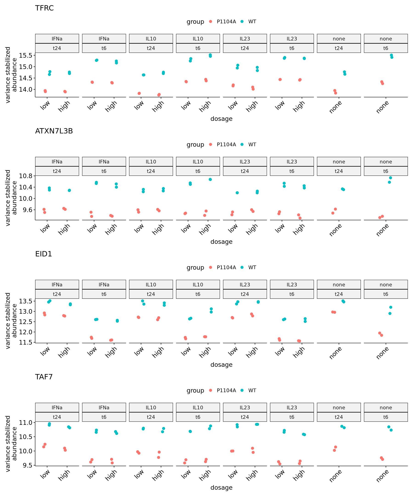
    

