### TYK2 IL-23 RNA-seq Assay Sequencing Repeat


```R
library(ggpubr)
library(DESeq2)
library(ggcorrplot)
library(furrr)
library(ggbiplot)
library(patchwork)
library(ComplexHeatmap)
library(tidyverse)
```

#### Dataset Properties <a name="part1"></a>


```R
alignments <- read_tsv("../pipeline/diffexp/multiqc_data/multiqc_star.txt") %>%
    mutate(id = as.numeric(gsub("_.*", "", Sample)))

count_summary <- read_tsv("../pipeline/diffexp/multiqc_data/multiqc_featureCounts.txt")  %>%
    mutate(id = as.numeric(gsub("_.*", "", Sample)))
```


```R
options(repr.plot.width = 8, repr.plot.height = 18)
alignments %>%
    ggplot() +
        geom_bar(aes(x = total_reads, y = reorder(Sample, -id)), stat = "identity") +
        theme_pubr(base_size = 16, x.text.angle = 45) +
        xlab("Total Read Depth") + ylab("") +
        ggtitle("Total Read Depth")
```


    
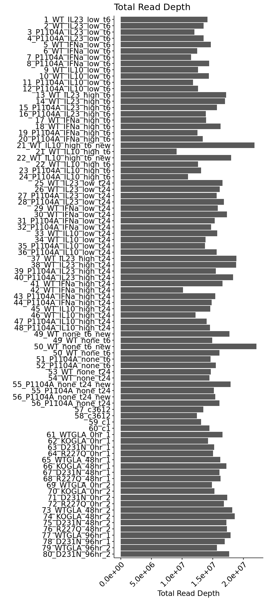
    


```R
alignments %>%
    ggplot() +
        geom_bar(aes(x = uniquely_mapped_percent/100, y = reorder(Sample, -1*as.numeric(id))), stat = "identity") +
        theme_pubr(base_size = 16, x.text.angle = 45) +
        xlab("Unique Alignment Rate") + ylab("") +
        ggtitle("Unique Alignment Rate")
```


    
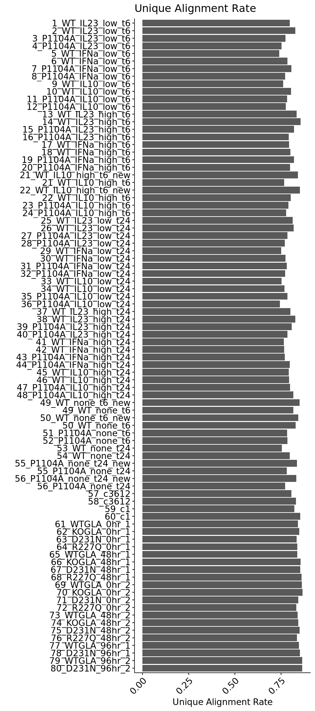
    


```R
count_summary %>%
    ggplot() +
        geom_bar(aes(x = percent_assigned/100, y = reorder(Sample, -1*as.numeric(id))), stat = "identity") +
        theme_pubr(base_size = 16, x.text.angle = 45) +
        xlab("Gene Assignment Rate") + ylab("") +
        ggtitle("Gene Assignment Rate")
```


    
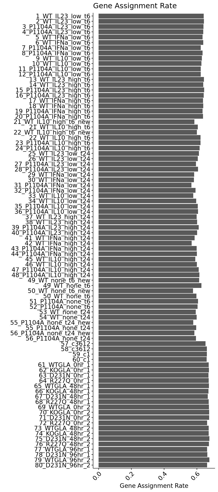
    


#### Unsupervised Profiles <a name="part2"></a>


```R
paths <- str_c("../pipeline/diffexp/",
                    alignments$Sample,
                    ".counts.tsv")
names(paths) <- paths

df <- map_dfr(paths,
              ~read_tsv(.x,
                        col_names = NULL,
                        skip = 2,
                        col_select = c(1,7)),
              .id = "sample") %>%
    rename("gene" = "X1",
           "count" = "X7") %>%
    mutate(sample = gsub("../pipeline/diffexp/|.counts.tsv", "", sample))

df_id <- df %>%
    mutate(id = as.character(gsub("_.*", "", sample)),
           id = if_else(grepl("new", sample), str_c(id, "b"), id)) %>%
    select(-sample) %>%
    arrange(id)
```


```R
samp_prop <- read_tsv("../sumstats/RNASEQ/run2/sample-properties-il23.tsv") %>%
    arrange(sample_id) %>%
    mutate(rep = rep(c(1,2), 40),
           covariate = as.factor(str_c(group, "_", cytokine, "_", dosage, "_", time)),
           sample_id = as.character(sample_id))

samp_prop <- bind_rows(

    samp_prop,
    samp_prop %>%
        filter(sample_id %in% c(21, 22, 49, 50, 55, 56)) %>%
        mutate(sample_id = str_c(sample_id, "b"),
               rep = case_when(rep == 1 ~ 3,
                               rep == 2 ~ 4))
    
)

rownames(samp_prop) <- samp_prop$sample_id
```


```R
cor_data_wide <- inner_join(df_id, samp_prop, by = c("id" = "sample_id")) %>%
    filter(!is.na(covariate)) %>%
    arrange(cytokine, group, dosage, rep) %>%
    select(gene, covariate, rep, count) %>%
    pivot_wider(names_from = covariate:rep, values_from = count)

cor_data_wide$v <- rowMeans(as.matrix(cor_data_wide[,-1]), na.rm = TRUE)

cor_data_filt <- cor_data_wide %>%
    arrange(-v) %>%
    head(1000) %>%
    select(-gene, -v)

cor_mat <- cor(cor_data_filt, use = "pairwise.complete.obs")
```


```R
options(repr.plot.width = 12, repr.plot.height = 12)
ggcorrplot(cor_mat[idx,idx], hc.order = TRUE, type = "upper", show.diag = TRUE) +
    scale_fill_gradient2(limit = c(0.7,1), low = "blue", high =  "red", mid = "white", midpoint = 0.85)
```

    Scale for fill is already present.
    Adding another scale for fill, which will replace the existing scale.


    
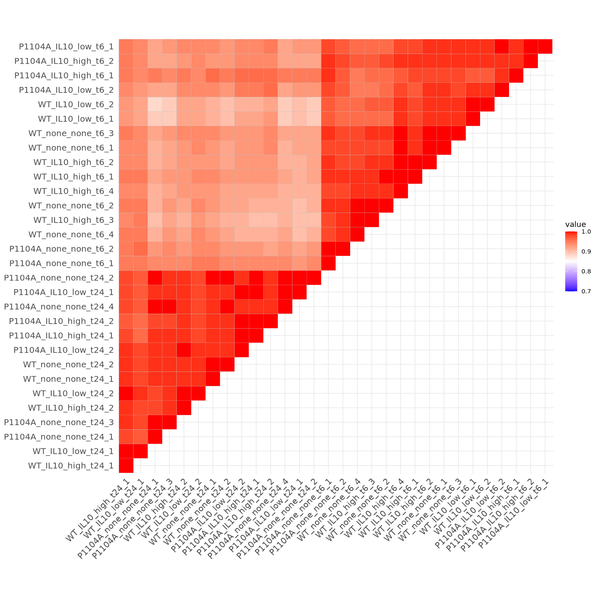
    


#### Statistical Modeling <a name="part3"></a>


```R
de_prop <- samp_prop %>%
    filter(!is.na(cytokine)) %>%
    arrange(covariate)
rownames(de_prop) <- str_c(de_prop$covariate, "_", de_prop$rep)

de_data <- df_id %>%
    inner_join(de_prop %>% select(sample_id, covariate, rep), by = c("id" = "sample_id")) %>%
    select(-id) %>%
    filter(!is.na(covariate)) %>%
    arrange(covariate, rep) %>%
    pivot_wider(names_from = covariate:rep, values_from = count)

log2_cpm <- de_data %>%
    pivot_longer(names_to = "sample", values_to = "count", -gene) %>%
    group_by(sample) %>%
    mutate(count = log2(count * 1000000 / sum(count, na.rm = TRUE)),
           count = if_else(is.infinite(count), NA, count)) %>%
    pivot_wider(names_from = sample, values_from = count)

write_tsv(de_data, "../sumstats/RNASEQ/run3/raw-counts.tsv")
write_tsv(log2_cpm, "../sumstats/RNASEQ/run3/log2-cpm.tsv")
```


```R
deobj_counts <- DESeqDataSetFromMatrix(countData = de_data %>% select(-gene),
    colData = de_prop,
    design = ~covariate)

deresult <- DESeq(deobj_counts)
```


```R
cov_group <- de_prop %>%
    filter(!grepl("none", covariate)) %>%
    distinct(covariate) %>%
    pull(covariate) %>%
    as.character()

none_group <- gsub("IFNa|IL10|IL23|low|high", "none", cov_group) %>%
    as.character()

plan(multicore, workers = 25)
norm_result <- future_map2(.x = cov_group,
                    .y = none_group,
                    ~results(deresult,
                             contrast = c("covariate", .x, .y),
                             independentFiltering = FALSE))

sumstats <- map2_dfr(norm_result,
                     cov_group,
                     ~bind_cols("gene" = de_data$gene,
                                            as_tibble(.x),
                                            "condition" = .y))

sumstats %>%
    separate(condition, c("background", "cytokine", "dosage", "time"), "_") %>%
    write_tsv("../sumstats/RNASEQ/run3/deseq2-sumstats-vs-none.tsv")
```


```R
sumstats <- read_tsv( "../sumstats/RNASEQ/run3/deseq2-sumstats-vs-none.tsv.gz")
split_sumstats <- sumstats %>%
    mutate(group = case_when(padj == 1 ~ "FDR = 1",
                             padj < 0.01 ~ "FDR < 0.01",
                             TRUE ~ "NS")) %>%
    mutate(time = relevel(as.factor(time), ref = "t6"),
           dosage = relevel(as.factor(dosage), ref = "low"))

ma_grid <- split_sumstats %>%
    ggplot() +
        geom_point(aes(x = log2(baseMean),
                       y = log2FoldChange,
                       color = group)) +
        theme_pubr(base_size = 15) +
        facet_grid(rows = vars(dosage, time),
                   cols = vars(cytokine, background)) +
        scale_color_manual(values = c("FDR = 1" = "gray",
                                      "NS" = "black",
                                      "FDR < 0.01" = "red"))
```


```R
options(repr.plot.width = 20, repr.plot.height = 20, warn = -1)
ma_grid
```


    
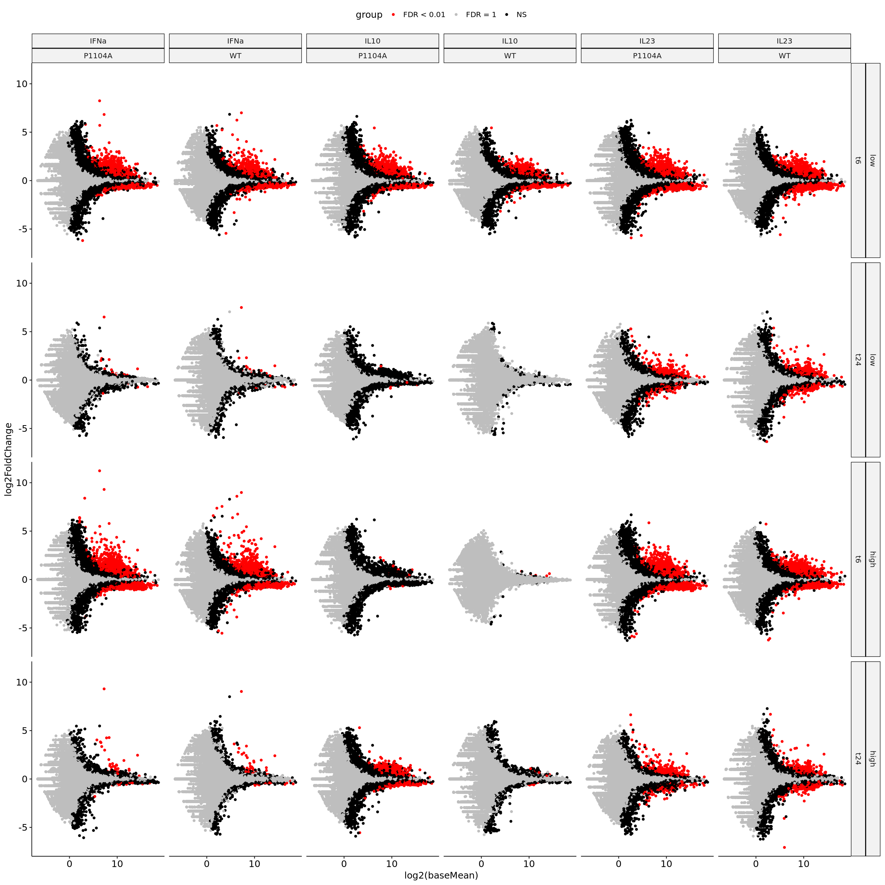
    


```R
volcano_grid <- split_sumstats %>%
    ggplot() +
        geom_point(aes(x = log2FoldChange,
                       y = -log10(pvalue),
                       color = group)) +
        theme_pubr(base_size = 15) +
        facet_grid(rows = vars(dosage, time),
                   cols = vars(cytokine, background)) +
        scale_color_manual(values = c("FDR = 1" = "gray",
                                      "NS" = "black",
                                      "FDR < 0.01" = "red")) +
        coord_cartesian(ylim = c(0, 50))

options(repr.plot.width = 20, repr.plot.height = 20, warn = -1)
volcano_grid
```


    
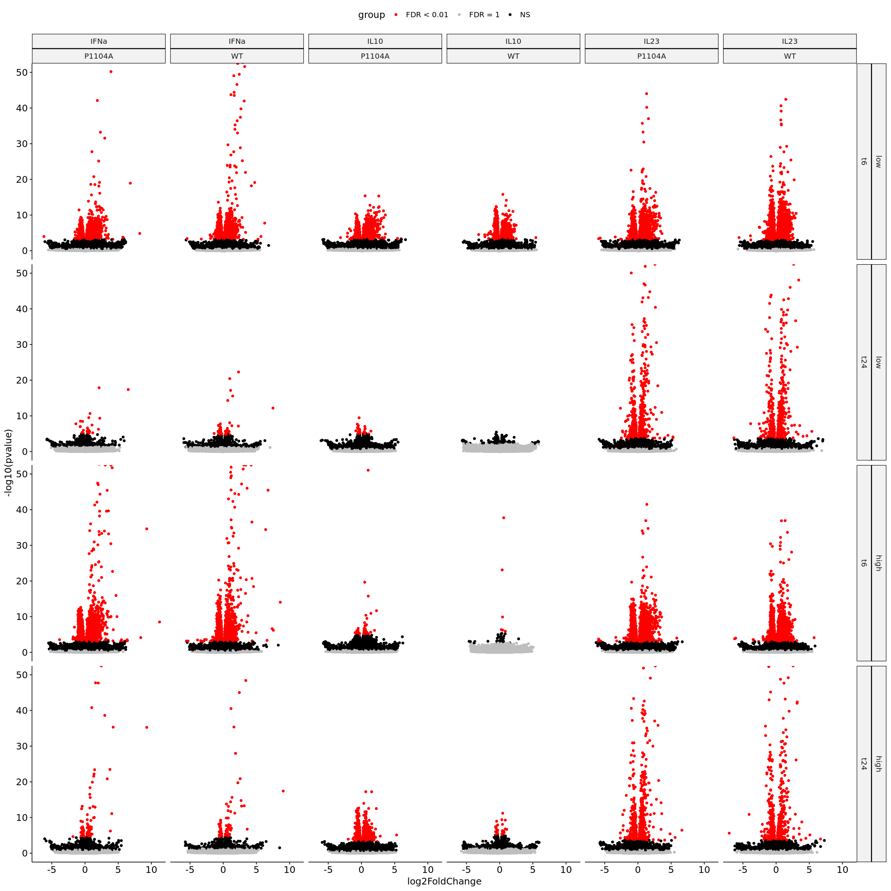
    


```R
options(repr.plot.width = 10, repr.plot.height = 5)
split_sumstats  %>%
    filter(group == "FDR < 0.01") %>%
    group_by(background, cytokine, dosage, time) %>%
    count(group, .drop = FALSE) %>%
    ggplot() +
        geom_bar(aes(x = dosage,
                     y = n,
                     fill = time),
                 position = position_dodge(0.5),
                 width = 0.5,
                 stat = "identity")  +
        facet_grid(cols = vars(cytokine, background)) +
        theme_pubr(base_size = 16)

split_sumstats  %>%
    filter(group == "FDR < 0.01") %>%
    group_by(background, cytokine, dosage, time) %>%
    count(group, .drop = FALSE) %>%
    select(-group) %>%
    arrange(time, cytokine, rev(background), dosage) %>%
    rename("FDR < 0.01 vs Untreated" = "n")
```


<table class="dataframe">
<caption>A grouped_df: 24 × 5</caption>
<thead>
	<tr><th scope=col>background</th><th scope=col>cytokine</th><th scope=col>dosage</th><th scope=col>time</th><th scope=col>FDR &lt; 0.01 vs Untreated</th></tr>
	<tr><th scope=col>&lt;chr&gt;</th><th scope=col>&lt;chr&gt;</th><th scope=col>&lt;fct&gt;</th><th scope=col>&lt;fct&gt;</th><th scope=col>&lt;int&gt;</th></tr>
</thead>
<tbody>
	<tr><td>WT    </td><td>IFNa</td><td>low </td><td>t6 </td><td>2768</td></tr>
	<tr><td>WT    </td><td>IFNa</td><td>high</td><td>t6 </td><td>3292</td></tr>
	<tr><td>P1104A</td><td>IFNa</td><td>low </td><td>t6 </td><td>2197</td></tr>
	<tr><td>P1104A</td><td>IFNa</td><td>high</td><td>t6 </td><td>3219</td></tr>
	<tr><td>WT    </td><td>IL10</td><td>low </td><td>t6 </td><td>2357</td></tr>
	<tr><td>WT    </td><td>IL10</td><td>high</td><td>t6 </td><td>   6</td></tr>
	<tr><td>P1104A</td><td>IL10</td><td>low </td><td>t6 </td><td>2195</td></tr>
	<tr><td>P1104A</td><td>IL10</td><td>high</td><td>t6 </td><td>  51</td></tr>
	<tr><td>WT    </td><td>IL23</td><td>low </td><td>t6 </td><td>3492</td></tr>
	<tr><td>WT    </td><td>IL23</td><td>high</td><td>t6 </td><td>3421</td></tr>
	<tr><td>P1104A</td><td>IL23</td><td>low </td><td>t6 </td><td>2865</td></tr>
	<tr><td>P1104A</td><td>IL23</td><td>high</td><td>t6 </td><td>3313</td></tr>
	<tr><td>WT    </td><td>IFNa</td><td>low </td><td>t24</td><td>  58</td></tr>
	<tr><td>WT    </td><td>IFNa</td><td>high</td><td>t24</td><td> 102</td></tr>
	<tr><td>P1104A</td><td>IFNa</td><td>low </td><td>t24</td><td>  30</td></tr>
	<tr><td>P1104A</td><td>IFNa</td><td>high</td><td>t24</td><td> 127</td></tr>
	<tr><td>WT    </td><td>IL10</td><td>low </td><td>t24</td><td>   0</td></tr>
	<tr><td>WT    </td><td>IL10</td><td>high</td><td>t24</td><td>  28</td></tr>
	<tr><td>P1104A</td><td>IL10</td><td>low </td><td>t24</td><td>  39</td></tr>
	<tr><td>P1104A</td><td>IL10</td><td>high</td><td>t24</td><td>1904</td></tr>
	<tr><td>WT    </td><td>IL23</td><td>low </td><td>t24</td><td> 736</td></tr>
	<tr><td>WT    </td><td>IL23</td><td>high</td><td>t24</td><td> 696</td></tr>
	<tr><td>P1104A</td><td>IL23</td><td>low </td><td>t24</td><td> 800</td></tr>
	<tr><td>P1104A</td><td>IL23</td><td>high</td><td>t24</td><td> 782</td></tr>
</tbody>
</table>


    
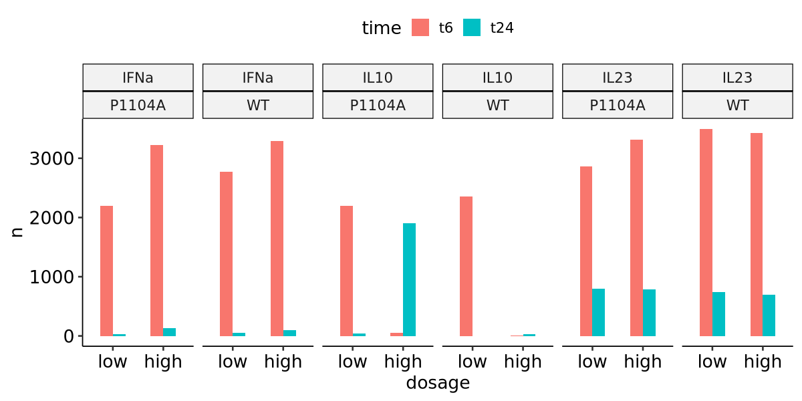
    


#### Differentially Expressed Genes <a name="part4"></a>


```R
vsd <- assay(vst(deresult, blind = FALSE))
vsd <- cbind(vsd, "row_var" = rowVars(vsd, na.rm = TRUE))

vsd_gene <- bind_cols("gene" = de_data$gene,
                      vsd) %>%
    pivot_longer(names_to = "sample", values_to = "norm_value", P1104A_IFNa_high_t24_1:WT_none_none_t6_4) %>%
    inner_join(de_prop %>% mutate(sample_id = str_c(covariate, "_", rep)),
               by = c("sample" = "sample_id")) %>%
    arrange(cytokine, group, dosage, time, rep)

var_genes <- vsd_gene %>%
    select(gene, row_var) %>%
    distinct() %>%
    arrange(-row_var) %>%
    head(500) %>%
    pull(gene)

vsd_gene_wide_sig <- vsd_gene %>%
    filter(gene %in% var_genes) %>%
    mutate(sample_name = str_c(cytokine, " ", dosage, " ", group, " ", time, " ", rep)) %>%
    select(gene, sample_name, norm_value) %>%
    pivot_wider(names_from = sample_name, values_from = norm_value)

vsd_gene_wide_all <- vsd_gene %>%
    mutate(sample_name = str_c(cytokine, " ", dosage, " ", group, " ", time, " ", rep)) %>%
    select(gene, sample_name, norm_value) %>%
    pivot_wider(names_from = sample_name, values_from = norm_value)
```


```R
vsd_format <- vsd_gene_wide_all
names(vsd_format)[-1] <- gsub(" ", "_", names(vsd_format)[-1])
vsd_format %>% write_tsv("../sumstats/RNASEQ/run3/deseq2-variance-stabilized-quants.tsv")
```


```R
options(repr.plot.width = 13.5, repr.plot.height = 12)
Heatmap(t(as.matrix(vsd_gene_wide_sig[,-1])),
        column_title = "Top 500 Most Variable Genes",
        cluster_columns = TRUE,
        cluster_rows = FALSE,
        row_split = gsub(" .*", "", names(vsd_gene_wide_sig[,-1])),
        use_raster = TRUE,
        raster_by_magick = TRUE,
        name = "Variance\nStabilized\nLog-Mean")
```

    Loading required namespace: magick
    


    
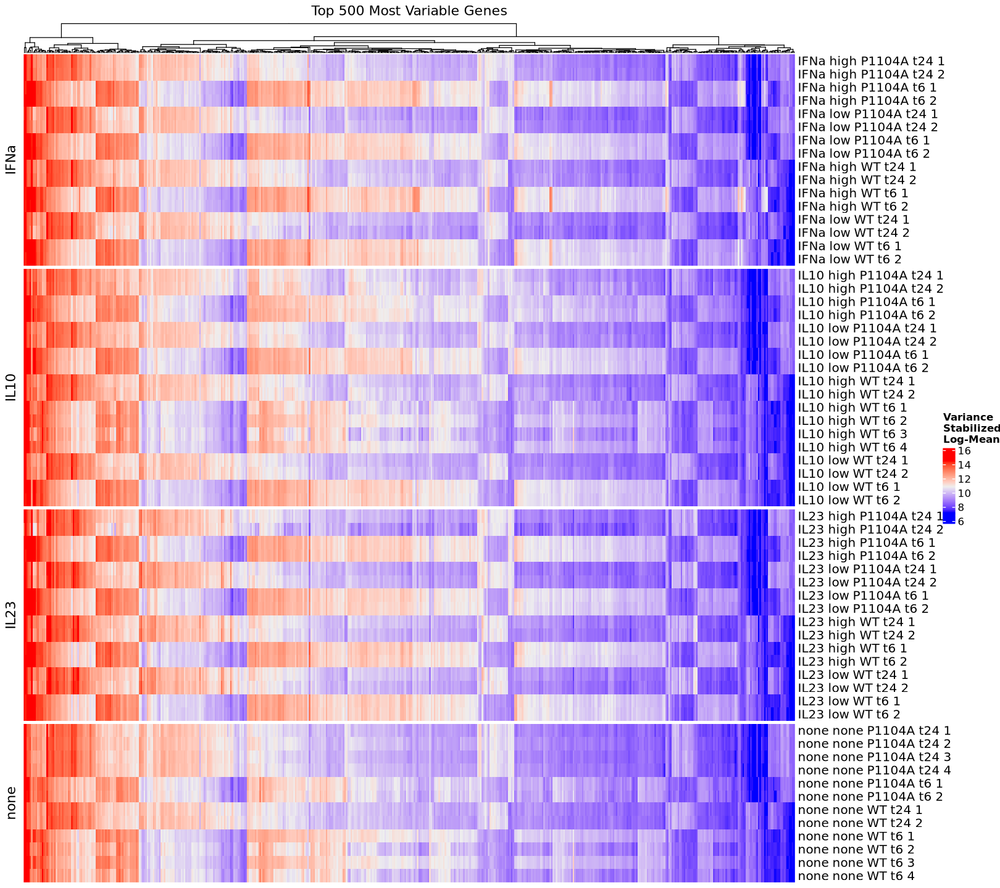
    


```R
de_genes_sig <- split_sumstats %>%
    filter(log2FoldChange > 1, padj < 0.01, !grepl("ENSG", gene)) %>%
    pull(gene) %>%
    unique()

heat_genes_wide <- vsd_gene_wide_all[vsd_gene_wide_all$gene %in% de_genes_sig,]
heat_data <- t(as.matrix(heat_genes_wide[,-1]))
colnames(heat_data) <- unlist(heat_genes_wide[,1])

options(repr.plot.width = 10, repr.plot.height = 15)
Heatmap(t(heat_data),show_row_names = FALSE,
        cluster_columns = FALSE,
        cluster_rows = TRUE,
        column_split = gsub("low |high |t6|t24| 1| 2| 3| 4| none", "", colnames(heat_genes_wide[,-1])),
        use_raster = TRUE,
        column_title_rot = 45,
        name = "Variance\nStabilized\nLog-Mean",
        row_title = "Genes DE vs None in any condition\nwith Log2FoldChange > 1 and FDR < 0.01")
```


    
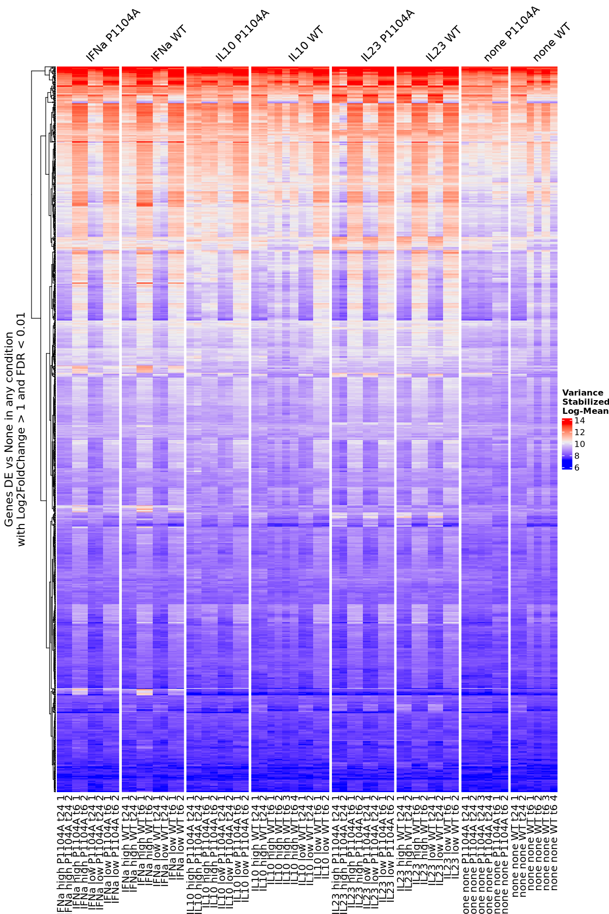
    


#### Gene Visualizations <a name="part5"></a>


```R
plot_gene <- function(gene_id) {

    the_plot <- split_sumstats %>%
        filter(gene == gene_id) %>%
        mutate(dosage = relevel(as.factor(dosage), ref = "low")) %>%
        ggplot() +
            geom_pointrange(aes(x = dosage,
                                y = log2FoldChange,
                                ymin = log2FoldChange - 2*lfcSE,
                                ymax = log2FoldChange + 2*lfcSE,
                                color = time), position = position_dodge(width = 0.4)) +
            theme_pubr(base_size = 16,
                       x.text.angle = 45) +
            ggtitle(gene_id) +
            geom_hline(yintercept = 0) +
            facet_grid(cols = vars(cytokine, background))

    return(the_plot)
    
}


stat1 <- plot_gene("STAT1")
stat2 <- plot_gene("STAT2")
stat3 <- plot_gene("STAT3")

jak1 <- plot_gene("JAK1")
jak2 <- plot_gene("JAK2")
jak3 <- plot_gene("JAK3")
```


```R
options(repr.plot.width = 20, repr.plot.height = 6)
stat1 + stat2 + stat3
jak1 + jak2 + jak3
```


    
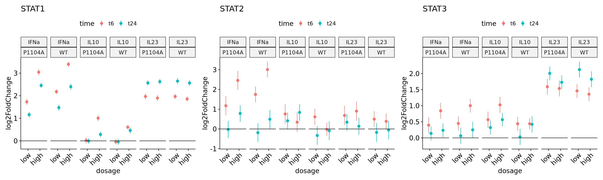
    


    
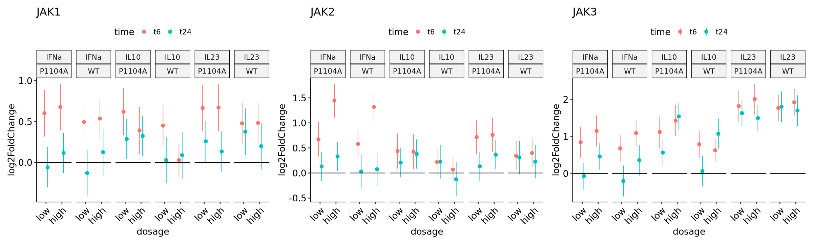
    


```R
options(repr.plot.width = 20, repr.plot.height = 6)
plot_gene("SOCS3") + 
    plot_gene("BCL3") +
    plot_gene("NFIL3")
```


    
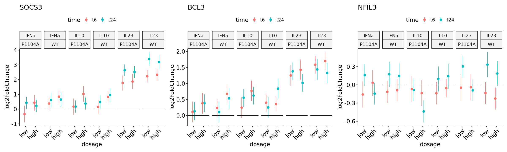
    


```R
plot_gene_vsd <- function(gene_id) {

    the_plot <- vsd_gene %>%
        filter(gene == gene_id) %>%
        mutate(dosage = relevel(as.factor(dosage), ref = "low")) %>%
        ggplot() +
            geom_point(aes(x = dosage,
                           y = norm_value,
                           color = time),
                       size = 3,
                       position = position_jitterdodge(jitter.width = 0.1,
                                                       dodge.width = 0.5)) +
            theme_pubr(base_size = 16,
                       x.text.angle = 45) +
            ggtitle(gene_id) +
            facet_grid(cols = vars(cytokine, group), scales = "free_x")

    return(the_plot)
    
}

options(repr.plot.width = 22, repr.plot.height = 6)
plot_gene_vsd("STAT1") + 
    plot_gene_vsd("STAT2") +
    plot_gene_vsd("STAT3")
plot_gene_vsd("JAK1") + 
    plot_gene_vsd("JAK2") +
    plot_gene_vsd("JAK3")
plot_gene_vsd("SOCS3") + 
    plot_gene_vsd("BCL3") +
    plot_gene_vsd("NFIL3")
```


    
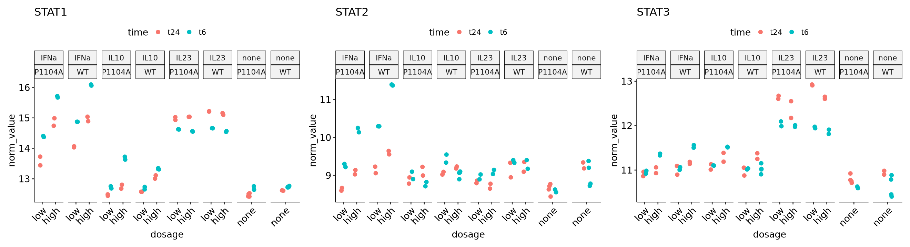
    


    
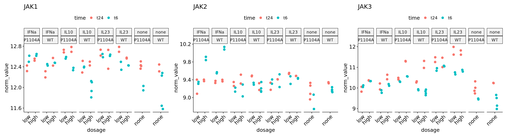
    


    
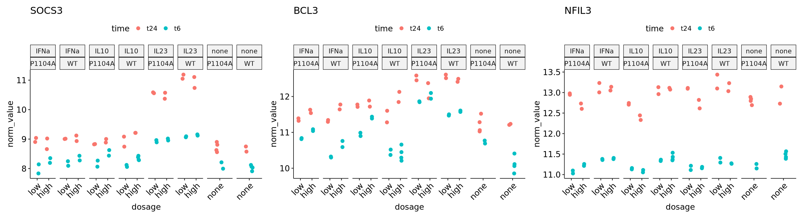
    


```R
options(repr.plot.width = 8, repr.plot.height = 6)
plot_gene_vsd("TYK2")
```


    
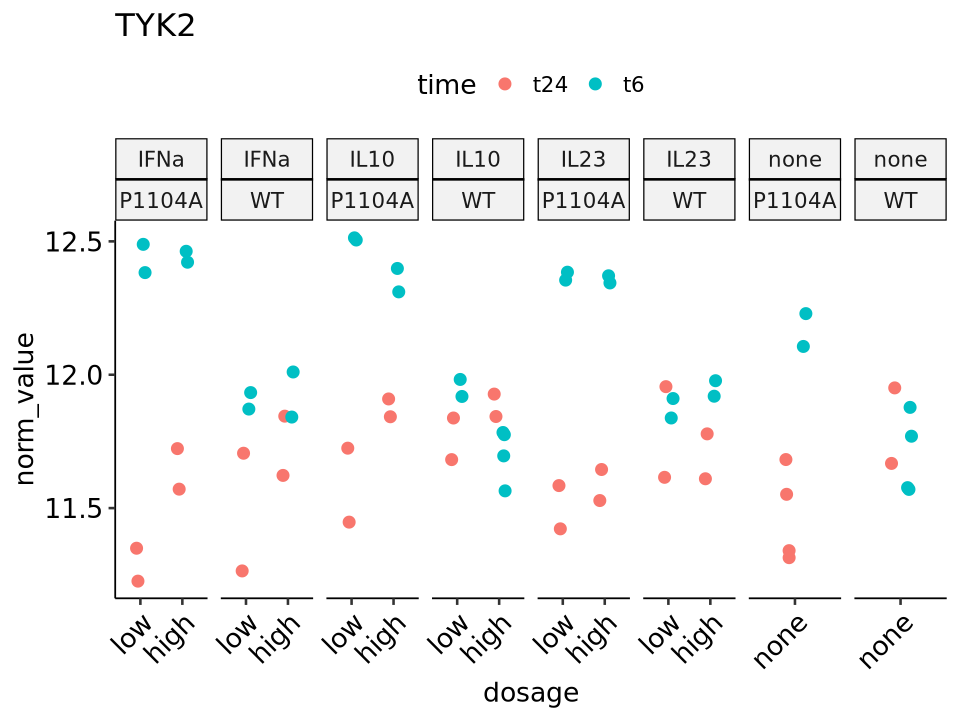
    

