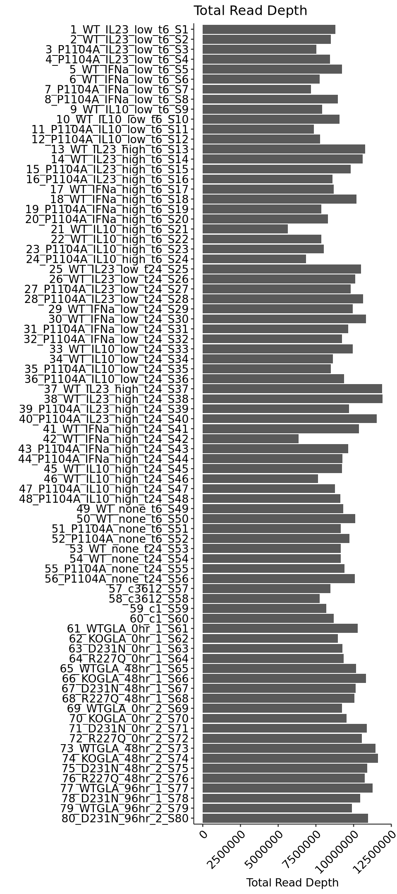
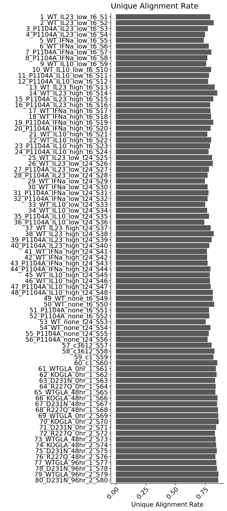
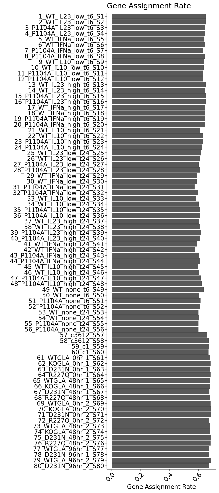
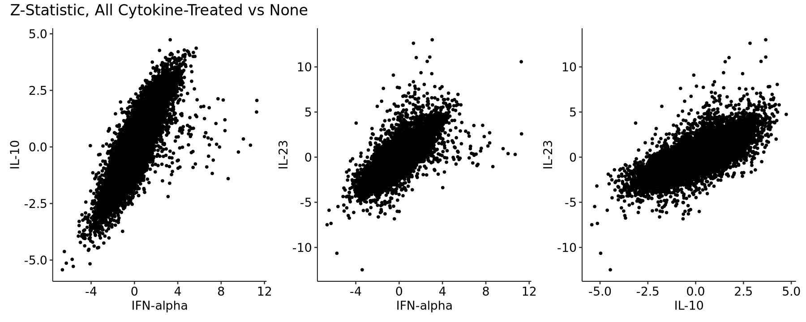
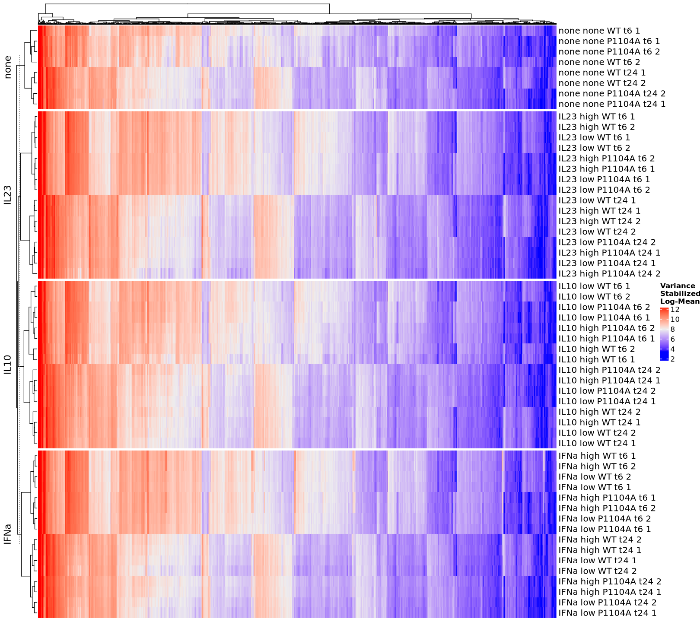
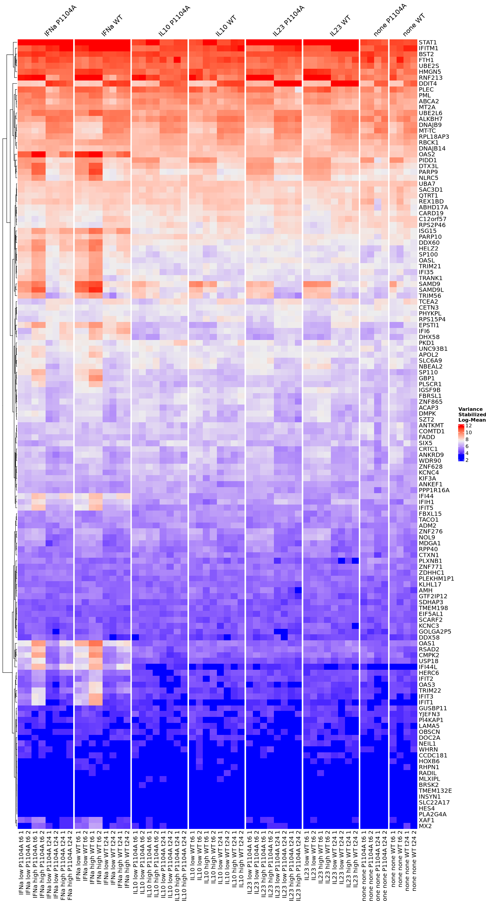
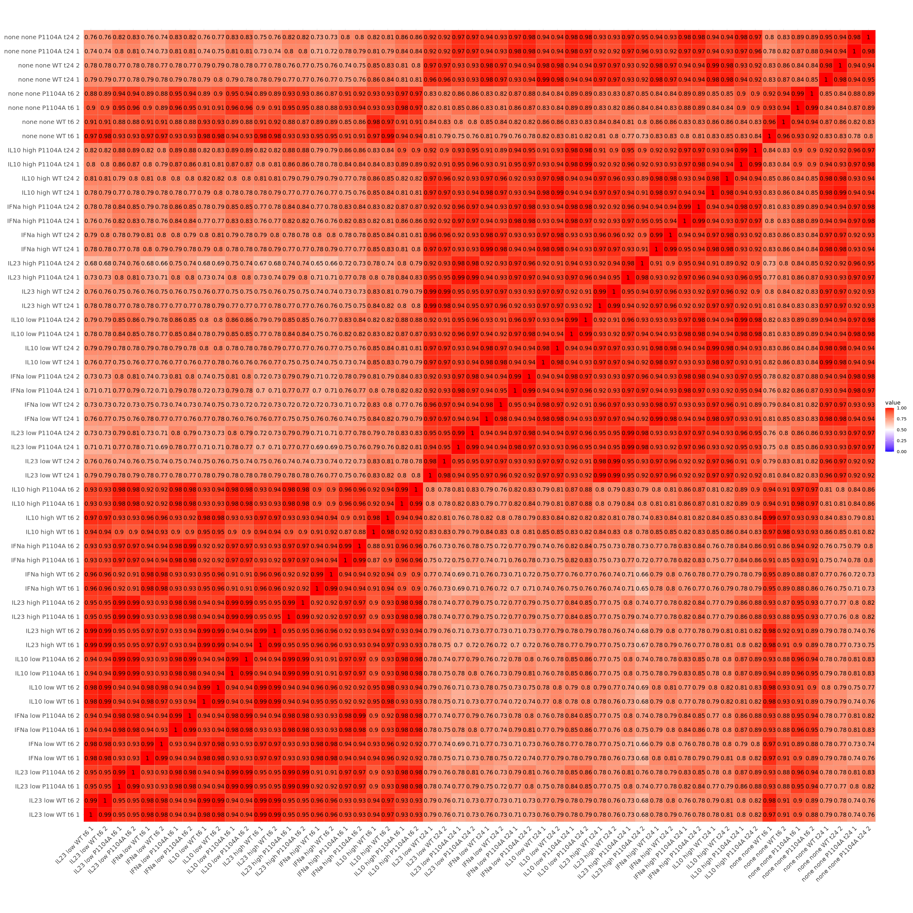
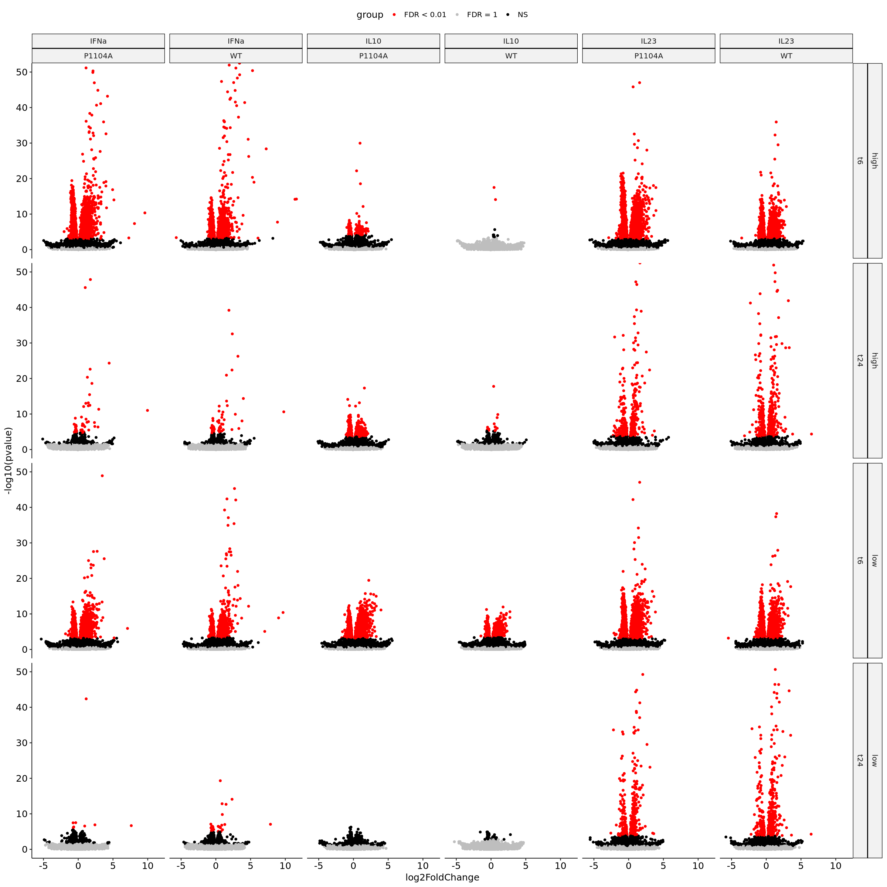
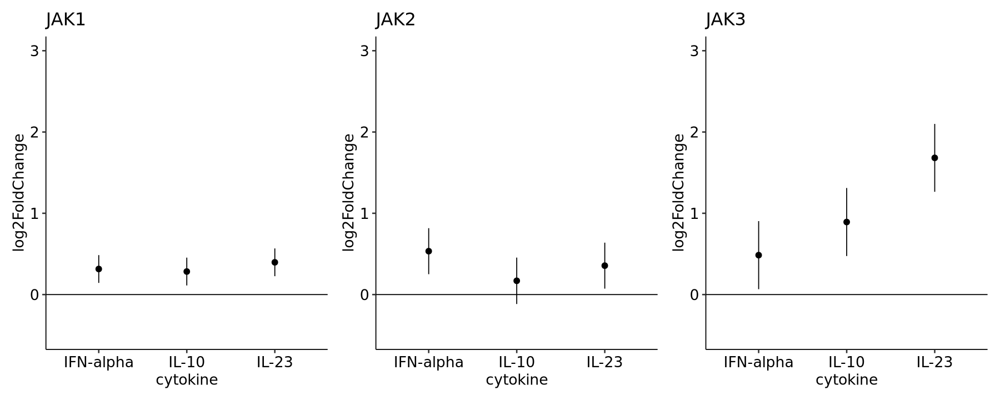
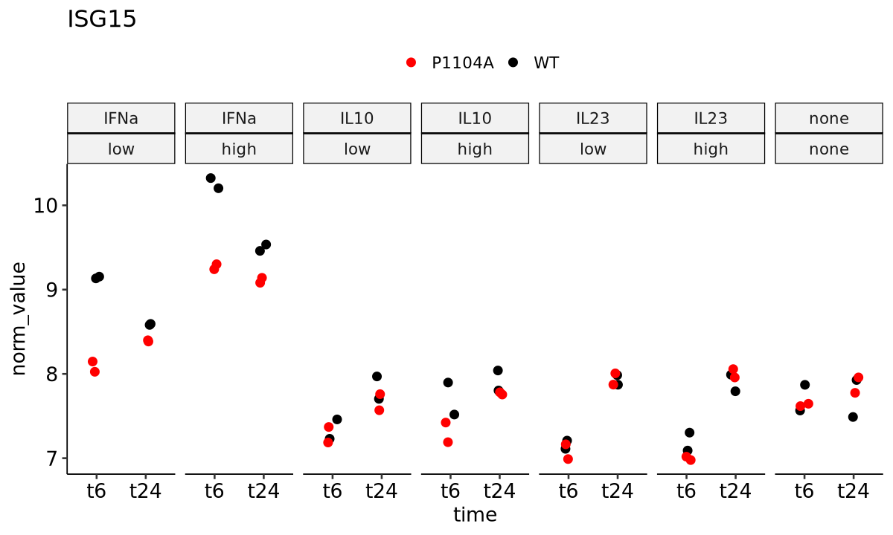

### TYK2 IL-23 RNA-seq

1. [Dataset Properties](#part1)
2. [Statistical Modeling](#part2)
3. [Global Profiling](#part3)
4. [Gene Visualizations](#part3)

#### Dataset Properties 

    

    

    

    

    

    

#### Statistical Modeling 

    

    

#### Global Profiling 

    

    

    

    

    Scale for fill is already present.
    Adding another scale for fill, which will replace the existing scale.

    

    

#### Gene Visualizations 

    

    

    

    

    

    

