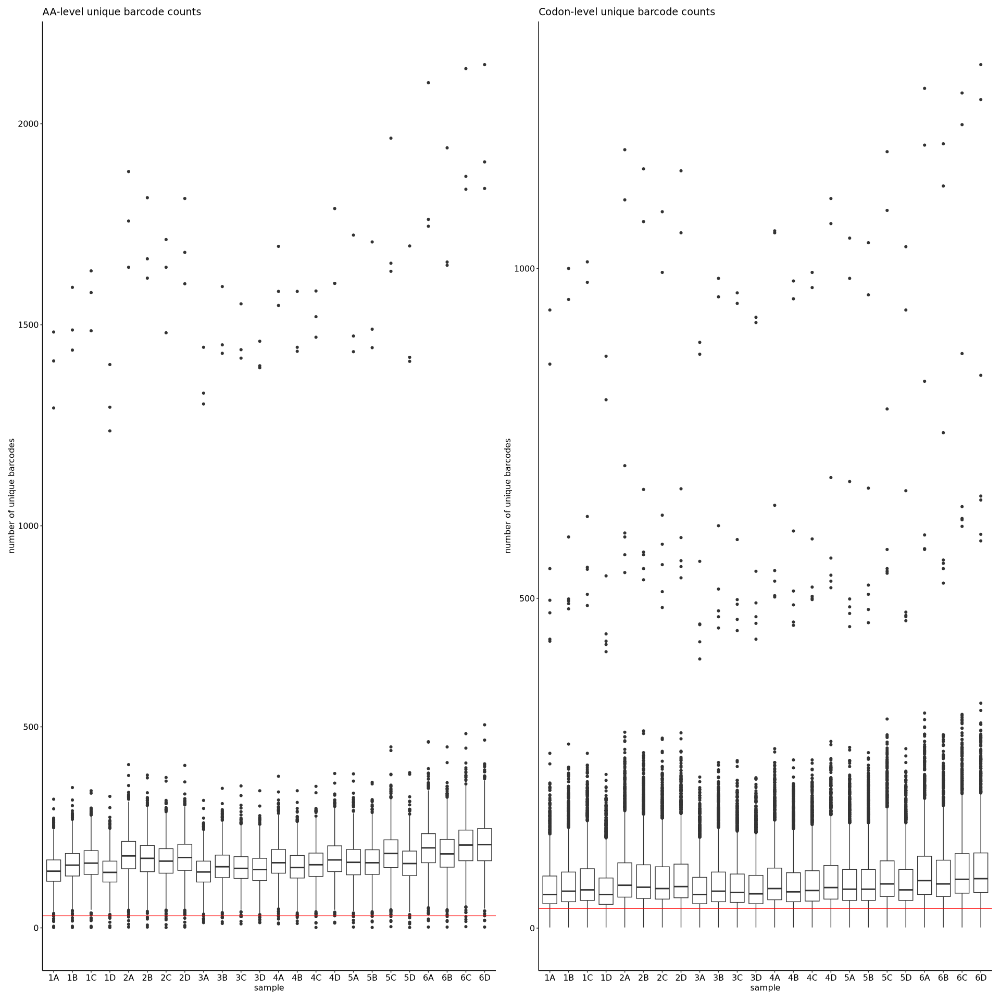
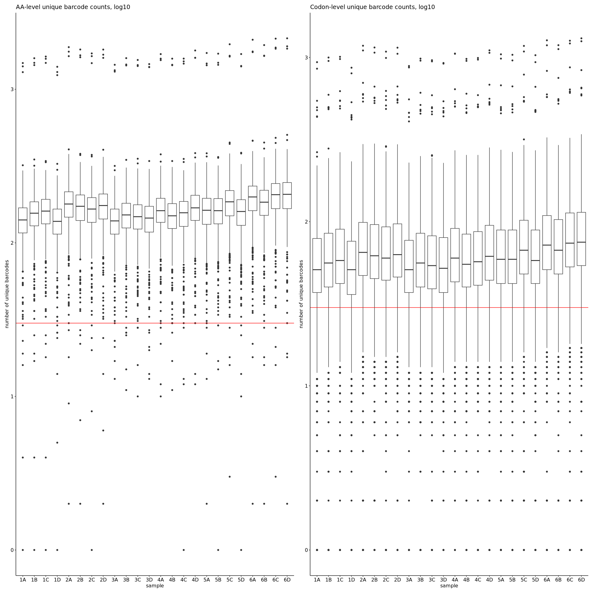
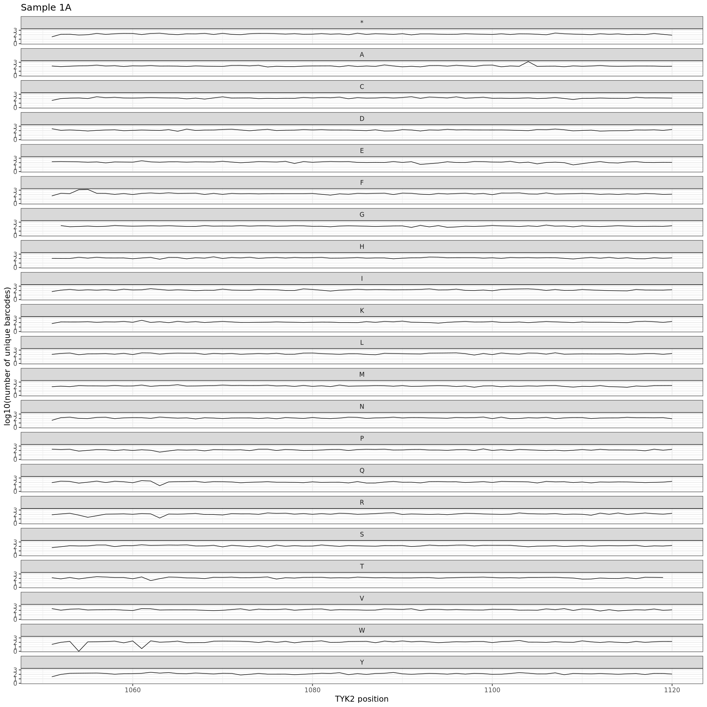
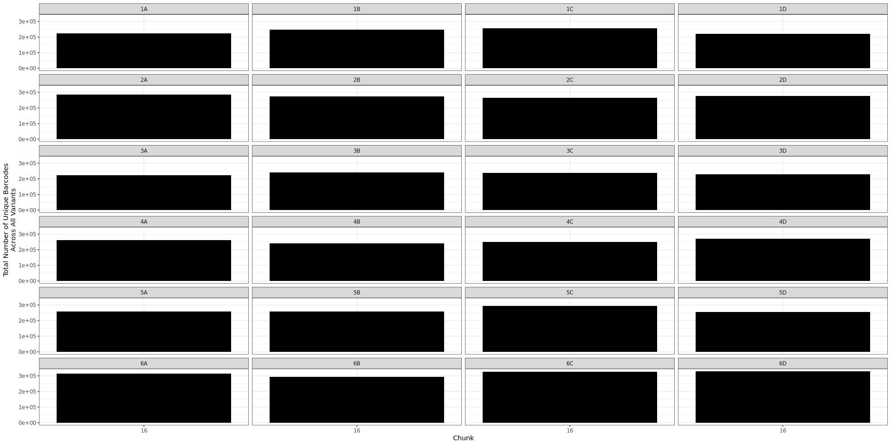
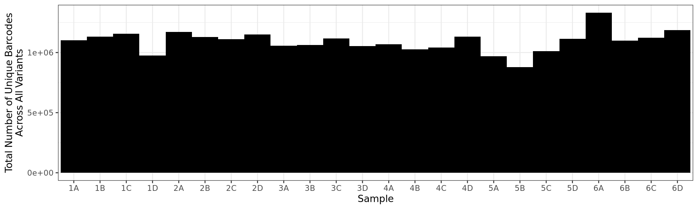
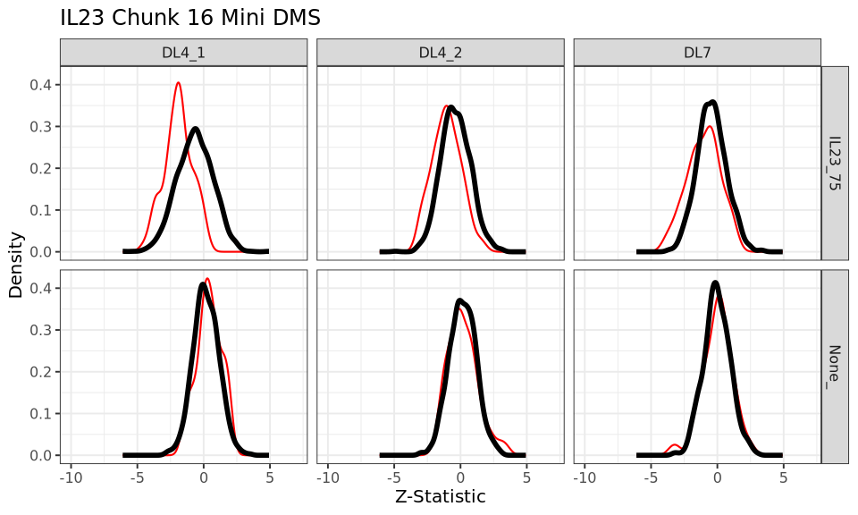
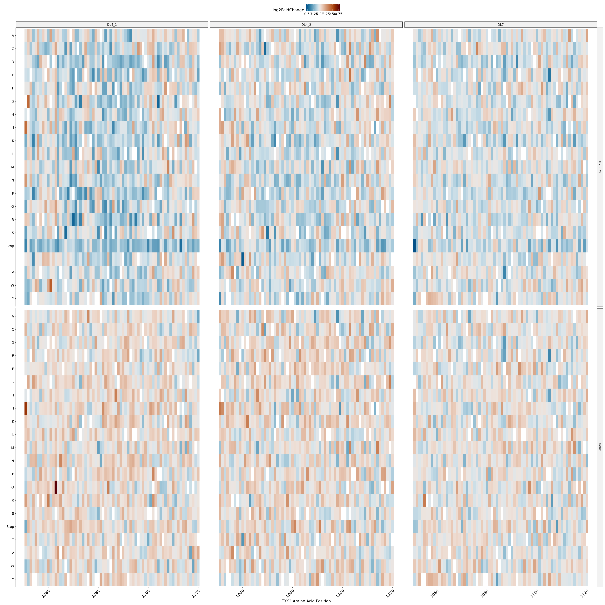
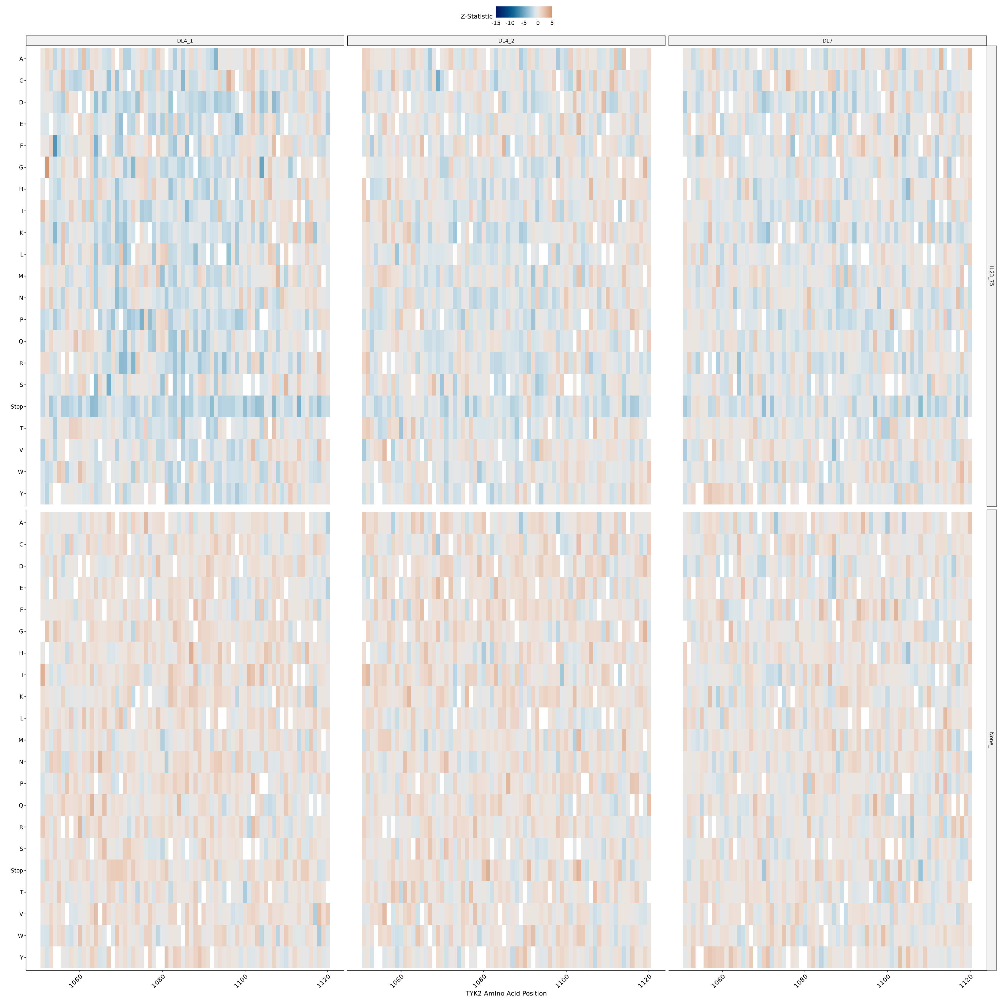

IL23 Mini DMS Assay
================

1.  [Barcode Sequencing Distributions](#part1)
2.  [Inference and Stop Codon Effects](#part2)
3.  [Visualizations](#part3)
4.  [Contrasts](#part4)

## Barcode Sequencing Distributions <a name="part1"></a>

<!-- --><!-- -->

``` r
bc_counts_aa %>% group_by(sample) %>% summarise(mean = mean(n)) %>% knitr::kable(digits = 3)
```

| sample |    mean |
|:-------|--------:|
| 1A     | 146.259 |
| 1B     | 160.555 |
| 1C     | 166.631 |
| 1D     | 142.805 |
| 2A     | 185.313 |
| 2B     | 177.870 |
| 2C     | 172.074 |
| 2D     | 180.464 |
| 3A     | 144.122 |
| 3B     | 157.352 |
| 3C     | 153.971 |
| 3D     | 149.279 |
| 4A     | 170.295 |
| 4B     | 155.825 |
| 4C     | 161.583 |
| 4D     | 175.929 |
| 5A     | 167.557 |
| 5B     | 167.148 |
| 5C     | 189.961 |
| 5D     | 164.899 |
| 6A     | 203.637 |
| 6B     | 190.169 |
| 6C     | 211.023 |
| 6D     | 212.839 |

<!-- -->

<!-- -->

<!-- -->

## Inference and Stop Codon Effects <a name="part2"></a>

In the plots below, the black curve shows the Z-statistic distribution
of all non-Stop variants across the entire length of the chunk. Each red
distribution shows the Z-statistics of Stop variants for one chunk only,
resulting in each facet having five red distributions (one for each
chunk) and one black distribution.

<!-- -->

### Visualizations <a name="part3"></a>

<!-- -->
<!-- -->
