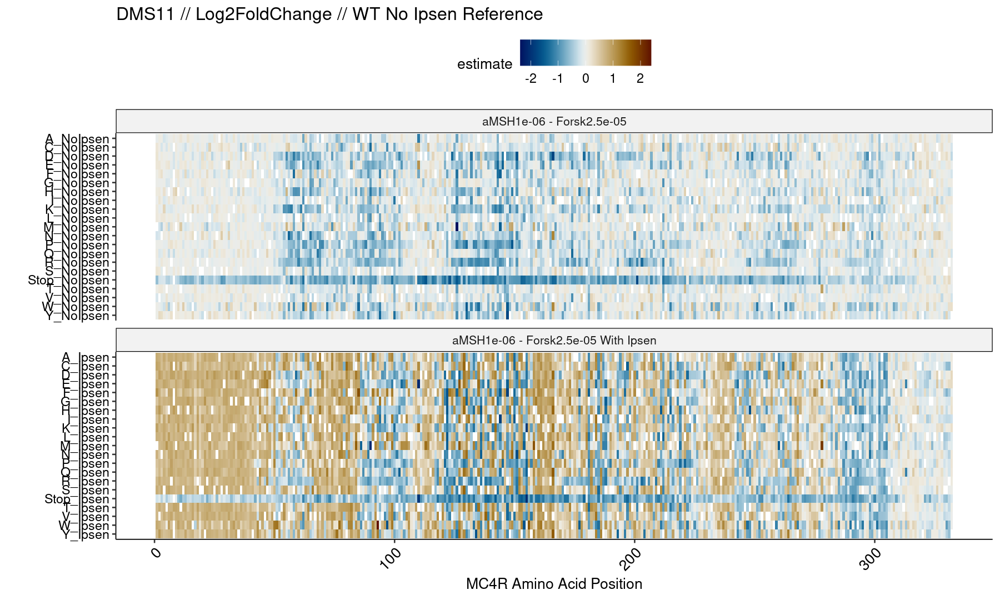
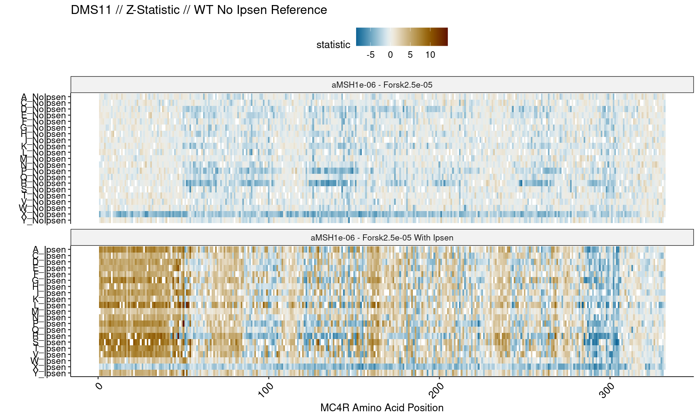
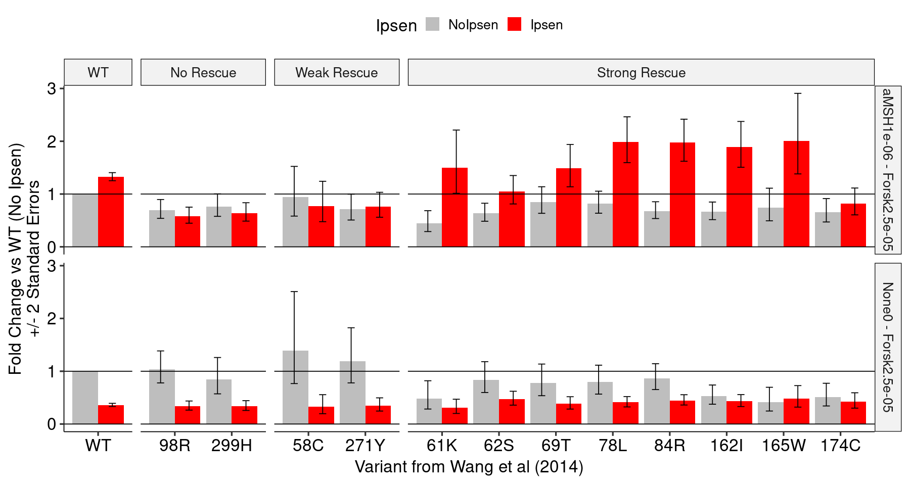
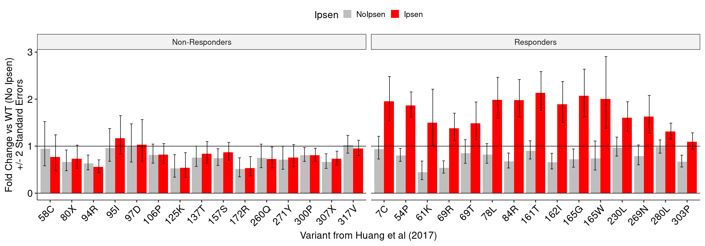

## OCNT-DMSLIB-0-CRE DMS Assay Run #2: MC4R, Gs, Ipsen (DMS11) Model Extension

This report extends the full analysis of the DMS11 dataset to  force the reference genotype for each position to be "WT, No Ipsen" across all mutants, even those under an Ipsen condition. This permits a more appropriate comparison to the summary statistics gather from various papers. Using the summary statistics, we can make the same heatmaps as usual:

    

    

    

    

Next, we compare these summary statistics to published variant sets from Wang et al (2014):

    

    

We can also generate the same plot, except for the Huang et al (2017) variant set stratified by functional category:

    

    

For plotting convienence, we can slim this down to just the top 15 and bottom 15 variants, ranked by the size of the gap between Ipsen and No Ipsen in the aMSH condition. This removes enough data points that we can leave the labels there, and they are still legible:

    

    

