```R
# Parameters
bcmap = "../pipeline/OCNT-DMSLIB-0-CRE/"

```

## DMS Barcode Mapping Report

1. [Sequencing Quality Metrics](#part1)
2. [Read Sampling Distributions](#part2)
3. [Library Complexity and Coverage](#part3)
4. [RY Barcoding](#part4)

### Sequencing Quality Metrics <a name="part1"></a>

#### Sequencing Depth 


    
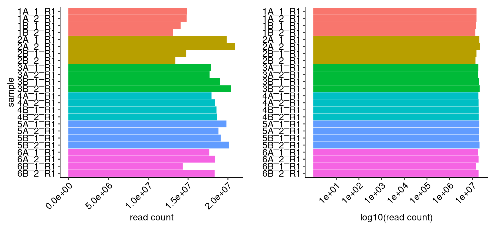
    


    
    
    |sample  | read count|
    |:-------|----------:|
    |1A_1_R1 |   14802535|
    |1A_2_R1 |   14788502|
    |1B_1_R1 |   14032298|
    |1B_2_R1 |   13082956|
    |2A_1_R1 |   19812582|
    |2A_2_R1 |   20840521|
    |2B_1_R1 |   14734954|
    |2B_2_R1 |   13365443|
    |3A_1_R1 |   17823044|
    |3A_2_R1 |   17662579|
    |3B_1_R1 |   18944841|
    |3B_2_R1 |   20319743|
    |4A_1_R1 |   17911599|
    |4A_2_R1 |   18332242|
    |4B_1_R1 |   18537492|
    |4B_2_R1 |   18575717|
    |5A_1_R1 |   19782420|
    |5A_2_R1 |   18780867|
    |5B_1_R1 |   19071180|
    |5B_2_R1 |   20078179|
    |6A_1_R1 |   17634340|
    |6A_2_R1 |   18323445|
    |6B_1_R1 |   14302389|
    |6B_2_R1 |   18304876|


#### R1/R2 Joining


    
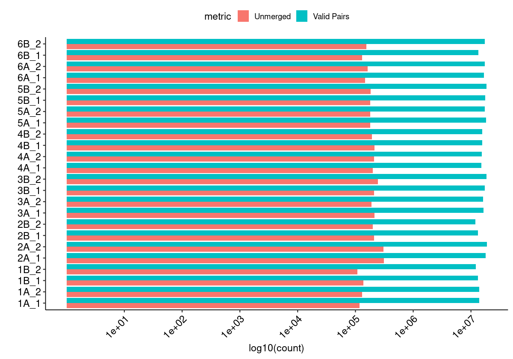
    


#### Merged Fragment Lengths


    
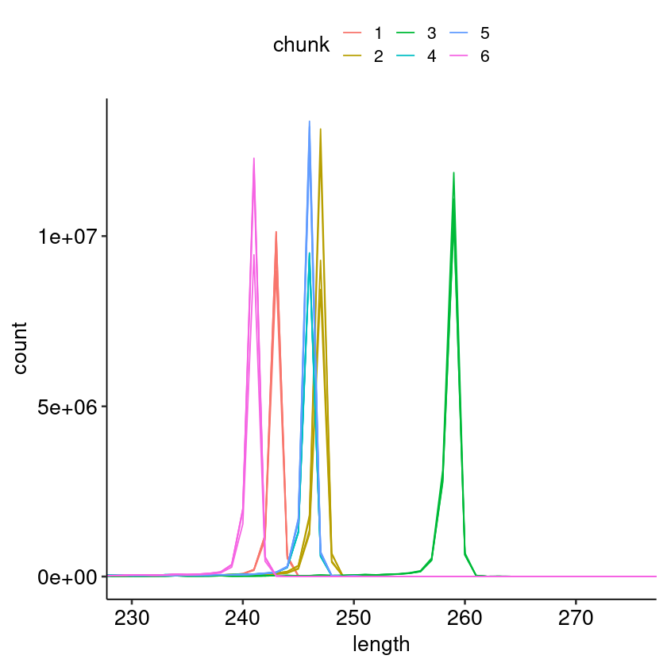
    


#### Unique Alignment Rate <a name="part2c"></a>


    
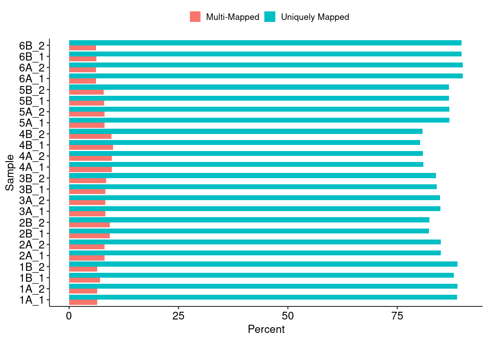
    


#### Edit Distance Distributions


    
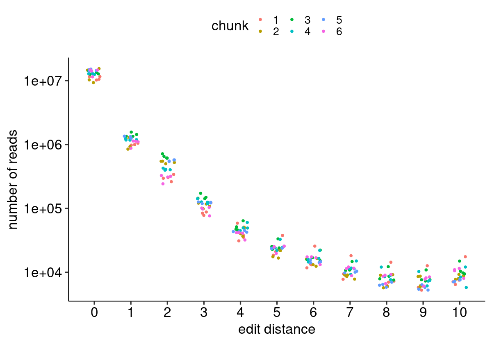
    


#### Edit Distance Proportion Distributions


    
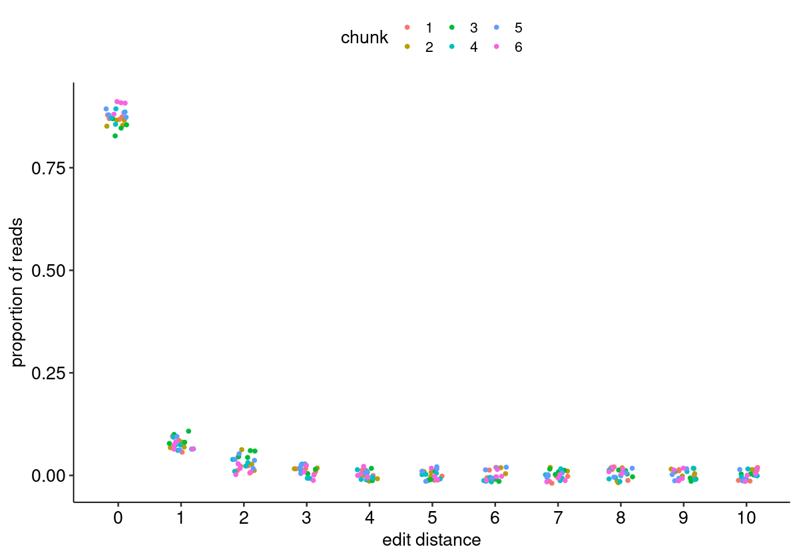
    


#### Reproduced Associations Per Barcode Sequence


    
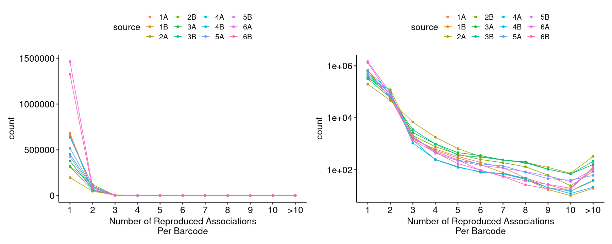
    


#### Filtered Barcode Counts Per Replicate Group


    
    
    |sample            |n      |
    |:-----------------|:------|
    |1A.bcmap-filtered |461133 |
    |1B.bcmap-filtered |444277 |
    |2A.bcmap-filtered |82816  |
    |2B.bcmap-filtered |170101 |
    |3A.bcmap-filtered |231127 |
    |3B.bcmap-filtered |189611 |
    |4A.bcmap-filtered |209533 |
    |4B.bcmap-filtered |296611 |
    |5A.bcmap-filtered |319961 |
    |5B.bcmap-filtered |260154 |
    |6A.bcmap-filtered |999466 |
    |6B.bcmap-filtered |893891 |


### Read Sampling Distributions <a name="part3"></a>

#### Reads Per Barcode Without Binning


    
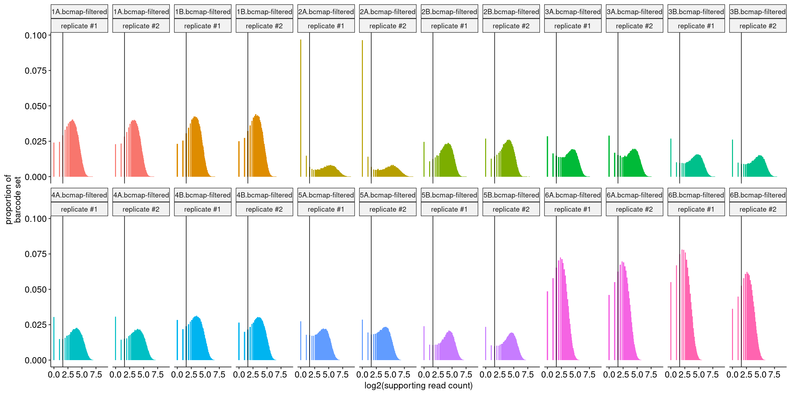
    


#### Reads Per Barcode With Binning


    
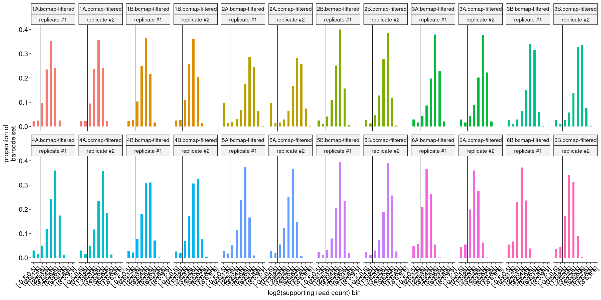
    


#### Barcode Purity Distributions


    
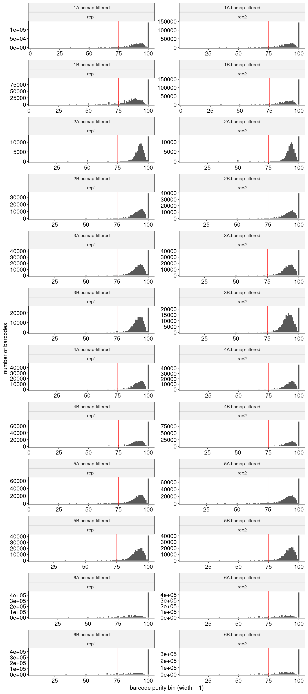
    


#### Barcode Counts Per Final Joined Map


    
    
    |sample            |final barcode count |
    |:-----------------|:-------------------|
    |1.bcmap-final.tsv |776426              |
    |2.bcmap-final.tsv |229516              |
    |3.bcmap-final.tsv |390186              |
    |4.bcmap-final.tsv |455179              |
    |5.bcmap-final.tsv |536064              |
    |6.bcmap-final.tsv |1455007             |


### Library Complexity and Coverage <a name="part4"></a>

#### Unique Barcodes Per Residue


    
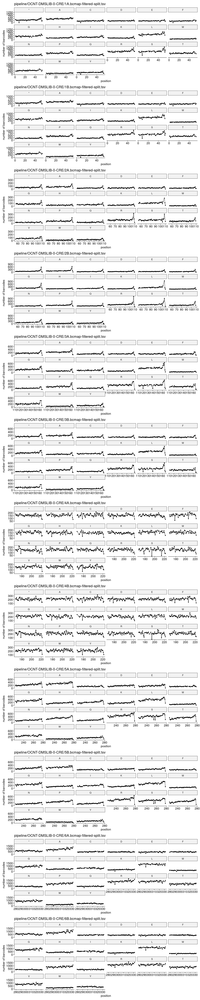
    


#### Unique Barcodes Per Residue, log10


    

    


### RY Barcoding <a name="part5"></a>


    
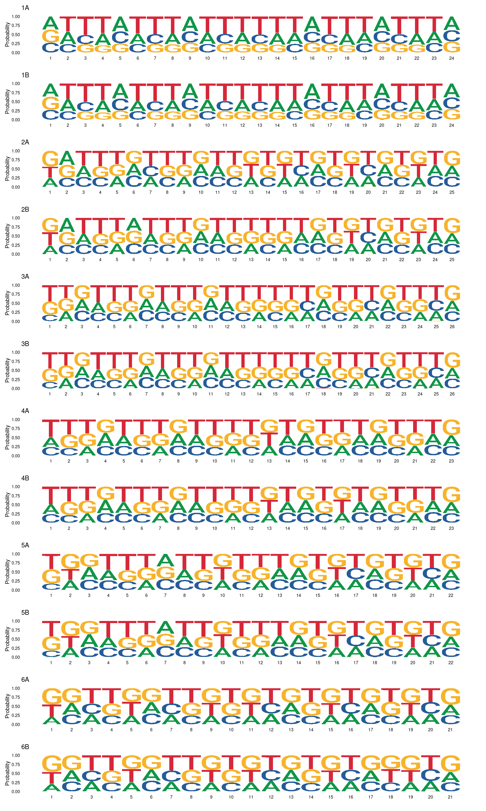
    

