## OCNT-DMSLIB-0-UAS DMS Assay Run #1: MC4R, Gq (DMS8)

| ID | Condition | Concentration | Replicates
| --- | ----------- | --- | ----------- |
| 1 | None | 0 | 4 |
| 2 | aMSH | 2e-8 | 4 |
| 3 | aMSH | 5e-8 | 4 |
| 4 | aMSH | 1e-6 | 4 |
| 5 | THIQ | 3e-9 | 4 |
| 6 | THIQ | 9e-9 | 4 |
| 7 | THIQ | 1e-7 | 3 |

This report generates summary statistics and plots for MC4R, Gq (DMS8) identically to that of TYK2. Some sections that are TYK2-specific (e.g. drug resistence GoF, spike-ins) are omitted, and the ClinVar comparison is added (since, for MC4R, that association is much stronger than for TYK2).

1. [Barcode Sequencing Distributions](#part1)
2. [Inference and Stop Codon Effects](#part2)
3. [Visualizations](#part3)
4. [ClinVar](#part4)
5. [Unnormalized Summary Statistics](#part5)
6. [Comparing aMSH to THIQ](#part6)

### Barcode Sequencing Distributions 

To start, we plot the distribution of unique barcodes per variant across samples:

    
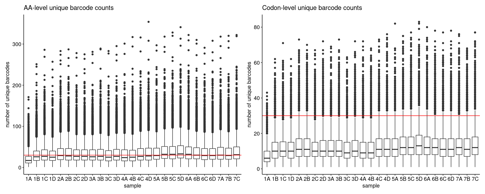
    

    
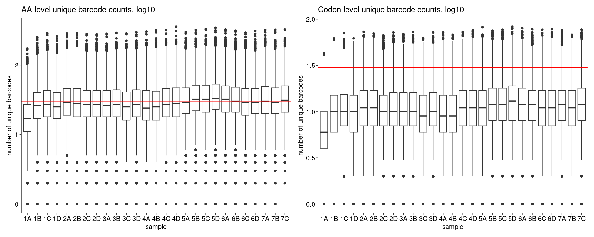
    

    
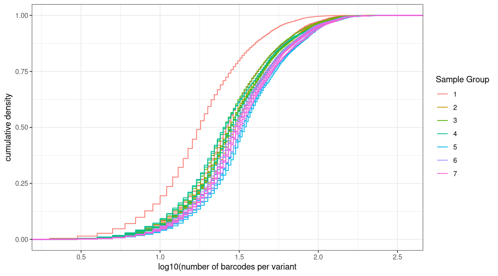
    

We can stratify this by residue, but at the expense of generating very large plots. All full coverage plots are stored [here](./coverage-plots) for all samples, and a representative sample (1A) is shown below:

    
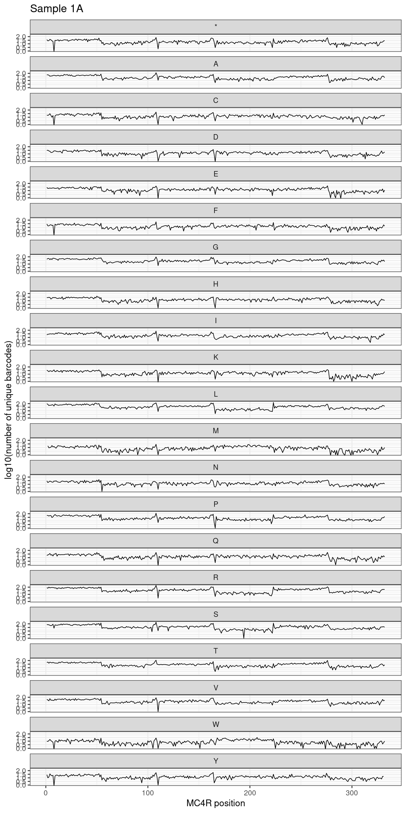
    

    

    

    
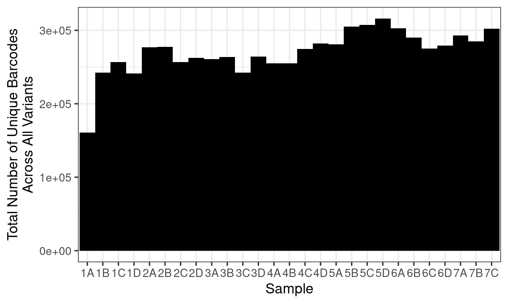
    

### Inference and Stop Codon Effects 

Next, we can compute the normalizing contrasts against Forskolin or None, and plot the results. First, we can quickly check if there are any positions missing, and see that there are two partial positional dropouts at position 8 and 293 (meaning total coverage is still approx. 99.89%):

    
    
    |aa | missing at position|
    |:--|-------------------:|
    |C  |                   8|
    |F  |                   8|
    |W  |                   8|
    |*  |                   8|
    |Y  |                   8|
    |M  |                 293|
    |W  |                 293|

Now, we compute the normalizing contrasts and evaluate stop codon effects across each chunk:

Finally, we can count up all significant effects at a 1% FDR in all comparisons. This verifies what is visually clear above, namely the relatively high basal activity (meaning significant variant effects in the absence of agonist): 

    
    
    |condition         | Non-Significant| Significant (FDR < 0.01)|
    |:-----------------|---------------:|------------------------:|
    |aMSH2e-08 - None0 |            6572|                       61|
    |aMSH5e-08 - None0 |            6423|                      210|
    |aMSH1e-06 - None0 |            5833|                      800|
    |THIQ3e-09 - None0 |            6613|                       20|
    |THIQ9e-09 - None0 |            6593|                       40|
    |THIQ1e-07 - None0 |            6539|                       94|

### Visualizations 

Next, we generate the standard visualizations for these data, namely heatmaps (using log2FoldChange or Z-statistic) and volcano plots:

    
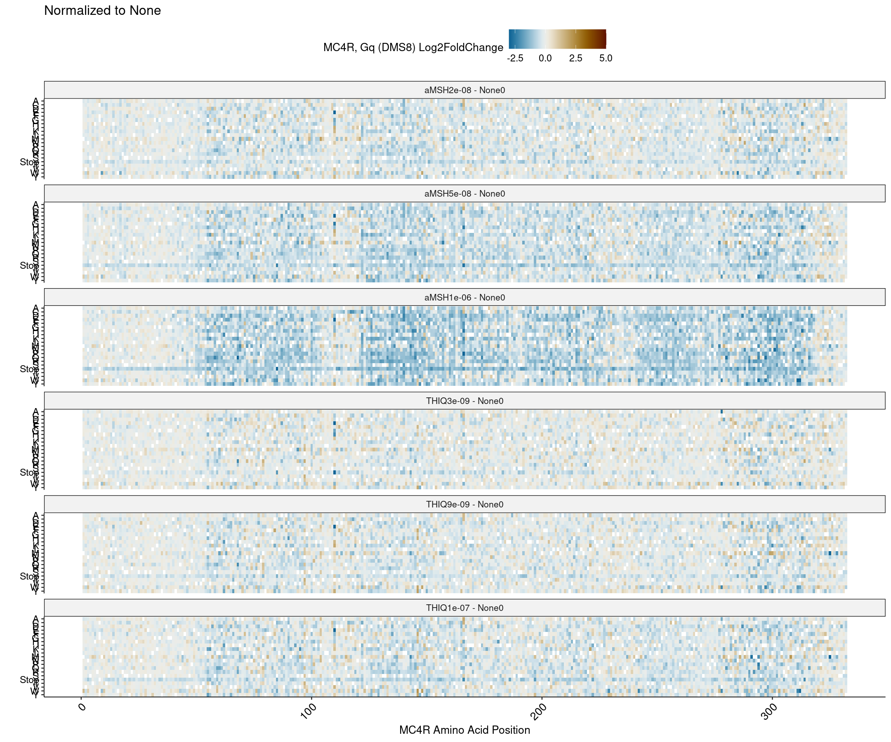
    

    
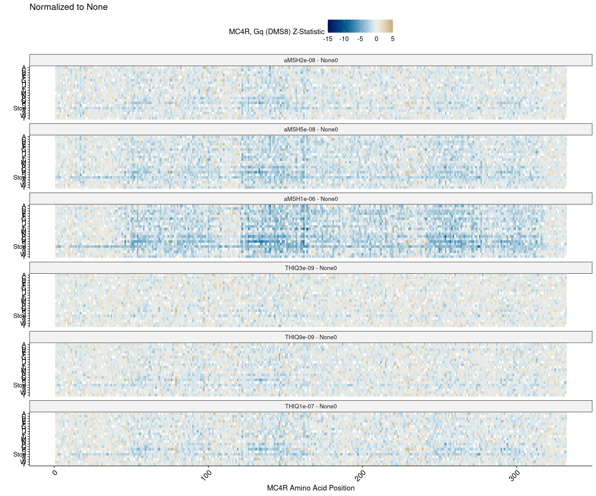
    

    
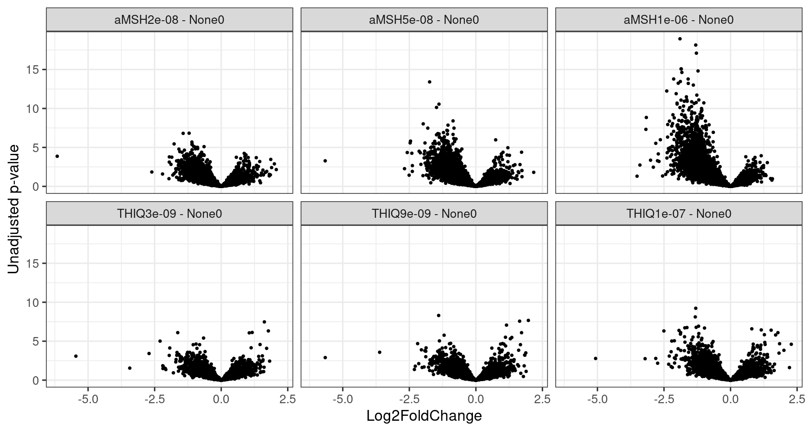
    

### ClinVar 

For MC4R, we know the association between ClinVar pathogenicity status and the observed summary statistics are quite strong for the Gs (DMS5) dataset. Since we have it on hand, we can extract just those variants which are annotated in ClinVar under various categories, and plot them across all conditions. We could do this for any variant subset, and so show a few selections below:

    
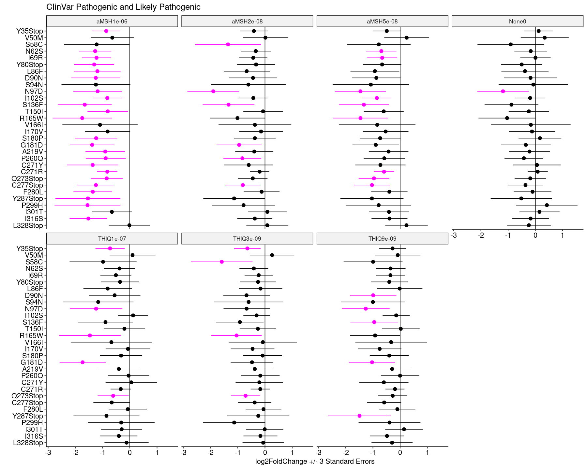
    

    
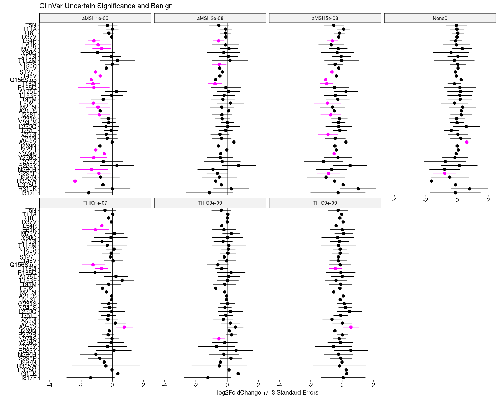
    

    
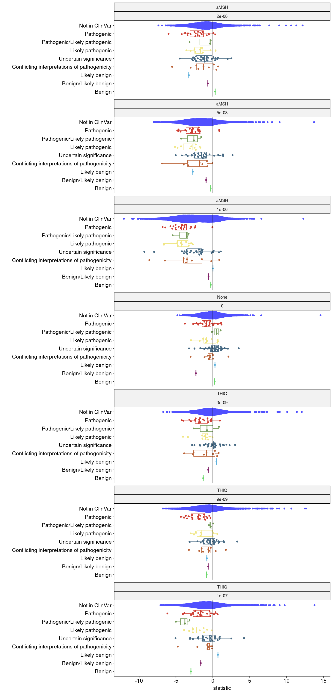
    

### Unnormalized Summary Statistics 

The summary statistics without any contrast or computed difference are located in the same directory as the normalized summary statistics [here](../sumstats/MC4R).

    
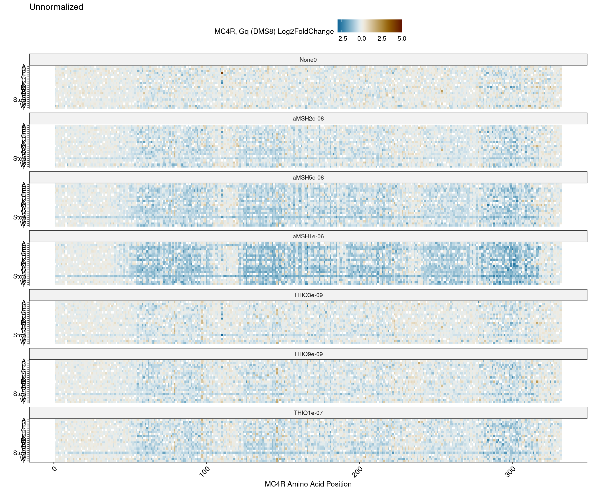
    

    
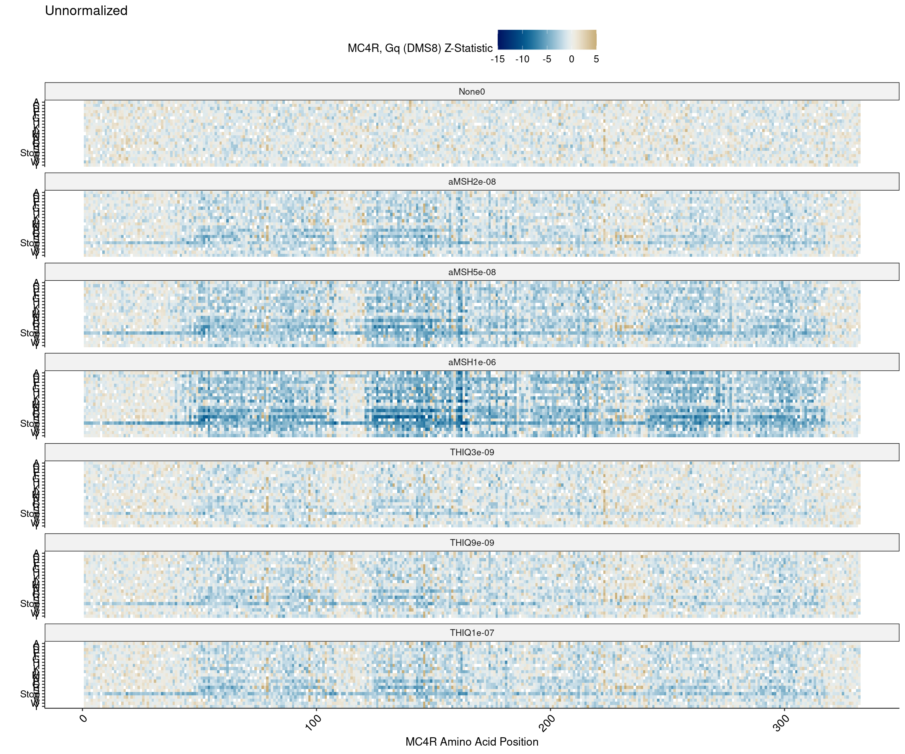
    

### Comparing aMSH to THIQ 

We have three concentrations each for aMSH and THIQ. If we match these conditions together as "Low", "Medium", and "High" we can compute the pairwise difference in mutation effets between aMSH and THIQ at each level. This generates a new set of summary statistics, which are shown below. 

    
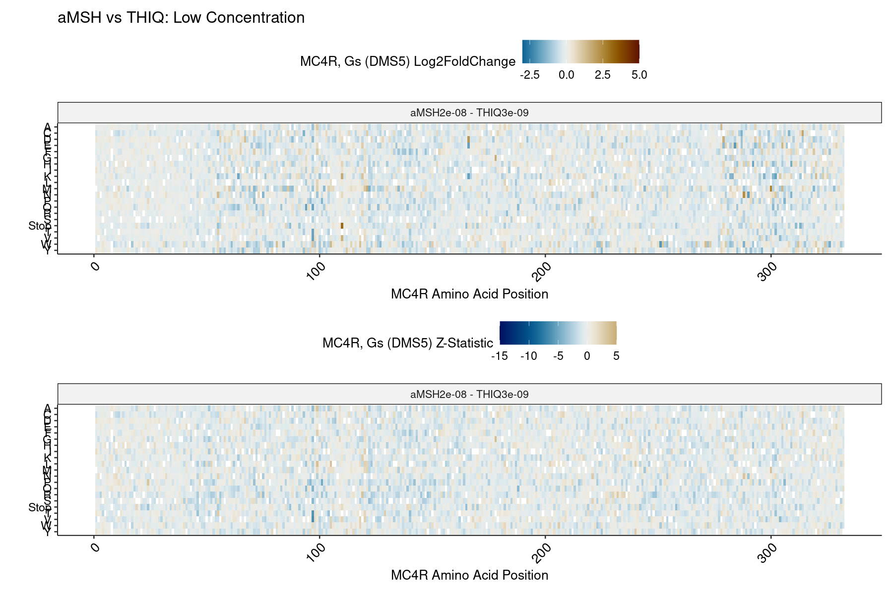
    

    
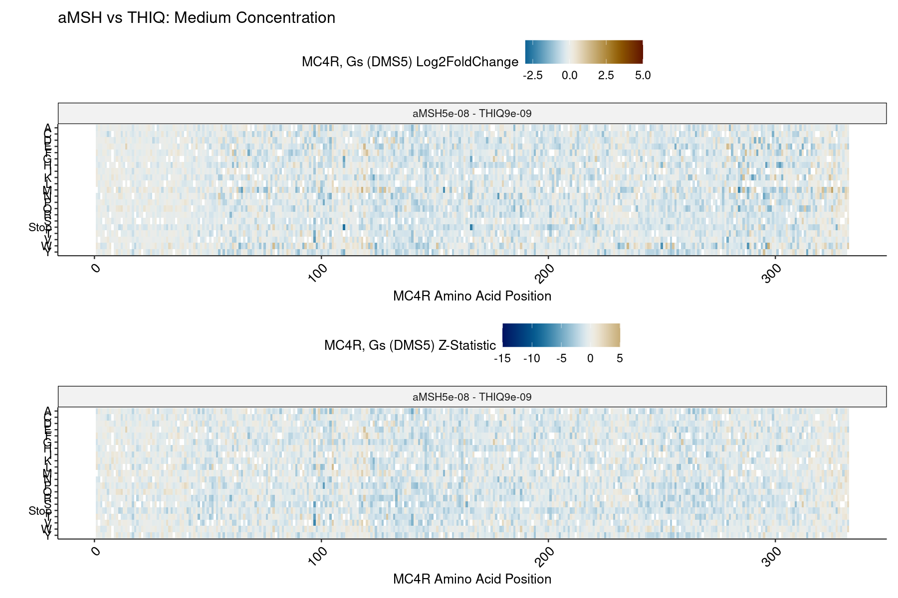
    

    
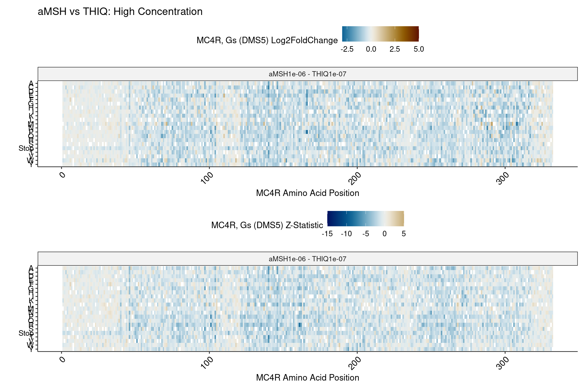
    

Most of these effects are negative, including a faint band of stops. This means that many variant effects are _more negative_ in aMSH compared to THIQ. This may reflect systematic differences, e.g. in the dosage of each compound. However, we can check which variants reverse this trend, namely those that are more negative in THIQ (instead of aMSH). Doing so, and imposing a FDR of 0.01, we find a resulting set of "THIQ-inhibiting" variants:

    
    
    | pos|chunk |aa | estimate| std.error|     p.adj|condition             |
    |---:|:-----|:--|--------:|---------:|---------:|:---------------------|
    | 105|2     |L  | 0.697024| 0.1704212| 0.0097851|aMSH5e-08 - THIQ9e-09 |

In contrast to Gs/DMS5, we don't see too much here other than a single variant at position 105.
