```R
# Parameters
bcmap = "../pipeline/OCNT-DMSLIB-0-UAS/"

```

## DMS Barcode Mapping Report

1. [Sequencing Quality Metrics](#part1)
2. [Read Sampling Distributions](#part2)
3. [Library Complexity and Coverage](#part3)
4. [RY Barcoding](#part4)

### Sequencing Quality Metrics <a name="part1"></a>

#### Sequencing Depth 


    
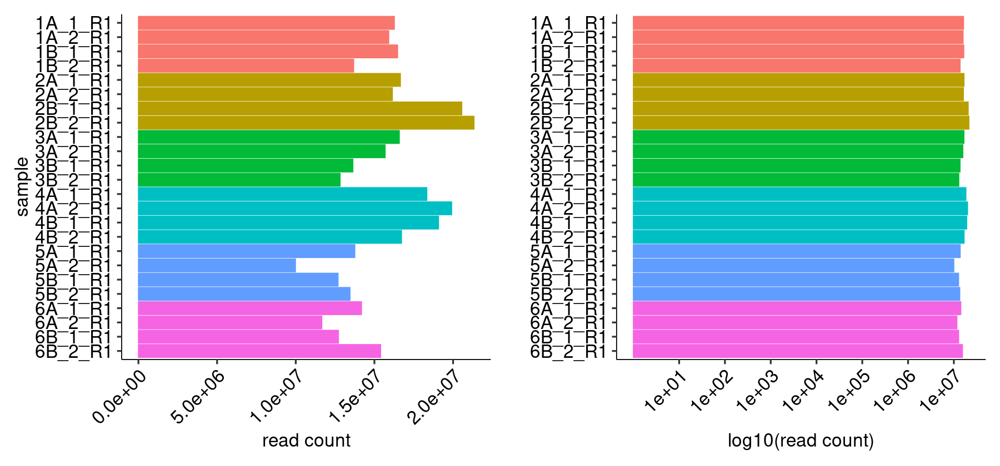
    


    
    
    |sample  | read count|
    |:-------|----------:|
    |1A_1_R1 |   16268005|
    |1A_2_R1 |   15909136|
    |1B_1_R1 |   16472443|
    |1B_2_R1 |   13680747|
    |2A_1_R1 |   16651043|
    |2A_2_R1 |   16139553|
    |2B_1_R1 |   20552887|
    |2B_2_R1 |   21329892|
    |3A_1_R1 |   16581138|
    |3A_2_R1 |   15679732|
    |3B_1_R1 |   13629656|
    |3B_2_R1 |   12815507|
    |4A_1_R1 |   18332161|
    |4A_2_R1 |   19910108|
    |4B_1_R1 |   19074041|
    |4B_2_R1 |   16721828|
    |5A_1_R1 |   13753901|
    |5A_2_R1 |    9980335|
    |5B_1_R1 |   12688545|
    |5B_2_R1 |   13448715|
    |6A_1_R1 |   14178469|
    |6A_2_R1 |   11655917|
    |6B_1_R1 |   12711108|
    |6B_2_R1 |   15393746|


#### R1/R2 Joining


    
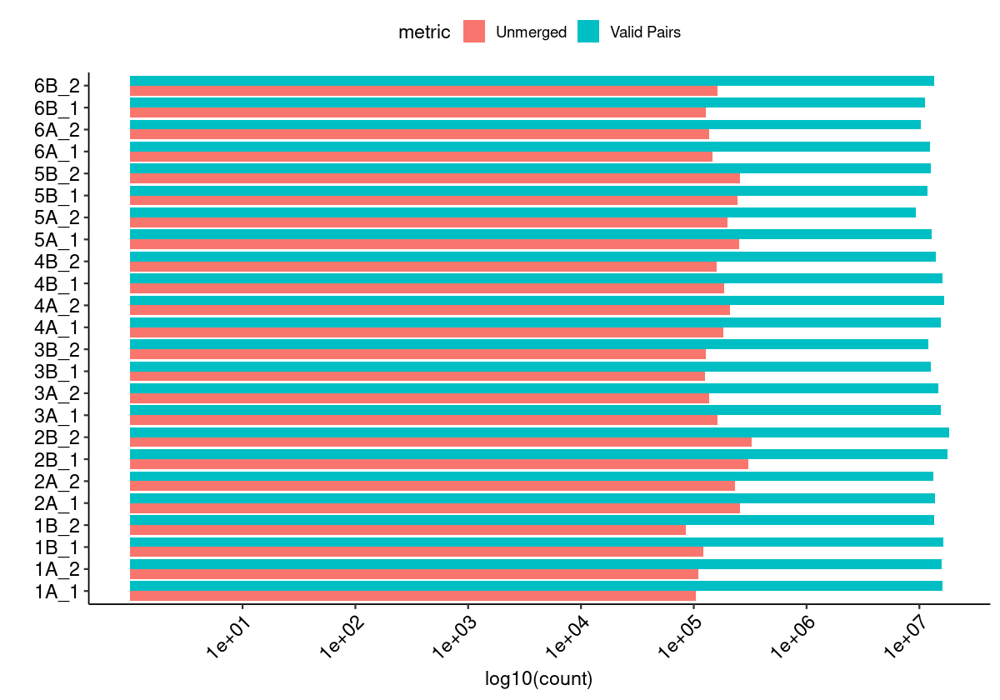
    


#### Merged Fragment Lengths


    
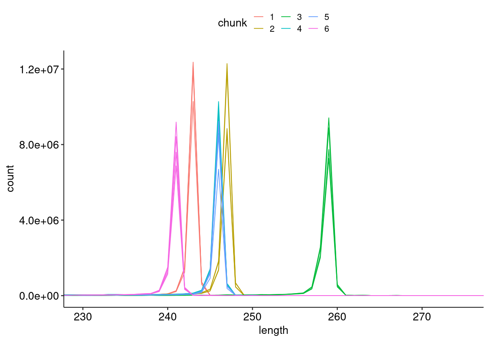
    


#### Unique Alignment Rate <a name="part2c"></a>


    
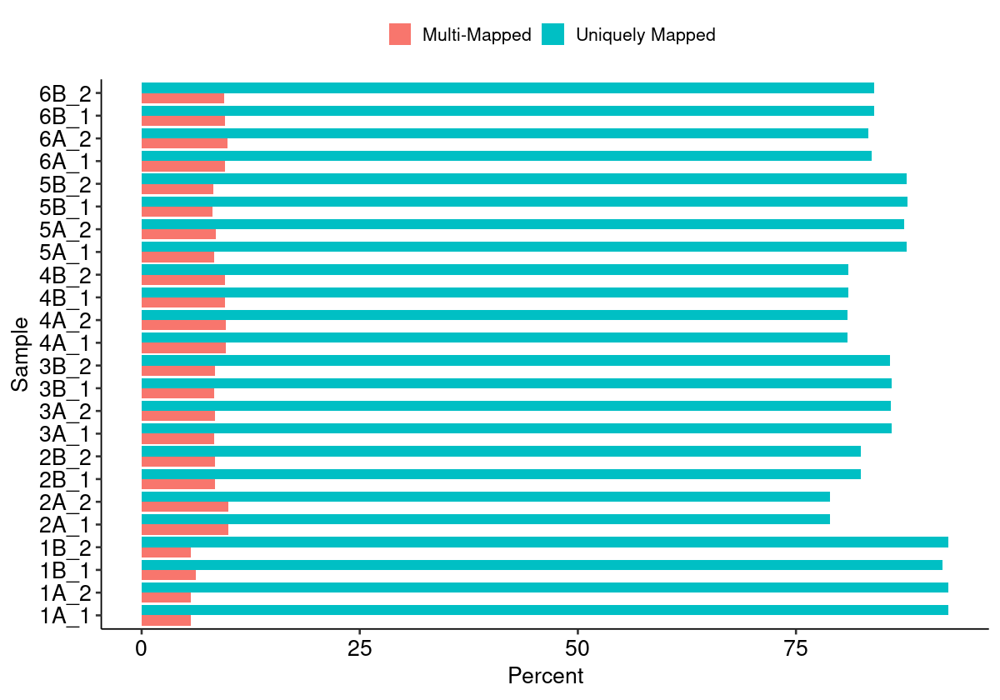
    


#### Edit Distance Distributions


    
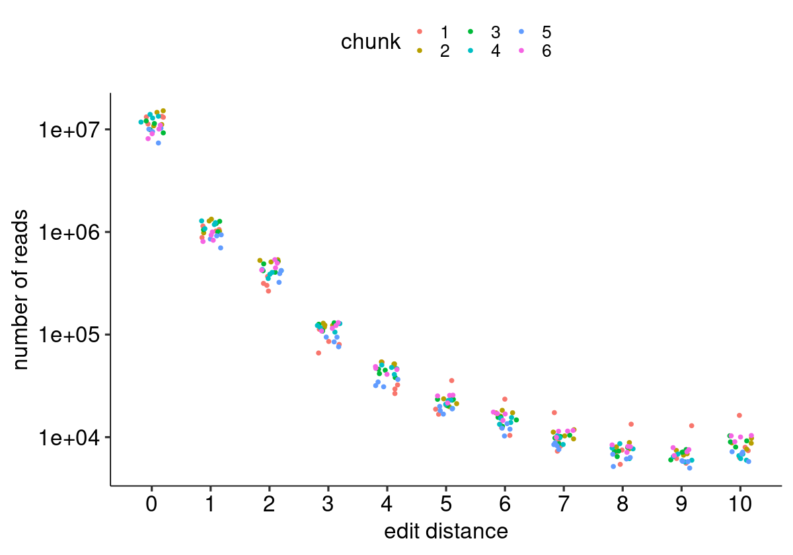
    


#### Edit Distance Proportion Distributions


    
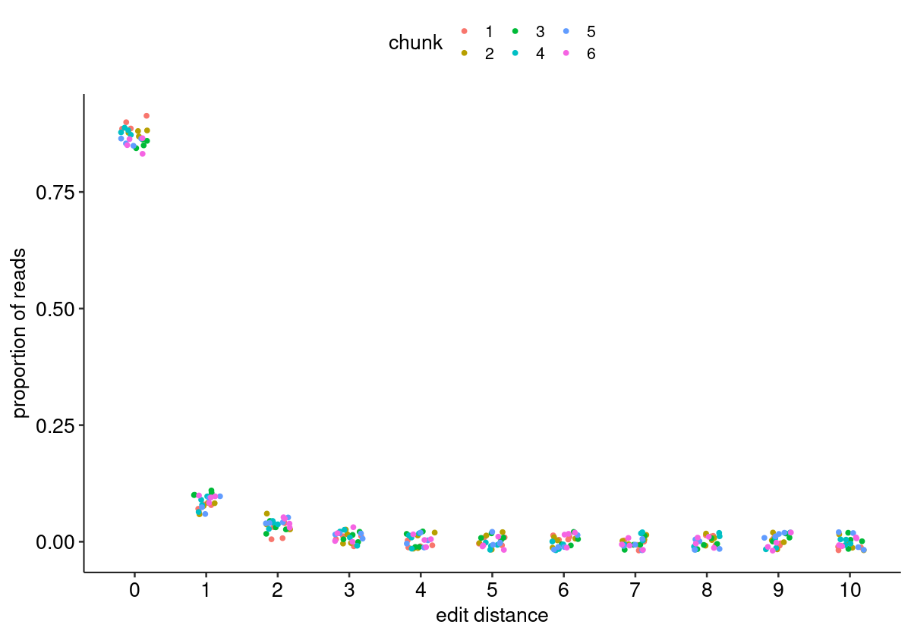
    


#### Reproduced Associations Per Barcode Sequence


    
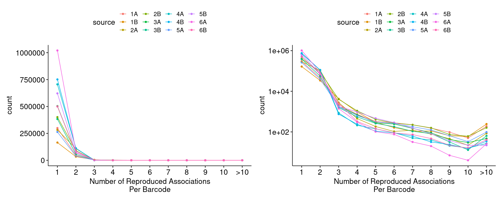
    


#### Filtered Barcode Counts Per Replicate Group


    
    
    |sample            |n      |
    |:-----------------|:------|
    |1A.bcmap-filtered |216094 |
    |1B.bcmap-filtered |113365 |
    |2A.bcmap-filtered |121332 |
    |2B.bcmap-filtered |202330 |
    |3A.bcmap-filtered |301073 |
    |3B.bcmap-filtered |229490 |
    |4A.bcmap-filtered |334621 |
    |4B.bcmap-filtered |356328 |
    |5A.bcmap-filtered |163874 |
    |5B.bcmap-filtered |393757 |
    |6A.bcmap-filtered |583801 |
    |6B.bcmap-filtered |288217 |


### Read Sampling Distributions <a name="part3"></a>

#### Reads Per Barcode Without Binning


    
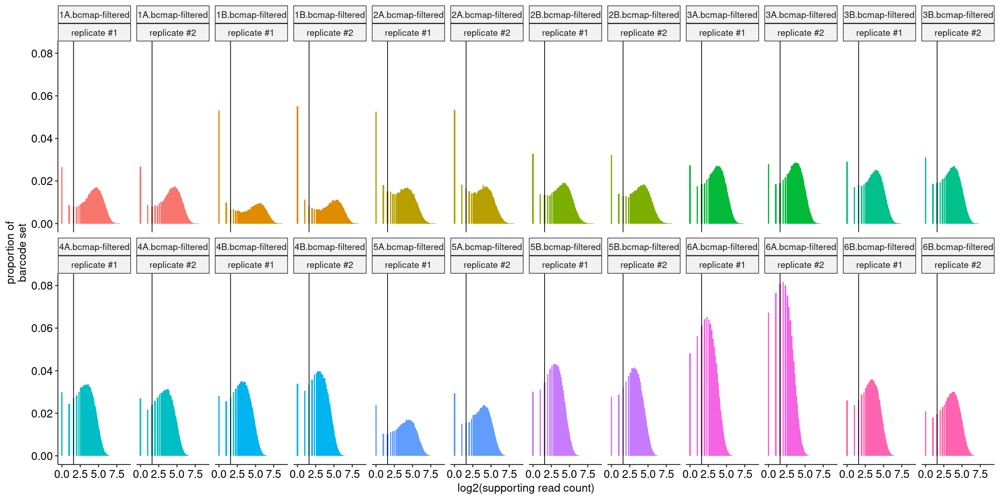
    


#### Reads Per Barcode With Binning


    
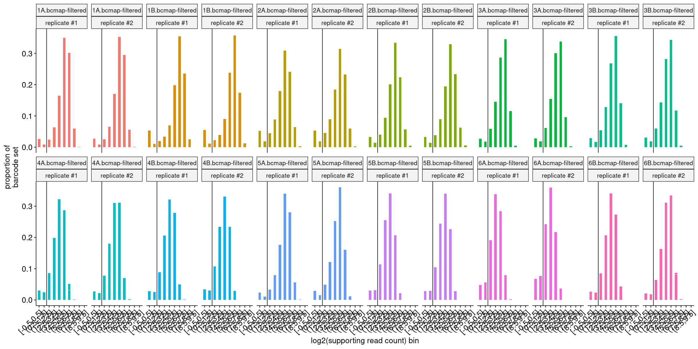
    


#### Barcode Purity Distributions


    
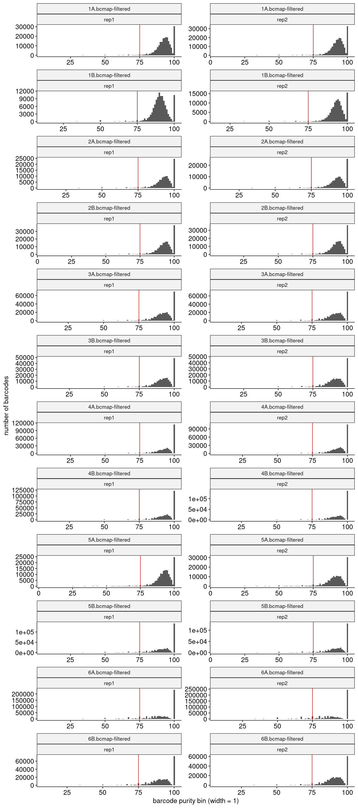
    


#### Barcode Counts Per Final Joined Map


    
    
    |sample            |final barcode count |
    |:-----------------|:-------------------|
    |1.bcmap-final.tsv |308031              |
    |2.bcmap-final.tsv |294916              |
    |3.bcmap-final.tsv |477975              |
    |4.bcmap-final.tsv |608462              |
    |5.bcmap-final.tsv |487691              |
    |6.bcmap-final.tsv |658340              |


### Library Complexity and Coverage <a name="part4"></a>

#### Unique Barcodes Per Residue


    
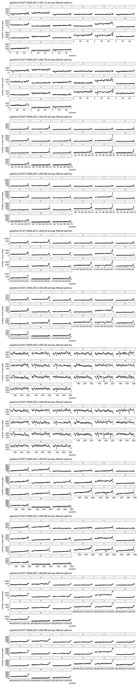
    


#### Unique Barcodes Per Residue, log10


    
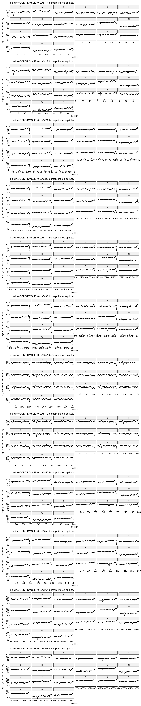
    


### RY Barcoding <a name="part5"></a>


    
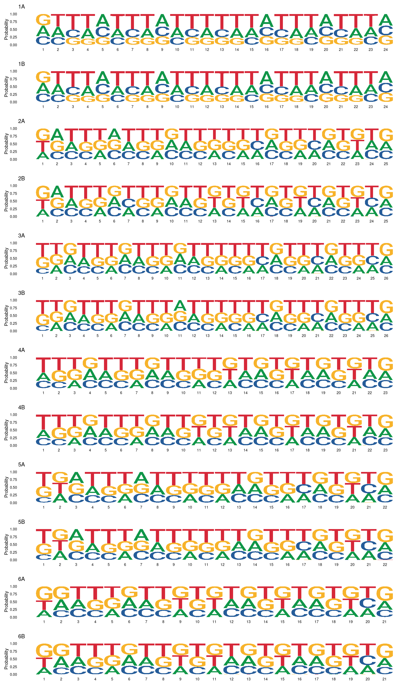
    

