## OCNT-DMSLIB-1 DMS Assay Run #4: TYK2 Inhibitors

| ID | Condition | Concentration (M) | Replicates
| --- | ----------- | --- | ----------- |
| 1 | None | 0 | 4 |
| 2 | BMS-986202 + IFN-alpha (100U/mL) | 3.6e-9 | 4 |
| 3 | BMS-986202 + IFN-alpha (100U/mL) | 2e-8 | 4 |
| 4 | BMS-986202 + IFN-alpha (100U/mL) | 1e-6 | 4 |
| 5 | Zasocitinib + IFN-alpha (100U/mL) | 1e-6 | 4 |
| 6 | Ropsacitinib + IFN-alpha (100U/mL) | 1e-7 | 4 |

We have three inhibitors at either one or three concentrations each, plus an untreated control condition. This report generates similar results to the initial full length TYK2 assay, focused on identifying drug resistance (i.e. GoF) effects.

1. [Barcode Sequencing Distributions](#part1)
2. [Inference and Stop Codon Effects](#part2)
3. [Visualizations](#part3)
4. [Drug Resistance/Gain-of-Function](#part4)

### Barcode Sequencing Distributions 

    
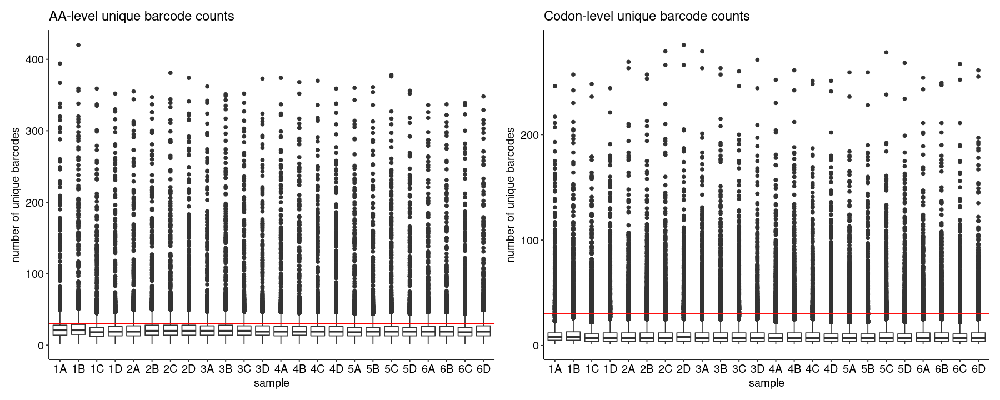
    

    
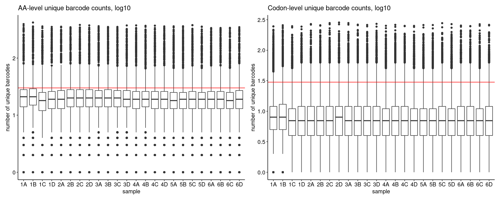
    

To get a sense of positional distribution, we can show the same data as lineplots across the length of TYK2. Below is an example using sample `1A` only; the remaining plots can be found [here](./coverage-plots):

    
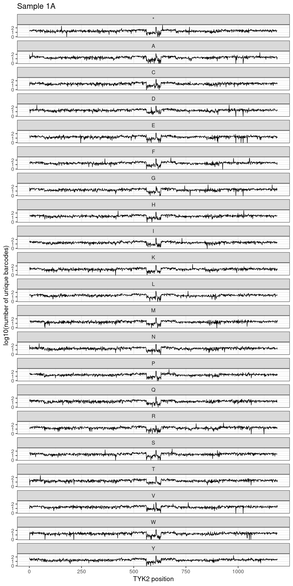
    

    
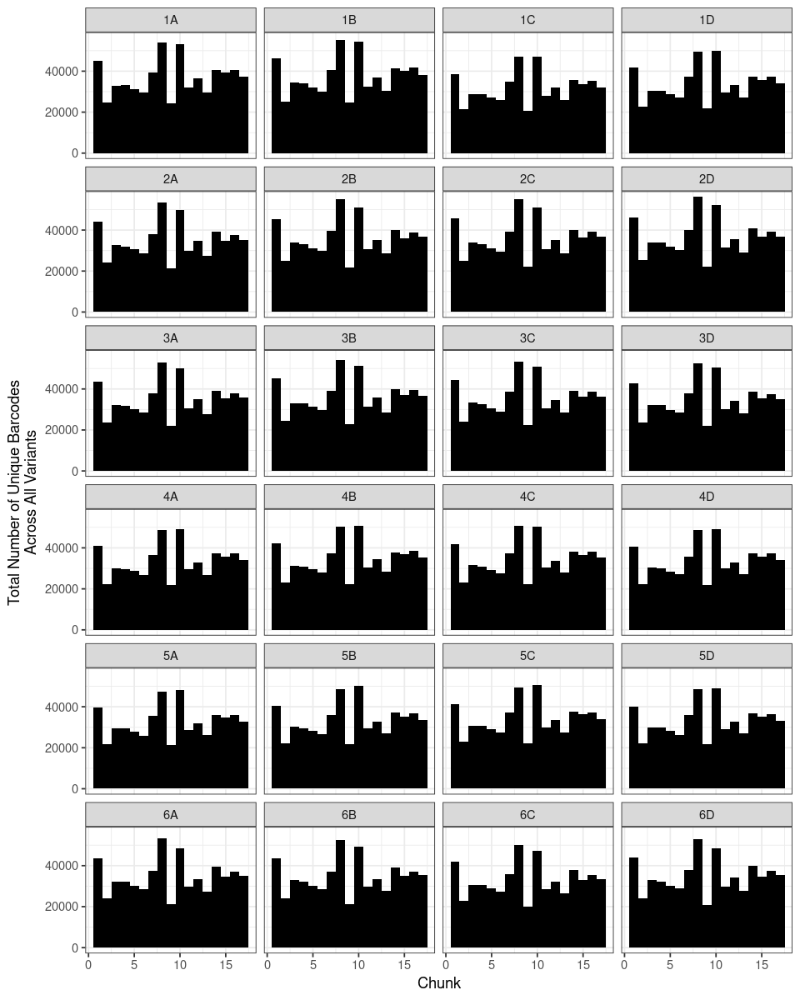
    

    

    

### Inference and Stop Codon Effects 

    
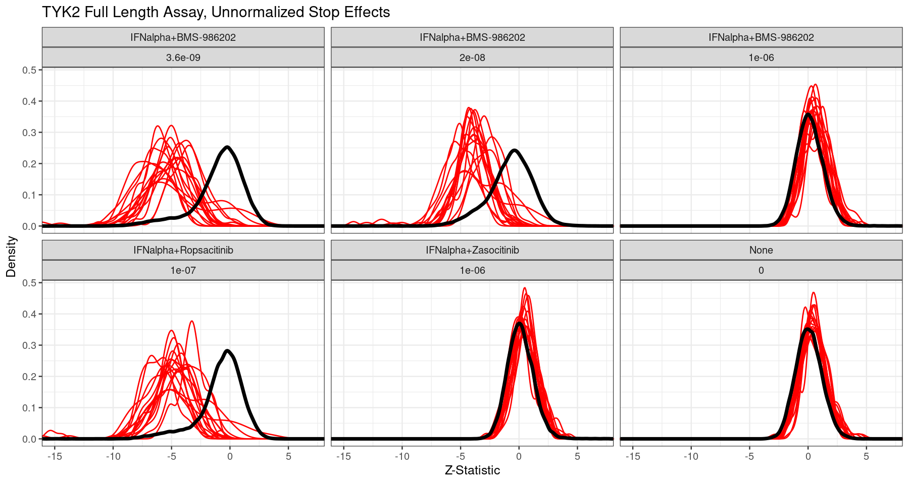
    

    
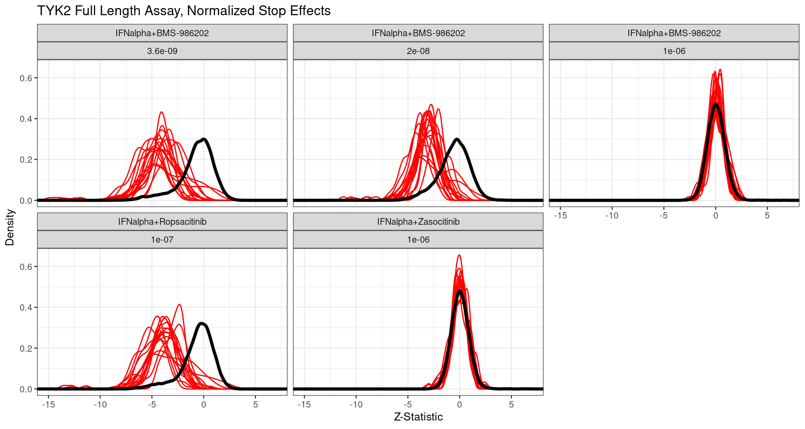
    

We can also examine directly the number of variants across all comparisons that are significant at a 1% FDR:

    
    
    |drug                  |    conc|direction | Non-Significant| Significant (FDR < 0.01)|
    |:---------------------|-------:|:---------|---------------:|------------------------:|
    |IFNalpha+BMS-986202   | 3.6e-09|GoF       |            8398|                        3|
    |IFNalpha+BMS-986202   | 3.6e-09|LoF       |           12775|                     2544|
    |IFNalpha+BMS-986202   | 2.0e-08|GoF       |            8354|                       38|
    |IFNalpha+BMS-986202   | 2.0e-08|LoF       |           13819|                     1509|
    |IFNalpha+BMS-986202   | 1.0e-06|GoF       |           12280|                       39|
    |IFNalpha+BMS-986202   | 1.0e-06|LoF       |           11401|                        0|
    |IFNalpha+Ropsacitinib | 1.0e-07|GoF       |            8660|                        1|
    |IFNalpha+Ropsacitinib | 1.0e-07|LoF       |           12907|                     2152|
    |IFNalpha+Zasocitinib  | 1.0e-06|GoF       |           12093|                       58|
    |IFNalpha+Zasocitinib  | 1.0e-06|LoF       |           11568|                        1|

### Visualizations 

    
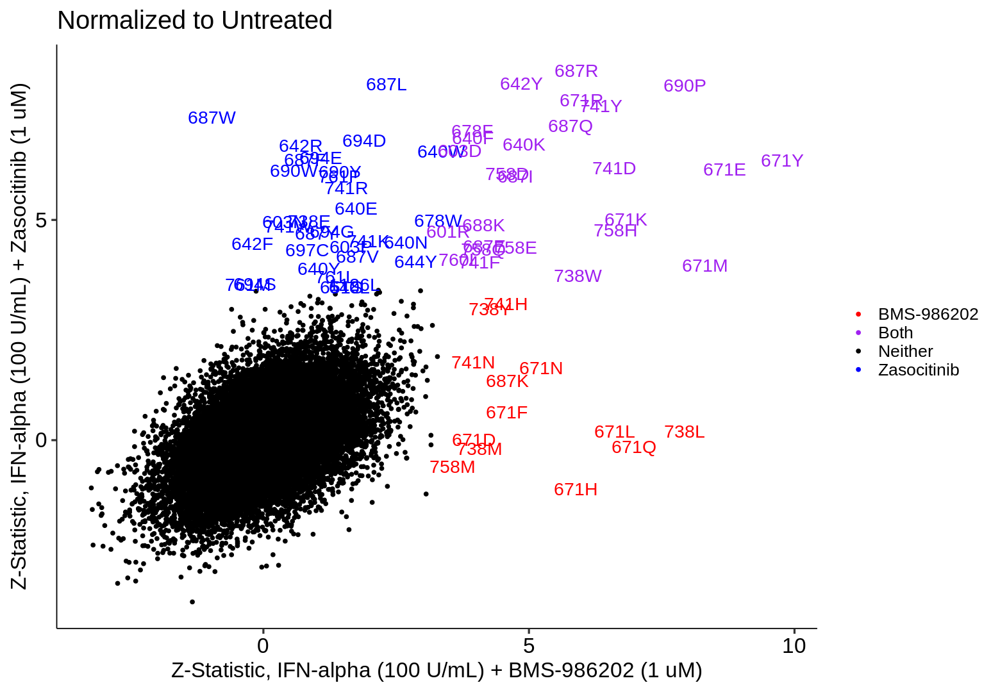
    

    
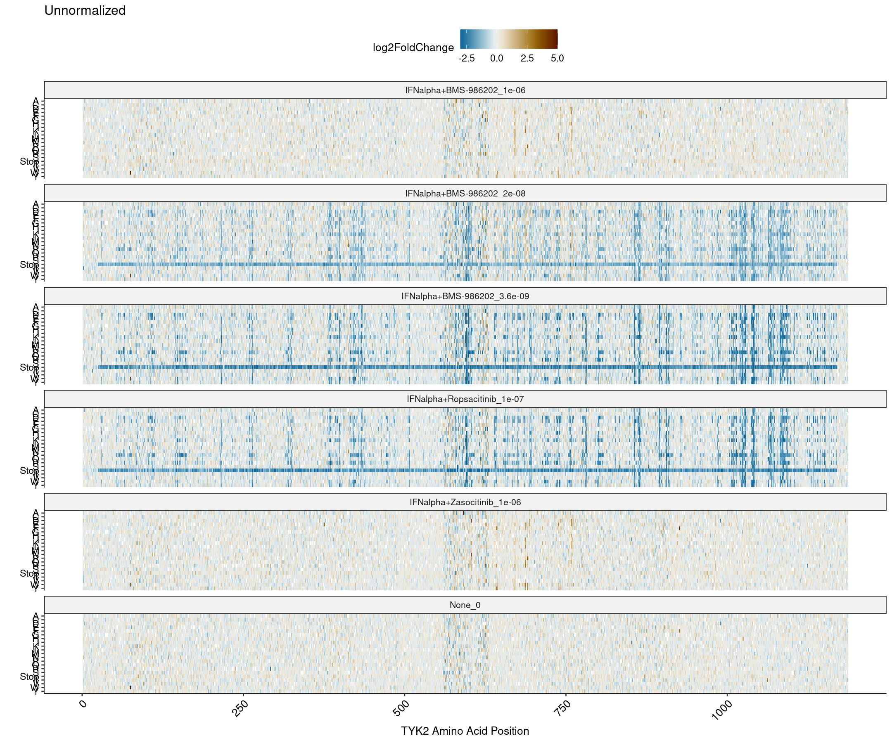
    

    
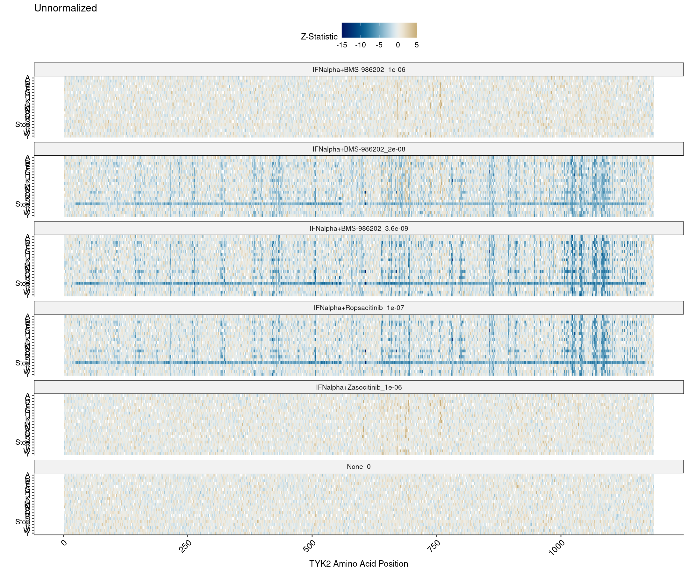
    

    
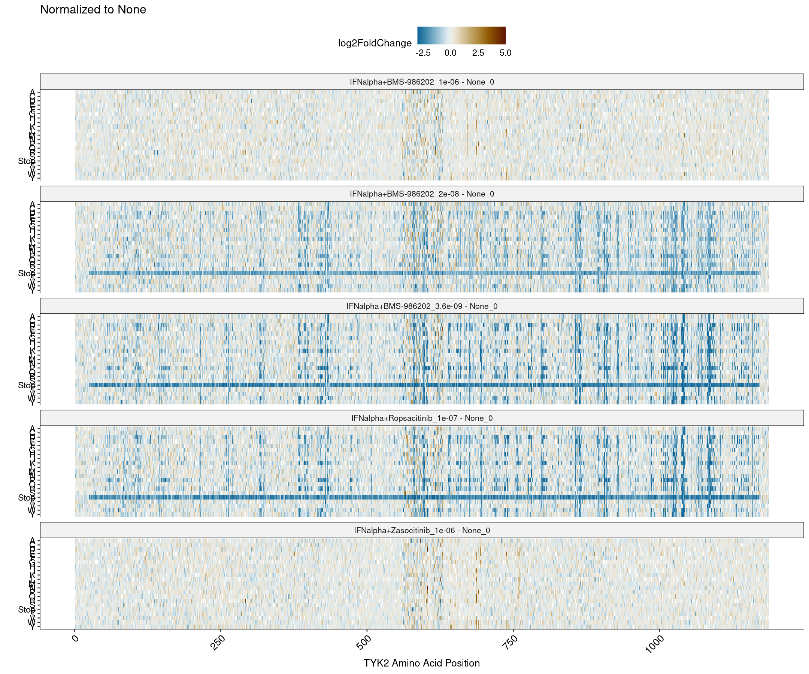
    

    
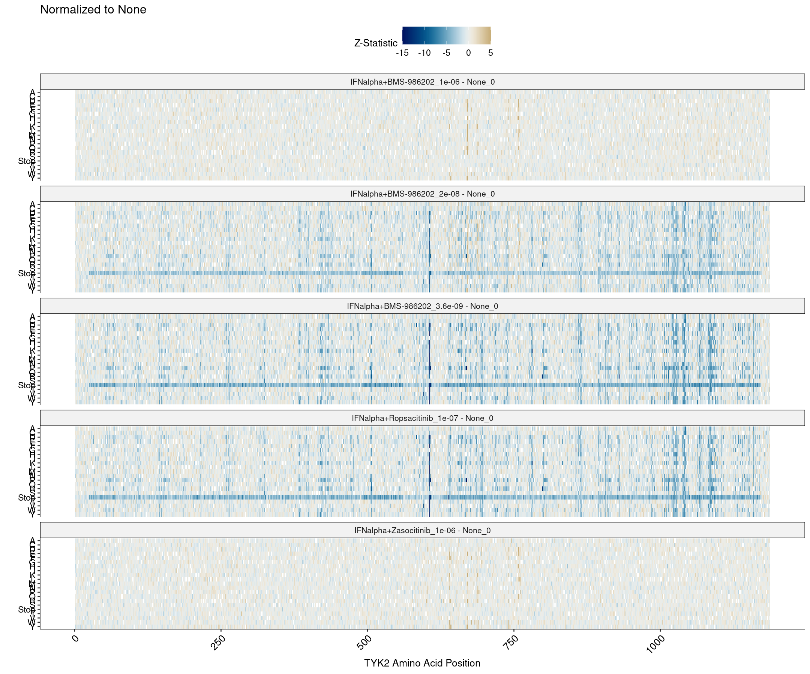
    

### Drug Resistance/Gain-of-Function 

These are the GoF variants in each of the Normalized comparisons only (though we can also consider other variant sets). First, the BMS-986202 variant sets:

    
    
    |condition                            | pos|aa |  estimate| std.error|     p.adj|
    |:------------------------------------|---:|:--|---------:|---------:|---------:|
    |IFNalpha+BMS-986202_3.6e-09 - None_0 | 158|V  | 1.5435087| 0.3849236| 0.0015981|
    |IFNalpha+BMS-986202_3.6e-09 - None_0 | 521|A  | 0.9101119| 0.2561762| 0.0075101|
    |IFNalpha+BMS-986202_3.6e-09 - None_0 | 995|V  | 1.0676228| 0.3015366| 0.0078077|

    
    
    |condition                          |  pos|aa |  estimate| std.error|     p.adj|
    |:----------------------------------|----:|:--|---------:|---------:|---------:|
    |IFNalpha+BMS-986202_2e-08 - None_0 |   31|K  | 1.4719264| 0.4064396| 0.0060369|
    |IFNalpha+BMS-986202_2e-08 - None_0 |  276|H  | 1.2868636| 0.3128541| 0.0011024|
    |IFNalpha+BMS-986202_2e-08 - None_0 |  457|F  | 0.9343545| 0.2687803| 0.0095985|
    |IFNalpha+BMS-986202_2e-08 - None_0 |  552|W  | 0.8733678| 0.2417263| 0.0062042|
    |IFNalpha+BMS-986202_2e-08 - None_0 |  640|M  | 1.0340211| 0.2462368| 0.0008025|
    |IFNalpha+BMS-986202_2e-08 - None_0 |  644|G  | 1.1970502| 0.2734211| 0.0004111|
    |IFNalpha+BMS-986202_2e-08 - None_0 |  651|N  | 0.7574797| 0.2083275| 0.0057675|
    |IFNalpha+BMS-986202_2e-08 - None_0 |  655|A  | 1.0891106| 0.3120483| 0.0092017|
    |IFNalpha+BMS-986202_2e-08 - None_0 |  671|E  | 1.1836206| 0.3147834| 0.0038120|
    |IFNalpha+BMS-986202_2e-08 - None_0 |  671|I  | 1.1225865| 0.2756395| 0.0012761|
    |IFNalpha+BMS-986202_2e-08 - None_0 |  671|M  | 1.4058431| 0.2985367| 0.0001097|
    |IFNalpha+BMS-986202_2e-08 - None_0 |  671|Q  | 0.9157416| 0.2449545| 0.0040907|
    |IFNalpha+BMS-986202_2e-08 - None_0 |  671|T  | 1.0074925| 0.2694644| 0.0040856|
    |IFNalpha+BMS-986202_2e-08 - None_0 |  671|V  | 1.2022044| 0.3251782| 0.0047101|
    |IFNalpha+BMS-986202_2e-08 - None_0 |  671|Y  | 1.1237006| 0.2772836| 0.0013710|
    |IFNalpha+BMS-986202_2e-08 - None_0 |  678|F  | 0.3677878| 0.0916850| 0.0015891|
    |IFNalpha+BMS-986202_2e-08 - None_0 |  687|H  | 0.9857922| 0.2834846| 0.0095689|
    |IFNalpha+BMS-986202_2e-08 - None_0 |  687|L  | 1.0776560| 0.2654841| 0.0013372|
    |IFNalpha+BMS-986202_2e-08 - None_0 |  687|Q  | 1.4107896| 0.3439016| 0.0011485|
    |IFNalpha+BMS-986202_2e-08 - None_0 |  687|V  | 1.1568393| 0.2877893| 0.0015441|
    |IFNalpha+BMS-986202_2e-08 - None_0 |  687|Y  | 1.2108170| 0.3084644| 0.0021586|
    |IFNalpha+BMS-986202_2e-08 - None_0 |  688|G  | 1.1740082| 0.2362084| 0.0000369|
    |IFNalpha+BMS-986202_2e-08 - None_0 |  688|K  | 1.1037919| 0.2555036| 0.0005080|
    |IFNalpha+BMS-986202_2e-08 - None_0 |  688|N  | 1.0680430| 0.2449069| 0.0004376|
    |IFNalpha+BMS-986202_2e-08 - None_0 |  689|I  | 1.5034324| 0.4049618| 0.0044653|
    |IFNalpha+BMS-986202_2e-08 - None_0 |  689|K  | 1.2101342| 0.2889632| 0.0008371|
    |IFNalpha+BMS-986202_2e-08 - None_0 |  689|S  | 1.2509951| 0.2842790| 0.0003764|
    |IFNalpha+BMS-986202_2e-08 - None_0 |  690|P  | 1.1250814| 0.3025246| 0.0043666|
    |IFNalpha+BMS-986202_2e-08 - None_0 |  738|L  | 1.2330558| 0.2536856| 0.0000584|
    |IFNalpha+BMS-986202_2e-08 - None_0 |  738|W  | 1.1289389| 0.2764724| 0.0012266|
    |IFNalpha+BMS-986202_2e-08 - None_0 |  741|A  | 1.2827669| 0.3615912| 0.0076284|
    |IFNalpha+BMS-986202_2e-08 - None_0 |  741|S  | 1.2962270| 0.3157812| 0.0011388|
    |IFNalpha+BMS-986202_2e-08 - None_0 |  746|W  | 1.2132924| 0.2987110| 0.0013239|
    |IFNalpha+BMS-986202_2e-08 - None_0 |  759|S  | 1.2618485| 0.3610630| 0.0090673|
    |IFNalpha+BMS-986202_2e-08 - None_0 |  760|L  | 0.7370304| 0.1221265| 0.0000002|
    |IFNalpha+BMS-986202_2e-08 - None_0 |  761|V  | 0.5135065| 0.1100151| 0.0001294|
    |IFNalpha+BMS-986202_2e-08 - None_0 |  796|S  | 1.3384272| 0.3368759| 0.0018258|
    |IFNalpha+BMS-986202_2e-08 - None_0 | 1176|C  | 0.9653736| 0.2604509| 0.0045605|

    
    
    |condition                          | pos|aa |  estimate| std.error|     p.adj|
    |:----------------------------------|---:|:--|---------:|---------:|---------:|
    |IFNalpha+BMS-986202_1e-06 - None_0 | 601|R  | 1.9695944| 0.5652972| 0.0093766|
    |IFNalpha+BMS-986202_1e-06 - None_0 | 603|D  | 1.8976524| 0.5135711| 0.0047353|
    |IFNalpha+BMS-986202_1e-06 - None_0 | 640|F  | 1.0781606| 0.2735480| 0.0020390|
    |IFNalpha+BMS-986202_1e-06 - None_0 | 640|K  | 1.3697988| 0.2787993| 0.0000469|
    |IFNalpha+BMS-986202_1e-06 - None_0 | 642|Y  | 1.1225038| 0.2311401| 0.0000594|
    |IFNalpha+BMS-986202_1e-06 - None_0 | 671|D  | 1.0767988| 0.2712658| 0.0018471|
    |IFNalpha+BMS-986202_1e-06 - None_0 | 671|E  | 2.6588986| 0.3063301| 0.0000000|
    |IFNalpha+BMS-986202_1e-06 - None_0 | 671|F  | 1.3846201| 0.3023599| 0.0001864|
    |IFNalpha+BMS-986202_1e-06 - None_0 | 671|H  | 1.7950875| 0.3049085| 0.0000005|
    |IFNalpha+BMS-986202_1e-06 - None_0 | 671|K  | 2.3364120| 0.3420936| 0.0000000|
    |IFNalpha+BMS-986202_1e-06 - None_0 | 671|L  | 2.0611573| 0.3117274| 0.0000000|
    |IFNalpha+BMS-986202_1e-06 - None_0 | 671|M  | 2.5124649| 0.3022441| 0.0000000|
    |IFNalpha+BMS-986202_1e-06 - None_0 | 671|N  | 1.6278158| 0.3112082| 0.0000116|
    |IFNalpha+BMS-986202_1e-06 - None_0 | 671|Q  | 1.7035191| 0.2439822| 0.0000000|
    |IFNalpha+BMS-986202_1e-06 - None_0 | 671|R  | 1.7960878| 0.2994078| 0.0000003|
    |IFNalpha+BMS-986202_1e-06 - None_0 | 671|Y  | 2.7104429| 0.2772136| 0.0000000|
    |IFNalpha+BMS-986202_1e-06 - None_0 | 678|F  | 0.3621001| 0.0920975| 0.0021104|
    |IFNalpha+BMS-986202_1e-06 - None_0 | 687|E  | 1.5906441| 0.3827441| 0.0009428|
    |IFNalpha+BMS-986202_1e-06 - None_0 | 687|I  | 1.6543214| 0.3486076| 0.0000947|
    |IFNalpha+BMS-986202_1e-06 - None_0 | 687|K  | 1.4851429| 0.3229435| 0.0001725|
    |IFNalpha+BMS-986202_1e-06 - None_0 | 687|Q  | 1.9991525| 0.3455917| 0.0000008|
    |IFNalpha+BMS-986202_1e-06 - None_0 | 687|R  | 1.5548300| 0.2635216| 0.0000005|
    |IFNalpha+BMS-986202_1e-06 - None_0 | 688|K  | 1.0606055| 0.2559583| 0.0009870|
    |IFNalpha+BMS-986202_1e-06 - None_0 | 690|P  | 2.4146482| 0.3043292| 0.0000000|
    |IFNalpha+BMS-986202_1e-06 - None_0 | 738|L  | 1.9666172| 0.2478961| 0.0000000|
    |IFNalpha+BMS-986202_1e-06 - None_0 | 738|M  | 1.4985800| 0.3683636| 0.0012956|
    |IFNalpha+BMS-986202_1e-06 - None_0 | 738|W  | 1.6751358| 0.2826724| 0.0000004|
    |IFNalpha+BMS-986202_1e-06 - None_0 | 738|Y  | 1.4358961| 0.3360731| 0.0006087|
    |IFNalpha+BMS-986202_1e-06 - None_0 | 741|D  | 2.1452830| 0.3246555| 0.0000000|
    |IFNalpha+BMS-986202_1e-06 - None_0 | 741|F  | 1.3937803| 0.3428191| 0.0013071|
    |IFNalpha+BMS-986202_1e-06 - None_0 | 741|H  | 1.5168075| 0.3319466| 0.0001940|
    |IFNalpha+BMS-986202_1e-06 - None_0 | 741|N  | 1.6564989| 0.4187017| 0.0019338|
    |IFNalpha+BMS-986202_1e-06 - None_0 | 741|Y  | 2.3843201| 0.3748826| 0.0000000|
    |IFNalpha+BMS-986202_1e-06 - None_0 | 758|D  | 2.1237207| 0.4620486| 0.0001741|
    |IFNalpha+BMS-986202_1e-06 - None_0 | 758|E  | 2.6329296| 0.5549168| 0.0000949|
    |IFNalpha+BMS-986202_1e-06 - None_0 | 758|H  | 2.7155576| 0.4093998| 0.0000000|
    |IFNalpha+BMS-986202_1e-06 - None_0 | 758|M  | 1.4564539| 0.4090187| 0.0073154|
    |IFNalpha+BMS-986202_1e-06 - None_0 | 758|Q  | 2.1804495| 0.5259520| 0.0009801|
    |IFNalpha+BMS-986202_1e-06 - None_0 | 760|L  | 0.4499241| 0.1220872| 0.0048944|

Then, the other two inhibitors:

    
    
    |condition                           |  pos|aa |  estimate| std.error|     p.adj|
    |:-----------------------------------|----:|:--|---------:|---------:|---------:|
    |IFNalpha+Zasocitinib_1e-06 - None_0 |  601|R  | 2.7380610| 0.5775535| 0.0000965|
    |IFNalpha+Zasocitinib_1e-06 - None_0 |  603|D  | 3.3430349| 0.5095479| 0.0000000|
    |IFNalpha+Zasocitinib_1e-06 - None_0 |  603|N  | 4.0882163| 0.8247328| 0.0000388|
    |IFNalpha+Zasocitinib_1e-06 - None_0 |  603|P  | 1.9681280| 0.4490537| 0.0004033|
    |IFNalpha+Zasocitinib_1e-06 - None_0 |  640|E  | 1.5194152| 0.2892755| 0.0000105|
    |IFNalpha+Zasocitinib_1e-06 - None_0 |  640|F  | 1.8824709| 0.2745678| 0.0000000|
    |IFNalpha+Zasocitinib_1e-06 - None_0 |  640|K  | 1.8789438| 0.2796418| 0.0000000|
    |IFNalpha+Zasocitinib_1e-06 - None_0 |  640|L  | 0.9693747| 0.2791423| 0.0096971|
    |IFNalpha+Zasocitinib_1e-06 - None_0 |  640|N  | 1.6397340| 0.3656999| 0.0002734|
    |IFNalpha+Zasocitinib_1e-06 - None_0 |  640|W  | 2.2785162| 0.3479387| 0.0000000|
    |IFNalpha+Zasocitinib_1e-06 - None_0 |  640|Y  | 1.0505531| 0.2696758| 0.0023928|
    |IFNalpha+Zasocitinib_1e-06 - None_0 |  642|F  | 1.4833746| 0.3331619| 0.0003089|
    |IFNalpha+Zasocitinib_1e-06 - None_0 |  642|R  | 1.8293774| 0.2739930| 0.0000000|
    |IFNalpha+Zasocitinib_1e-06 - None_0 |  642|Y  | 1.8649723| 0.2304274| 0.0000000|
    |IFNalpha+Zasocitinib_1e-06 - None_0 |  644|Y  | 1.7070848| 0.4212636| 0.0013717|
    |IFNalpha+Zasocitinib_1e-06 - None_0 |  651|S  | 0.9929601| 0.2862083| 0.0098056|
    |IFNalpha+Zasocitinib_1e-06 - None_0 |  671|E  | 1.9217823| 0.3124622| 0.0000001|
    |IFNalpha+Zasocitinib_1e-06 - None_0 |  671|K  | 1.6946500| 0.3386013| 0.0000316|
    |IFNalpha+Zasocitinib_1e-06 - None_0 |  671|M  | 1.2028298| 0.3037229| 0.0019097|
    |IFNalpha+Zasocitinib_1e-06 - None_0 |  671|R  | 2.3129458| 0.2998109| 0.0000000|
    |IFNalpha+Zasocitinib_1e-06 - None_0 |  671|Y  | 1.7856847| 0.2814507| 0.0000000|
    |IFNalpha+Zasocitinib_1e-06 - None_0 |  678|F  | 0.6431186| 0.0915826| 0.0000000|
    |IFNalpha+Zasocitinib_1e-06 - None_0 |  678|W  | 1.4710626| 0.2953335| 0.0000352|
    |IFNalpha+Zasocitinib_1e-06 - None_0 |  687|E  | 1.6809648| 0.3823085| 0.0003818|
    |IFNalpha+Zasocitinib_1e-06 - None_0 |  687|F  | 1.4934930| 0.2345010| 0.0000000|
    |IFNalpha+Zasocitinib_1e-06 - None_0 |  687|I  | 2.0531739| 0.3431487| 0.0000003|
    |IFNalpha+Zasocitinib_1e-06 - None_0 |  687|L  | 2.1631510| 0.2676981| 0.0000000|
    |IFNalpha+Zasocitinib_1e-06 - None_0 |  687|Q  | 2.5022062| 0.3507702| 0.0000000|
    |IFNalpha+Zasocitinib_1e-06 - None_0 |  687|R  | 2.2206893| 0.2650412| 0.0000000|
    |IFNalpha+Zasocitinib_1e-06 - None_0 |  687|V  | 1.2069851| 0.2897436| 0.0009094|
    |IFNalpha+Zasocitinib_1e-06 - None_0 |  687|W  | 1.9828119| 0.2707377| 0.0000000|
    |IFNalpha+Zasocitinib_1e-06 - None_0 |  687|Y  | 1.4453719| 0.3079405| 0.0001168|
    |IFNalpha+Zasocitinib_1e-06 - None_0 |  688|K  | 1.2467250| 0.2554362| 0.0000537|
    |IFNalpha+Zasocitinib_1e-06 - None_0 |  690|P  | 2.4319091| 0.3021891| 0.0000000|
    |IFNalpha+Zasocitinib_1e-06 - None_0 |  690|W  | 1.7415681| 0.2844905| 0.0000001|
    |IFNalpha+Zasocitinib_1e-06 - None_0 |  690|Y  | 1.7636220| 0.2896707| 0.0000002|
    |IFNalpha+Zasocitinib_1e-06 - None_0 |  694|D  | 1.7631016| 0.2594539| 0.0000000|
    |IFNalpha+Zasocitinib_1e-06 - None_0 |  694|E  | 1.7779927| 0.2777247| 0.0000000|
    |IFNalpha+Zasocitinib_1e-06 - None_0 |  694|G  | 1.5184838| 0.3205004| 0.0000977|
    |IFNalpha+Zasocitinib_1e-06 - None_0 |  694|S  | 0.9232091| 0.2602336| 0.0076280|
    |IFNalpha+Zasocitinib_1e-06 - None_0 |  697|C  | 1.0972198| 0.2545147| 0.0005256|
    |IFNalpha+Zasocitinib_1e-06 - None_0 |  738|E  | 2.1961642| 0.4425131| 0.0000379|
    |IFNalpha+Zasocitinib_1e-06 - None_0 |  738|W  | 1.0519565| 0.2823392| 0.0042653|
    |IFNalpha+Zasocitinib_1e-06 - None_0 |  741|D  | 1.9915236| 0.3222240| 0.0000001|
    |IFNalpha+Zasocitinib_1e-06 - None_0 |  741|F  | 1.4356826| 0.3562379| 0.0014848|
    |IFNalpha+Zasocitinib_1e-06 - None_0 |  741|K  | 1.8418486| 0.4083383| 0.0002459|
    |IFNalpha+Zasocitinib_1e-06 - None_0 |  741|R  | 1.7797016| 0.3110070| 0.0000011|
    |IFNalpha+Zasocitinib_1e-06 - None_0 |  741|W  | 1.9934224| 0.4105154| 0.0000595|
    |IFNalpha+Zasocitinib_1e-06 - None_0 |  741|Y  | 2.8306288| 0.3730986| 0.0000000|
    |IFNalpha+Zasocitinib_1e-06 - None_0 |  758|D  | 2.7737181| 0.4593592| 0.0000002|
    |IFNalpha+Zasocitinib_1e-06 - None_0 |  758|E  | 2.4666245| 0.5643633| 0.0004221|
    |IFNalpha+Zasocitinib_1e-06 - None_0 |  758|H  | 1.9770074| 0.4146327| 0.0000862|
    |IFNalpha+Zasocitinib_1e-06 - None_0 |  758|Q  | 2.2455367| 0.5182318| 0.0004852|
    |IFNalpha+Zasocitinib_1e-06 - None_0 |  760|L  | 0.5048784| 0.1232199| 0.0011690|
    |IFNalpha+Zasocitinib_1e-06 - None_0 |  761|L  | 1.5045204| 0.4066701| 0.0046707|
    |IFNalpha+Zasocitinib_1e-06 - None_0 |  761|M  | 1.4201944| 0.4025224| 0.0081335|
    |IFNalpha+Zasocitinib_1e-06 - None_0 |  761|P  | 1.9540694| 0.3264905| 0.0000003|
    |IFNalpha+Zasocitinib_1e-06 - None_0 | 1126|L  | 1.4881611| 0.4219122| 0.0081594|

    
    
    |condition                            | pos|aa | estimate| std.error|     p.adj|
    |:------------------------------------|---:|:--|--------:|---------:|---------:|
    |IFNalpha+Ropsacitinib_1e-07 - None_0 | 570|I  |  1.47329| 0.3712224| 0.0018527|

Notably, Ropsacitinib has far fewer GoF variants than the other two inhibitors (at least at the higest BMS-986202 concentration). We can relax the FDR filter to 5% and see which variants are returned:

    
    
    |condition                            |  pos|aa |  estimate| std.error|     p.adj|
    |:------------------------------------|----:|:--|---------:|---------:|---------:|
    |IFNalpha+Ropsacitinib_1e-07 - None_0 |   50|F  | 1.0541922| 0.3324601| 0.0241452|
    |IFNalpha+Ropsacitinib_1e-07 - None_0 |  126|P  | 1.4344593| 0.4181414| 0.0110738|
    |IFNalpha+Ropsacitinib_1e-07 - None_0 |  169|M  | 0.9489253| 0.3067219| 0.0298489|
    |IFNalpha+Ropsacitinib_1e-07 - None_0 |  200|C  | 1.4602570| 0.4825970| 0.0360600|
    |IFNalpha+Ropsacitinib_1e-07 - None_0 |  200|R  | 1.7514247| 0.5417656| 0.0202056|
    |IFNalpha+Ropsacitinib_1e-07 - None_0 |  214|V  | 1.2470533| 0.3723937| 0.0142652|
    |IFNalpha+Ropsacitinib_1e-07 - None_0 |  299|S  | 1.0758430| 0.3166588| 0.0122974|
    |IFNalpha+Ropsacitinib_1e-07 - None_0 |  518|E  | 0.8205508| 0.2701840| 0.0350047|
    |IFNalpha+Ropsacitinib_1e-07 - None_0 |  552|W  | 0.7438906| 0.2451350| 0.0352205|
    |IFNalpha+Ropsacitinib_1e-07 - None_0 |  570|I  | 1.4732898| 0.3712224| 0.0018527|
    |IFNalpha+Ropsacitinib_1e-07 - None_0 |  787|K  | 1.0229431| 0.3208302| 0.0229732|
    |IFNalpha+Ropsacitinib_1e-07 - None_0 |  826|V  | 1.1275548| 0.3524449| 0.0222857|
    |IFNalpha+Ropsacitinib_1e-07 - None_0 |  941|W  | 1.0311929| 0.3285987| 0.0263995|
    |IFNalpha+Ropsacitinib_1e-07 - None_0 |  983|D  | 1.1311618| 0.3656278| 0.0298489|
    |IFNalpha+Ropsacitinib_1e-07 - None_0 |  992|C  | 0.9563196| 0.3185197| 0.0385599|
    |IFNalpha+Ropsacitinib_1e-07 - None_0 | 1007|A  | 0.8937453| 0.2932269| 0.0339653|
    |IFNalpha+Ropsacitinib_1e-07 - None_0 | 1009|V  | 0.9427707| 0.3086735| 0.0333761|
    |IFNalpha+Ropsacitinib_1e-07 - None_0 | 1009|W  | 1.0268692| 0.3457665| 0.0420718|
    |IFNalpha+Ropsacitinib_1e-07 - None_0 | 1094|I  | 0.9214561| 0.3054883| 0.0370449|
    |IFNalpha+Ropsacitinib_1e-07 - None_0 | 1110|Y  | 0.9287840| 0.3020166| 0.0314694|
    |IFNalpha+Ropsacitinib_1e-07 - None_0 | 1157|Q  | 0.8555233| 0.2828556| 0.0361768|

The signal is fairly distributed, with two positions showing multiple effects at 200 and 1009. However, we do see some spatial organization when plotting the counts of the above mutations along the structure:

    
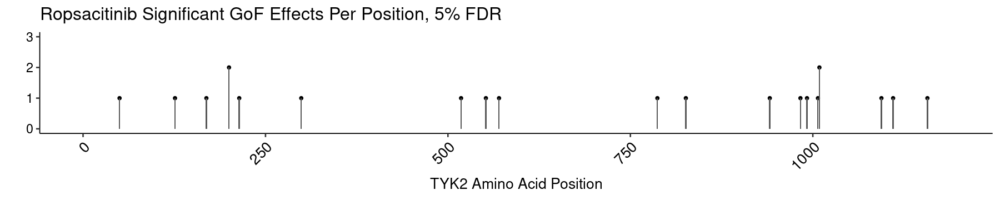
    

It is likely that a higher concentration of Ropsacitinib would reasonably generate a more distinctive drug resistance profile, based on these results and the comparison to different concentrations of BMS-986202.

    
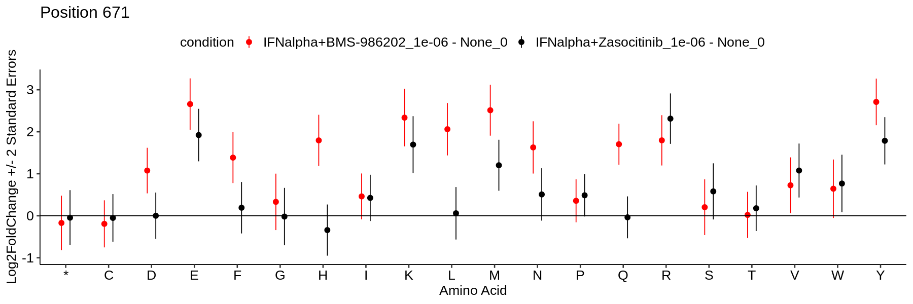
    

    
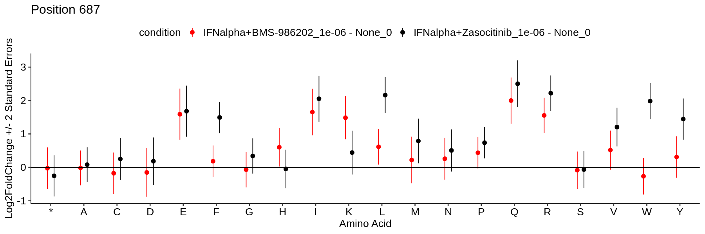
    

