## OCNT-DMSLIB-1 DMS Assay Run #7: TYK2 Inhibitors

| ID | Condition | Concentration (M) | Replicates
| --- | ----------- | --- | ----------- |
| 1 | None | 0 | 4 |
| 2 | IFN-alpha (100 U/mL) | 0 | 4 |
| 2 | BMS-986202 + IFN-alpha (100U/mL) | 2e-8 | 4 |
| 5 | Zasocitinib + IFN-alpha (100U/mL) | 7e-9 | 4 |
| 6 | Ropsacitinib + IFN-alpha (100U/mL) | 1e-5 | 4 |

In this framework, we have None and IFN-alpha to establish the core mutational profile of TYK2 under IFN-alpha stimulation. Then, we have each of three inhibitors (at one concentration each) co-administered with IFN-alpha.

1. [Barcode Sequencing Distributions](#part1)
2. [Inference and Stop Codon Effects](#part2)
3. [Visualizations](#part3)
4. [Drug Resistance/Gain-of-Function](#part4)
5. [Drug Potentiation](#part5)

### Barcode Sequencing Distributions <a name="part1"></a>


```R
bc_counts_aa %>% group_by(sample) %>% summarize(n = median(n)) %>% summarize(min(n), max(n), median(n))
```


<table class="dataframe">
<caption>A tibble: 1 × 3</caption>
<thead>
	<tr><th scope=col>min(n)</th><th scope=col>max(n)</th><th scope=col>median(n)</th></tr>
	<tr><th scope=col>&lt;dbl&gt;</th><th scope=col>&lt;dbl&gt;</th><th scope=col>&lt;dbl&gt;</th></tr>
</thead>
<tbody>
	<tr><td>21</td><td>27</td><td>25</td></tr>
</tbody>
</table>


    
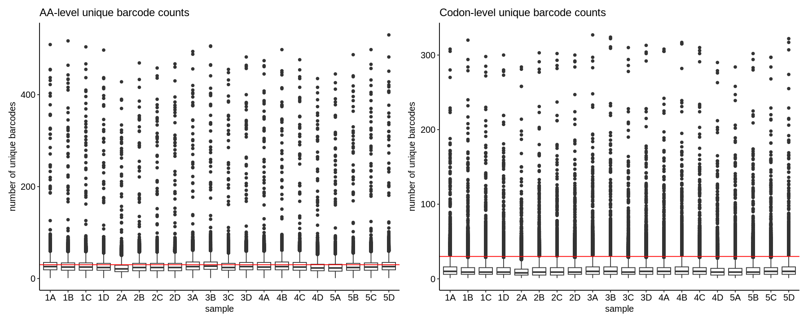
    


    
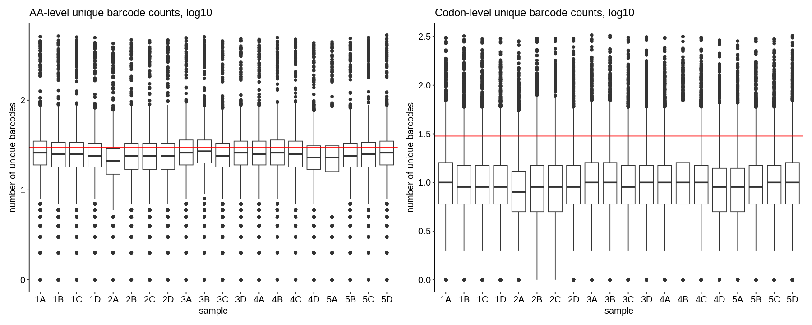
    


To get a sense of positional distribution, we can show the same data as lineplots across the length of TYK2. Below is an example using sample `1A` only; the remaining plots can be found [here](./coverage-plots):


    
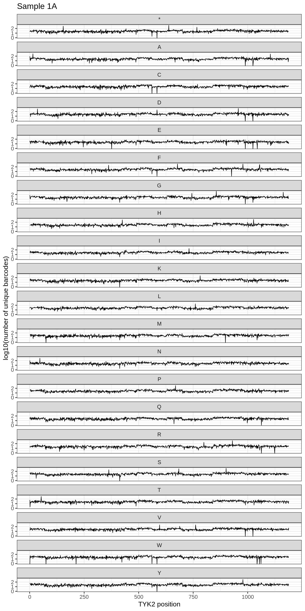
    


    
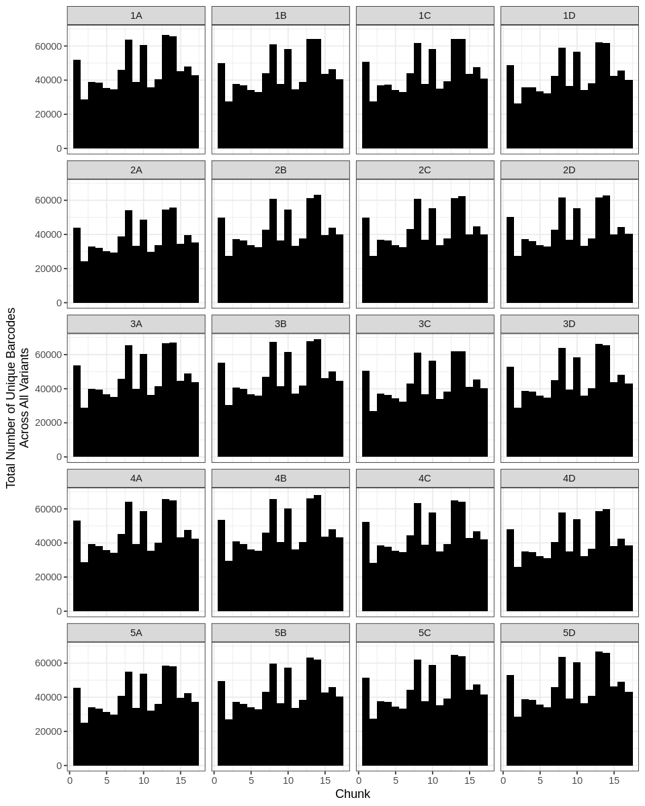
    


    
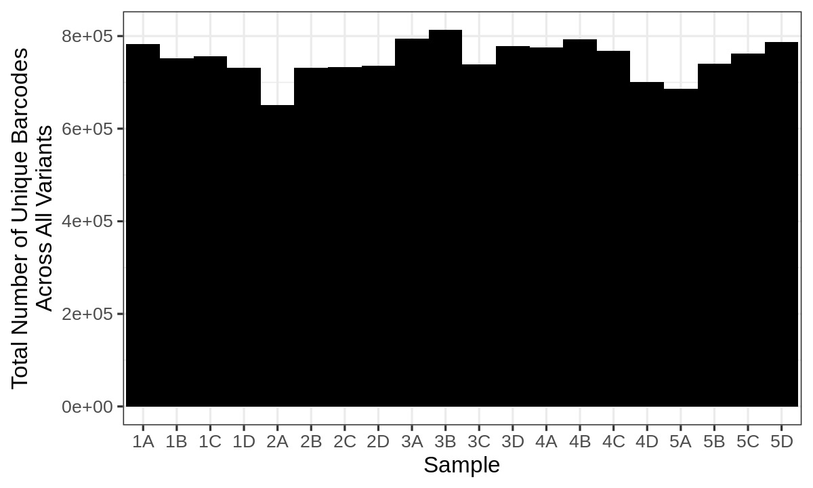
    


### Inference and Stop Codon Effects <a name="part2"></a>

Under strong inhibition, we expect to see no difference between mutants and WT most (but not all!) of the time, since the inhibitor will suppress the activity of most mutants as it does WT. In this dataset, we have both high and low doses of inhibitors, so we can plot the distribution of stop codon effects versus all other mutations in the library (all relative to WT) and compare. In the below plot, the Non-Stop distribution in each condition is shown in black, and the Stop distribution for each chunk individually (so 17 per condition) are shown in red:


    
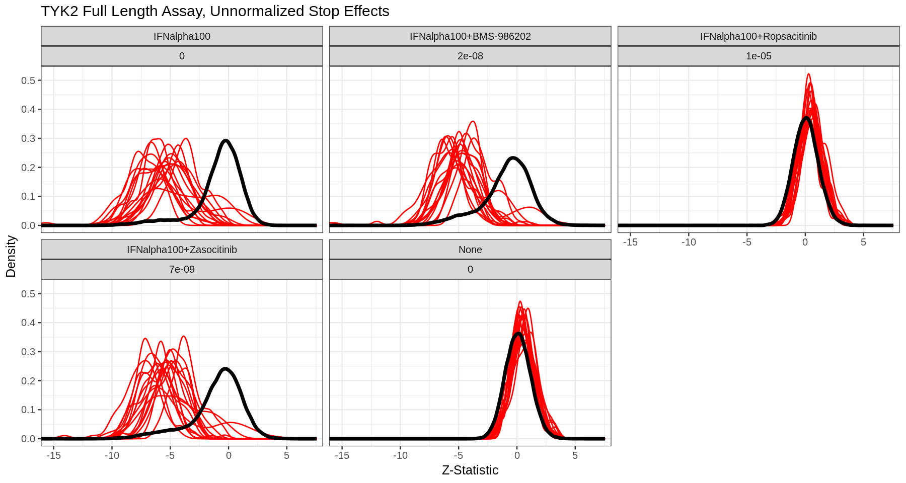
    


    
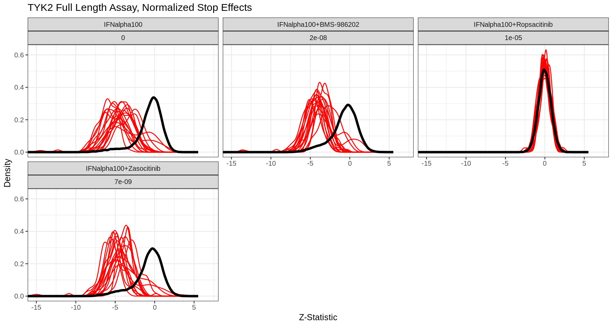
    


We can also examine directly the number of variants across all comparisons that are significant at a 1% FDR:


    
    
    |drug                     |  conc|direction | Non-Significant| Significant (FDR < 0.01)|
    |:------------------------|-----:|:---------|---------------:|------------------------:|
    |IFNalpha100              | 0e+00|GoF       |            8651|                        1|
    |IFNalpha100              | 0e+00|LoF       |           12523|                     2544|
    |IFNalpha100+BMS-986202   | 2e-08|GoF       |            8154|                       33|
    |IFNalpha100+BMS-986202   | 2e-08|LoF       |           12813|                     2719|
    |IFNalpha100+Ropsacitinib | 1e-05|GoF       |           11478|                        0|
    |IFNalpha100+Ropsacitinib | 1e-05|LoF       |           12241|                        0|
    |IFNalpha100+Zasocitinib  | 7e-09|GoF       |            8133|                       17|
    |IFNalpha100+Zasocitinib  | 7e-09|LoF       |           12518|                     3051|


### Visualizations <a name="part3"></a>


    
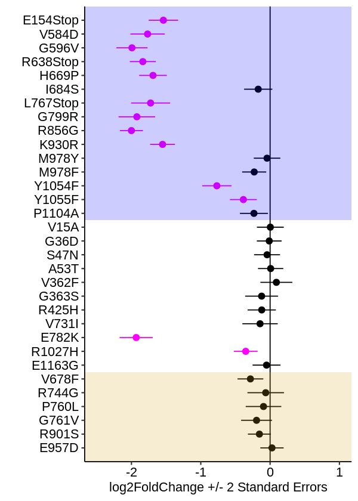
    


    
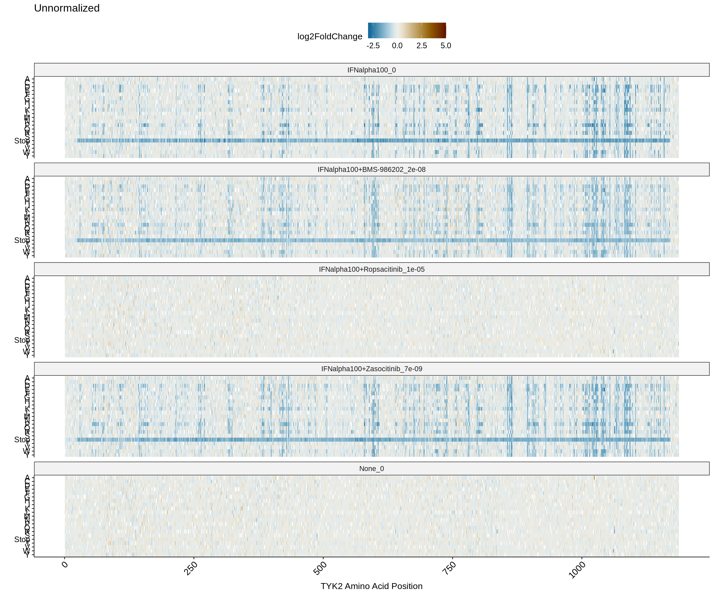
    


    
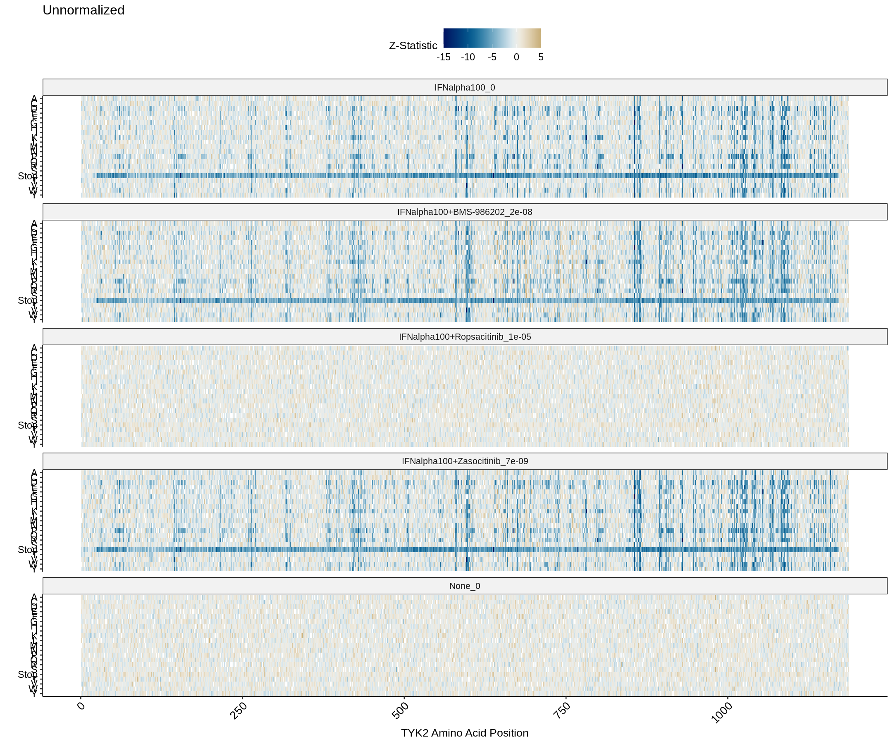
    


    
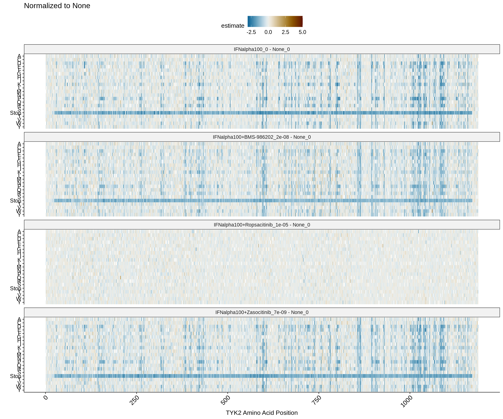
    


    

    


### Drug Resistance/Gain-of-Function <a name="part4"></a>

These are the GoF variants in each of the Normalized comparisons only (though we can also consider other variant sets). NOTE: No variants are significant in ropsacitinib after multiple testing adjustment at a 1% FDR, so the set using a 5% FDR is shown instead):


    
    
    |condition                               |  pos|aa |  estimate| std.error|     p.adj|
    |:---------------------------------------|----:|:--|---------:|---------:|---------:|
    |IFNalpha100+Ropsacitinib_1e-05 - None_0 |  206|Q  | 2.2780633| 0.7575796| 0.0259833|
    |IFNalpha100+Ropsacitinib_1e-05 - None_0 |  619|N  | 1.0520914| 0.3403100| 0.0203425|
    |IFNalpha100+Ropsacitinib_1e-05 - None_0 |  968|K  | 0.8167298| 0.2597208| 0.0173715|
    |IFNalpha100+Ropsacitinib_1e-05 - None_0 | 1022|T  | 1.2411171| 0.3744781| 0.0103734|


    
    
    |condition                              |  pos|aa |  estimate| std.error|     p.adj|
    |:--------------------------------------|----:|:--|---------:|---------:|---------:|
    |IFNalpha100+Zasocitinib_7e-09 - None_0 |   11|R  | 1.3354086| 0.3436159| 0.0014902|
    |IFNalpha100+Zasocitinib_7e-09 - None_0 |  195|R  | 1.4756881| 0.4112868| 0.0042479|
    |IFNalpha100+Zasocitinib_7e-09 - None_0 |  352|L  | 1.2441683| 0.3508074| 0.0048827|
    |IFNalpha100+Zasocitinib_7e-09 - None_0 |  406|F  | 1.8410739| 0.5375922| 0.0072765|
    |IFNalpha100+Zasocitinib_7e-09 - None_0 |  433|F  | 1.3304065| 0.3391751| 0.0013068|
    |IFNalpha100+Zasocitinib_7e-09 - None_0 |  466|H  | 0.9381169| 0.2587520| 0.0037379|
    |IFNalpha100+Zasocitinib_7e-09 - None_0 |  493|M  | 1.0533474| 0.2862793| 0.0031099|
    |IFNalpha100+Zasocitinib_7e-09 - None_0 |  601|Y  | 1.4157983| 0.3333802| 0.0003833|
    |IFNalpha100+Zasocitinib_7e-09 - None_0 |  603|M  | 0.9264659| 0.2623005| 0.0051316|
    |IFNalpha100+Zasocitinib_7e-09 - None_0 |  647|K  | 0.9037614| 0.2716439| 0.0099636|
    |IFNalpha100+Zasocitinib_7e-09 - None_0 |  671|N  | 1.1062840| 0.3181057| 0.0061298|
    |IFNalpha100+Zasocitinib_7e-09 - None_0 |  687|F  | 0.9473997| 0.2340445| 0.0008195|
    |IFNalpha100+Zasocitinib_7e-09 - None_0 |  689|K  | 1.1401626| 0.2911943| 0.0013388|
    |IFNalpha100+Zasocitinib_7e-09 - None_0 | 1107|Q  | 1.1492314| 0.2854429| 0.0008893|
    |IFNalpha100+Zasocitinib_7e-09 - None_0 | 1126|H  | 0.9361211| 0.2754802| 0.0079194|
    |IFNalpha100+Zasocitinib_7e-09 - None_0 | 1176|*  | 1.1674331| 0.3430517| 0.0077929|
    |IFNalpha100+Zasocitinib_7e-09 - None_0 | 1185|C  | 1.0276931| 0.2763233| 0.0027064|


    
    
    |condition                             | pos|aa |  estimate| std.error|     p.adj|
    |:-------------------------------------|---:|:--|---------:|---------:|---------:|
    |IFNalpha100+BMS-986202_2e-08 - None_0 | 153|M  | 1.8293450| 0.5146748| 0.0047568|
    |IFNalpha100+BMS-986202_2e-08 - None_0 | 244|E  | 0.7975916| 0.2276530| 0.0056358|
    |IFNalpha100+BMS-986202_2e-08 - None_0 | 355|N  | 0.9663929| 0.2738238| 0.0051793|
    |IFNalpha100+BMS-986202_2e-08 - None_0 | 499|G  | 0.9173240| 0.2681003| 0.0073525|
    |IFNalpha100+BMS-986202_2e-08 - None_0 | 526|L  | 0.9511076| 0.2832255| 0.0090244|
    |IFNalpha100+BMS-986202_2e-08 - None_0 | 595|E  | 1.4515672| 0.3962894| 0.0032962|
    |IFNalpha100+BMS-986202_2e-08 - None_0 | 595|Q  | 1.3129935| 0.3620009| 0.0037193|
    |IFNalpha100+BMS-986202_2e-08 - None_0 | 601|R  | 1.4081499| 0.3530226| 0.0010228|
    |IFNalpha100+BMS-986202_2e-08 - None_0 | 603|D  | 1.4026799| 0.3447459| 0.0007587|
    |IFNalpha100+BMS-986202_2e-08 - None_0 | 640|G  | 1.1287267| 0.2867421| 0.0012426|
    |IFNalpha100+BMS-986202_2e-08 - None_0 | 644|G  | 0.9431781| 0.2755916| 0.0073335|
    |IFNalpha100+BMS-986202_2e-08 - None_0 | 655|C  | 1.1092020| 0.2550829| 0.0002573|
    |IFNalpha100+BMS-986202_2e-08 - None_0 | 663|D  | 1.2247176| 0.2761552| 0.0001826|
    |IFNalpha100+BMS-986202_2e-08 - None_0 | 671|D  | 1.5648834| 0.2834384| 0.0000015|
    |IFNalpha100+BMS-986202_2e-08 - None_0 | 671|E  | 1.7288609| 0.3369407| 0.0000093|
    |IFNalpha100+BMS-986202_2e-08 - None_0 | 671|K  | 1.2163151| 0.3300904| 0.0030530|
    |IFNalpha100+BMS-986202_2e-08 - None_0 | 671|M  | 1.5116118| 0.3046532| 0.0000198|
    |IFNalpha100+BMS-986202_2e-08 - None_0 | 671|Q  | 0.8400781| 0.2434977| 0.0067075|
    |IFNalpha100+BMS-986202_2e-08 - None_0 | 671|Y  | 1.3242729| 0.2961463| 0.0001570|
    |IFNalpha100+BMS-986202_2e-08 - None_0 | 687|F  | 0.8414695| 0.2329143| 0.0039033|
    |IFNalpha100+BMS-986202_2e-08 - None_0 | 687|I  | 1.1364934| 0.3363642| 0.0084361|
    |IFNalpha100+BMS-986202_2e-08 - None_0 | 687|Y  | 1.0812887| 0.3098388| 0.0058916|
    |IFNalpha100+BMS-986202_2e-08 - None_0 | 688|G  | 0.9972637| 0.2482908| 0.0009218|
    |IFNalpha100+BMS-986202_2e-08 - None_0 | 688|K  | 0.8854567| 0.2596989| 0.0076368|
    |IFNalpha100+BMS-986202_2e-08 - None_0 | 688|N  | 1.0124592| 0.2580085| 0.0012991|
    |IFNalpha100+BMS-986202_2e-08 - None_0 | 689|K  | 1.1182472| 0.2865356| 0.0014041|
    |IFNalpha100+BMS-986202_2e-08 - None_0 | 689|S  | 1.2212853| 0.2887586| 0.0004095|
    |IFNalpha100+BMS-986202_2e-08 - None_0 | 690|P  | 1.1975239| 0.3209116| 0.0025870|
    |IFNalpha100+BMS-986202_2e-08 - None_0 | 710|E  | 1.2295712| 0.3599512| 0.0074830|
    |IFNalpha100+BMS-986202_2e-08 - None_0 | 746|P  | 1.4386504| 0.4296127| 0.0093051|
    |IFNalpha100+BMS-986202_2e-08 - None_0 | 760|L  | 0.5692395| 0.1259357| 0.0001290|
    |IFNalpha100+BMS-986202_2e-08 - None_0 | 779|V  | 1.3499925| 0.3926733| 0.0069704|
    |IFNalpha100+BMS-986202_2e-08 - None_0 | 878|V  | 1.2796535| 0.3641979| 0.0054502|


The stop effect is weird to see in this context - lets look at that stop in all conditions:


    
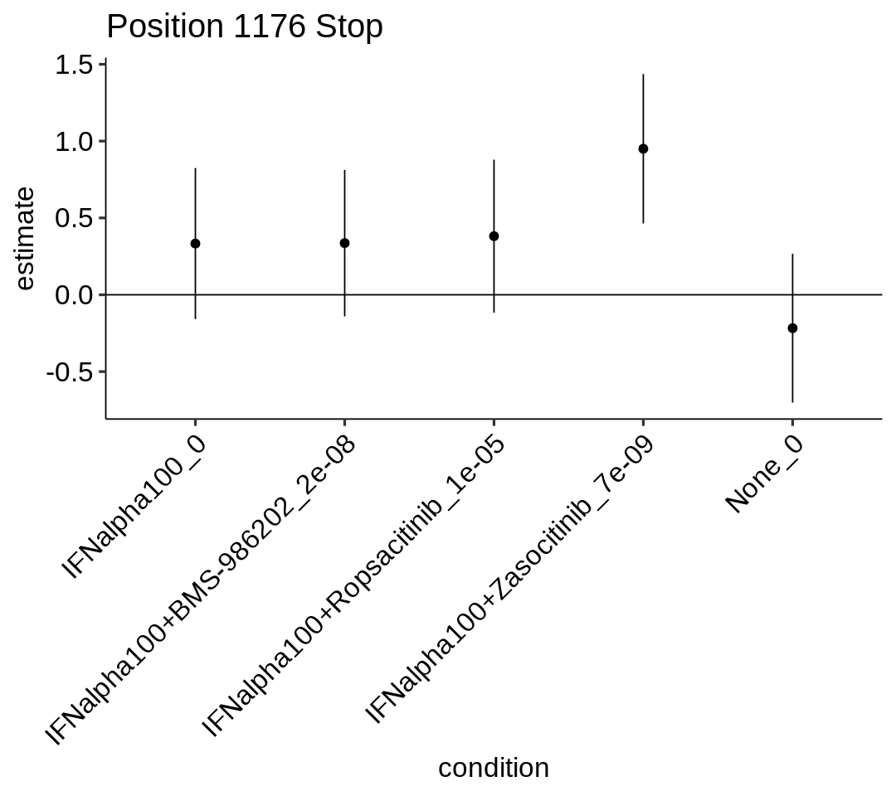
    


It is significant, but is in the region of stops at the end of the protein that generally dont show a LoF effect from stop codons:


    
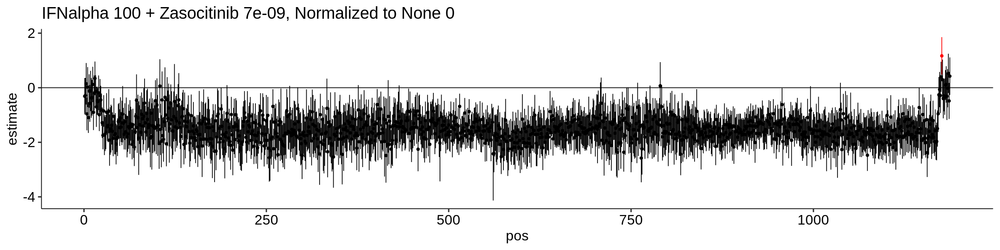
    


### Drug Potentiation <a name="part5"></a>


    
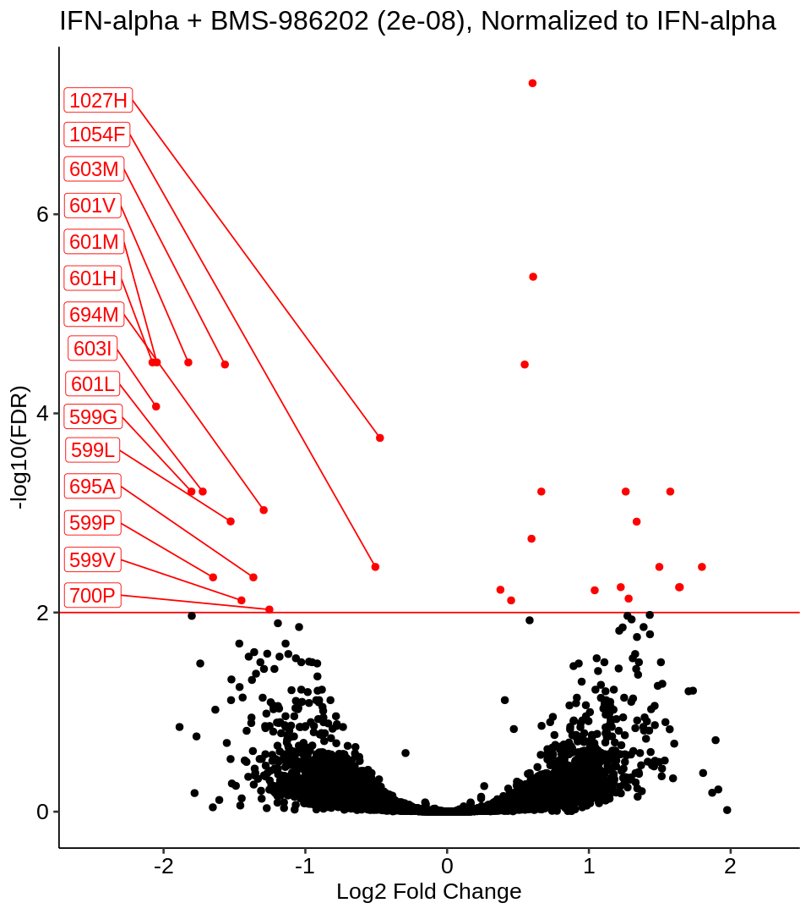
    


<table class="dataframe">
<caption>A tibble: 15 × 5</caption>
<thead>
	<tr><th scope=col>condition</th><th scope=col>pos</th><th scope=col>aa</th><th scope=col>estimate</th><th scope=col>p.adj</th></tr>
	<tr><th scope=col>&lt;chr&gt;</th><th scope=col>&lt;dbl&gt;</th><th scope=col>&lt;chr&gt;</th><th scope=col>&lt;dbl&gt;</th><th scope=col>&lt;dbl&gt;</th></tr>
</thead>
<tbody>
	<tr><td>IFNalpha100+BMS-986202_2e-08 - IFNalpha100_0</td><td> 599</td><td>G</td><td>-1.8035622</td><td>6.100411e-04</td></tr>
	<tr><td>IFNalpha100+BMS-986202_2e-08 - IFNalpha100_0</td><td> 599</td><td>L</td><td>-1.5270272</td><td>1.215985e-03</td></tr>
	<tr><td>IFNalpha100+BMS-986202_2e-08 - IFNalpha100_0</td><td> 599</td><td>P</td><td>-1.6510140</td><td>4.435032e-03</td></tr>
	<tr><td>IFNalpha100+BMS-986202_2e-08 - IFNalpha100_0</td><td> 599</td><td>V</td><td>-1.4506621</td><td>7.554739e-03</td></tr>
	<tr><td>IFNalpha100+BMS-986202_2e-08 - IFNalpha100_0</td><td> 601</td><td>H</td><td>-2.0782209</td><td>3.076257e-05</td></tr>
	<tr><td>IFNalpha100+BMS-986202_2e-08 - IFNalpha100_0</td><td> 601</td><td>L</td><td>-1.7240052</td><td>6.100411e-04</td></tr>
	<tr><td>IFNalpha100+BMS-986202_2e-08 - IFNalpha100_0</td><td> 601</td><td>M</td><td>-2.0475156</td><td>3.076257e-05</td></tr>
	<tr><td>IFNalpha100+BMS-986202_2e-08 - IFNalpha100_0</td><td> 601</td><td>V</td><td>-1.8255167</td><td>3.076257e-05</td></tr>
	<tr><td>IFNalpha100+BMS-986202_2e-08 - IFNalpha100_0</td><td> 603</td><td>I</td><td>-2.0529038</td><td>8.535143e-05</td></tr>
	<tr><td>IFNalpha100+BMS-986202_2e-08 - IFNalpha100_0</td><td> 603</td><td>M</td><td>-1.5672314</td><td>3.230773e-05</td></tr>
	<tr><td>IFNalpha100+BMS-986202_2e-08 - IFNalpha100_0</td><td> 694</td><td>M</td><td>-1.2939152</td><td>9.361203e-04</td></tr>
	<tr><td>IFNalpha100+BMS-986202_2e-08 - IFNalpha100_0</td><td> 695</td><td>A</td><td>-1.3666114</td><td>4.435032e-03</td></tr>
	<tr><td>IFNalpha100+BMS-986202_2e-08 - IFNalpha100_0</td><td> 700</td><td>P</td><td>-1.2537972</td><td>9.329562e-03</td></tr>
	<tr><td>IFNalpha100+BMS-986202_2e-08 - IFNalpha100_0</td><td>1027</td><td>H</td><td>-0.4736837</td><td>1.764537e-04</td></tr>
	<tr><td>IFNalpha100+BMS-986202_2e-08 - IFNalpha100_0</td><td>1054</td><td>F</td><td>-0.5060788</td><td>3.485076e-03</td></tr>
</tbody>
</table>


<table class="dataframe">
<caption>A tibble: 17 × 5</caption>
<thead>
	<tr><th scope=col>condition</th><th scope=col>pos</th><th scope=col>aa</th><th scope=col>estimate</th><th scope=col>p.adj</th></tr>
	<tr><th scope=col>&lt;chr&gt;</th><th scope=col>&lt;dbl&gt;</th><th scope=col>&lt;chr&gt;</th><th scope=col>&lt;dbl&gt;</th><th scope=col>&lt;dbl&gt;</th></tr>
</thead>
<tbody>
	<tr><td>IFNalpha100+Zasocitinib_7e-09 - IFNalpha100_0</td><td> 599</td><td>I</td><td>-1.5560720</td><td>2.599568e-03</td></tr>
	<tr><td>IFNalpha100+Zasocitinib_7e-09 - IFNalpha100_0</td><td> 599</td><td>L</td><td>-1.4684695</td><td>3.485076e-03</td></tr>
	<tr><td>IFNalpha100+Zasocitinib_7e-09 - IFNalpha100_0</td><td> 599</td><td>W</td><td>-1.6593759</td><td>3.200807e-03</td></tr>
	<tr><td>IFNalpha100+Zasocitinib_7e-09 - IFNalpha100_0</td><td> 601</td><td>C</td><td>-1.4847910</td><td>9.662656e-03</td></tr>
	<tr><td>IFNalpha100+Zasocitinib_7e-09 - IFNalpha100_0</td><td> 601</td><td>L</td><td>-1.5589389</td><td>4.038811e-03</td></tr>
	<tr><td>IFNalpha100+Zasocitinib_7e-09 - IFNalpha100_0</td><td> 601</td><td>M</td><td>-1.7266992</td><td>1.683330e-03</td></tr>
	<tr><td>IFNalpha100+Zasocitinib_7e-09 - IFNalpha100_0</td><td> 601</td><td>Q</td><td>-1.5118940</td><td>7.734799e-04</td></tr>
	<tr><td>IFNalpha100+Zasocitinib_7e-09 - IFNalpha100_0</td><td> 601</td><td>V</td><td>-1.4241021</td><td>7.871992e-03</td></tr>
	<tr><td>IFNalpha100+Zasocitinib_7e-09 - IFNalpha100_0</td><td> 695</td><td>Y</td><td>-1.1812582</td><td>5.908045e-03</td></tr>
	<tr><td>IFNalpha100+Zasocitinib_7e-09 - IFNalpha100_0</td><td> 739</td><td>H</td><td>-1.9774349</td><td>1.984626e-03</td></tr>
	<tr><td>IFNalpha100+Zasocitinib_7e-09 - IFNalpha100_0</td><td> 739</td><td>M</td><td>-1.9799465</td><td>9.321175e-04</td></tr>
	<tr><td>IFNalpha100+Zasocitinib_7e-09 - IFNalpha100_0</td><td> 758</td><td>C</td><td>-2.7664630</td><td>7.038339e-05</td></tr>
	<tr><td>IFNalpha100+Zasocitinib_7e-09 - IFNalpha100_0</td><td> 865</td><td>G</td><td>-1.1765818</td><td>4.035112e-03</td></tr>
	<tr><td>IFNalpha100+Zasocitinib_7e-09 - IFNalpha100_0</td><td> 894</td><td>V</td><td>-1.1996357</td><td>4.881949e-03</td></tr>
	<tr><td>IFNalpha100+Zasocitinib_7e-09 - IFNalpha100_0</td><td> 898</td><td>I</td><td>-1.1141530</td><td>8.734296e-03</td></tr>
	<tr><td>IFNalpha100+Zasocitinib_7e-09 - IFNalpha100_0</td><td>1027</td><td>H</td><td>-0.5002964</td><td>5.862812e-05</td></tr>
	<tr><td>IFNalpha100+Zasocitinib_7e-09 - IFNalpha100_0</td><td>1054</td><td>F</td><td>-0.4967717</td><td>4.435032e-03</td></tr>
</tbody>
</table>


    
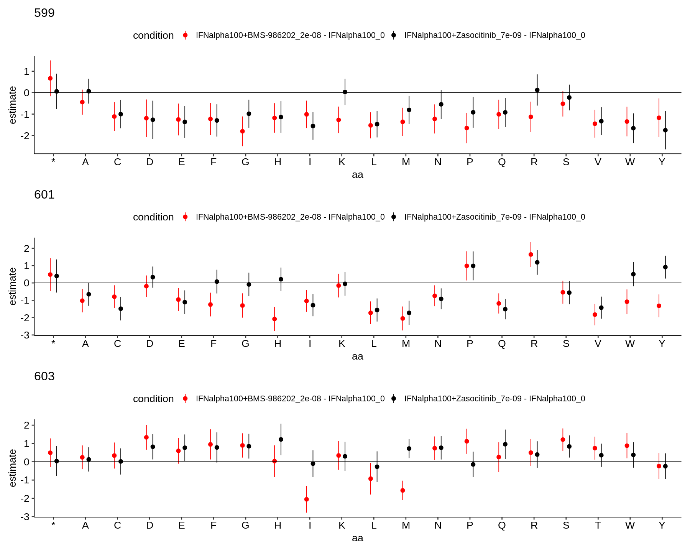
    


To contextualize the significant hits in the context of the underlying variant profile across conditions, we can plot the Z-statistics of IFN-alpha and each drug separately, but then highlight the significant variants by the contrast:


    
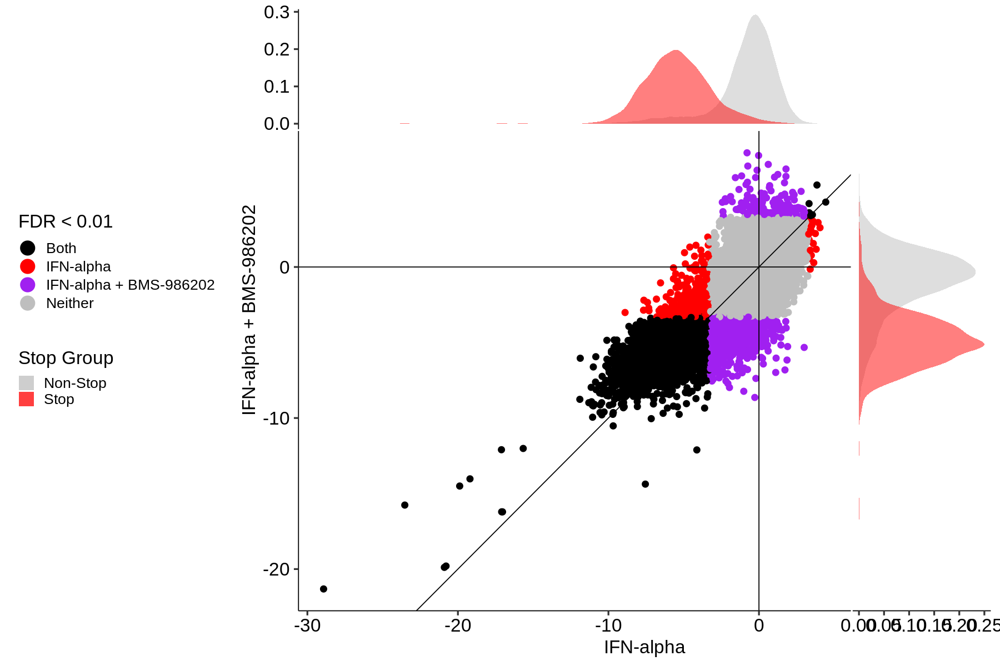
    


    
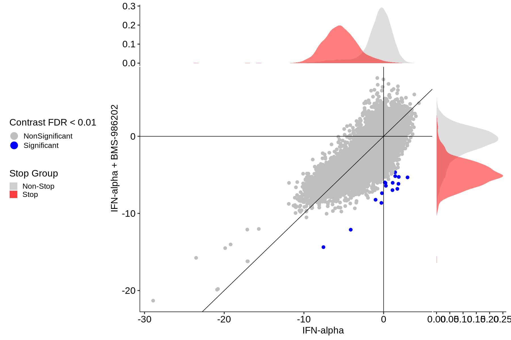
    


    
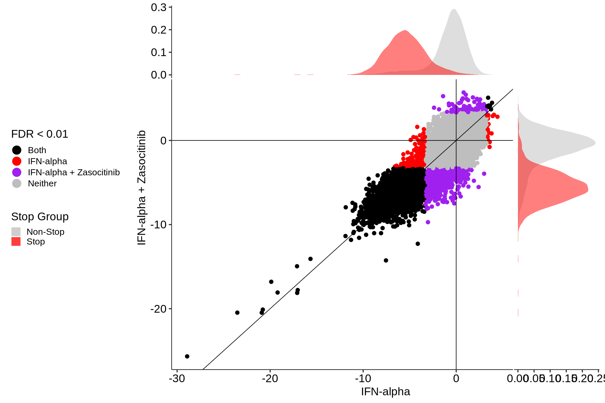
    


    
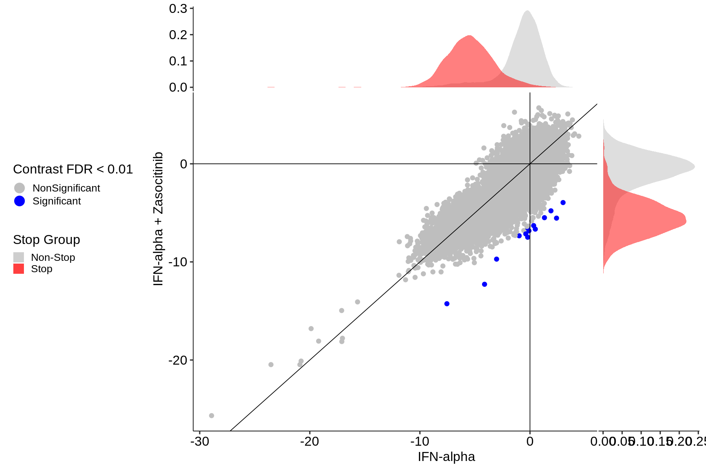
    


Much like for drug resistence, we can also plot them directly against each other since the IFN-alpha terms will cancel out in the final contrast:


```R
potentiation_sumstats %>% count(drug)
```


<table class="dataframe">
<caption>A tibble: 2 × 2</caption>
<thead>
	<tr><th scope=col>drug</th><th scope=col>n</th></tr>
	<tr><th scope=col>&lt;chr&gt;</th><th scope=col>&lt;int&gt;</th></tr>
</thead>
<tbody>
	<tr><td>IFNalpha100+BMS-986202 </td><td>23719</td></tr>
	<tr><td>IFNalpha100+Zasocitinib</td><td>23719</td></tr>
</tbody>
</table>


    
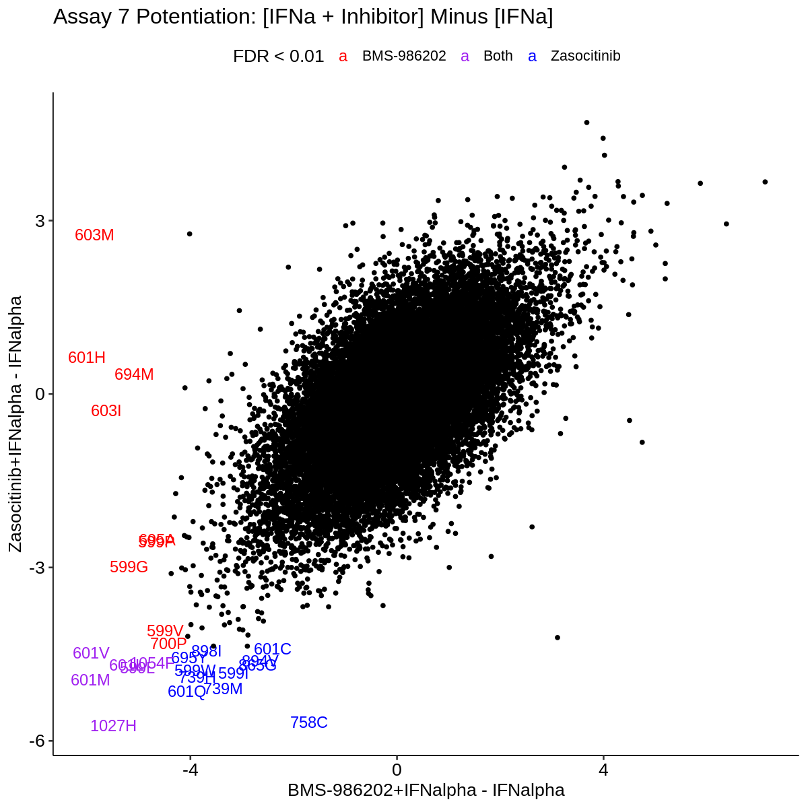
    


<strong>png:</strong> 2


We can pull out this list of variants specifically and profile them:


    
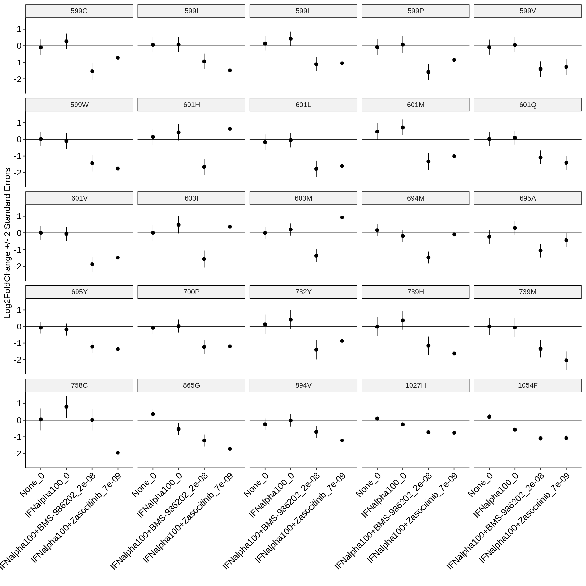
    


Generally, these variants have no effect on function in None or IFNalpha, but become very negative relative to WT under one or both of the inhibitors.


    
    
    | Position|AA | Log2FoldChange, IFNalpha+BMS-986202 - IFNalpha100| Log2FoldChange, IFNalpha+BMS-986202 - IFNalpha100| FDR, IFNalpha+Zasocitinib - IFNalpha100| FDR, IFNalpha+Zasocitinib - IFNalpha100|
    |--------:|:--|-------------------------------------------------:|-------------------------------------------------:|---------------------------------------:|---------------------------------------:|
    |      599|G  |                                          -1.80356|                                          -0.98476|                                 0.00035|                                 0.37116|
    |      599|I  |                                          -1.01279|                                          -1.55607|                                 0.15470|                                 0.00464|
    |      599|L  |                                          -1.52703|                                          -1.46847|                                 0.00076|                                 0.00555|
    |      599|P  |                                          -1.65101|                                          -0.91614|                                 0.00347|                                 0.60060|
    |      599|V  |                                          -1.45066|                                          -1.33079|                                 0.00561|                                 0.03768|
    |      599|W  |                                          -1.34800|                                          -1.65938|                                 0.03057|                                 0.00520|
    |      601|H  |                                          -2.07822|                                           0.21353|                                 0.00002|                                 0.99239|
    |      601|L  |                                          -1.72401|                                          -1.55894|                                 0.00035|                                 0.00555|
    |      601|M  |                                          -2.04752|                                          -1.72670|                                 0.00002|                                 0.00370|
    |      601|Q  |                                          -1.18220|                                          -1.51189|                                 0.02152|                                 0.00210|
    |      601|V  |                                          -1.82552|                                          -1.42410|                                 0.00002|                                 0.01156|
    |      603|I  |                                          -2.05290|                                          -0.10515|                                 0.00005|                                 0.99866|
    |      603|M  |                                          -1.56723|                                           0.72242|                                 0.00002|                                 0.50658|
    |      694|M  |                                          -1.29392|                                           0.08823|                                 0.00059|                                 0.99866|
    |      695|A  |                                          -1.36661|                                          -0.73948|                                 0.00347|                                 0.62663|
    |      695|Y  |                                          -1.02892|                                          -1.18126|                                 0.02343|                                 0.00827|
    |      700|P  |                                          -1.25380|                                          -1.22725|                                 0.00729|                                 0.01690|
    |      732|Y  |                                          -1.80113|                                          -1.27614|                                 0.00834|                                 0.33940|
    |      739|H  |                                          -1.52140|                                          -1.97743|                                 0.03512|                                 0.00397|
    |      739|M  |                                          -1.28351|                                          -1.97995|                                 0.10286|                                 0.00210|
    |      758|C  |                                          -0.78987|                                          -2.76646|                                 0.68453|                                 0.00016|
    |      865|G  |                                          -0.68343|                                          -1.17658|                                 0.30206|                                 0.00555|
    |      894|V  |                                          -0.68882|                                          -1.19964|                                 0.32097|                                 0.00645|
    |     1027|H  |                                          -0.47368|                                          -0.50030|                                 0.00011|                                 0.00016|
    |     1054|F  |                                          -0.50608|                                          -0.49677|                                 0.00249|                                 0.00609|

