## OCNT-DMSLIB-1 DMS Assay Run #9: TYK2 IL-23 Mini-DMS with Itacitinib

This is a mini-DMS dataset derived from the IL-23 reporter system covering chunk 16 only. There are 12 samples (3 replicates in each of 4 conditions), with the following structure:

| ID | Condition | Dosage | Replicates
| --- | ----------- | --- | ----------- |
| 1 | None | 0 | 3 |
| 2 | IL-23 | 1 | 3 |
| 3 | IL-23 | 10 | 3 |
| 4 | IL-23 + Itacitinib | 10 | 3 |

Let's check some effects we expect to observe (mainly QC parameters and stop codons), then examine the global distribution of mutant vs WT effects across conditions.

1. [Barcode Sequencing Distributions](#part1)
2. [Inference and Stop Codon Effects](#part2)
3. [Visualizations](#part3)
4. [Raw Data Review](#part4)

### Barcode Sequencing Distributions 

    
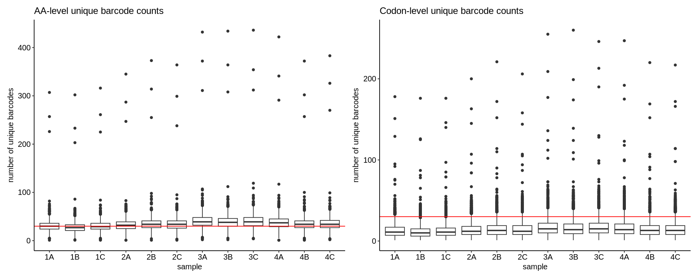
    

    
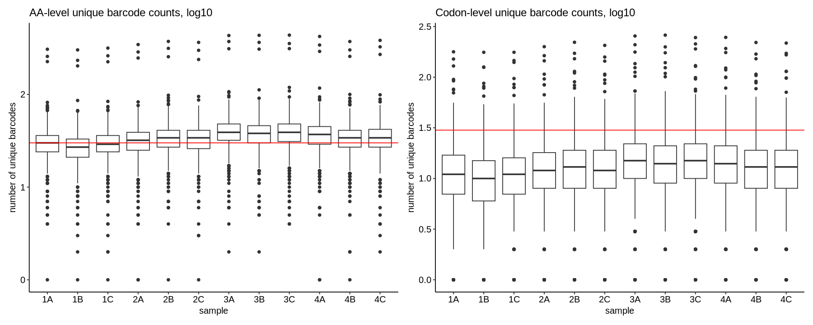
    

To get a sense of positional distribution, we can show the same data as lineplots across the length of TYK2. Below is an example using the first sample; the remaining plots can be found [here](./coverage-plots):

    
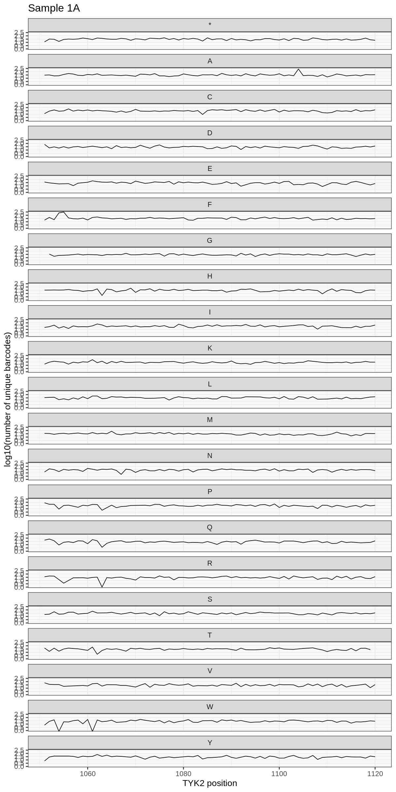
    

    
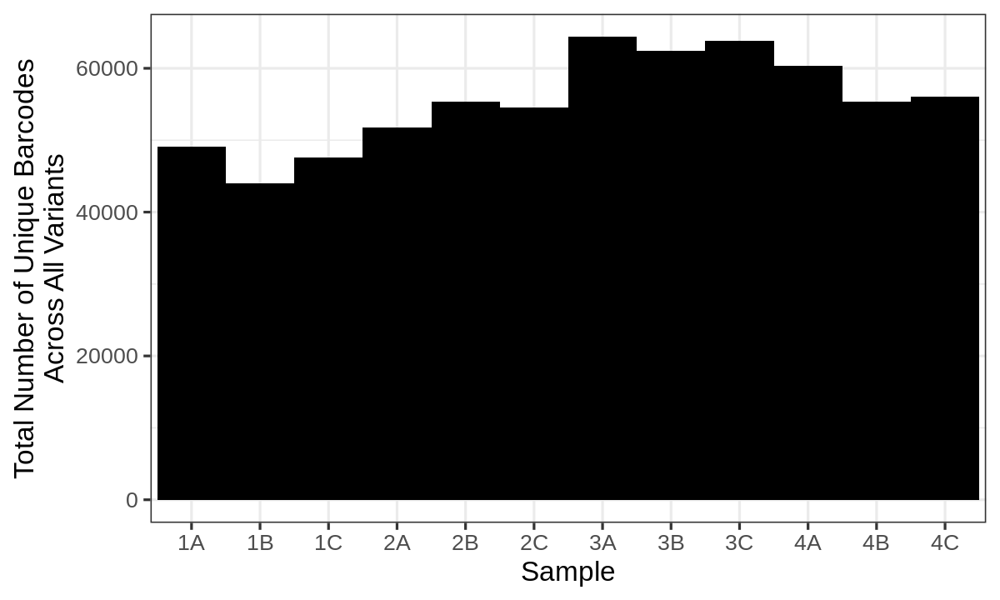
    

### Inference and Stop Codon Effects 

    
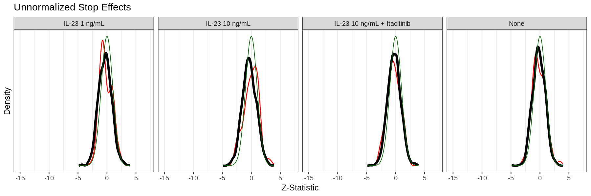
    

    
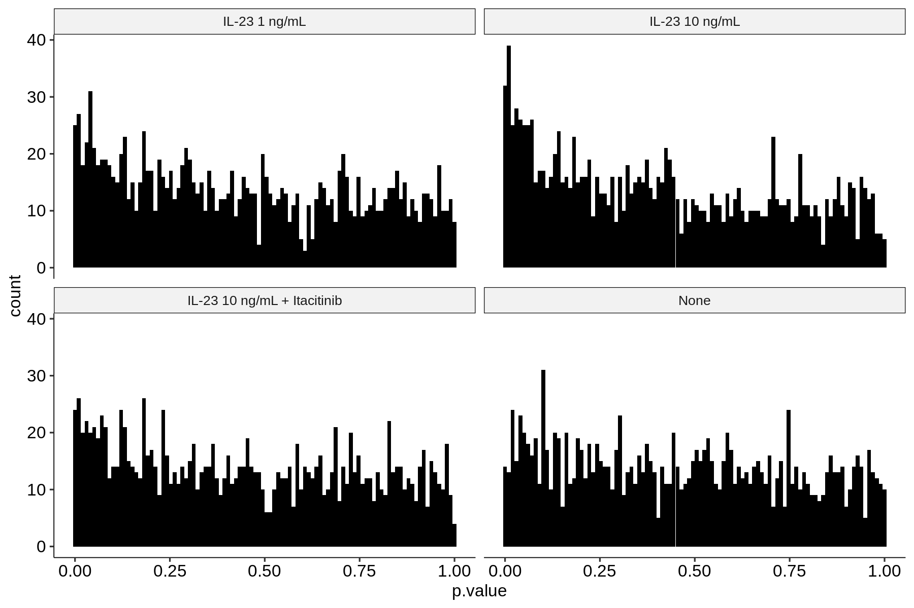
    

    
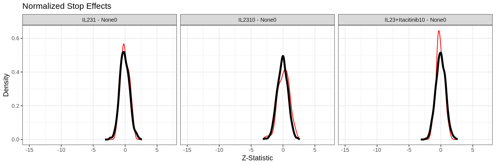
    

We can also examine directly the number of variants across all comparisons that are significant at a 1% FDR:

    
    
    |direction | Non-Significant|
    |:---------|---------------:|
    |GoF       |            1946|
    |LoF       |            2248|

### Visualizations 

    
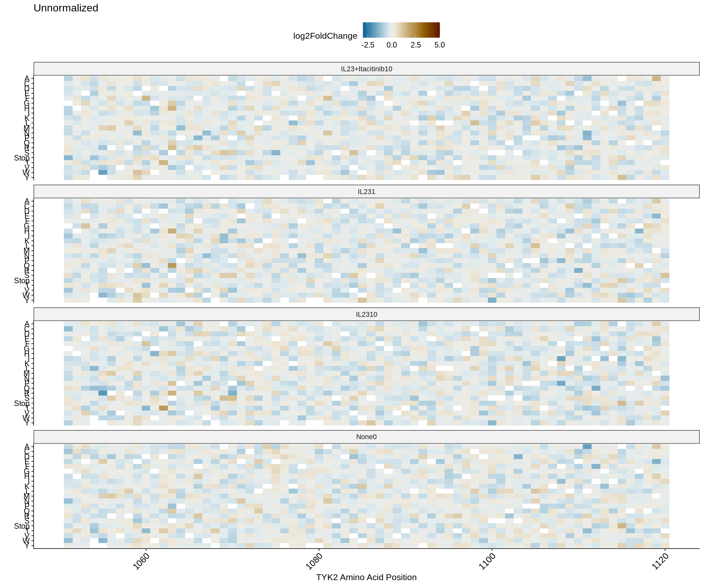
    

    
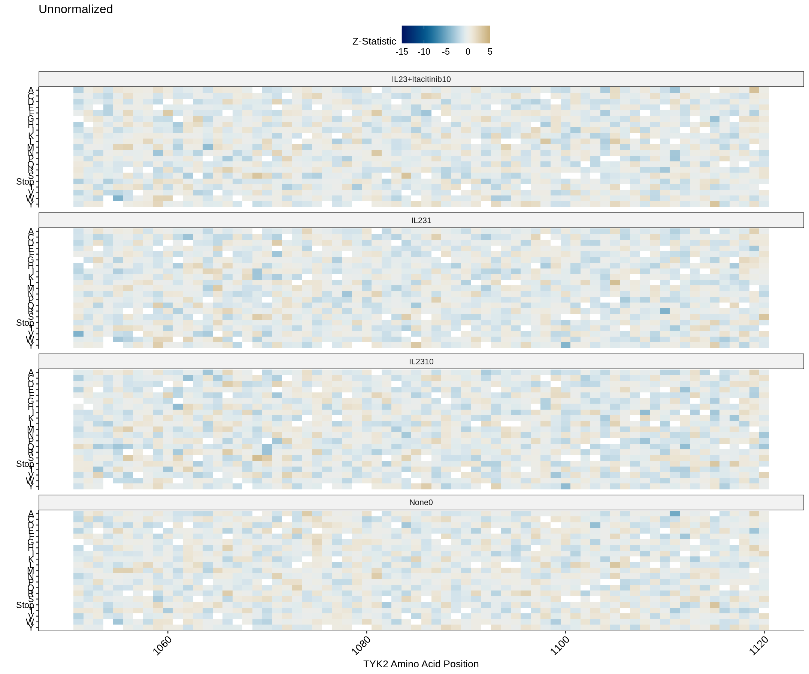
    

    
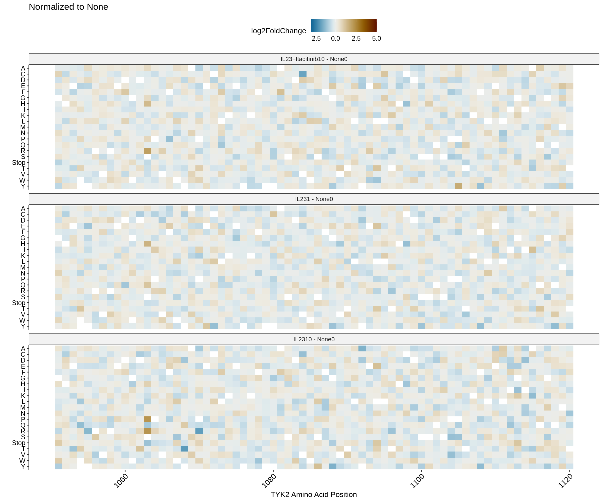
    

    
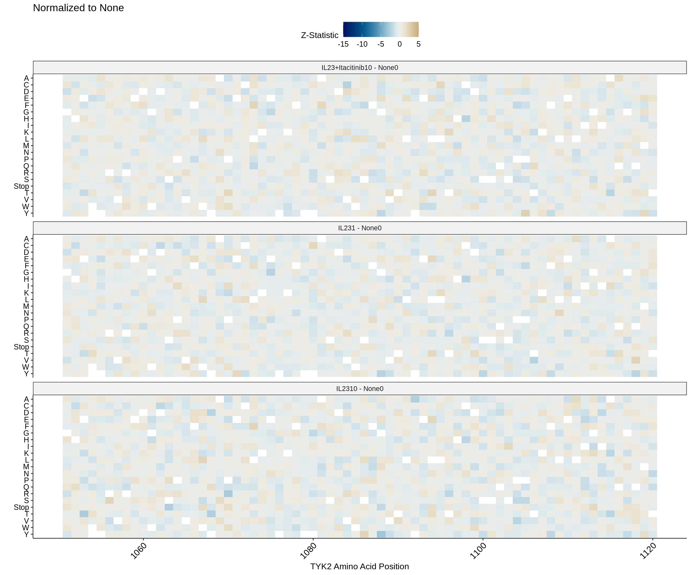
    

### Raw Data Review 

To be sure the model isn't doing something unusual, we extract the raw barcode counts for three variants (WT, P1104A, and P1104Stop) and compare them. Below are the distributions of those raw counts across samples:

    
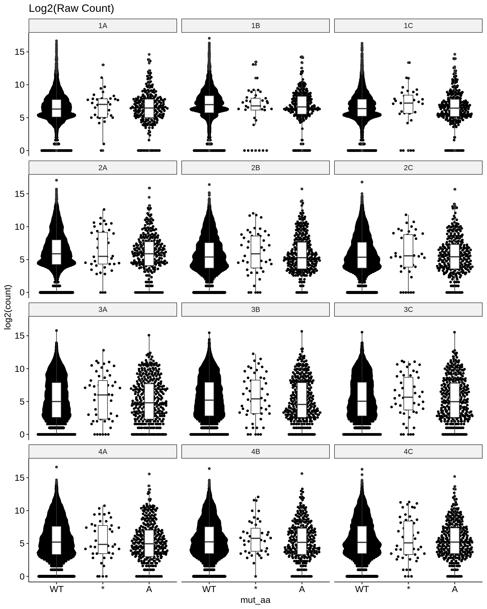
    

Another simple raw data view is to take the raw counts and subtract the barcode average from each barcode. This generates a "barcode-centered" log count, which can make it easier to see trends in the raw data:

    
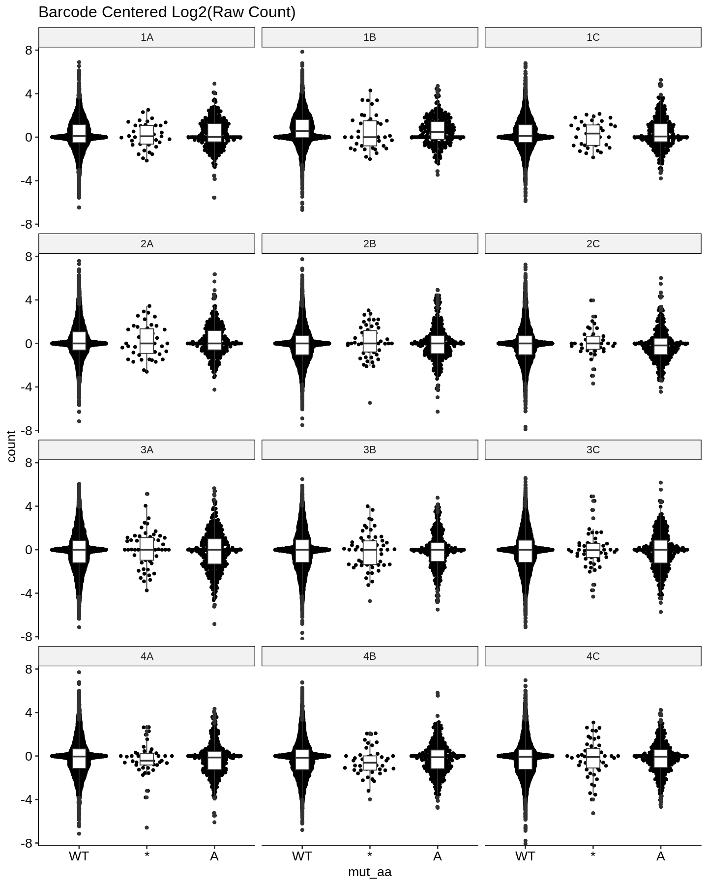
    

To get an intuition for what a variant effect would look like in the raw counts, we can extract the same counts for the same positions from the IFN-alpha 100 U/mL condition in Assay 3. In comparison, we have far more barcodes per variant in the mini-DMS as expected, but the stop-specific shift is very clear:

    
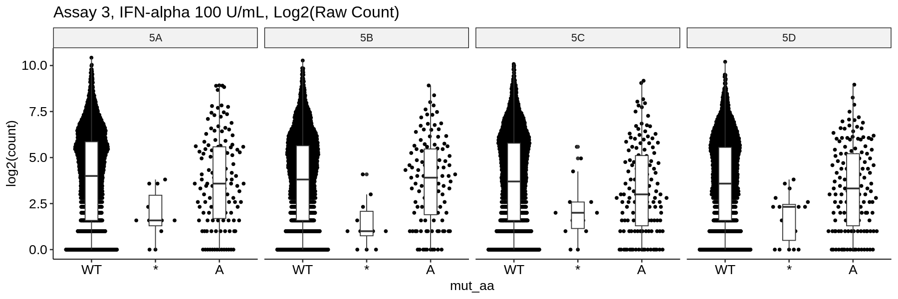
    

    
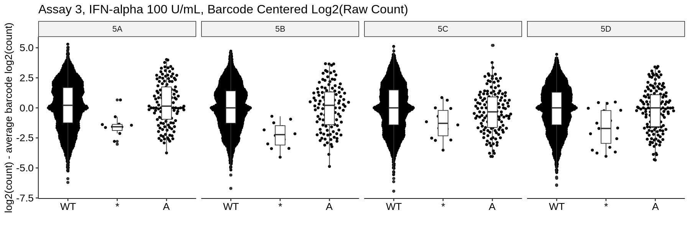
    

For completion, we can extract the summary statitics for position 1104 and view them directly:

    
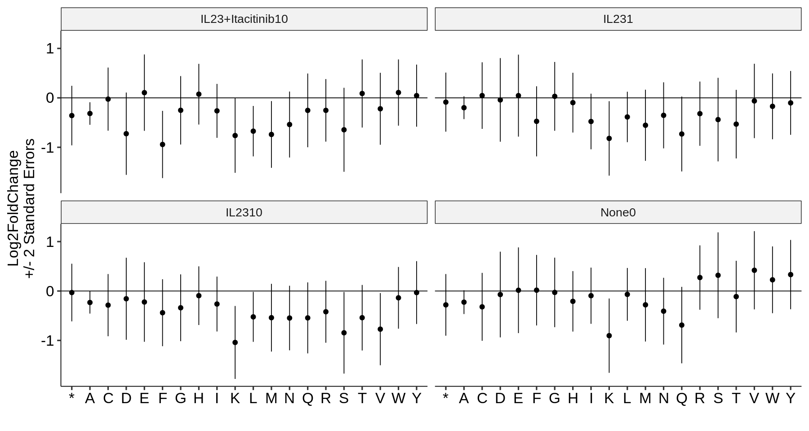
    

We observe the variance reduction for P1104A but no convincing significant effects. Finally, we can compare the Z-statistics between IL-23 10 ng/mL and IL-23 10 ng/mL + Itacitinib to evaluate whether any itacitinib-specific variant groups appear, which does not seem to be the case. Below, stops are highlighted in red:

    
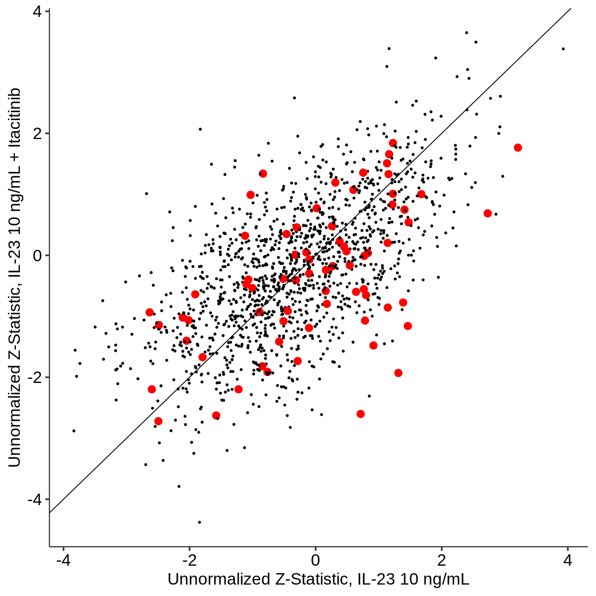
    

