```R
# Parameters
bcmap = "pipeline/OCNT-DMSLIB-1-run2/"

```

## DMS Barcode Mapping Report

1. [Sequencing Quality Metrics](#part1)
2. [Read Sampling Distributions](#part2)
3. [Library Complexity and Coverage](#part3)
4. [RY Barcoding](#part4)

### Sequencing Quality Metrics <a name="part1"></a>

#### Sequencing Depth 


    
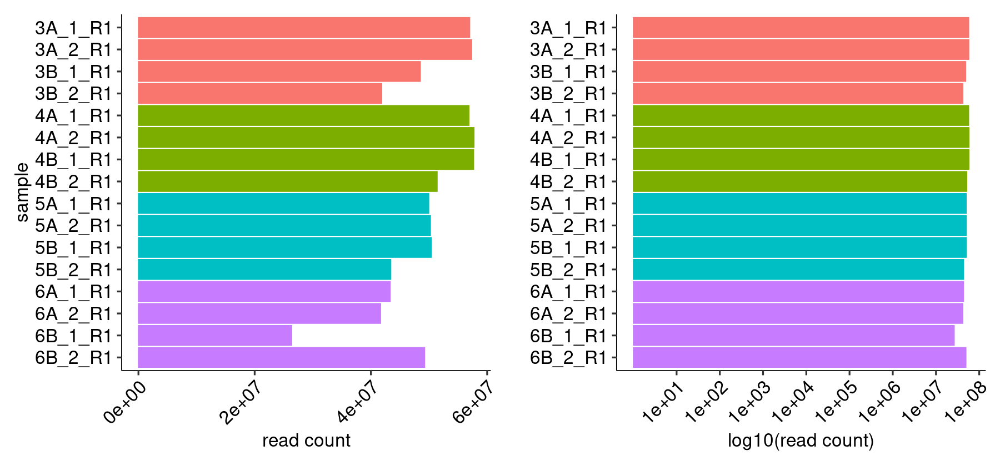
    


    
    
    |sample  | read count|
    |:-------|----------:|
    |3A_1_R1 |   56995569|
    |3A_2_R1 |   57329625|
    |3B_1_R1 |   48504137|
    |3B_2_R1 |   41862423|
    |4A_1_R1 |   56866293|
    |4A_2_R1 |   57735109|
    |4B_1_R1 |   57669587|
    |4B_2_R1 |   51393103|
    |5A_1_R1 |   49946515|
    |5A_2_R1 |   50238182|
    |5B_1_R1 |   50381602|
    |5B_2_R1 |   43417816|
    |6A_1_R1 |   43311834|
    |6A_2_R1 |   41659294|
    |6B_1_R1 |   26367894|
    |6B_2_R1 |   49243114|


#### R1/R2 Joining


    
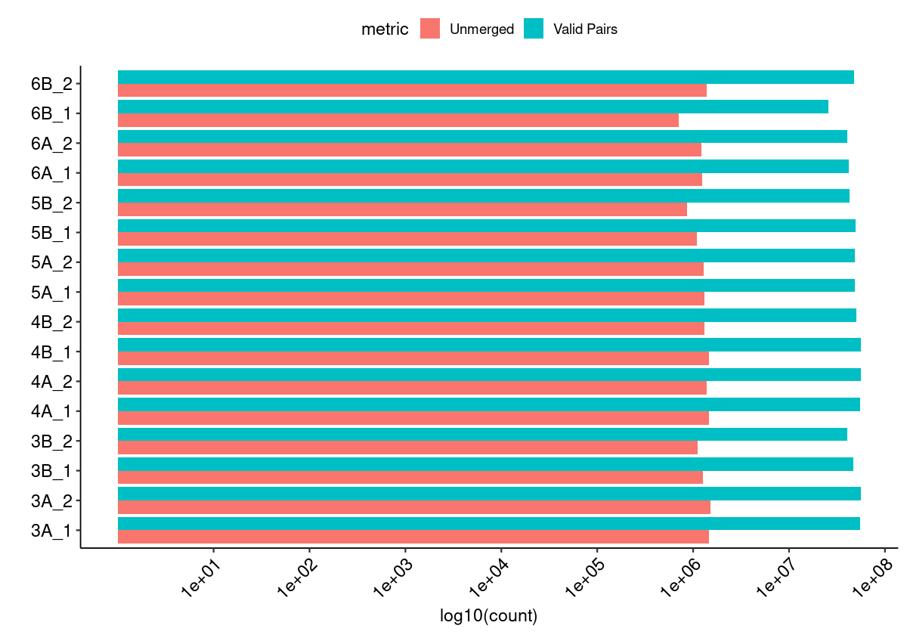
    


#### Merged Fragment Lengths


    
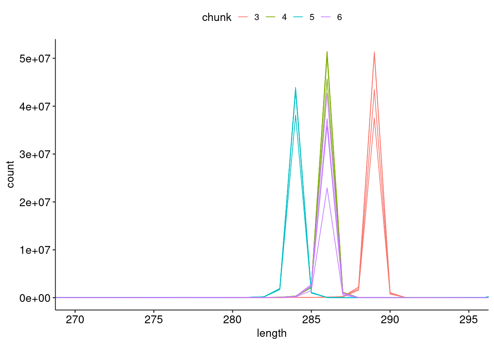
    


#### Unique Alignment Rate <a name="part2c"></a>


    
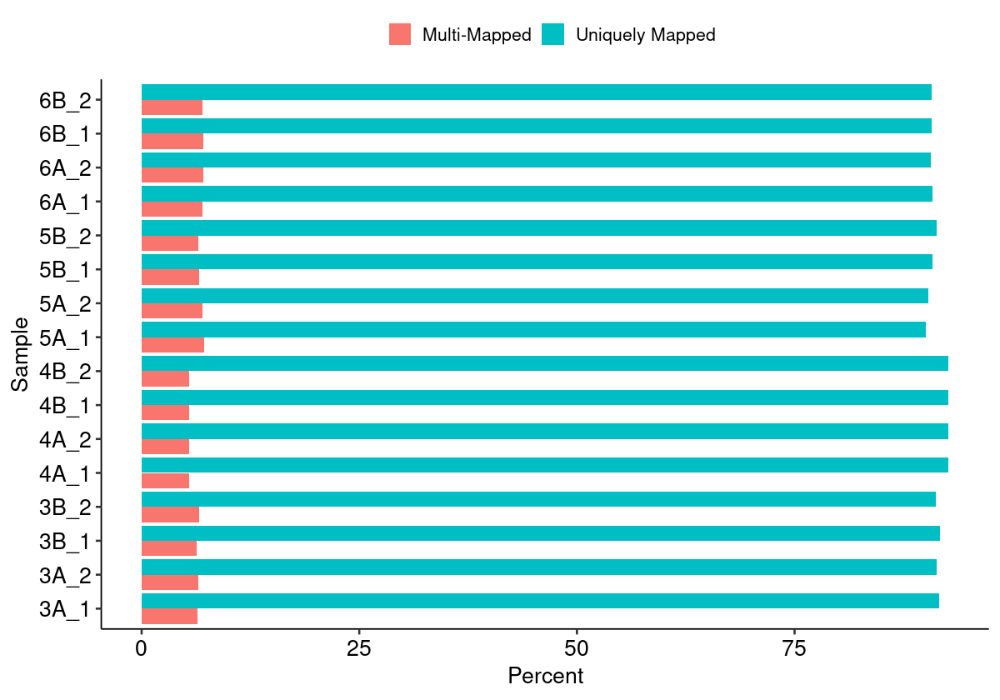
    


#### Edit Distance Distributions


    
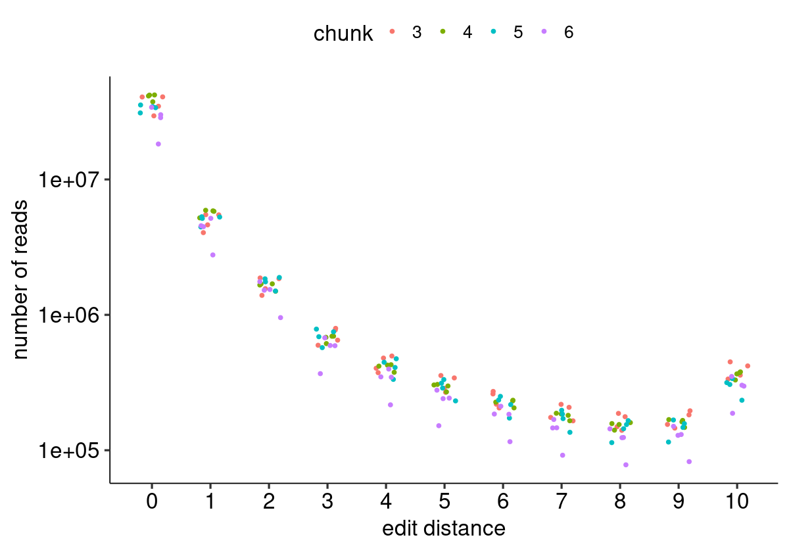
    


#### Edit Distance Proportion Distributions


    
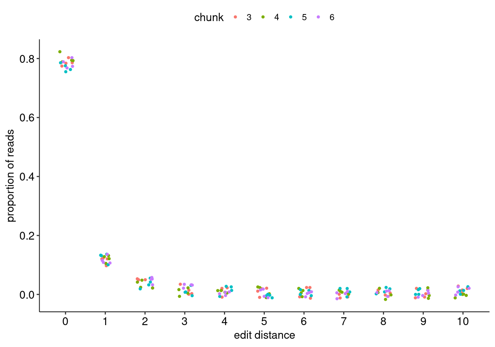
    


#### Reproduced Associations Per Barcode Sequence


    
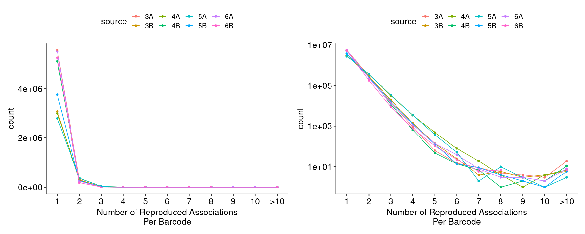
    


#### Filtered Barcode Counts Per Replicate Group


    
    
    |sample            |n       |
    |:-----------------|:-------|
    |3A.bcmap-filtered |5016187 |
    |3B.bcmap-filtered |2758136 |
    |4A.bcmap-filtered |2656574 |
    |4B.bcmap-filtered |4544991 |
    |5A.bcmap-filtered |2429781 |
    |5B.bcmap-filtered |3279812 |
    |6A.bcmap-filtered |4813287 |
    |6B.bcmap-filtered |4596939 |


### Read Sampling Distributions <a name="part3"></a>

#### Reads Per Barcode Without Binning


    
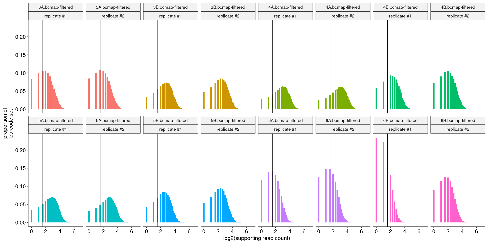
    


#### Reads Per Barcode With Binning


    
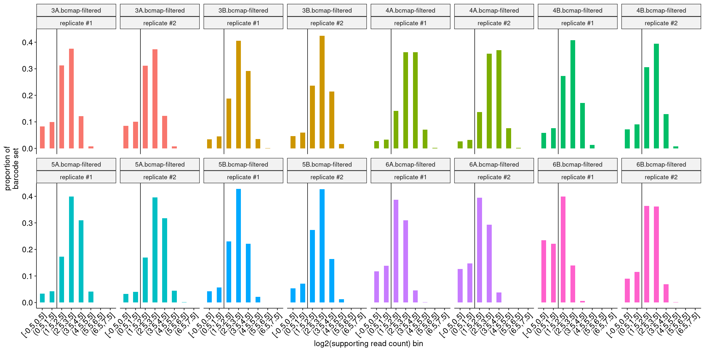
    


#### Barcode Purity Distributions


    
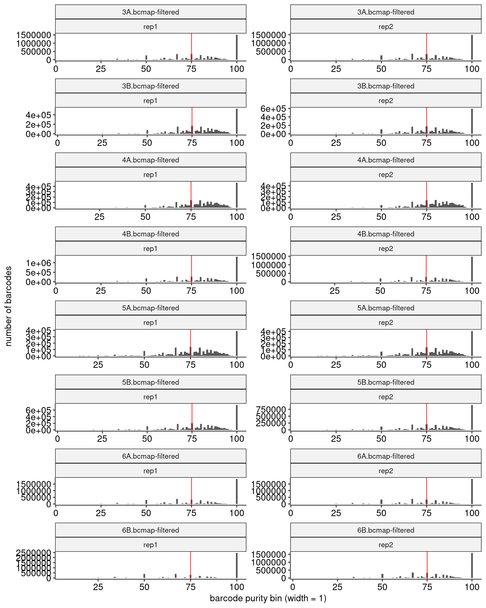
    


#### Barcode Counts Per Final Joined Map


    
    
    |sample            |final barcode count |
    |:-----------------|:-------------------|
    |3.bcmap-final.tsv |3108897             |
    |4.bcmap-final.tsv |3508914             |
    |5.bcmap-final.tsv |2624160             |
    |6.bcmap-final.tsv |2908148             |


### Library Complexity and Coverage <a name="part4"></a>

#### Unique Barcodes Per Residue


    
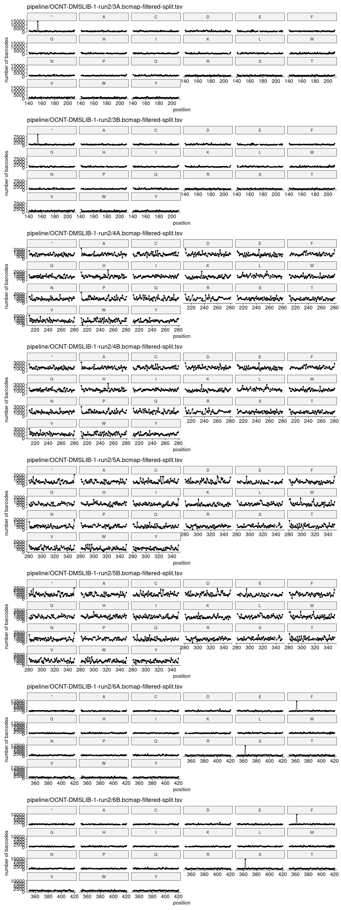
    


#### Unique Barcodes Per Residue, log10


    
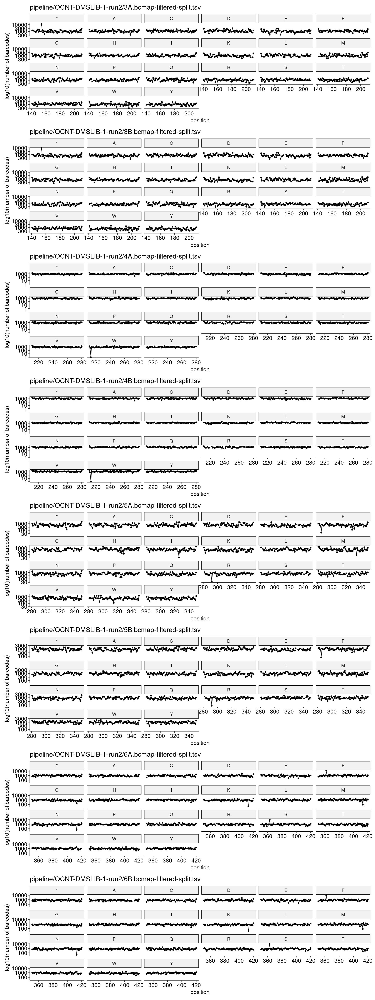
    


### RY Barcoding <a name="part5"></a>


    
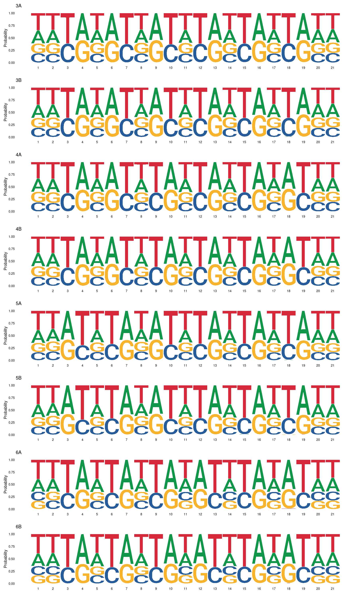
    

