```R
# Parameters
bcmap = "pipeline/OCNT-DMSLIB-1-run3/"

```

## DMS Barcode Mapping Report

1. [Sequencing Quality Metrics](#part1)
2. [Read Sampling Distributions](#part2)
3. [Library Complexity and Coverage](#part3)
4. [RY Barcoding](#part4)

### Sequencing Quality Metrics <a name="part1"></a>

#### Sequencing Depth 


    
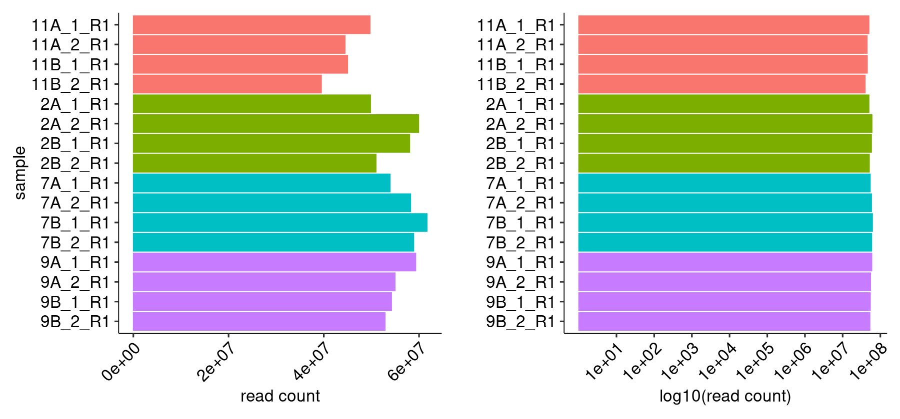
    


    
    
    |sample   | read count|
    |:--------|----------:|
    |11A_1_R1 |   49706875|
    |11A_2_R1 |   44465206|
    |11B_1_R1 |   45001191|
    |11B_2_R1 |   39492569|
    |2A_1_R1  |   49810043|
    |2A_2_R1  |   59921016|
    |2B_1_R1  |   58034085|
    |2B_2_R1  |   50968680|
    |7A_1_R1  |   53914519|
    |7A_2_R1  |   58237126|
    |7B_1_R1  |   61675645|
    |7B_2_R1  |   58883880|
    |9A_1_R1  |   59311747|
    |9A_2_R1  |   54964702|
    |9B_1_R1  |   54219045|
    |9B_2_R1  |   52874002|


#### R1/R2 Joining


    
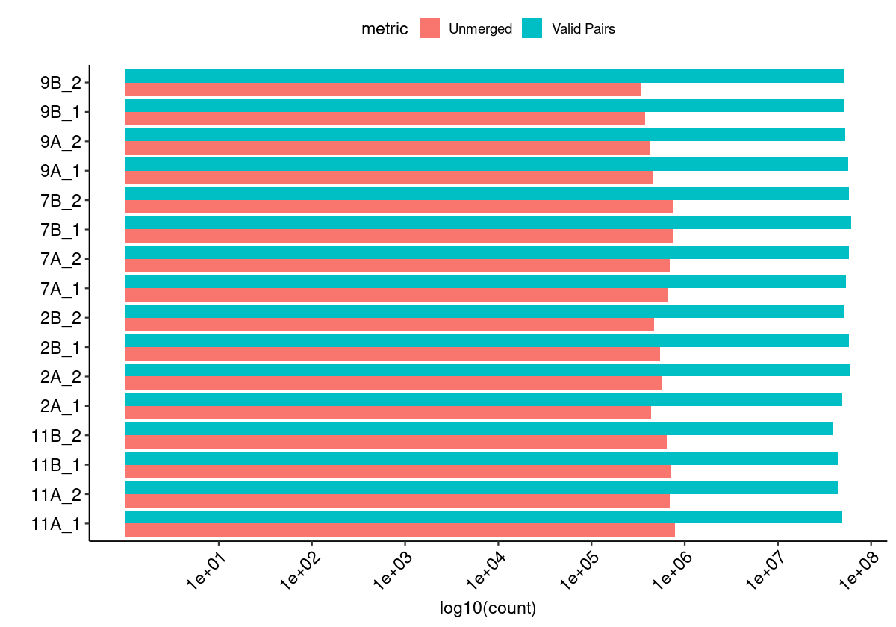
    


#### Merged Fragment Lengths


    
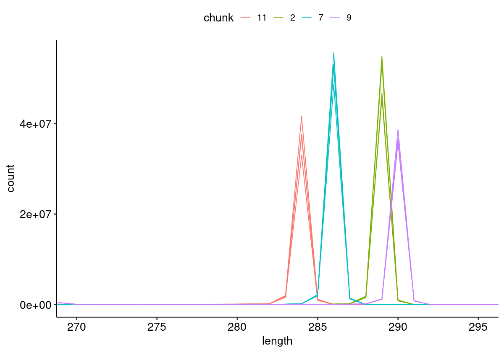
    


#### Unique Alignment Rate <a name="part2c"></a>


    
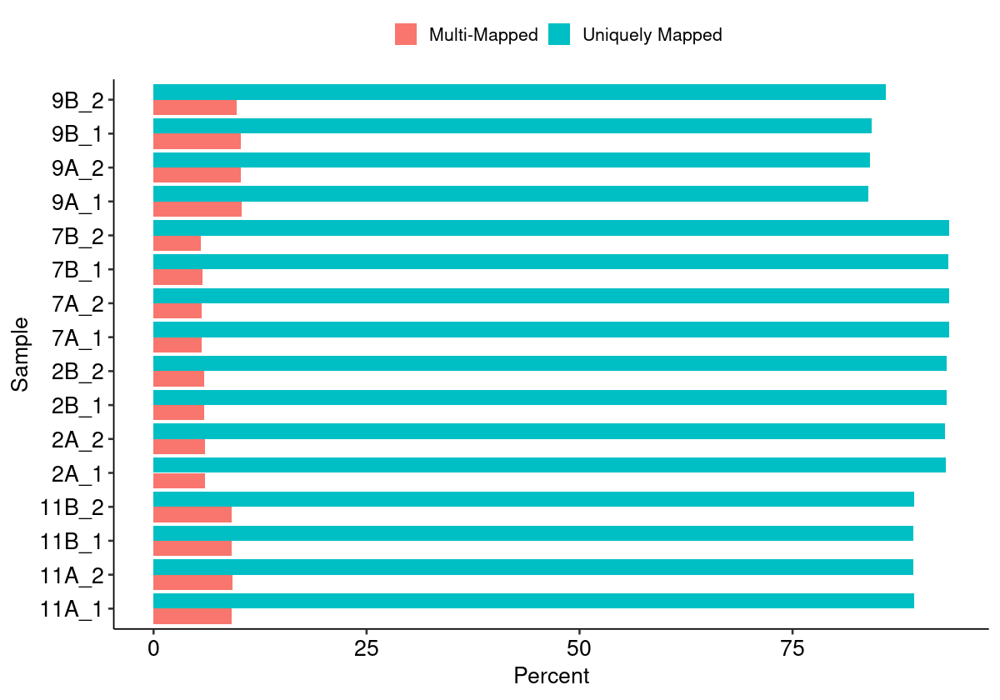
    


#### Edit Distance Distributions


    
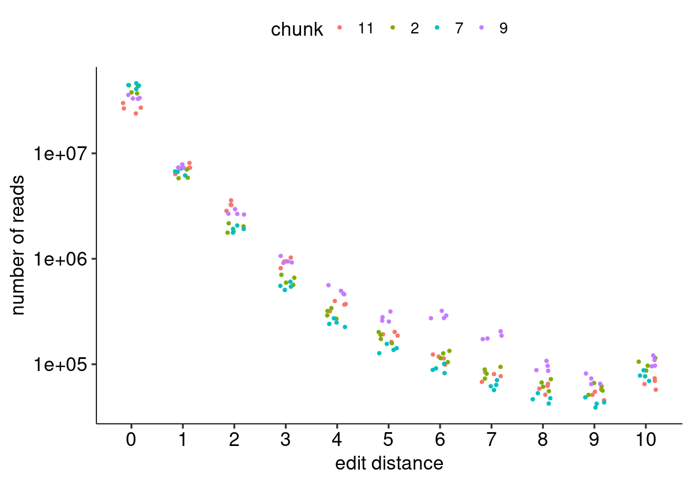
    


#### Edit Distance Proportion Distributions


    

    


#### Reproduced Associations Per Barcode Sequence


    
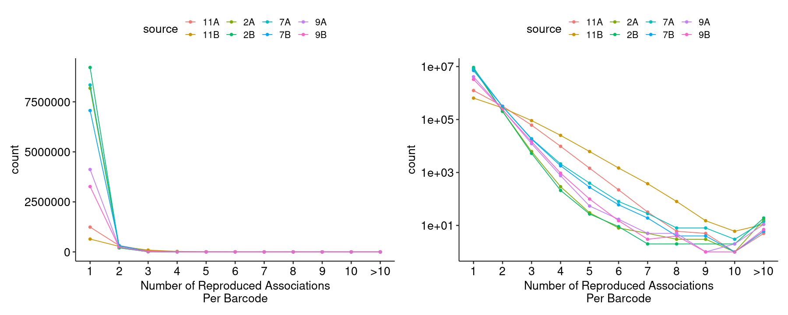
    


#### Filtered Barcode Counts Per Replicate Group


    
    
    |sample             |n       |
    |:------------------|:-------|
    |11A.bcmap-filtered |897404  |
    |11B.bcmap-filtered |458270  |
    |2A.bcmap-filtered  |7374702 |
    |2B.bcmap-filtered  |8313414 |
    |7A.bcmap-filtered  |7395659 |
    |7B.bcmap-filtered  |6264691 |
    |9A.bcmap-filtered  |2770132 |
    |9B.bcmap-filtered  |2200844 |


### Read Sampling Distributions <a name="part3"></a>

#### Reads Per Barcode Without Binning


    
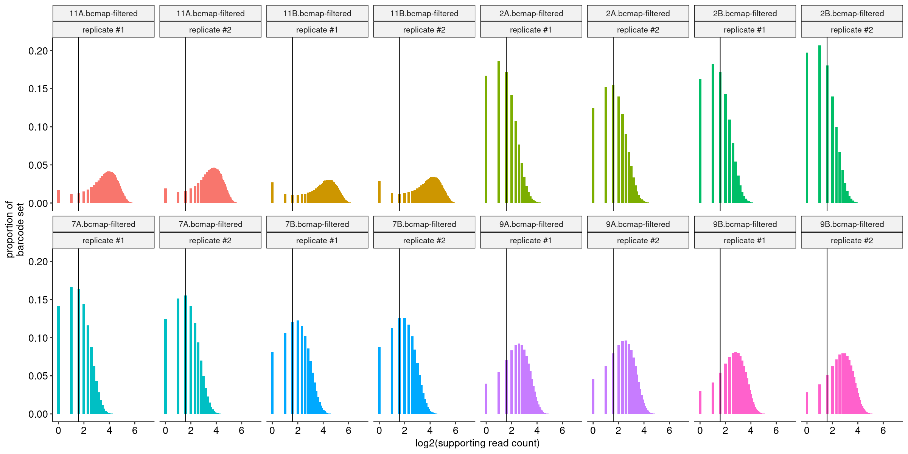
    


#### Reads Per Barcode With Binning


    
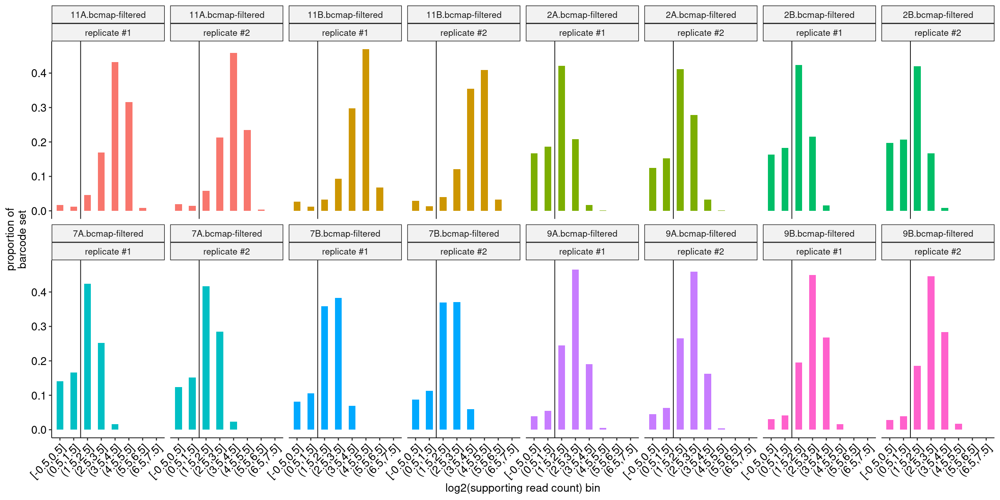
    


#### Barcode Purity Distributions


    
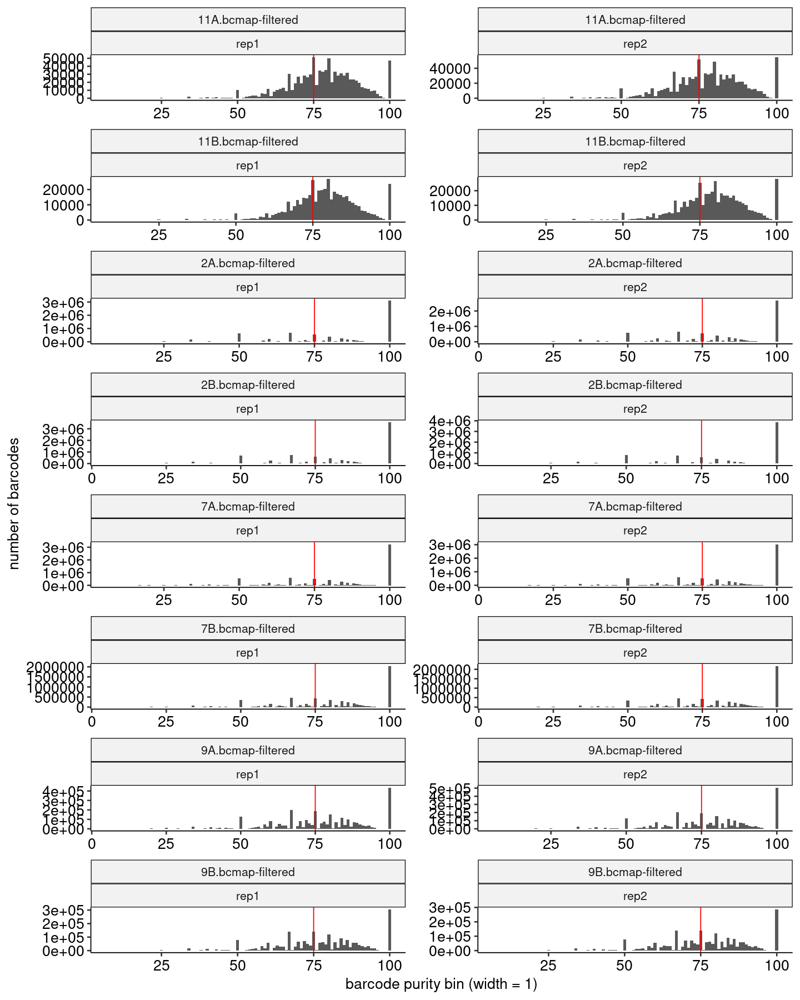
    


#### Barcode Counts Per Final Joined Map


    
    
    |sample             |final barcode count |
    |:------------------|:-------------------|
    |11.bcmap-final.tsv |561509              |
    |2.bcmap-final.tsv  |4108118             |
    |7.bcmap-final.tsv  |4799142             |
    |9.bcmap-final.tsv  |1689191             |


### Library Complexity and Coverage <a name="part4"></a>

#### Unique Barcodes Per Residue


    
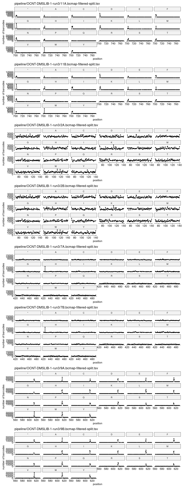
    


#### Unique Barcodes Per Residue, log10


    
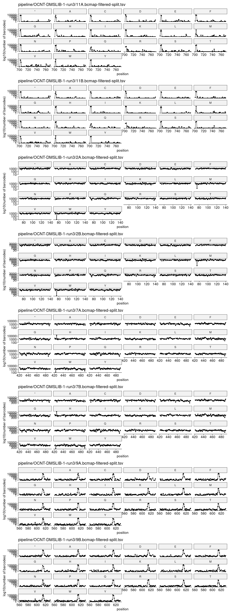
    


### RY Barcoding <a name="part5"></a>


    
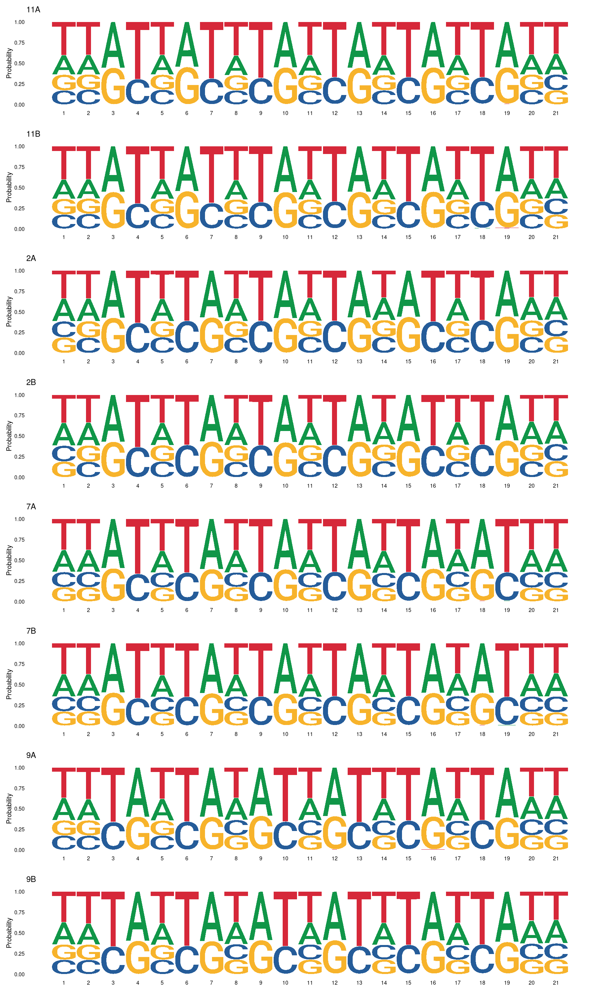
    

