```R
# Parameters
bcmap = "pipeline/OCNT-DMSLIB-1-run4/"

```

## DMS Barcode Mapping Report

1. [Sequencing Quality Metrics](#part1)
2. [Read Sampling Distributions](#part2)
3. [Library Complexity and Coverage](#part3)
4. [RY Barcoding](#part4)

### Sequencing Quality Metrics <a name="part1"></a>

#### Sequencing Depth 


    
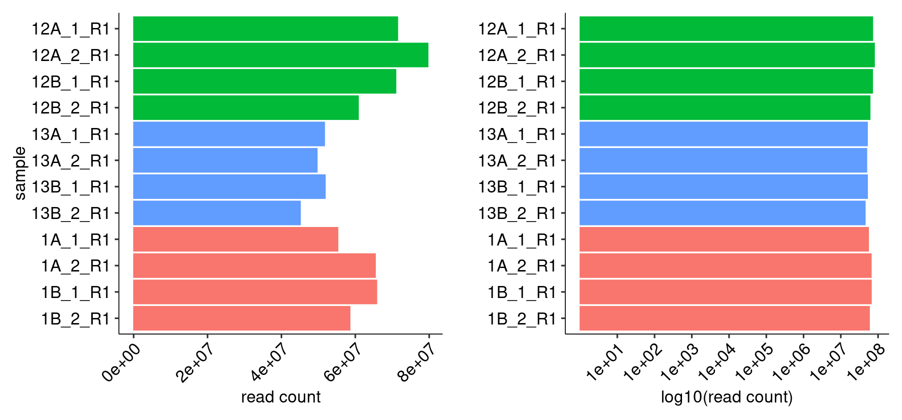
    


    
    
    |sample   | read count|
    |:--------|----------:|
    |12A_1_R1 |   71460461|
    |12A_2_R1 |   79662859|
    |12B_1_R1 |   70970072|
    |12B_2_R1 |   60813033|
    |13A_1_R1 |   51670577|
    |13A_2_R1 |   49658472|
    |13B_1_R1 |   51857612|
    |13B_2_R1 |   45124783|
    |1A_1_R1  |   55278401|
    |1A_2_R1  |   65422137|
    |1B_1_R1  |   65793388|
    |1B_2_R1  |   58551206|


#### R1/R2 Joining


    
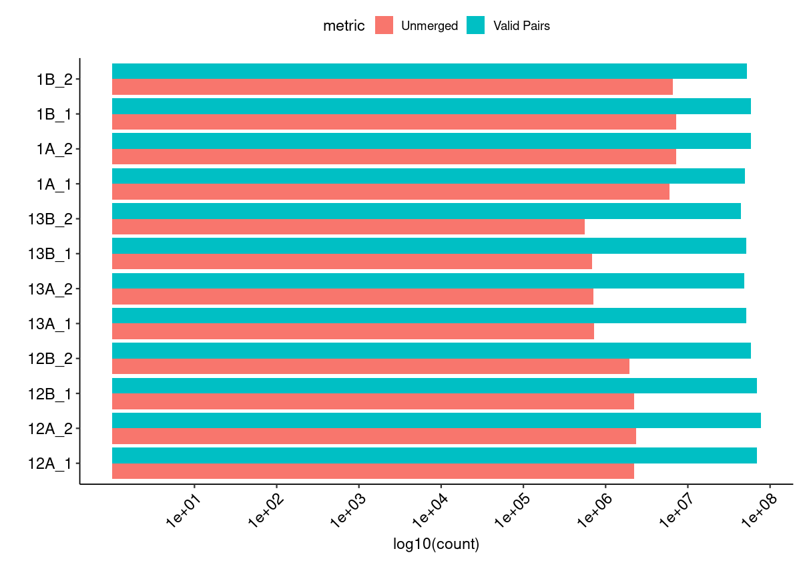
    


#### Merged Fragment Lengths


    
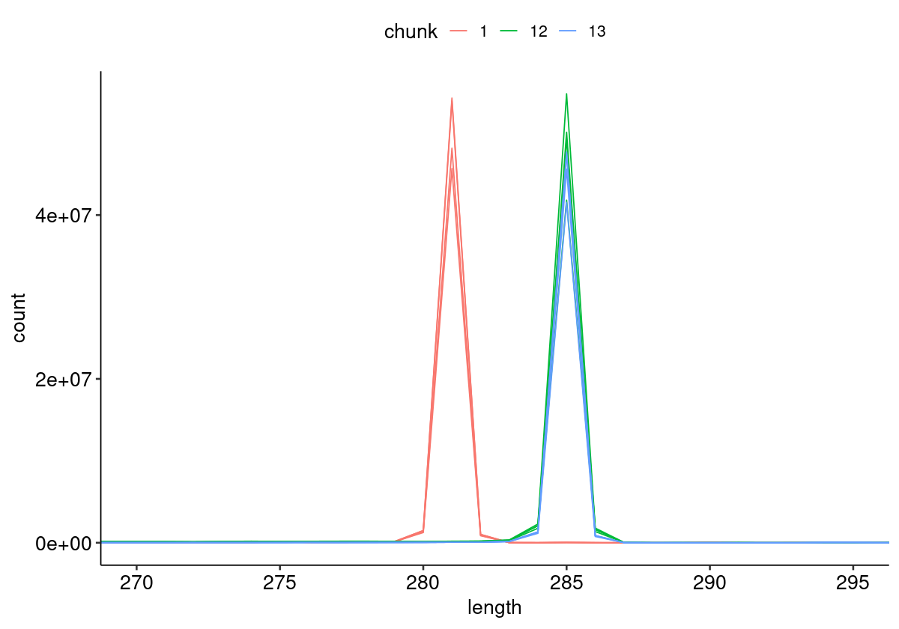
    


#### Unique Alignment Rate <a name="part2c"></a>


    
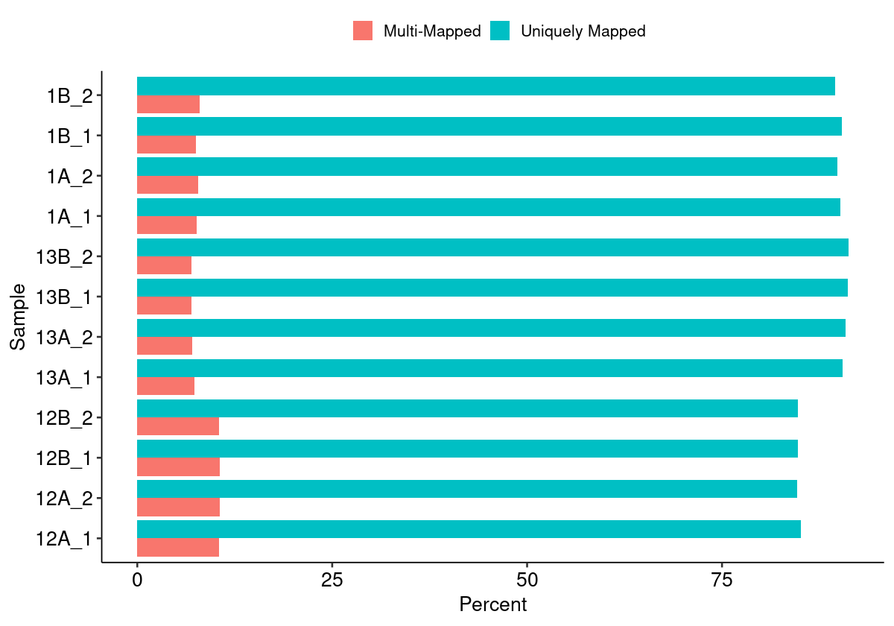
    


#### Edit Distance Distributions


    
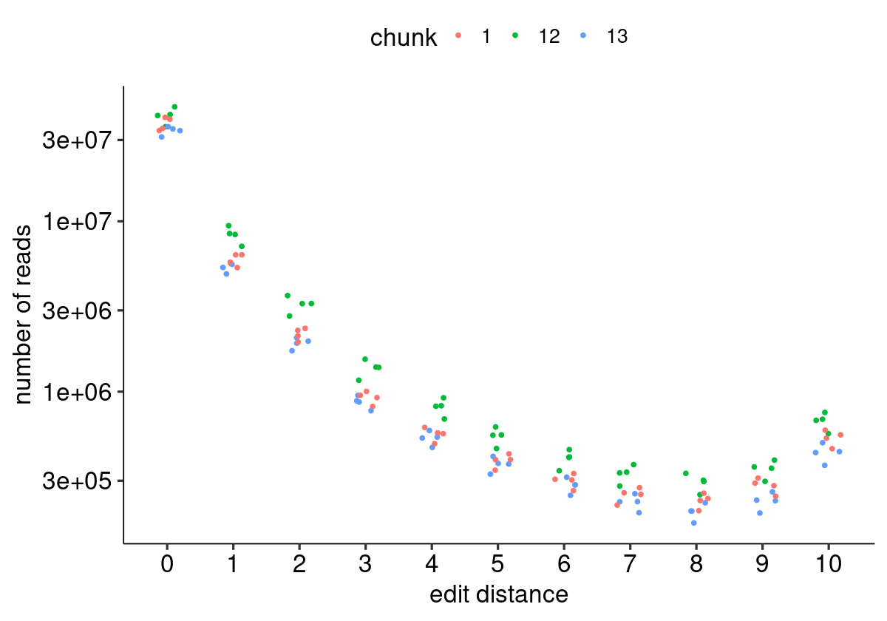
    


#### Edit Distance Proportion Distributions


    
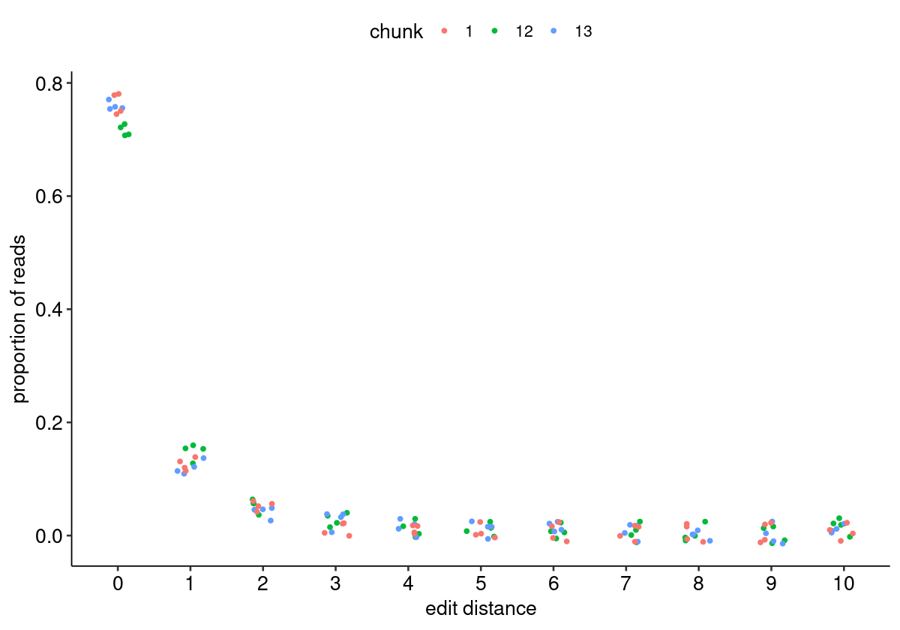
    


#### Reproduced Associations Per Barcode Sequence


    
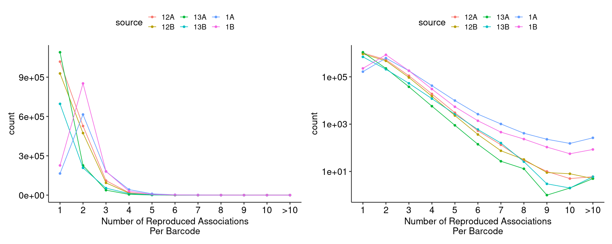
    


#### Filtered Barcode Counts Per Replicate Group


    
    
    |sample             |n      |
    |:------------------|:------|
    |12A.bcmap-filtered |677878 |
    |12B.bcmap-filtered |618381 |
    |13A.bcmap-filtered |981190 |
    |13B.bcmap-filtered |624369 |
    |1A.bcmap-filtered  |108465 |
    |1B.bcmap-filtered  |153288 |


### Read Sampling Distributions <a name="part3"></a>

#### Reads Per Barcode Without Binning


    
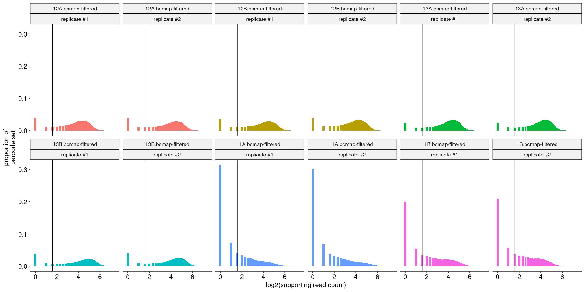
    


#### Reads Per Barcode With Binning


    
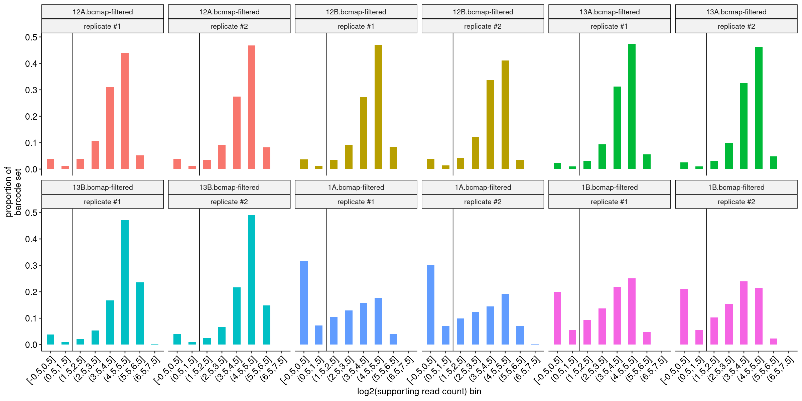
    


#### Barcode Purity Distributions


    
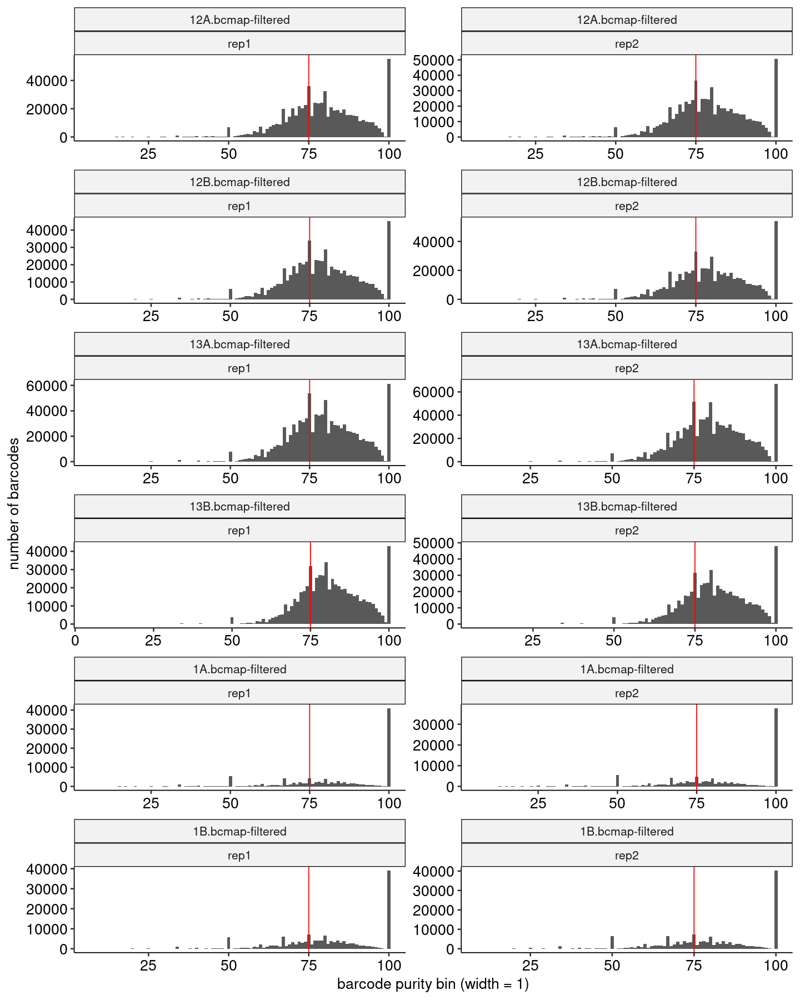
    


#### Barcode Counts Per Final Joined Map


    
    
    |sample             |final barcode count |
    |:------------------|:-------------------|
    |1.bcmap-final.tsv  |65708               |
    |12.bcmap-final.tsv |538844              |
    |13.bcmap-final.tsv |786184              |


### Library Complexity and Coverage <a name="part4"></a>

#### Unique Barcodes Per Residue


    
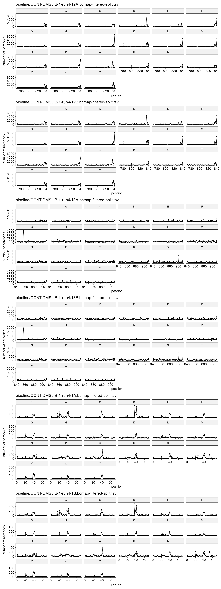
    


#### Unique Barcodes Per Residue, log10


    
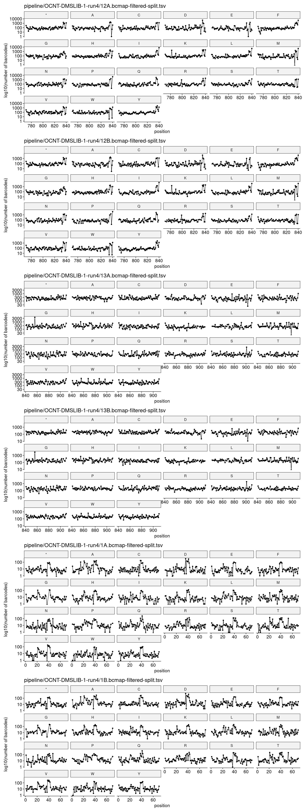
    


### RY Barcoding <a name="part5"></a>


    
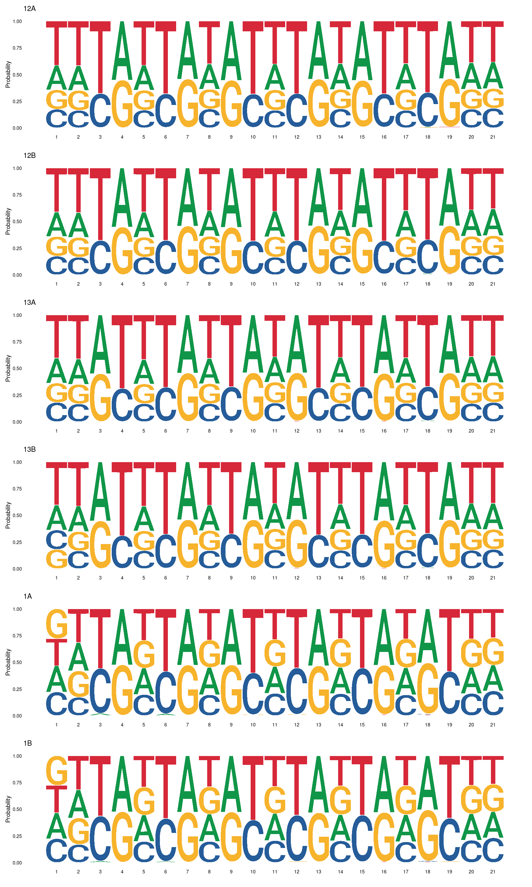
    

