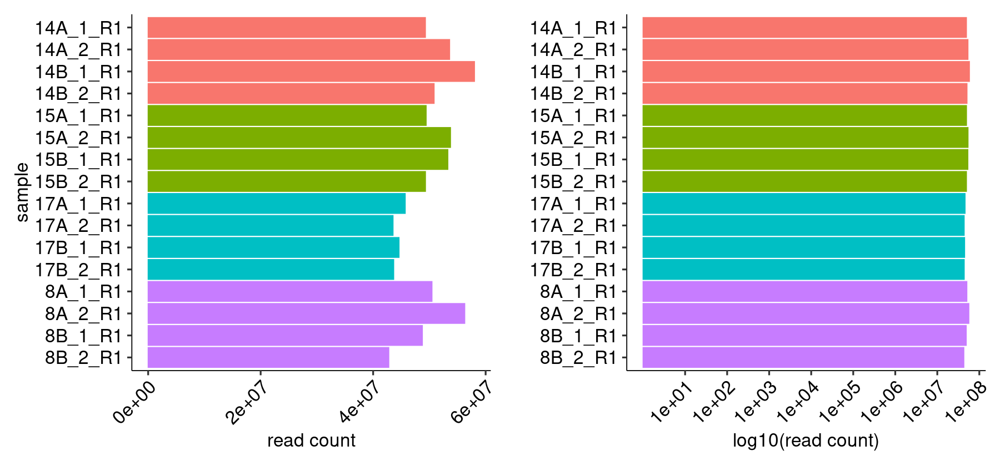
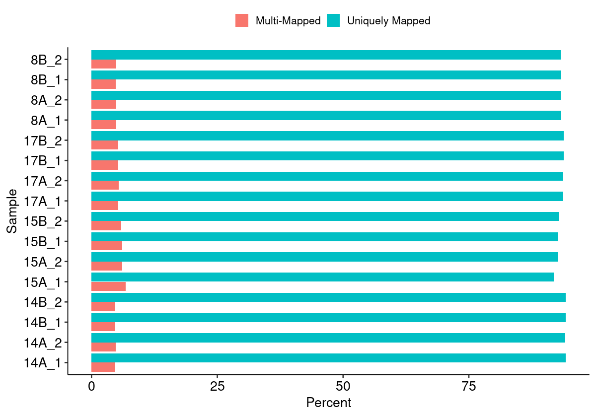
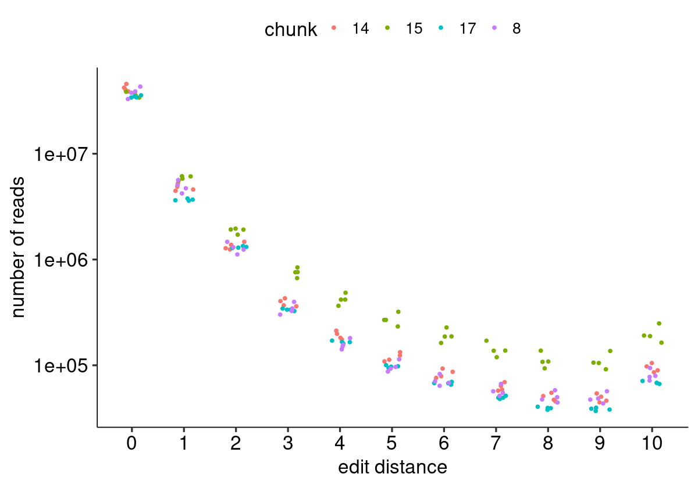
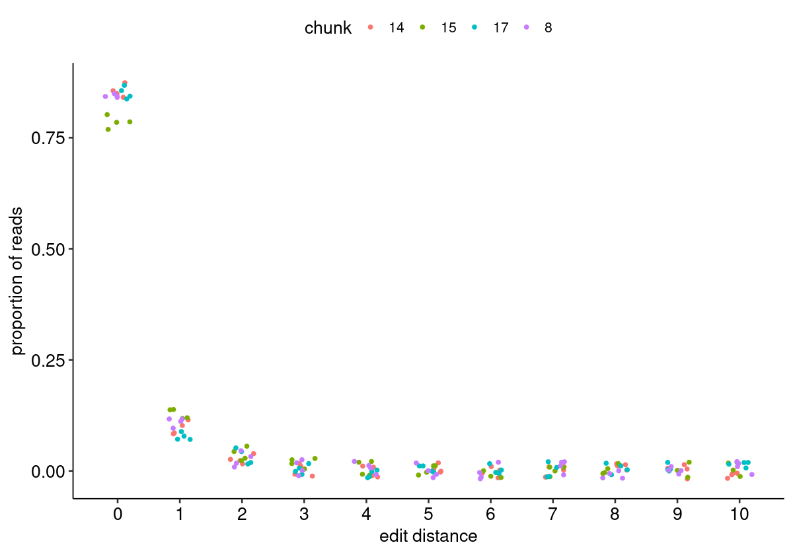
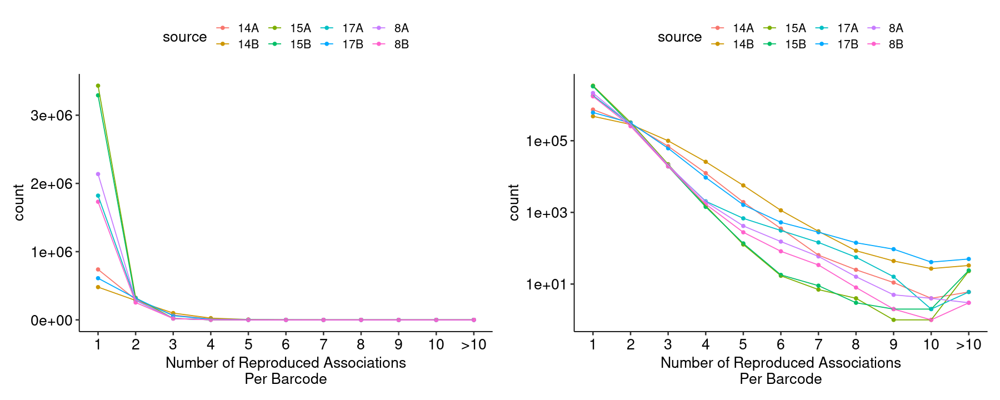
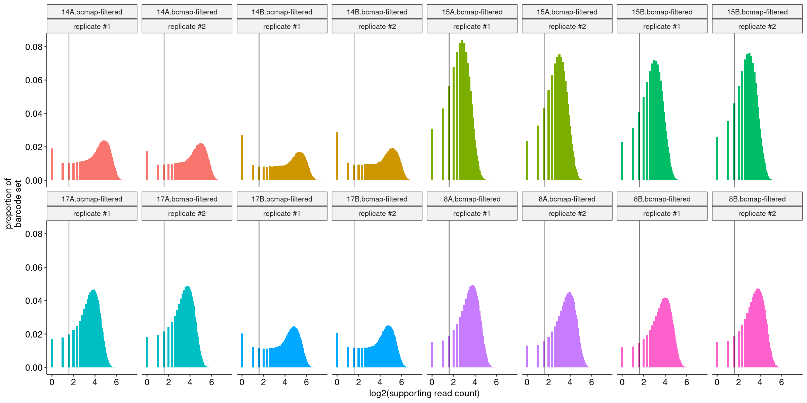
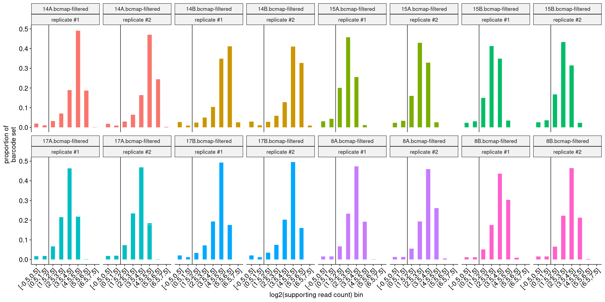
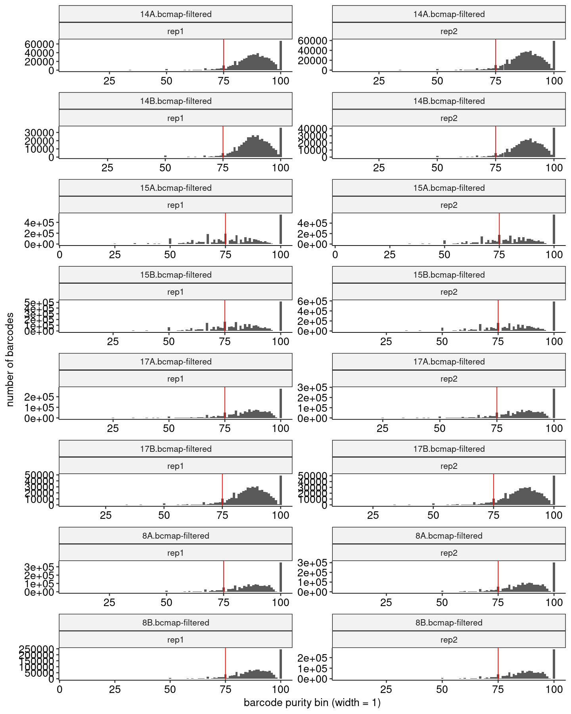
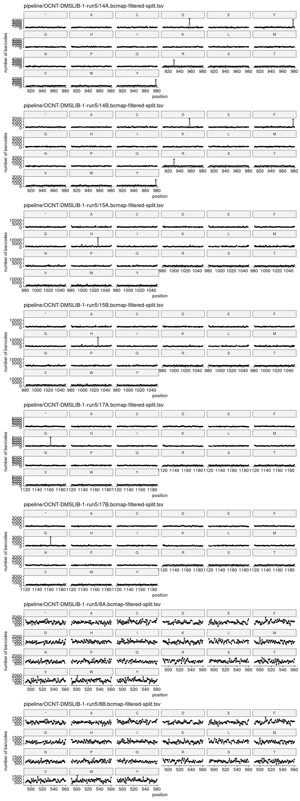
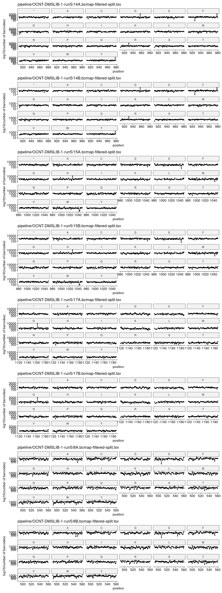

```R
# Parameters
bcmap = "pipeline/OCNT-DMSLIB-1-run5/"

```

## DMS Barcode Mapping Report

1. [Sequencing Quality Metrics](#part1)
2. [Read Sampling Distributions](#part2)
3. [Library Complexity and Coverage](#part3)
4. [RY Barcoding](#part4)

### Sequencing Quality Metrics <a name="part1"></a>

#### Sequencing Depth 


    

    


    
    
    |sample   | read count|
    |:--------|----------:|
    |14A_1_R1 |   49288886|
    |14A_2_R1 |   53592103|
    |14B_1_R1 |   58012867|
    |14B_2_R1 |   50836529|
    |15A_1_R1 |   49419595|
    |15A_2_R1 |   53748627|
    |15B_1_R1 |   53277404|
    |15B_2_R1 |   49296786|
    |17A_1_R1 |   45698849|
    |17A_2_R1 |   43532502|
    |17B_1_R1 |   44598492|
    |17B_2_R1 |   43649362|
    |8A_1_R1  |   50457687|
    |8A_2_R1  |   56281747|
    |8B_1_R1  |   48748640|
    |8B_2_R1  |   42779728|


#### R1/R2 Joining


    

    


#### Merged Fragment Lengths


    

    


#### Unique Alignment Rate <a name="part2c"></a>


    

    


#### Edit Distance Distributions


    

    


#### Edit Distance Proportion Distributions


    

    


#### Reproduced Associations Per Barcode Sequence


    

    


#### Filtered Barcode Counts Per Replicate Group


    
    
    |sample             |n       |
    |:------------------|:-------|
    |14A.bcmap-filtered |654385  |
    |14B.bcmap-filtered |420238  |
    |15A.bcmap-filtered |3075044 |
    |15B.bcmap-filtered |2948586 |
    |17A.bcmap-filtered |1619356 |
    |17B.bcmap-filtered |534570  |
    |8A.bcmap-filtered  |1876826 |
    |8B.bcmap-filtered  |1519632 |


### Read Sampling Distributions <a name="part3"></a>

#### Reads Per Barcode Without Binning


    

    


#### Reads Per Barcode With Binning


    

    


#### Barcode Purity Distributions


    

    


#### Barcode Counts Per Final Joined Map


    
    
    |sample             |final barcode count |
    |:------------------|:-------------------|
    |14.bcmap-final.tsv |952940              |
    |15.bcmap-final.tsv |2882678             |
    |17.bcmap-final.tsv |1694256             |
    |8.bcmap-final.tsv  |2730990             |


### Library Complexity and Coverage <a name="part4"></a>

#### Unique Barcodes Per Residue


    

    


#### Unique Barcodes Per Residue, log10


    

    


### RY Barcoding <a name="part5"></a>


    

    

