```R
# Parameters
bcmap = "pipeline/OCNT-DMSLIB-1-run6/"

```

## DMS Barcode Mapping Report

1. [Sequencing Quality Metrics](#part1)
2. [Read Sampling Distributions](#part2)
3. [Library Complexity and Coverage](#part3)
4. [RY Barcoding](#part4)

### Sequencing Quality Metrics <a name="part1"></a>

#### Sequencing Depth 


    
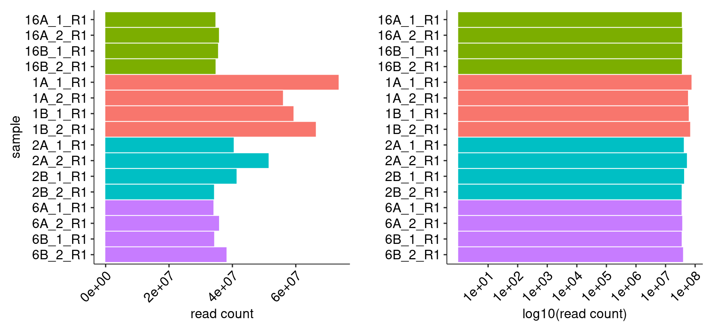
    


    
    
    |sample   | read count|
    |:--------|----------:|
    |16A_1_R1 |   34539122|
    |16A_2_R1 |   35651031|
    |16B_1_R1 |   35366280|
    |16B_2_R1 |   34580469|
    |1A_1_R1  |   73413058|
    |1A_2_R1  |   55848295|
    |1B_1_R1  |   59172208|
    |1B_2_R1  |   66223656|
    |2A_1_R1  |   40302533|
    |2A_2_R1  |   51318015|
    |2B_1_R1  |   41210945|
    |2B_2_R1  |   34096270|
    |6A_1_R1  |   33912217|
    |6A_2_R1  |   35681570|
    |6B_1_R1  |   34142848|
    |6B_2_R1  |   38037893|


#### R1/R2 Joining


    
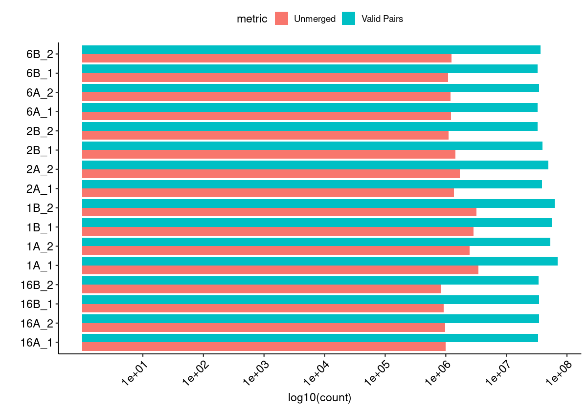
    


#### Merged Fragment Lengths


    
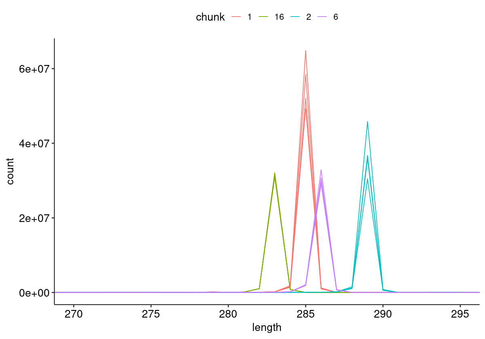
    


#### Unique Alignment Rate <a name="part2c"></a>


    
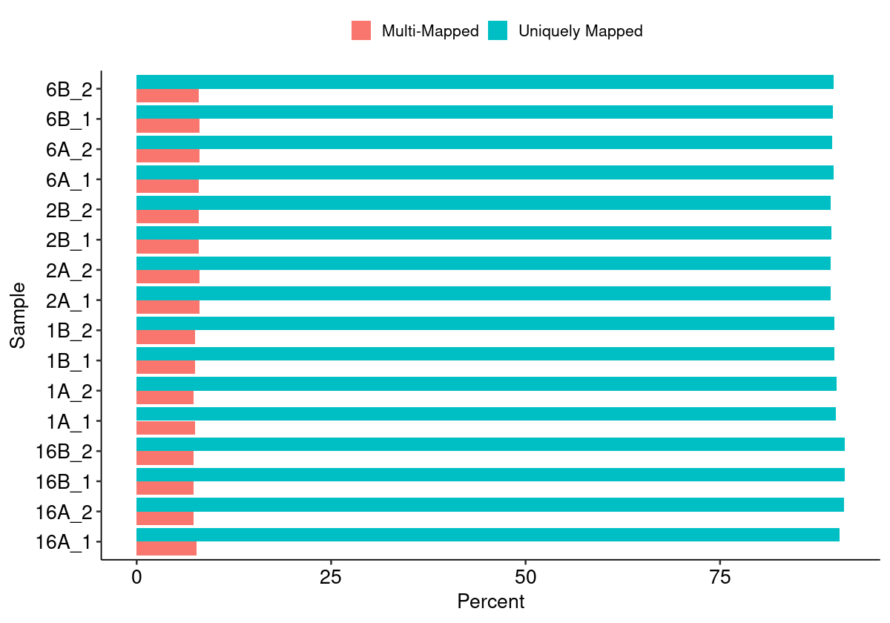
    


#### Edit Distance Distributions


    
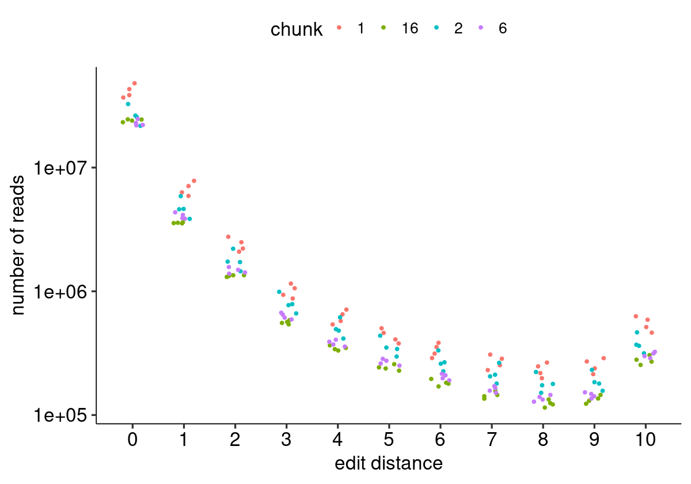
    


#### Edit Distance Proportion Distributions


    
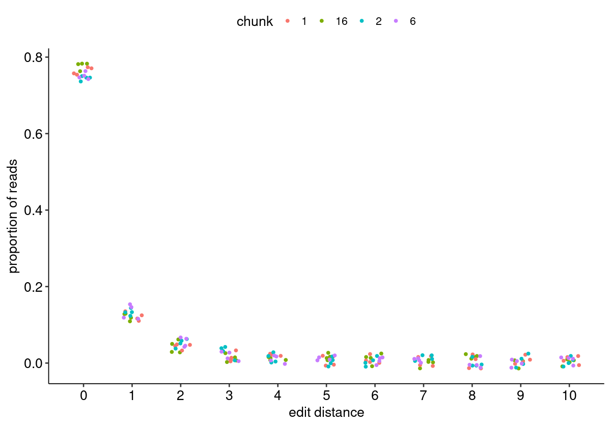
    


#### Reproduced Associations Per Barcode Sequence


    
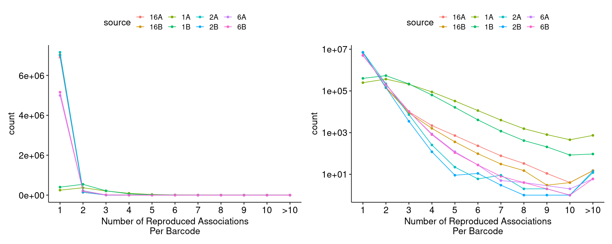
    


#### Filtered Barcode Counts Per Replicate Group


    
    
    |sample             |n       |
    |:------------------|:-------|
    |16A.bcmap-filtered |6188763 |
    |16B.bcmap-filtered |6299612 |
    |1A.bcmap-filtered  |191130  |
    |1B.bcmap-filtered  |318182  |
    |2A.bcmap-filtered  |6425549 |
    |2B.bcmap-filtered  |6293259 |
    |6A.bcmap-filtered  |4356020 |
    |6B.bcmap-filtered  |4503808 |


### Read Sampling Distributions <a name="part3"></a>

#### Reads Per Barcode Without Binning


    
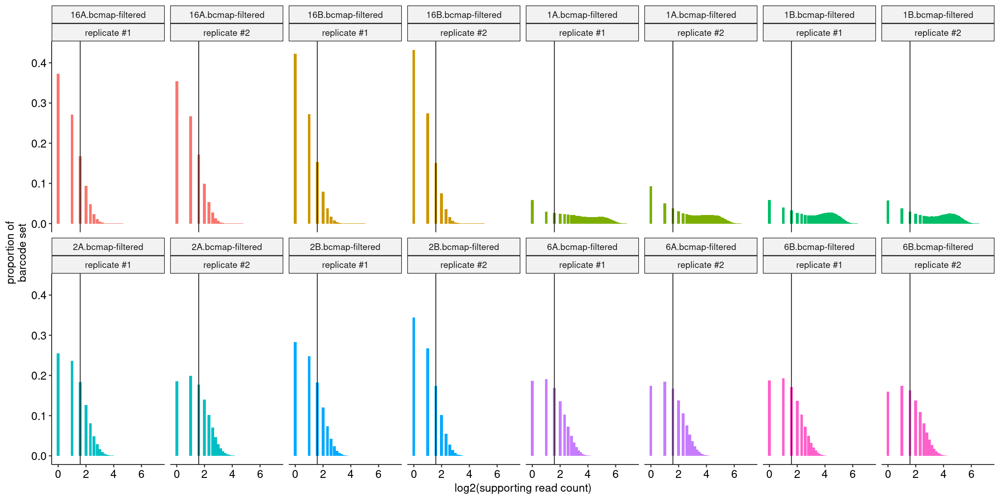
    


#### Reads Per Barcode With Binning


    
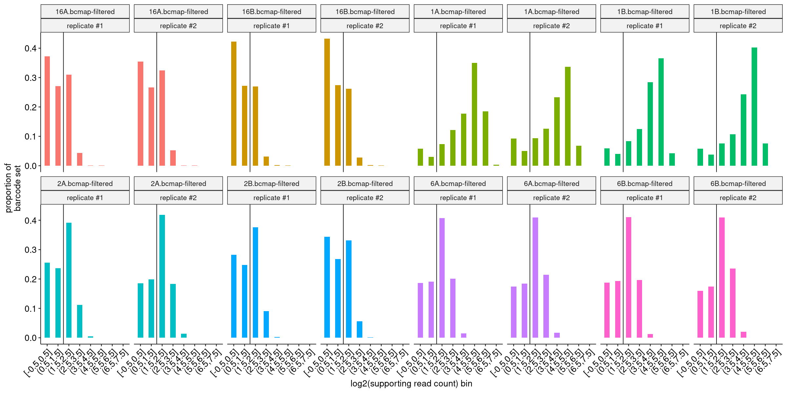
    


#### Barcode Purity Distributions


    
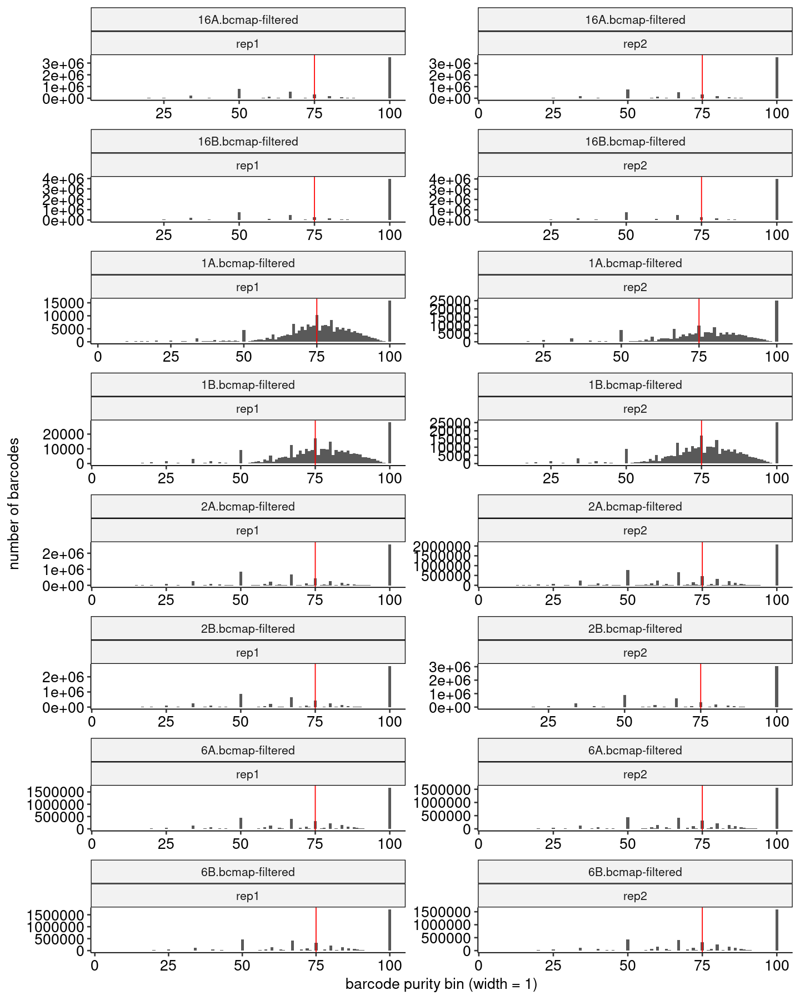
    


#### Barcode Counts Per Final Joined Map


    
    
    |sample             |final barcode count |
    |:------------------|:-------------------|
    |1.bcmap-final.tsv  |171107              |
    |16.bcmap-final.tsv |1100624             |
    |2.bcmap-final.tsv  |1618321             |
    |6.bcmap-final.tsv  |1821745             |


### Library Complexity and Coverage <a name="part4"></a>

#### Unique Barcodes Per Residue


    
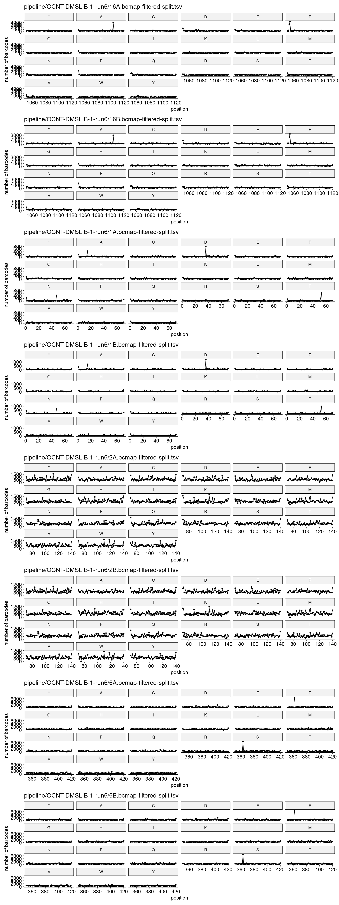
    


#### Unique Barcodes Per Residue, log10


    
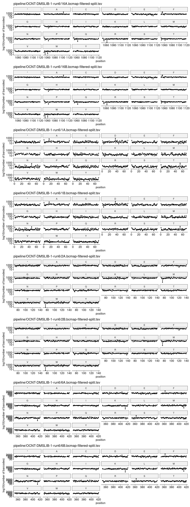
    


### RY Barcoding <a name="part5"></a>


    

    

