```R
# Parameters
bcmap = "pipeline/OCNT-DMSLIB-1-run7/"

```

## DMS Barcode Mapping Report

1. [Sequencing Quality Metrics](#part1)
2. [Read Sampling Distributions](#part2)
3. [Library Complexity and Coverage](#part3)
4. [RY Barcoding](#part4)

### Sequencing Quality Metrics <a name="part1"></a>

#### Sequencing Depth 


    
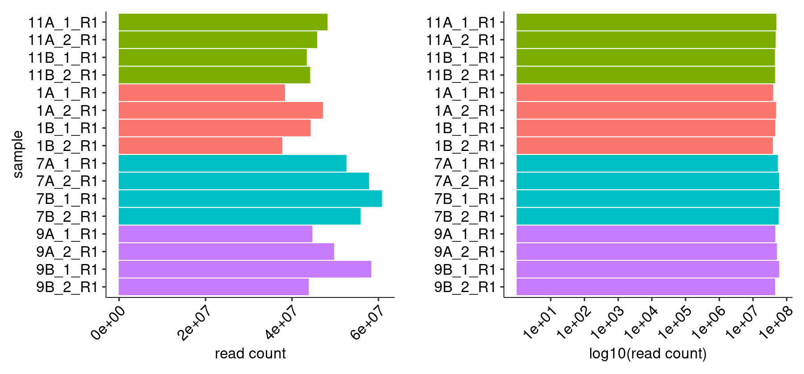
    


    
    
    |sample   | read count|
    |:--------|----------:|
    |11A_1_R1 |   48134213|
    |11A_2_R1 |   45731431|
    |11B_1_R1 |   43318334|
    |11B_2_R1 |   44113574|
    |1A_1_R1  |   38280507|
    |1A_2_R1  |   47048684|
    |1B_1_R1  |   44197313|
    |1B_2_R1  |   37674421|
    |7A_1_R1  |   52512976|
    |7A_2_R1  |   57711920|
    |7B_1_R1  |   60698997|
    |7B_2_R1  |   55788016|
    |9A_1_R1  |   44617622|
    |9A_2_R1  |   49652582|
    |9B_1_R1  |   58241577|
    |9B_2_R1  |   43754415|


#### R1/R2 Joining


    
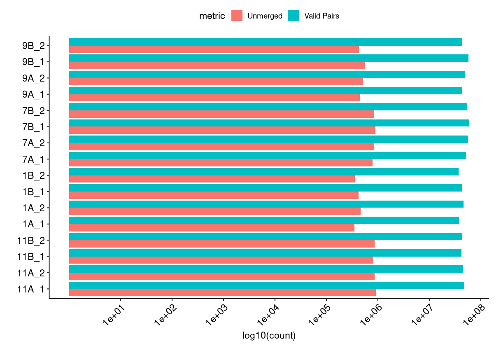
    


#### Merged Fragment Lengths


    
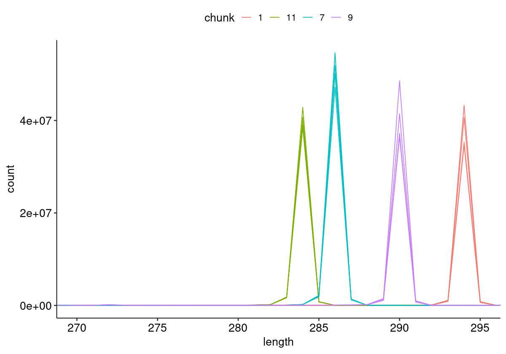
    


#### Unique Alignment Rate <a name="part2c"></a>


    
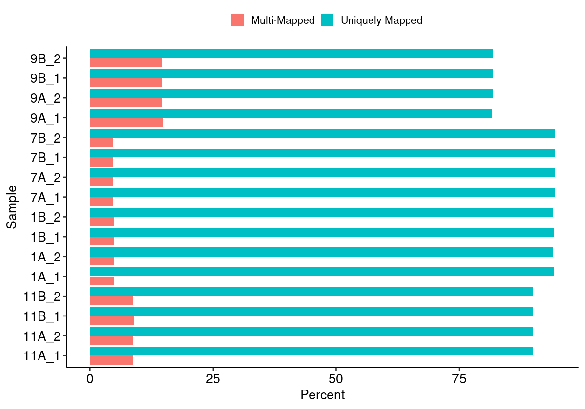
    


#### Edit Distance Distributions


    
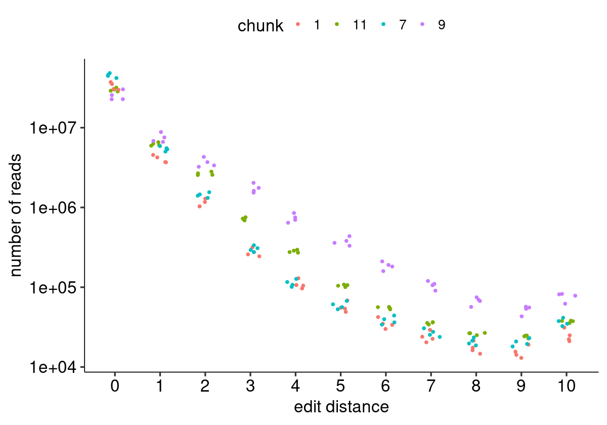
    


#### Edit Distance Proportion Distributions


    
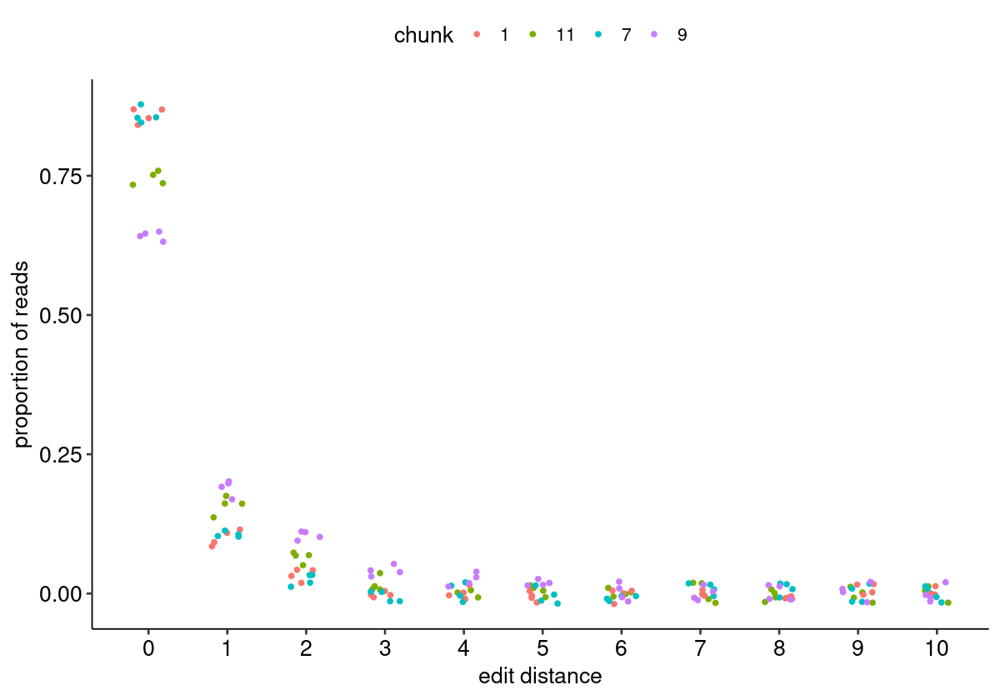
    


#### Reproduced Associations Per Barcode Sequence


    

    


#### Filtered Barcode Counts Per Replicate Group


    
    
    |sample             |n       |
    |:------------------|:-------|
    |11A.bcmap-filtered |16127   |
    |11B.bcmap-filtered |17857   |
    |1A.bcmap-filtered  |498486  |
    |1B.bcmap-filtered  |762649  |
    |7A.bcmap-filtered  |7491219 |
    |7B.bcmap-filtered  |6287307 |
    |9A.bcmap-filtered  |2510753 |
    |9B.bcmap-filtered  |2601577 |


### Read Sampling Distributions <a name="part3"></a>

#### Reads Per Barcode Without Binning


    
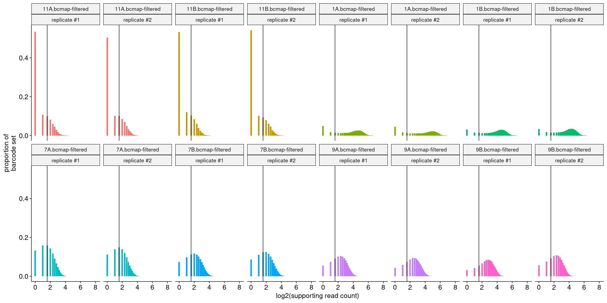
    


#### Reads Per Barcode With Binning


    
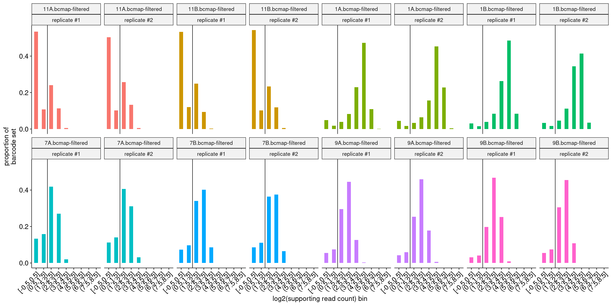
    


#### Barcode Purity Distributions


    
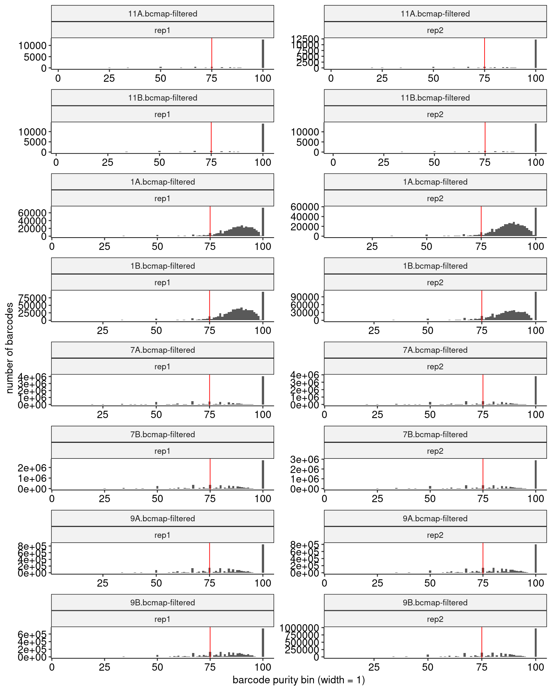
    


#### Barcode Counts Per Final Joined Map


    
    
    |sample             |final barcode count |
    |:------------------|:-------------------|
    |1.bcmap-final.tsv  |1049573             |
    |11.bcmap-final.tsv |839                 |
    |7.bcmap-final.tsv  |6311758             |
    |9.bcmap-final.tsv  |2862159             |


### Library Complexity and Coverage <a name="part4"></a>

#### Unique Barcodes Per Residue


    
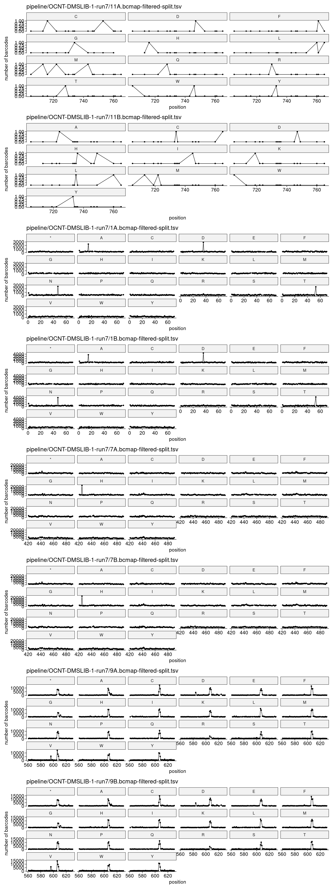
    


#### Unique Barcodes Per Residue, log10


    
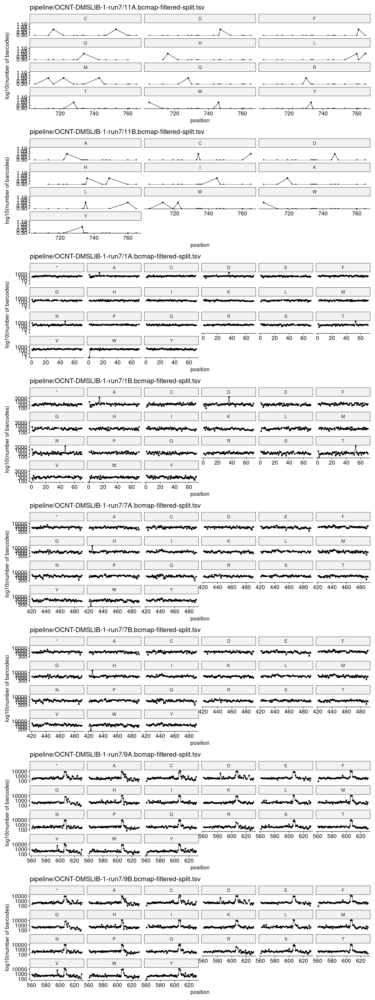
    


### RY Barcoding <a name="part5"></a>


    
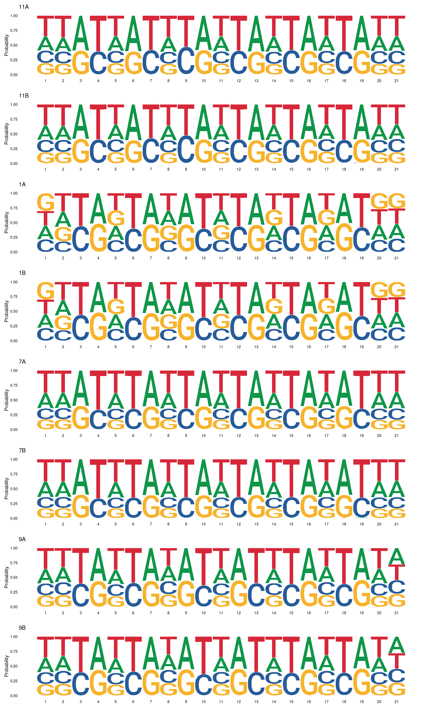
    

