```R
# Parameters
bcmap = "pipeline/OCNT-DMSLIB-1-run8/"

```

## DMS Barcode Mapping Report

1. [Sequencing Quality Metrics](#part1)
2. [Read Sampling Distributions](#part2)
3. [Library Complexity and Coverage](#part3)
4. [RY Barcoding](#part4)

### Sequencing Quality Metrics <a name="part1"></a>

#### Sequencing Depth 


    
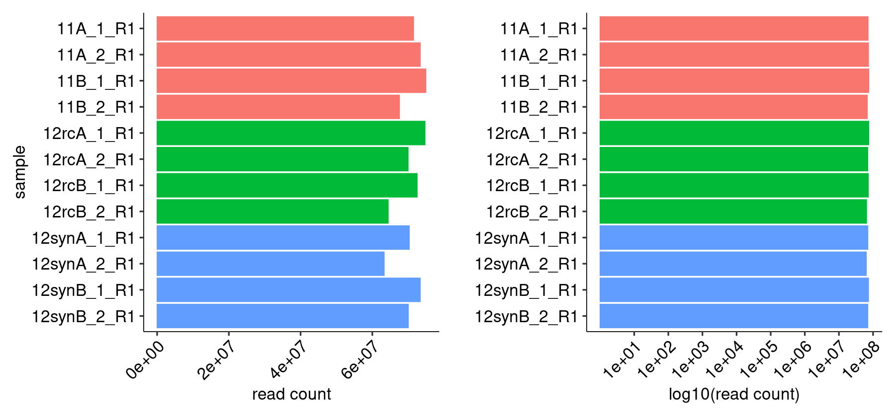
    


    
    
    |sample      | read count|
    |:-----------|----------:|
    |11A_1_R1    |   71501289|
    |11A_2_R1    |   73363205|
    |11B_1_R1    |   74915150|
    |11B_2_R1    |   67575696|
    |12rcA_1_R1  |   74687590|
    |12rcA_2_R1  |   69973607|
    |12rcB_1_R1  |   72490383|
    |12rcB_2_R1  |   64422773|
    |12synA_1_R1 |   70299524|
    |12synA_2_R1 |   63302622|
    |12synB_1_R1 |   73358171|
    |12synB_2_R1 |   70029180|


#### R1/R2 Joining


    
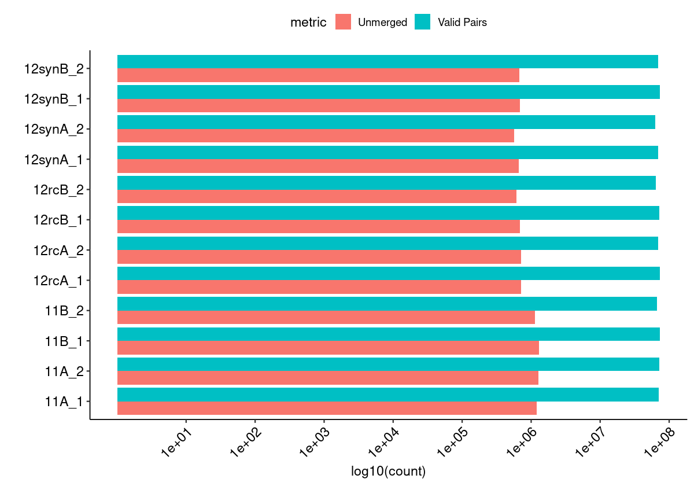
    


#### Merged Fragment Lengths


    
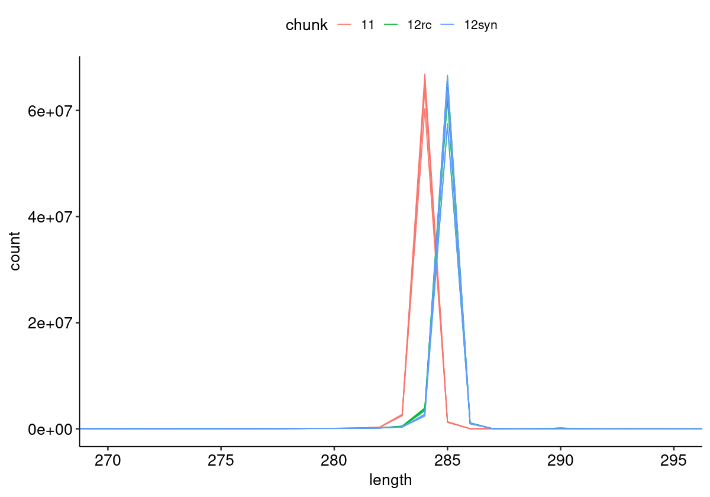
    


#### Unique Alignment Rate <a name="part2c"></a>


    
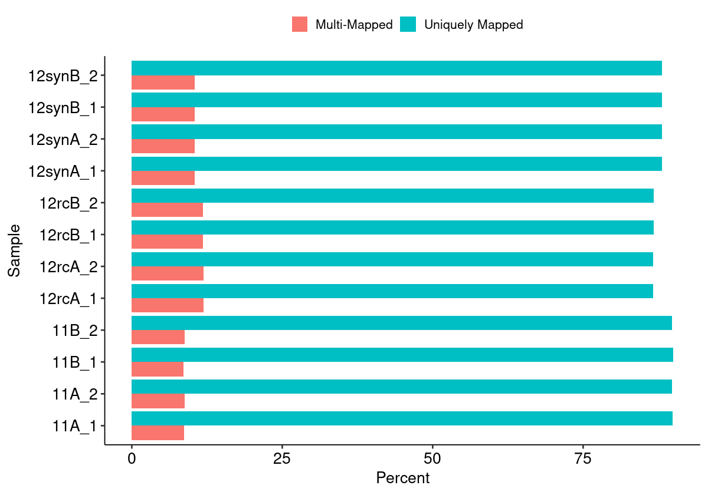
    


#### Edit Distance Distributions


    
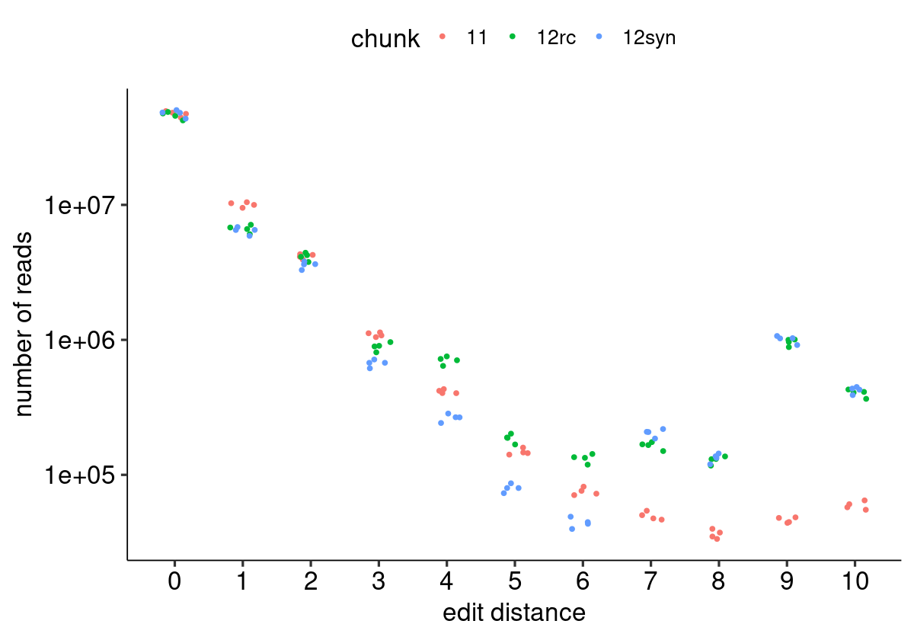
    


#### Edit Distance Proportion Distributions


    
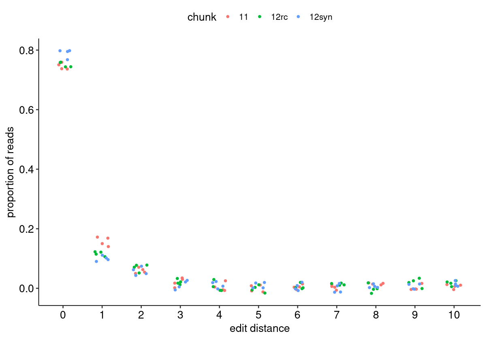
    


#### Reproduced Associations Per Barcode Sequence


    
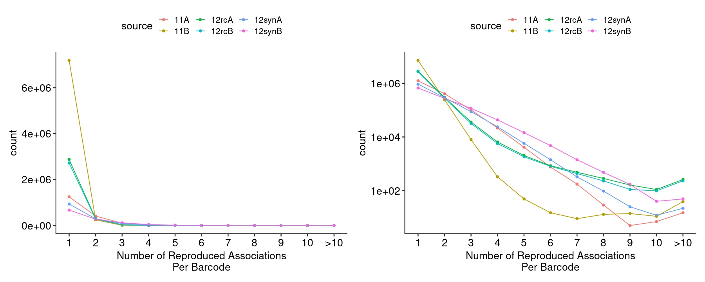
    


#### Filtered Barcode Counts Per Replicate Group


    
    
    |sample                |n       |
    |:---------------------|:-------|
    |11A.bcmap-filtered    |948712  |
    |11B.bcmap-filtered    |5490590 |
    |12rcA.bcmap-filtered  |2224078 |
    |12rcB.bcmap-filtered  |2105273 |
    |12synA.bcmap-filtered |749770  |
    |12synB.bcmap-filtered |540799  |


### Read Sampling Distributions <a name="part3"></a>

#### Reads Per Barcode Without Binning


    
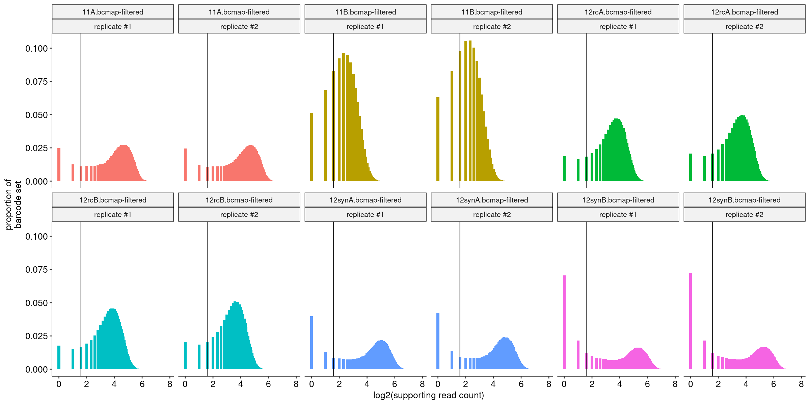
    


#### Reads Per Barcode With Binning


    
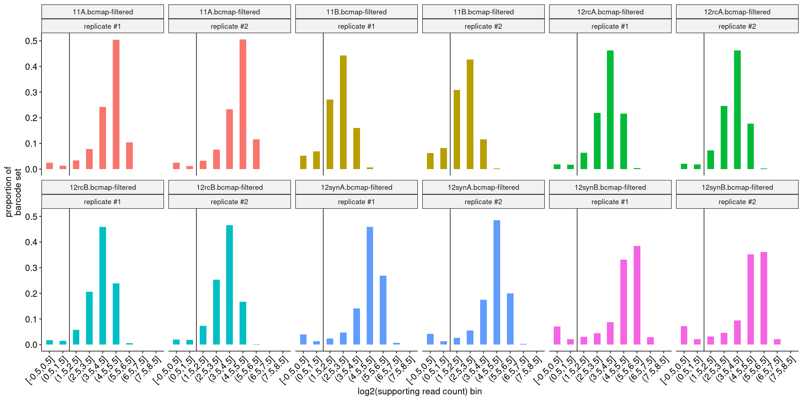
    


#### Barcode Purity Distributions


    
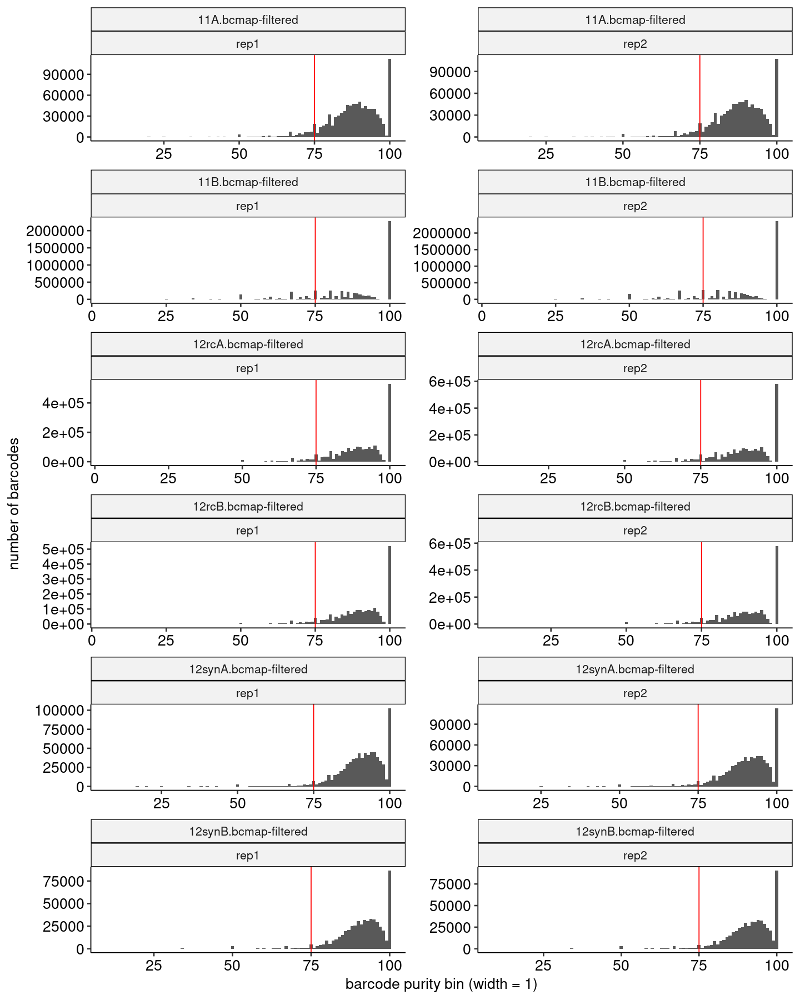
    


#### Barcode Counts Per Final Joined Map


    
    
    |sample                |final barcode count |
    |:---------------------|:-------------------|
    |11.bcmap-final.tsv    |4004013             |
    |12rc.bcmap-final.tsv  |3523703             |
    |12syn.bcmap-final.tsv |1129741             |


### Library Complexity and Coverage <a name="part4"></a>

#### Unique Barcodes Per Residue


    
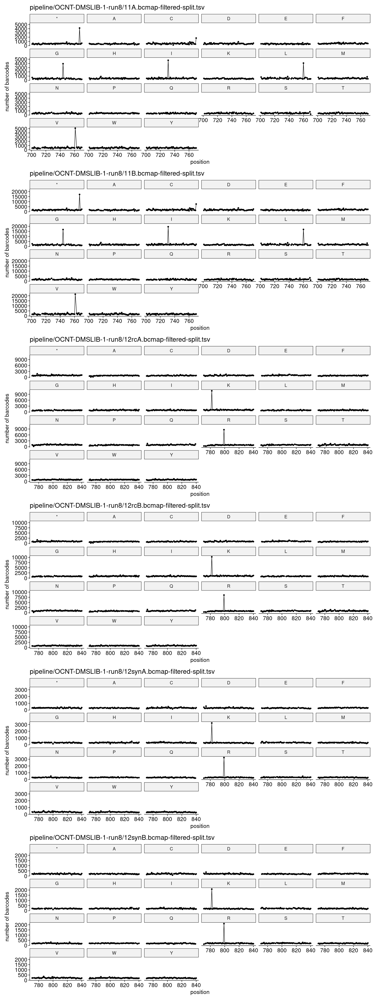
    


#### Unique Barcodes Per Residue, log10


    
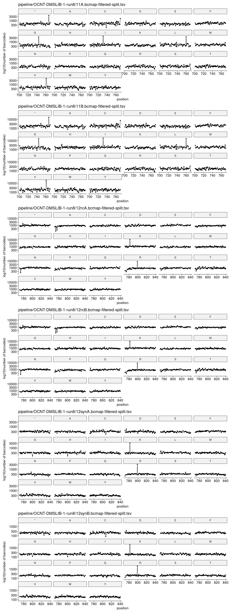
    


### RY Barcoding <a name="part5"></a>


    
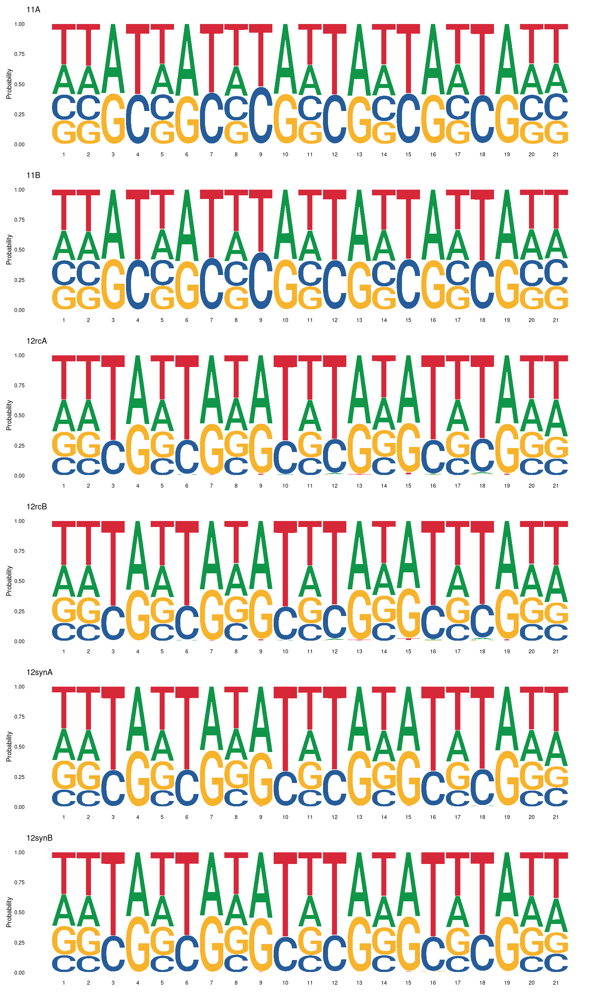
    

