```R
# Parameters
bcmap = "pipeline/OCNT-DMSLIB-1-run9/"

```

## DMS Barcode Mapping Report

1. [Sequencing Quality Metrics](#part1)
2. [Read Sampling Distributions](#part2)
3. [Library Complexity and Coverage](#part3)
4. [RY Barcoding](#part4)

### Sequencing Quality Metrics <a name="part1"></a>

#### Sequencing Depth 


    
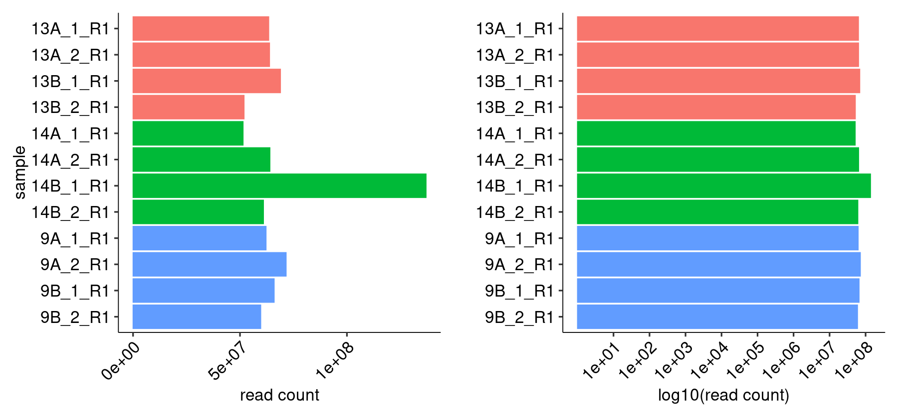
    


    
    
    |sample   | read count|
    |:--------|----------:|
    |13A_1_R1 |   63439605|
    |13A_2_R1 |   63821064|
    |13B_1_R1 |   68930459|
    |13B_2_R1 |   51905801|
    |14A_1_R1 |   51442929|
    |14A_2_R1 |   63991115|
    |14B_1_R1 |  136994097|
    |14B_2_R1 |   60968591|
    |9A_1_R1  |   62190693|
    |9A_2_R1  |   71577235|
    |9B_1_R1  |   65980097|
    |9B_2_R1  |   59699960|


#### R1/R2 Joining


    
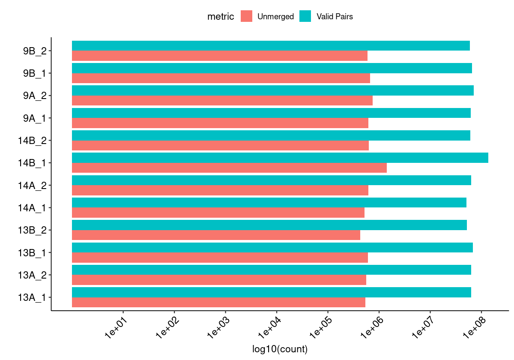
    


#### Merged Fragment Lengths


    
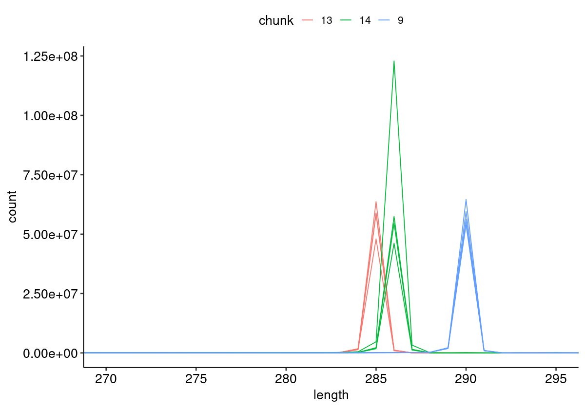
    


#### Unique Alignment Rate <a name="part2c"></a>


    
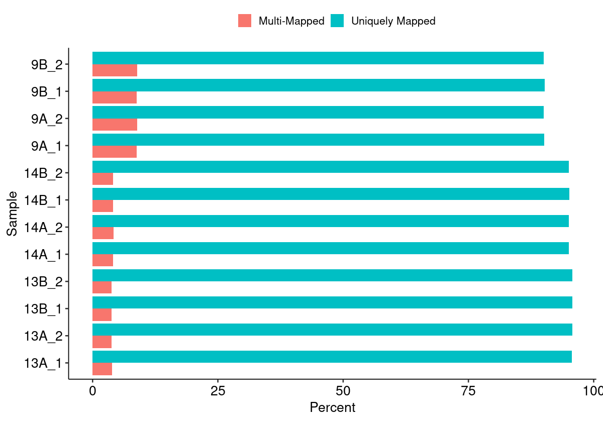
    


#### Edit Distance Distributions


    
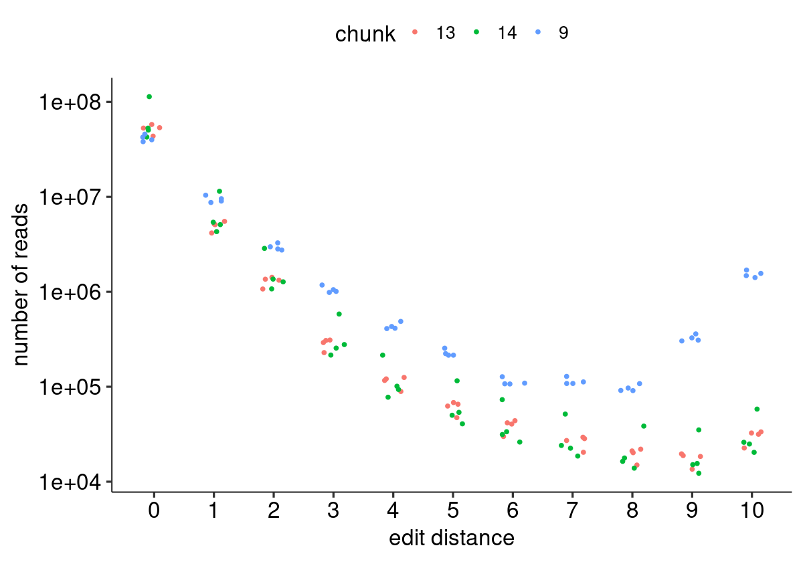
    


#### Edit Distance Proportion Distributions


    
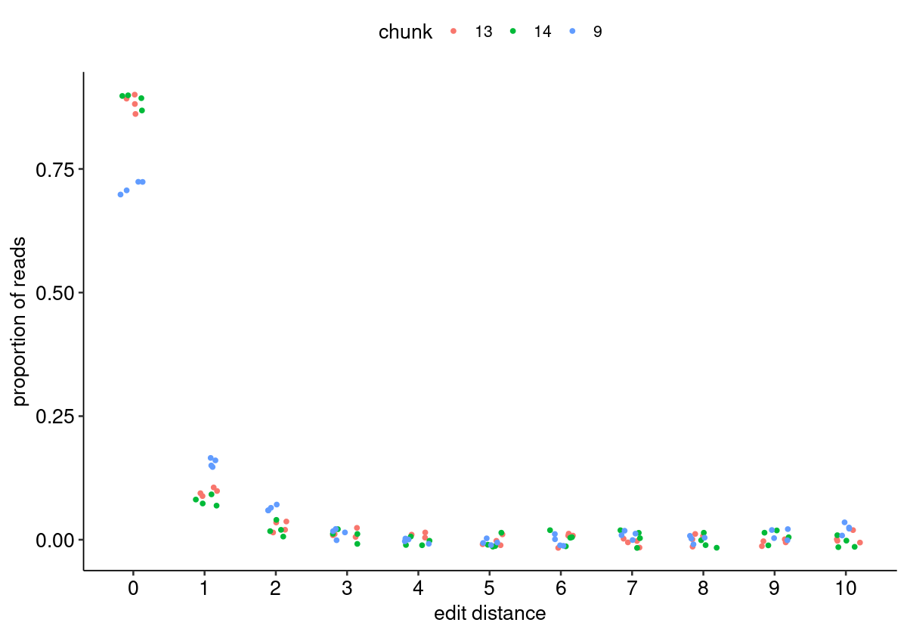
    


#### Reproduced Associations Per Barcode Sequence


    
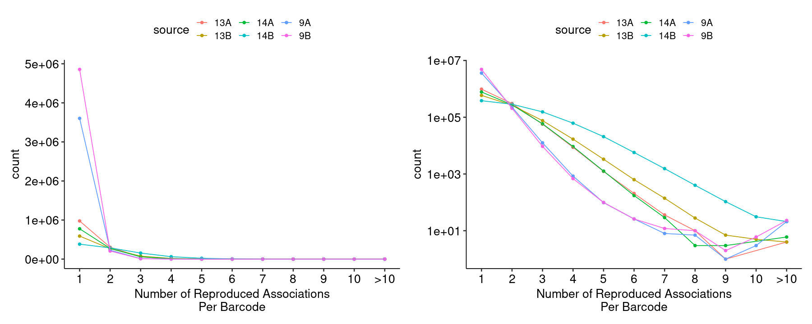
    


#### Filtered Barcode Counts Per Replicate Group


    
    
    |sample             |n       |
    |:------------------|:-------|
    |13A.bcmap-filtered |883724  |
    |13B.bcmap-filtered |531838  |
    |14A.bcmap-filtered |692111  |
    |14B.bcmap-filtered |335839  |
    |9A.bcmap-filtered  |2640418 |
    |9B.bcmap-filtered  |3558437 |


### Read Sampling Distributions <a name="part3"></a>

#### Reads Per Barcode Without Binning


    
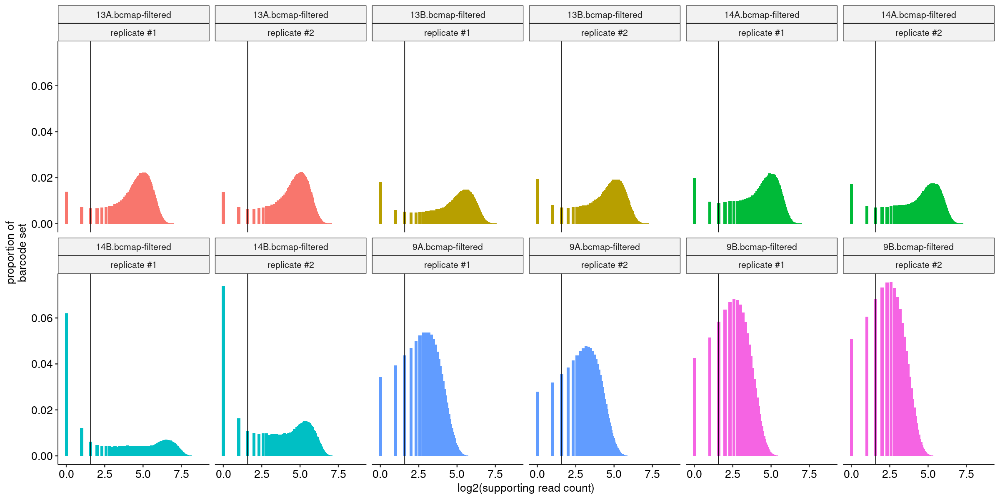
    


#### Reads Per Barcode With Binning


    
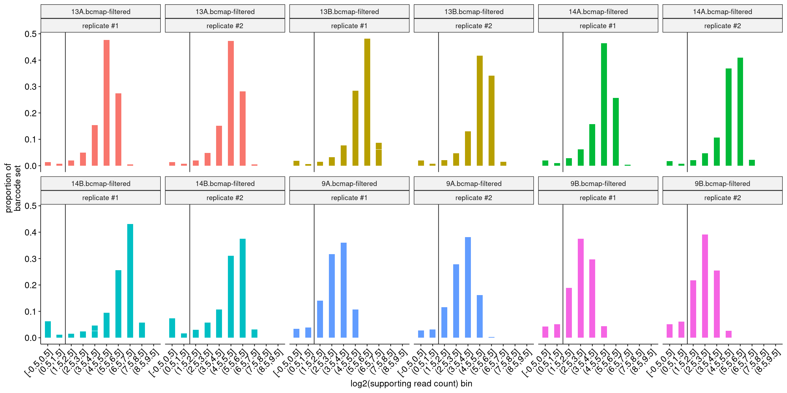
    


#### Barcode Purity Distributions


    
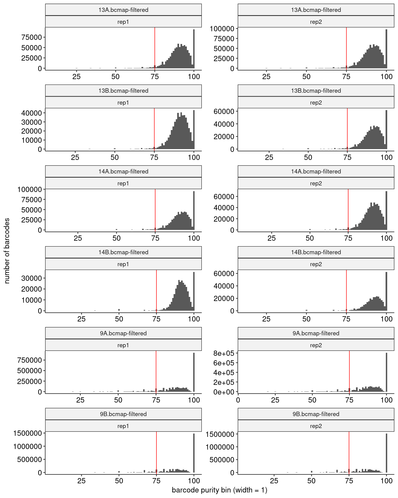
    


#### Barcode Counts Per Final Joined Map


    
    
    |sample             |final barcode count |
    |:------------------|:-------------------|
    |13.bcmap-final.tsv |1328749             |
    |14.bcmap-final.tsv |943190              |
    |9.bcmap-final.tsv  |4529421             |


### Library Complexity and Coverage <a name="part4"></a>

#### Unique Barcodes Per Residue


    
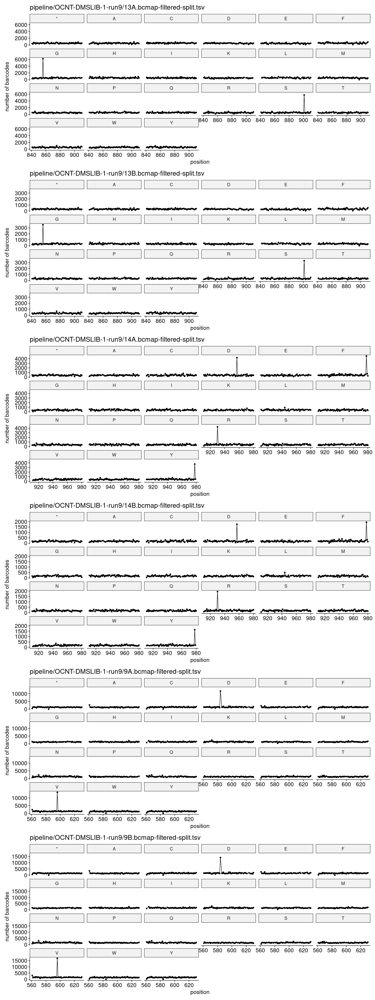
    


#### Unique Barcodes Per Residue, log10


    
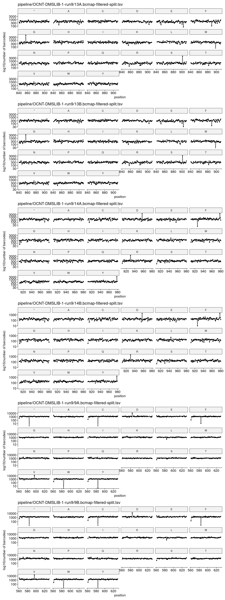
    


### RY Barcoding <a name="part5"></a>


    
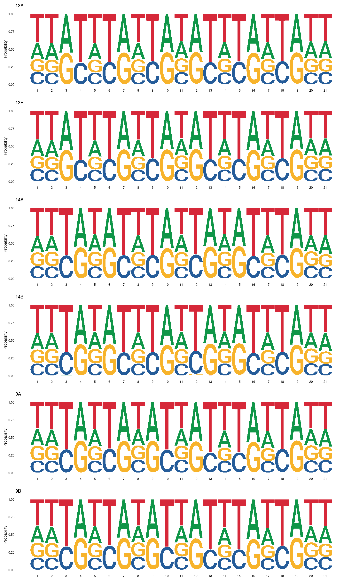
    

