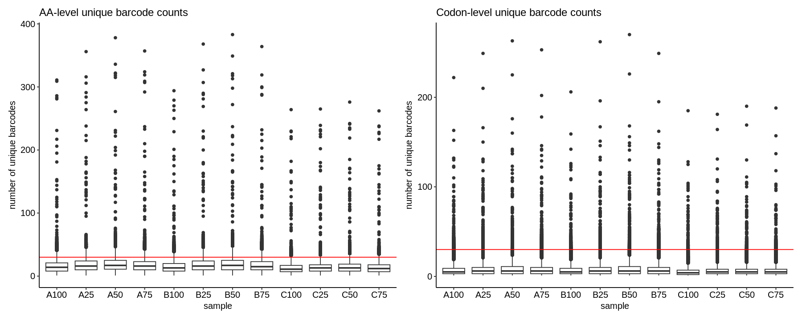
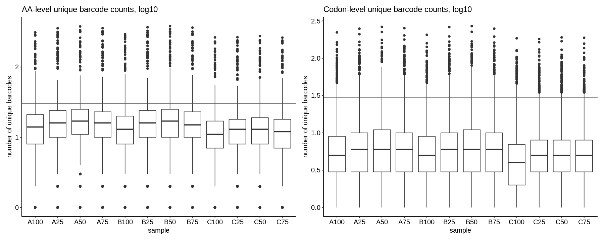
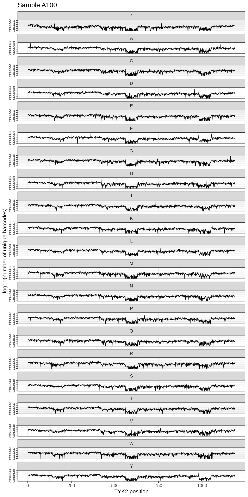
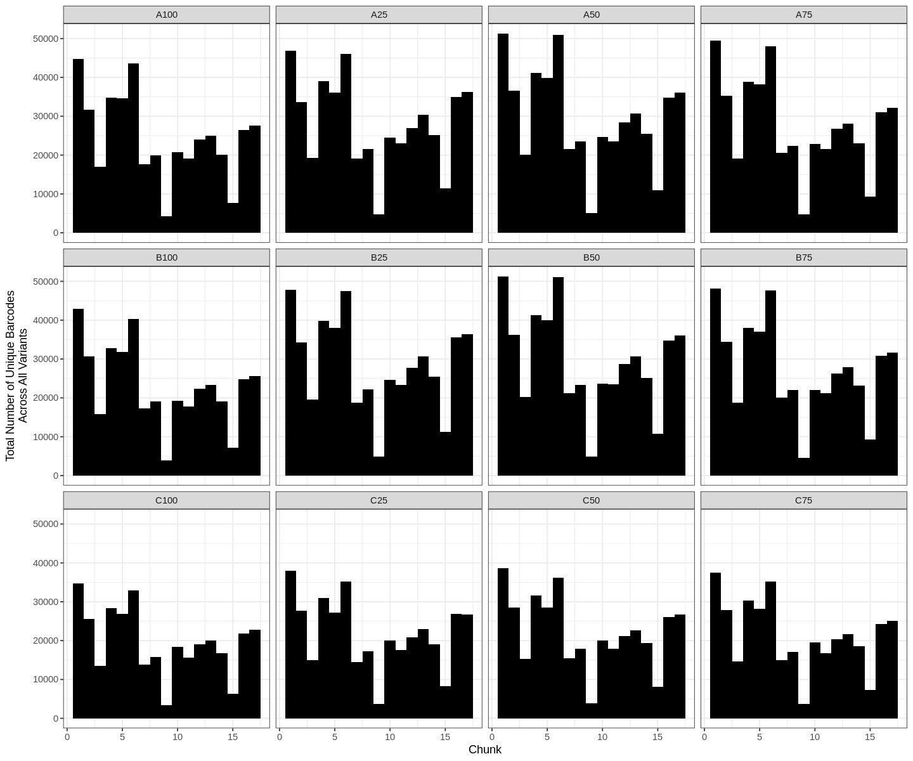
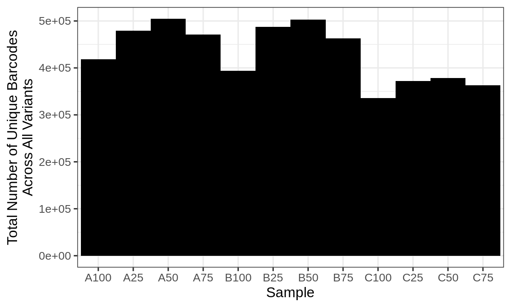
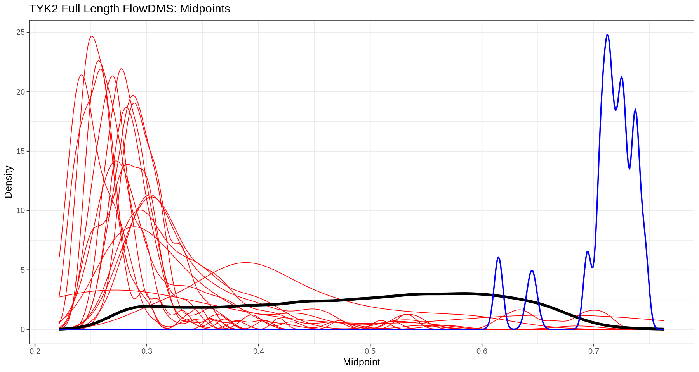
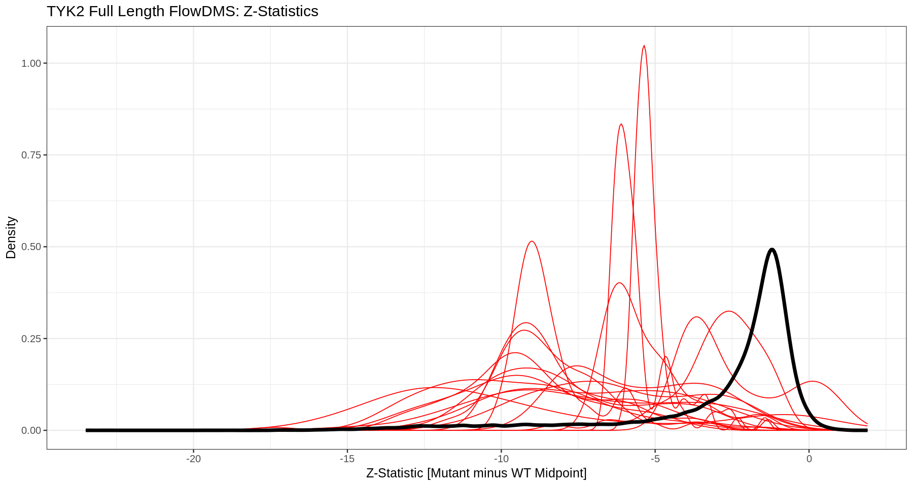
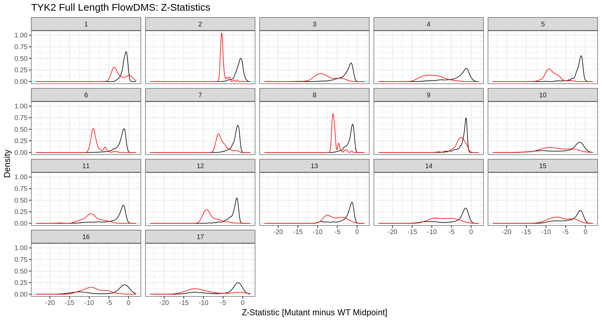
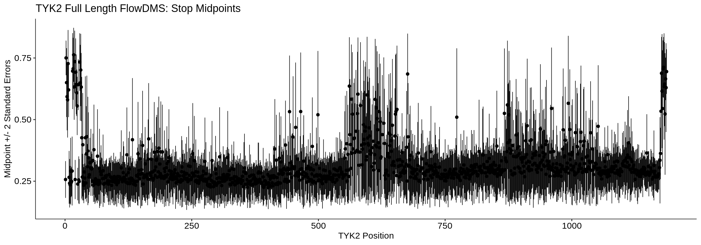
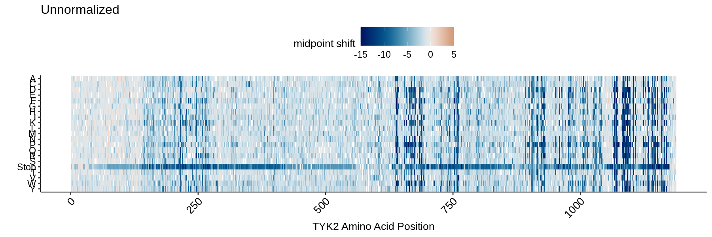

## FlowDMS Assay Report

1. [Barcode Sequencing Distributions](#part1)
2. [Variant Effect Profiles and Midpoints](#part2)
3. [Visualizations](#part3)

### Barcode Sequencing Distributions 

    

    

    

    

To get a sense of positional distribution, we can show the same data as lineplots across the length of TYK2. Below is an example using the first sample; the remaining plots can be found [here](./coverage-plots):

    

    

    

    

    

    

### Variant Effect Profiles and Midpoints 

    
    
    |chunk |  WT score| WT score standard error|
    |:-----|---------:|-----------------------:|
    |1     | 0.6447912|               0.0961789|
    |10    | 0.7349122|               0.0101506|
    |11    | 0.7279167|               0.0155198|
    |12rc  | 0.7385077|               0.0298568|
    |13    | 0.7241531|               0.0357402|
    |14    | 0.7381060|               0.0163644|
    |15    | 0.7146434|               0.0198638|
    |16    | 0.7047822|               0.0103863|
    |17    | 0.7075321|               0.0131014|
    |2     | 0.6149431|               0.0563844|
    |3     | 0.7457294|               0.0265146|
    |4     | 0.7262153|               0.0206718|
    |5     | 0.6944908|               0.0303435|
    |6     | 0.7118432|               0.0399839|
    |7     | 0.7159258|               0.0590188|
    |8     | 0.7107589|               0.0623667|
    |9     | 0.7207521|               0.0363604|

    

    

    

    

    

    

### Visualizations 

    

    

    

    

