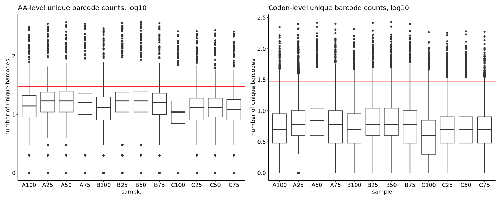
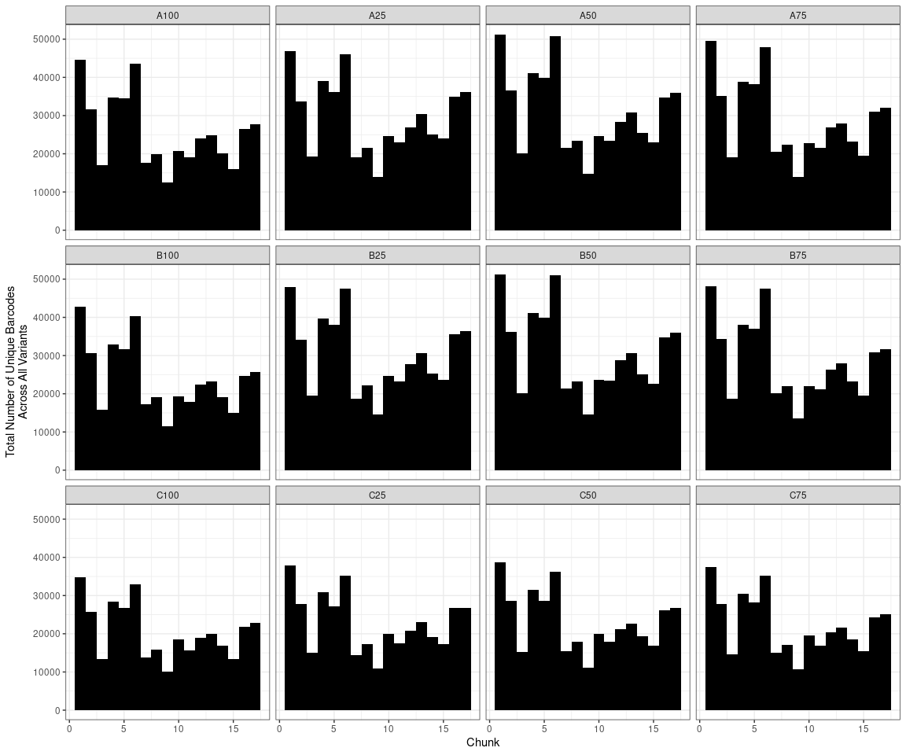
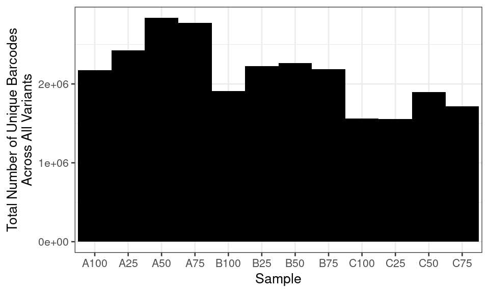

FlowDMS Assay Report
================

## FlowDMS Assay Report

1.  [Barcode Sequencing Distributions](#part1)
2.  [Variant Effect Profiles and Midpoints](#part2)
3.  [Visualizations](#part3)

### Barcode Sequencing Distributions 

<!-- --><!-- -->

To get a sense of positional distribution, we can show the same data as
lineplots across the length of TYK2. Below is an example using the first
sample; the remaining plots can be found [here](./coverage-plots):

<!-- -->

<!-- -->

<!-- -->

### Variant Effect Profiles and Midpoints 

| chunk |  WT score | WT score standard error |
|:------|----------:|------------------------:|
| 1     | 0.6503299 |               0.0038261 |
| 10    | 0.6519057 |               0.0046534 |
| 11    | 0.6588561 |               0.0044116 |
| 12rc  | 0.6595908 |               0.0034370 |
| 13    | 0.6464868 |               0.0058625 |
| 14    | 0.6510096 |               0.0054923 |
| 15    | 0.6572717 |               0.0078855 |
| 16    | 0.6484706 |               0.0055901 |
| 17    | 0.6484550 |               0.0052278 |
| 2     | 0.6617793 |               0.0039350 |
| 3     | 0.6471453 |               0.0048378 |
| 4     | 0.6535781 |               0.0042275 |
| 5     | 0.6498528 |               0.0035014 |
| 6     | 0.6448730 |               0.0032635 |
| 7     | 0.6467662 |               0.0041270 |
| 8     | 0.6619626 |               0.0050299 |
| 9     | 0.6675519 |               0.0063069 |

<!-- -->

<!-- -->

<!-- -->

<!-- -->

<!-- -->
