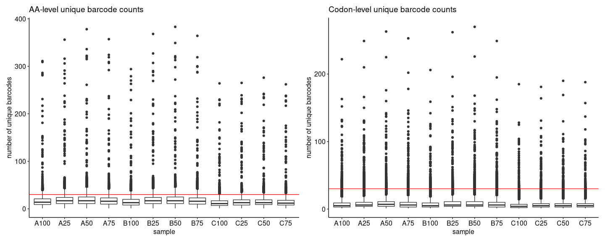
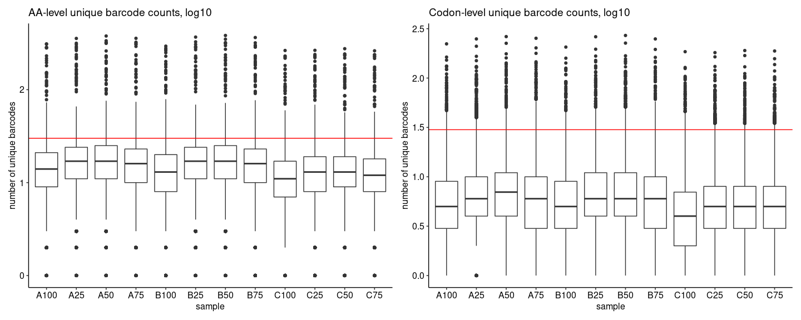
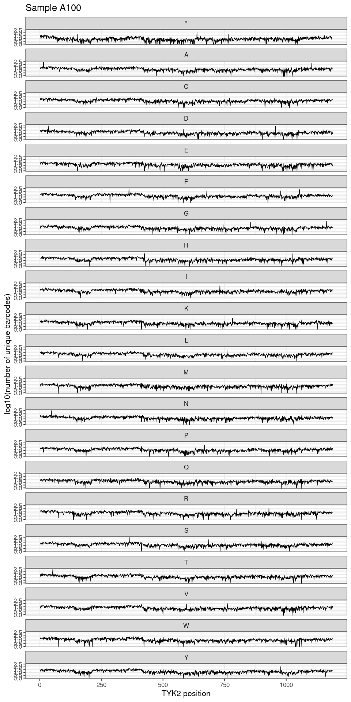

FlowDMS Assay Report
================

## FlowDMS Assay Report

1.  [Barcode Sequencing Distributions](#part1)
2.  [Variant Effect Profiles and Midpoints](#part2)
3.  [Visualizations](#part3)

``` r
library(magrittr)
library(data.table)
library(ggrepel)
library(ggpubr)
library(vroom)
library(scales)
library(scico)
library(ggridges)
library(knitr)
library(ggbeeswarm)
library(fs)
library(patchwork)
library(ggnewscale)
library(furrr)
library(tidyverse)

source("../src/dms-analysis-utils.R")
```

### Barcode Sequencing Distributions <a name="part1"></a>

``` r
#mapped_counts <- read_tsv("pipeline/tyk2-vamp-final-vampseq.mapped-counts.tsv") %>%
#    separate(oligo, into=c("dms_lib", "chunk", "wt_aa", "pos", "mut_aa", "wt_codon", "mut_codon"), sep="_") %>%
#    mutate(mut_aa = if_else(mut_aa %in% c("*", "X"), "*", mut_aa),
#           condition = as.factor(paste0(condition, condition_conc)),
#           mut_aa = if_else(wt_aa == mut_aa | is.na(mut_aa), "WT", mut_aa),
#           mut_aa = relevel(as.factor(mut_aa), ref = "WT"))
#
#mapped_counts %>% write_tsv("pipeline/tyk2-vamp-final-vampseq-split.mapped-counts.tsv")

mapped_counts <- read_tsv("../pipeline/tyk2-vamp-final-vampseq-split.mapped-counts.tsv")
```

    ## Rows: 25527789 Columns: 14

    ## ── Column specification ───────────────────────────────────────────────────────────────────────────────────────────────────────────────────────────────────────────────────────────
    ## Delimiter: "\t"
    ## chr (9): sample, barcode, dms_lib, chunk, wt_aa, mut_aa, wt_codon, mut_codon...
    ## dbl (3): count, pos, condition_conc
    ## lgl (2): dox, clone

    ## 
    ## ℹ Use `spec()` to retrieve the full column specification for this data.
    ## ℹ Specify the column types or set `show_col_types = FALSE` to quiet this message.

``` r
bc_counts_aa <- mapped_counts %>%
    filter(mut_aa != "WT") %>%
    group_by(sample,wt_aa,mut_aa,pos) %>%
    count()

bc_counts_codon <- mapped_counts %>%
    filter(mut_aa != "WT") %>%
    group_by(sample,wt_codon,mut_codon,pos) %>%
    count()

res_count <- bc_counts_aa %>%
    ggplot() +
        geom_boxplot(aes(x = sample, y = n)) +
        theme_pubr() +
        geom_hline(yintercept = 30, color = "red") +
        ylab("number of unique barcodes") + ggtitle("AA-level unique barcode counts")

codon_count <- bc_counts_codon %>%
    ggplot() +
        geom_boxplot(aes(x = sample, y = n)) +
        theme_pubr() +
        geom_hline(yintercept = 30, color = "red")  +
        ylab("number of unique barcodes") + ggtitle("Codon-level unique barcode counts")

res_count_log <- bc_counts_aa %>%
    ggplot() +
        geom_boxplot(aes(x = sample, y = log10(n))) +
        theme_pubr() +
        geom_hline(yintercept = log10(30), color = "red") +
        ylab("number of unique barcodes") + ggtitle("AA-level unique barcode counts, log10")

codon_count_log <- bc_counts_codon %>%
    ggplot() +
        geom_boxplot(aes(x = sample, y = log10(n))) +
        theme_pubr() +
        geom_hline(yintercept = log10(30), color = "red")  +
        ylab("number of unique barcodes") + ggtitle("Codon-level unique barcode counts, log10")
```

``` r
res_count + codon_count
```

<!-- -->

``` r
res_count_log + codon_count_log 
```

<!-- -->

To get a sense of positional distribution, we can show the same data as
lineplots across the length of TYK2. Below is an example using the first
sample; the remaining plots can be found [here](./coverage-plots):

``` r
wt_tyk2 <- read_tsv("../data/tyk2/tyk2-wt-aa.tsv")
```

    ## Rows: 1189 Columns: 2

    ## ── Column specification ───────────────────────────────────────────────────────────────────────────────────────────────────────────────────────────────────────────────────────────
    ## Delimiter: "\t"
    ## chr (1): wt_aa
    ## dbl (1): pos

    ## 
    ## ℹ Use `spec()` to retrieve the full column specification for this data.
    ## ℹ Specify the column types or set `show_col_types = FALSE` to quiet this message.

``` r
coverage_plots <- map(.x = unique(bc_counts_aa$sample),
                      .f = ~plot_coverage(bcs = bc_counts_aa,
                                          wt_aa = wt_tyk2,
                                          sample_id = .,
                                          destdir = "OCNT-VAMPLIB-1-assay-run3"))
```

    ## Joining, by = c("pos", "mut_aa")

    ## Joining, by = c("pos", "mut_aa")
    ## Joining, by = c("pos", "mut_aa")
    ## Joining, by = c("pos", "mut_aa")
    ## Joining, by = c("pos", "mut_aa")
    ## Joining, by = c("pos", "mut_aa")
    ## Joining, by = c("pos", "mut_aa")
    ## Joining, by = c("pos", "mut_aa")
    ## Joining, by = c("pos", "mut_aa")
    ## Joining, by = c("pos", "mut_aa")
    ## Joining, by = c("pos", "mut_aa")
    ## Joining, by = c("pos", "mut_aa")

``` r
coverage_plots[[1]]
```

<!-- -->

``` r
mapped_counts %>%
    ungroup() %>%
    count(sample, chunk) %>%
    mutate(chunk = gsub("rc", "", chunk),
           chunk = as.numeric(chunk)) %>%
    ggplot() +
        geom_bar(aes(x = chunk, y = n), width = 1, color = NA, fill = "black", stat = "identity") +
        theme_bw() +
        facet_wrap(~sample, ncol = 4) +
        xlab("Chunk") + ylab("Total Number of Unique Barcodes\nAcross All Variants")
```

    ## Warning: Removed 12 rows containing missing values (position_stack).

<!-- -->

``` r
mapped_counts %>%
    ungroup() %>%
    count(sample) %>%
    ggplot() +
        geom_bar(aes(x = sample, y = n), width = 1, color = NA, fill = "black", stat = "identity") +
        theme_bw(base_size = 20) +
        xlab("Sample") + ylab("Total Number of Unique Barcodes\nAcross All Variants")
```

<!-- -->
