```R
# Parameters
bcmap = "pipeline/OCNT-VAMPLIB-1-run1/"

```

## DMS Barcode Mapping Report

1. [Sequencing Quality Metrics](#part1)
2. [Read Sampling Distributions](#part2)
3. [Library Complexity and Coverage](#part3)
4. [RY Barcoding](#part4)

### Sequencing Quality Metrics <a name="part1"></a>

#### Sequencing Depth 


    
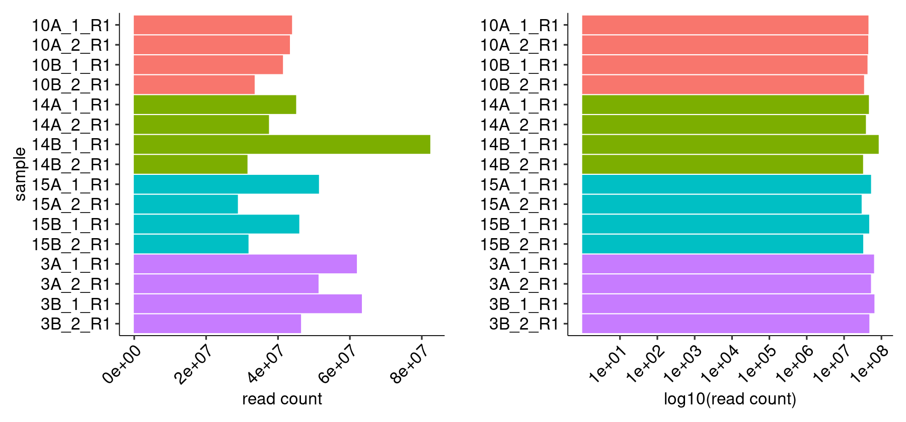
    


    
    
    |sample   | read count|
    |:--------|----------:|
    |10A_1_R1 |   43782876|
    |10A_2_R1 |   43192138|
    |10B_1_R1 |   41254230|
    |10B_2_R1 |   33382208|
    |14A_1_R1 |   44928439|
    |14A_2_R1 |   37363376|
    |14B_1_R1 |   82244691|
    |14B_2_R1 |   31387288|
    |15A_1_R1 |   51272151|
    |15A_2_R1 |   28715429|
    |15B_1_R1 |   45794895|
    |15B_2_R1 |   31672561|
    |3A_1_R1  |   61820517|
    |3A_2_R1  |   51157819|
    |3B_1_R1  |   63209182|
    |3B_2_R1  |   46284723|


#### R1/R2 Joining


    
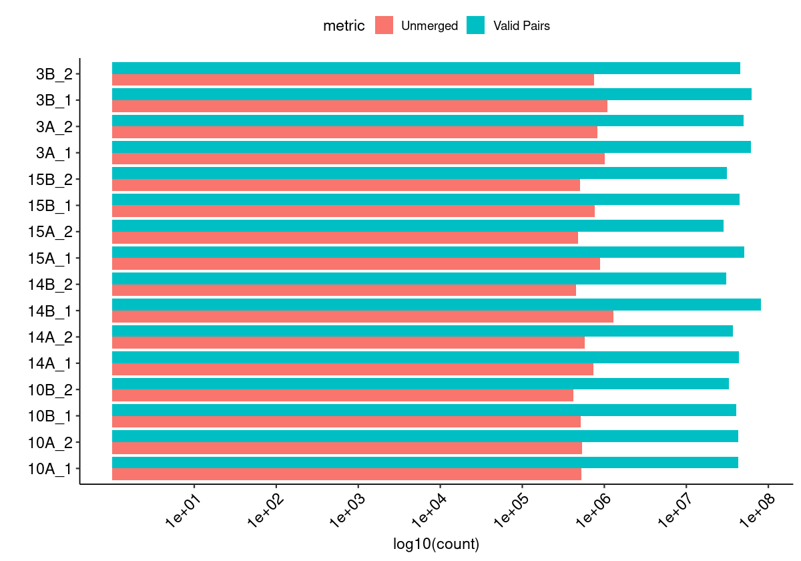
    


#### Merged Fragment Lengths


    
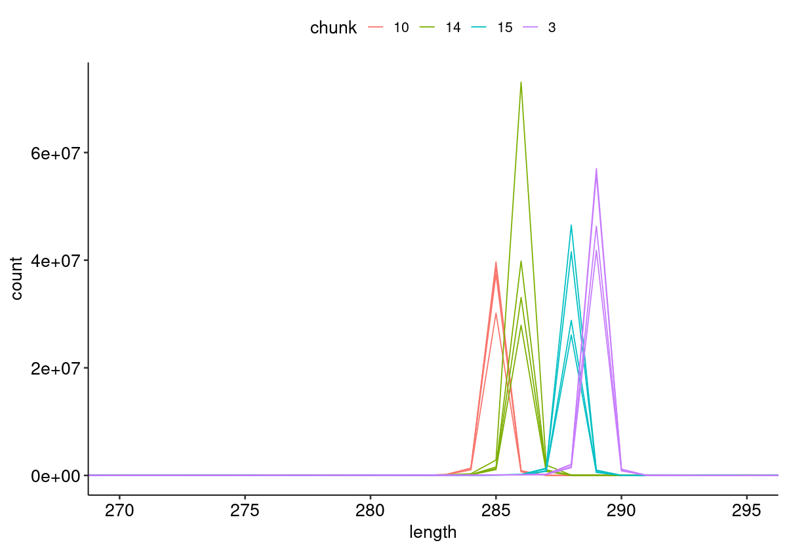
    


#### Unique Alignment Rate <a name="part2c"></a>


    
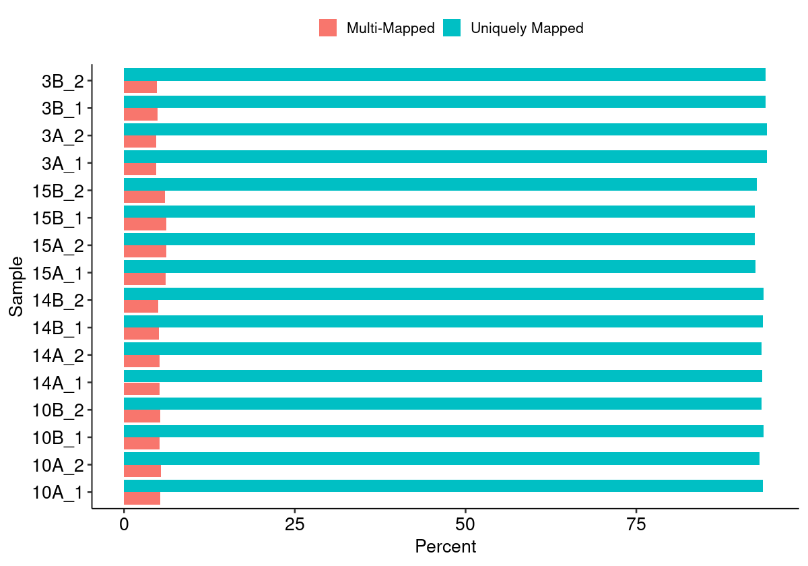
    


#### Edit Distance Distributions


    
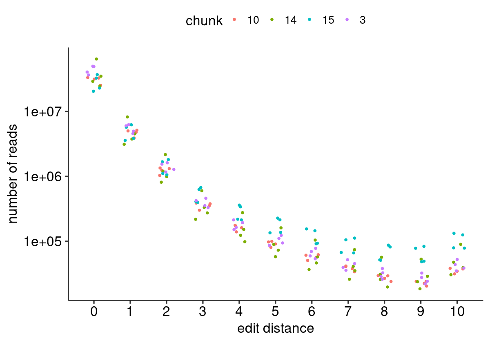
    


#### Edit Distance Proportion Distributions


    
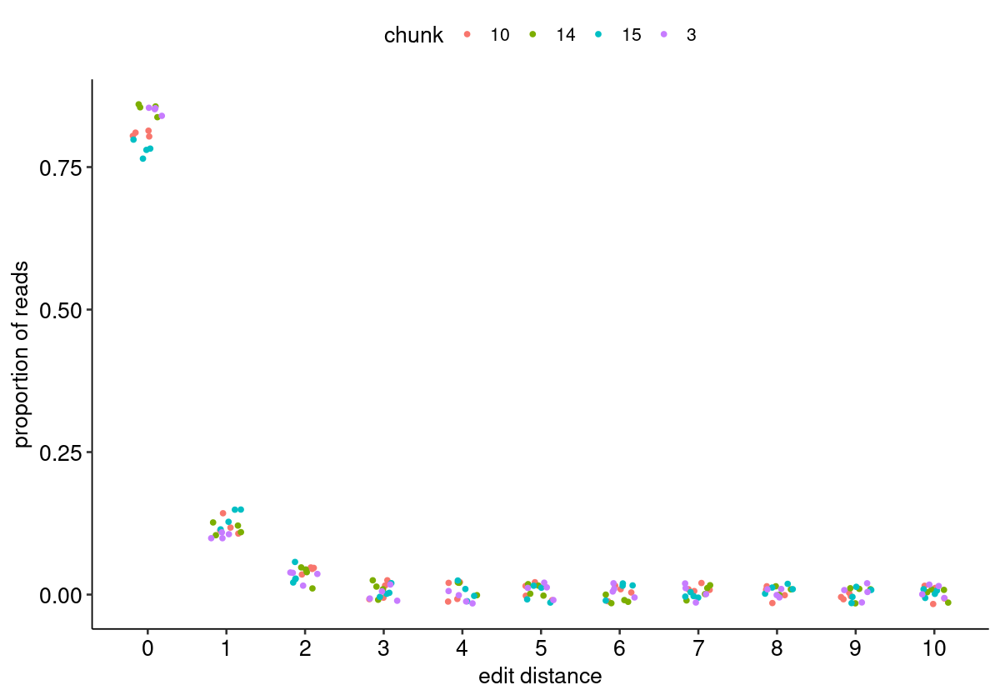
    


#### Reproduced Associations Per Barcode Sequence


    
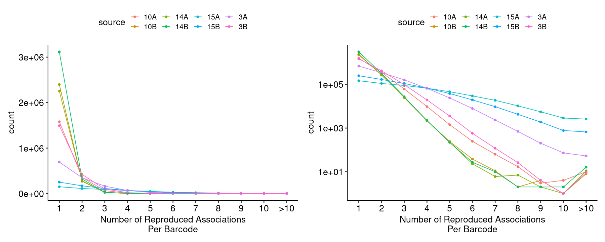
    


#### Filtered Barcode Counts Per Replicate Group


    
    
    |sample             |n       |
    |:------------------|:-------|
    |10A.bcmap-filtered |1391179 |
    |10B.bcmap-filtered |1984443 |
    |14A.bcmap-filtered |2140871 |
    |14B.bcmap-filtered |2781493 |
    |15A.bcmap-filtered |124569  |
    |15B.bcmap-filtered |218286  |
    |3A.bcmap-filtered  |615892  |
    |3B.bcmap-filtered  |1340417 |


### Read Sampling Distributions <a name="part3"></a>

#### Reads Per Barcode Without Binning


    
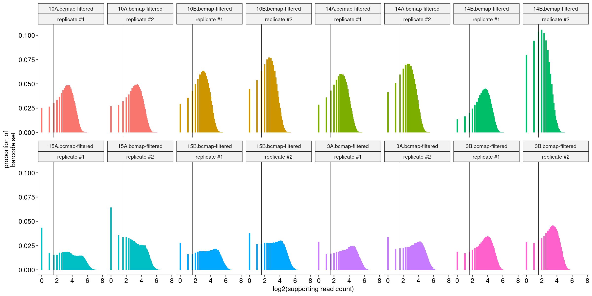
    


#### Reads Per Barcode With Binning


    

    


#### Barcode Purity Distributions


    
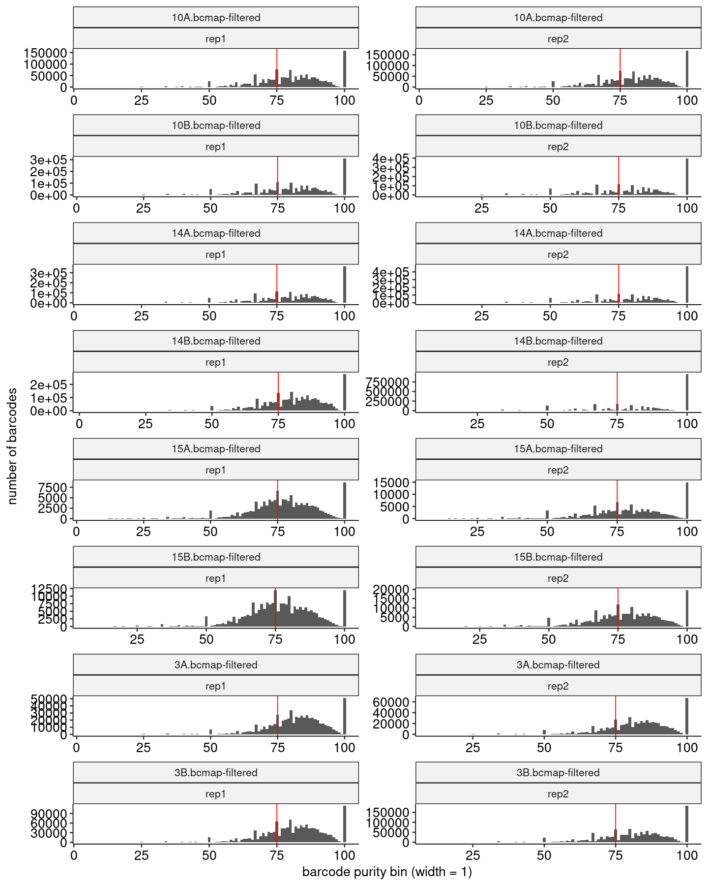
    


#### Barcode Counts Per Final Joined Map


    
    
    |sample             |final barcode count |
    |:------------------|:-------------------|
    |10.bcmap-final.tsv |1528695             |
    |14.bcmap-final.tsv |2320410             |
    |15.bcmap-final.tsv |126561              |
    |3.bcmap-final.tsv  |1084593             |


### Library Complexity and Coverage <a name="part4"></a>

#### Unique Barcodes Per Residue


    
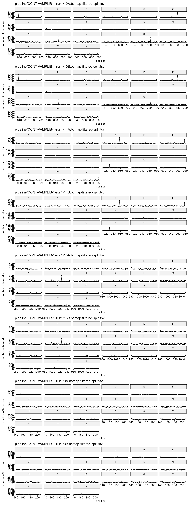
    


#### Unique Barcodes Per Residue, log10


    
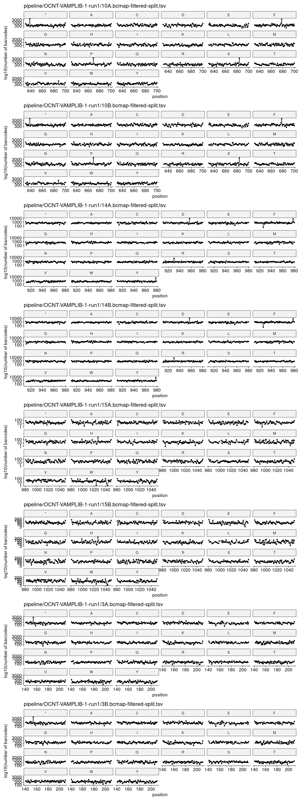
    


### RY Barcoding <a name="part5"></a>


    
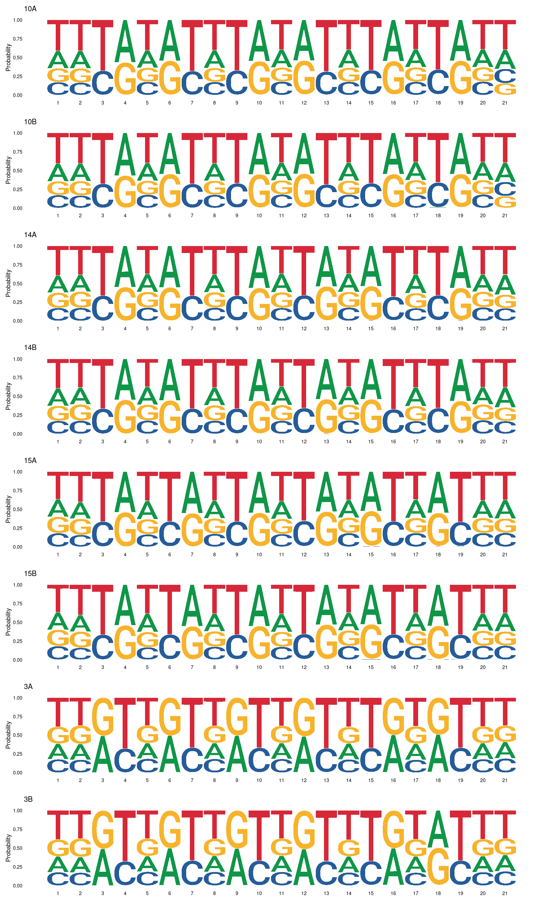
    

