```R
# Parameters
bcmap = "pipeline/OCNT-VAMPLIB-1-run2/"

```

## DMS Barcode Mapping Report

1. [Sequencing Quality Metrics](#part1)
2. [Read Sampling Distributions](#part2)
3. [Library Complexity and Coverage](#part3)
4. [RY Barcoding](#part4)

### Sequencing Quality Metrics <a name="part1"></a>

#### Sequencing Depth 


    
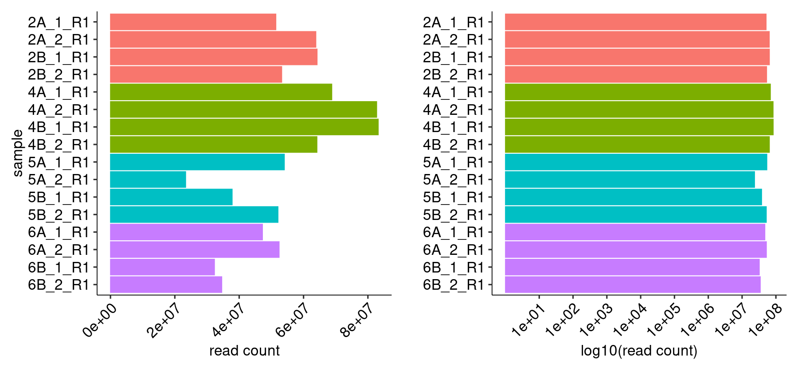
    


    
    
    |sample  | read count|
    |:-------|----------:|
    |2A_1_R1 |   51401447|
    |2A_2_R1 |   63831515|
    |2B_1_R1 |   64220492|
    |2B_2_R1 |   53219621|
    |4A_1_R1 |   68782332|
    |4A_2_R1 |   82728451|
    |4B_1_R1 |   83216228|
    |4B_2_R1 |   64168728|
    |5A_1_R1 |   54037299|
    |5A_2_R1 |   23367507|
    |5B_1_R1 |   37818358|
    |5B_2_R1 |   52064995|
    |6A_1_R1 |   47239414|
    |6A_2_R1 |   52419351|
    |6B_1_R1 |   32322747|
    |6B_2_R1 |   34592169|


#### R1/R2 Joining


    
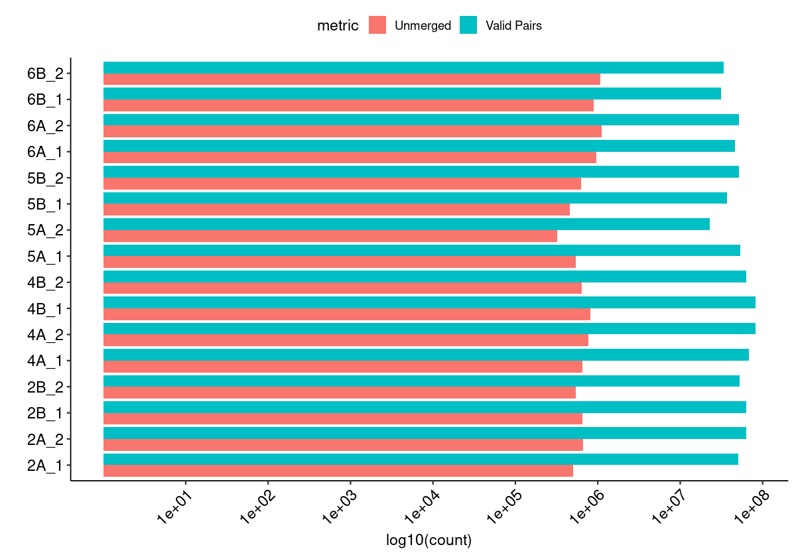
    


#### Merged Fragment Lengths


    
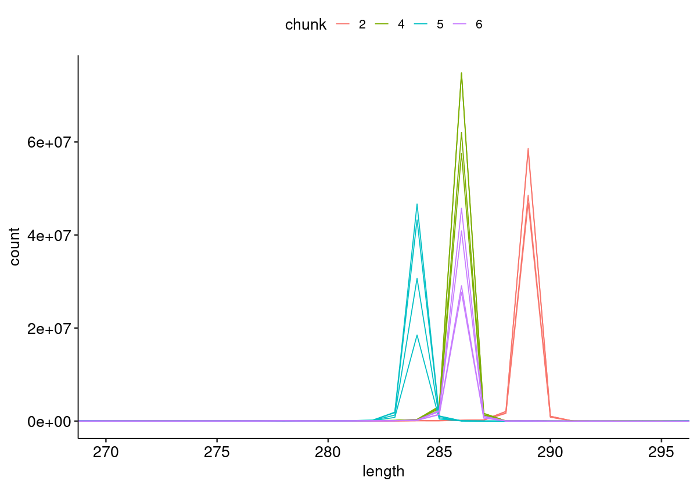
    


#### Unique Alignment Rate <a name="part2c"></a>


    
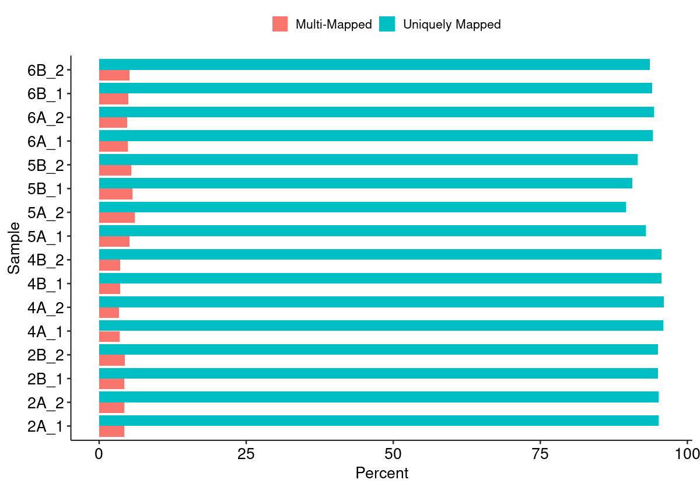
    


#### Edit Distance Distributions


    
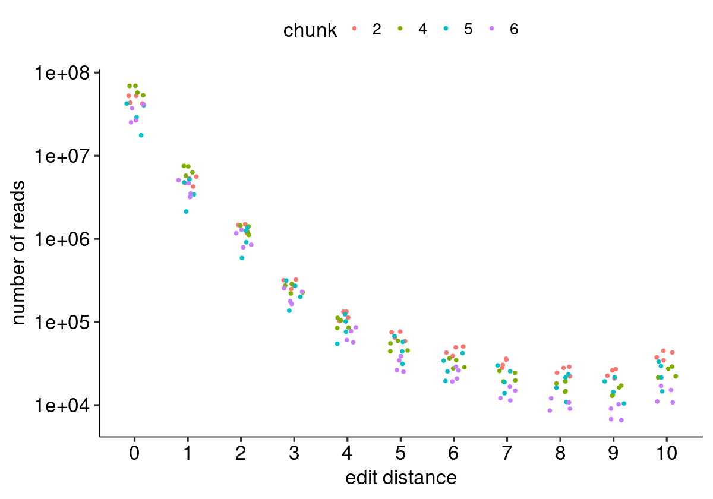
    


#### Edit Distance Proportion Distributions


    
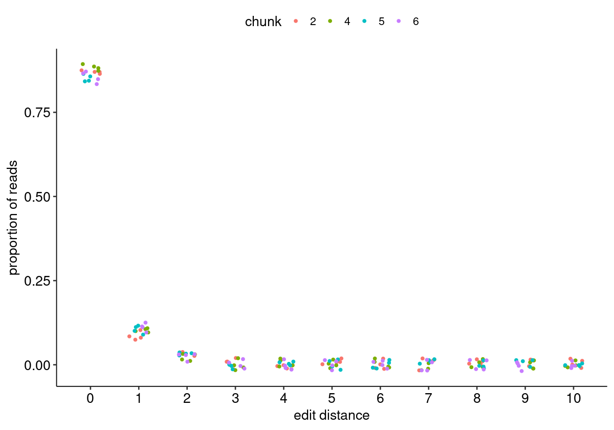
    


#### Reproduced Associations Per Barcode Sequence


    
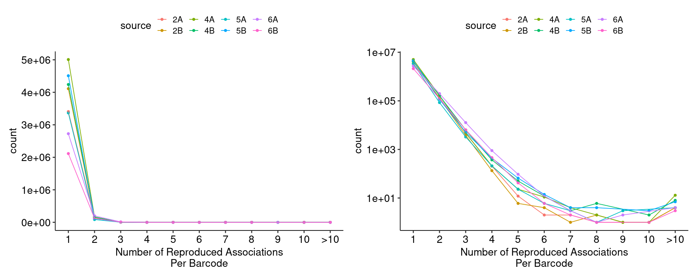
    


#### Filtered Barcode Counts Per Replicate Group


    
    
    |sample            |n       |
    |:-----------------|:-------|
    |2A.bcmap-filtered |3071691 |
    |2B.bcmap-filtered |3707002 |
    |4A.bcmap-filtered |4468945 |
    |4B.bcmap-filtered |3782200 |
    |5A.bcmap-filtered |2941030 |
    |5B.bcmap-filtered |3941950 |
    |6A.bcmap-filtered |2384120 |
    |6B.bcmap-filtered |1848843 |


### Read Sampling Distributions <a name="part3"></a>

#### Reads Per Barcode Without Binning


    
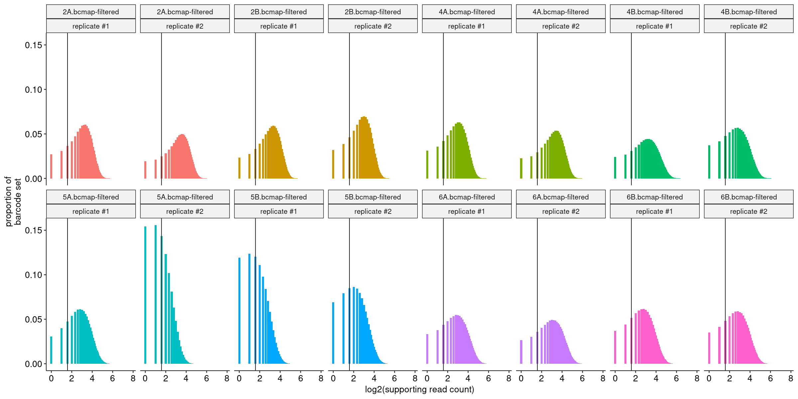
    


#### Reads Per Barcode With Binning


    

    


#### Barcode Purity Distributions


    
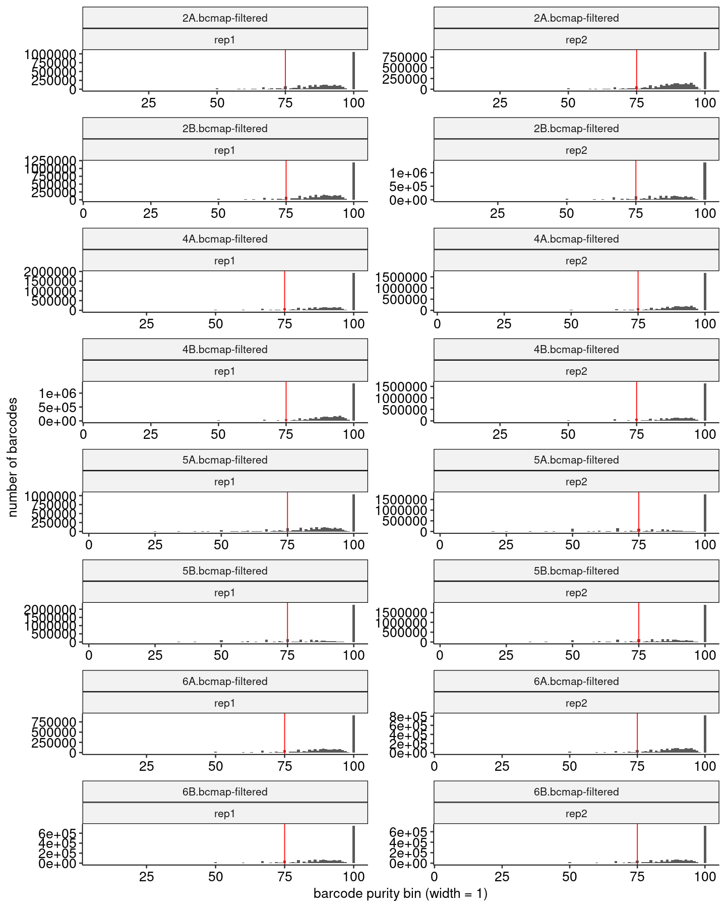
    


#### Barcode Counts Per Final Joined Map


    
    
    |sample            |final barcode count |
    |:-----------------|:-------------------|
    |2.bcmap-final.tsv |5325148             |
    |4.bcmap-final.tsv |6705842             |
    |5.bcmap-final.tsv |3800276             |
    |6.bcmap-final.tsv |3262262             |


### Library Complexity and Coverage <a name="part4"></a>

#### Unique Barcodes Per Residue


    
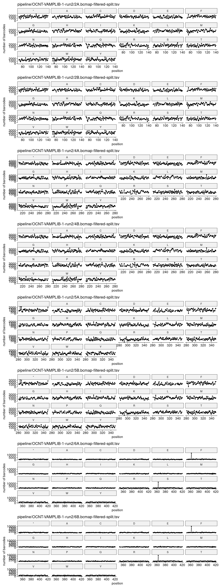
    


#### Unique Barcodes Per Residue, log10


    
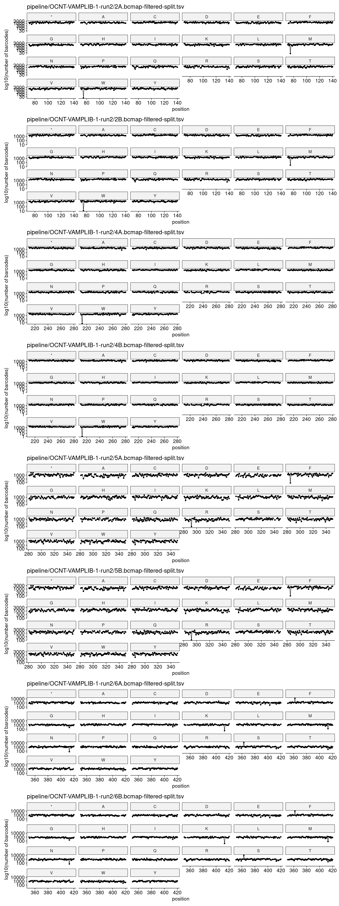
    


### RY Barcoding <a name="part5"></a>


    

    

