```R
# Parameters
bcmap = "pipeline/OCNT-VAMPLIB-1-run3/"

```

## DMS Barcode Mapping Report

1. [Sequencing Quality Metrics](#part1)
2. [Read Sampling Distributions](#part2)
3. [Library Complexity and Coverage](#part3)
4. [RY Barcoding](#part4)

### Sequencing Quality Metrics <a name="part1"></a>

#### Sequencing Depth 


    
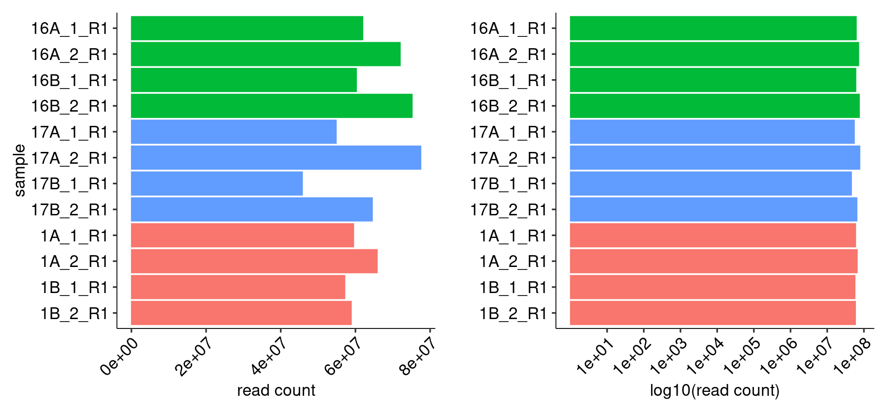
    


    
    
    |sample   | read count|
    |:--------|----------:|
    |16A_1_R1 |   61965193|
    |16A_2_R1 |   71995263|
    |16B_1_R1 |   60265326|
    |16B_2_R1 |   75192731|
    |17A_1_R1 |   54859356|
    |17A_2_R1 |   77516275|
    |17B_1_R1 |   45796417|
    |17B_2_R1 |   64538520|
    |1A_1_R1  |   59518409|
    |1A_2_R1  |   65840017|
    |1B_1_R1  |   57157338|
    |1B_2_R1  |   58891611|


#### R1/R2 Joining


    
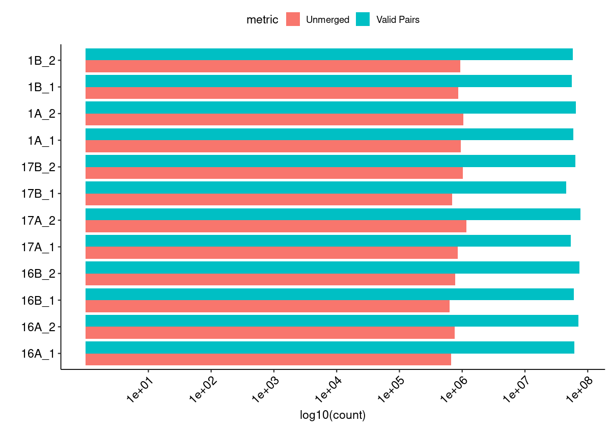
    


#### Merged Fragment Lengths


    
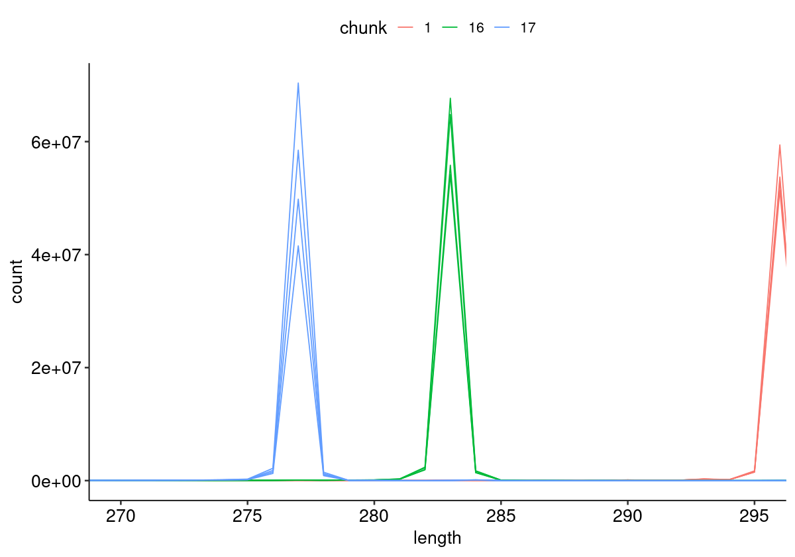
    


#### Unique Alignment Rate <a name="part2c"></a>


    
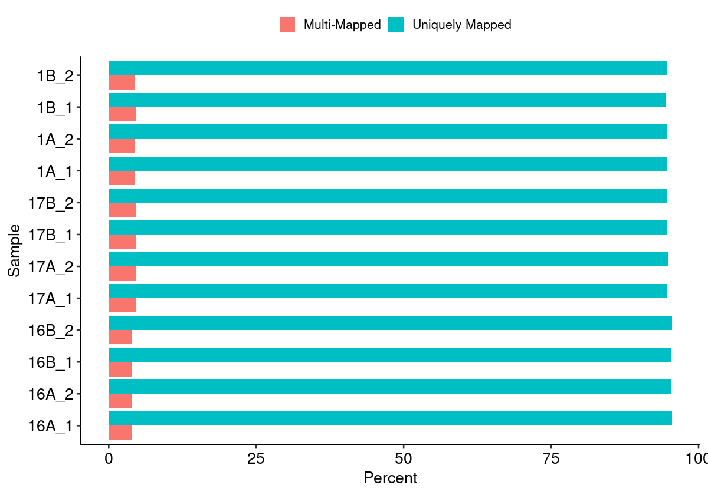
    


#### Edit Distance Distributions


    
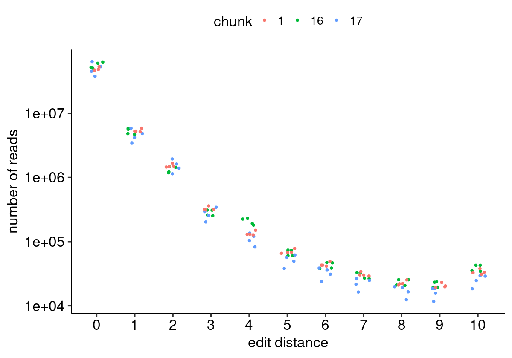
    


#### Edit Distance Proportion Distributions


    
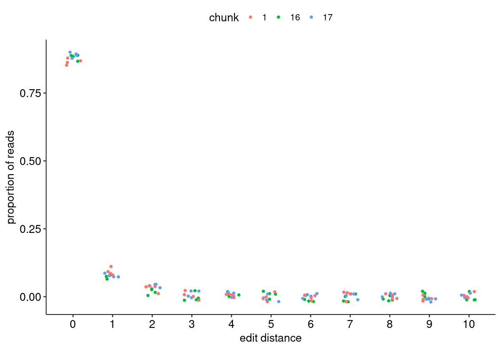
    


#### Reproduced Associations Per Barcode Sequence


    
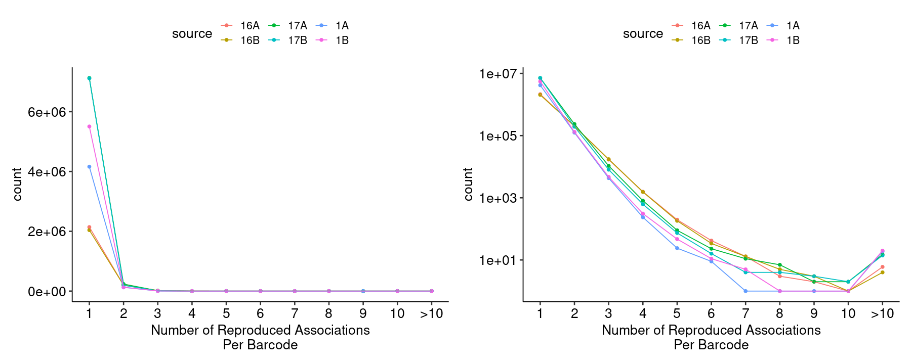
    


#### Filtered Barcode Counts Per Replicate Group


    
    
    |sample             |n       |
    |:------------------|:-------|
    |16A.bcmap-filtered |1906628 |
    |16B.bcmap-filtered |1815041 |
    |17A.bcmap-filtered |6341835 |
    |17B.bcmap-filtered |6331267 |
    |1A.bcmap-filtered  |3617370 |
    |1B.bcmap-filtered  |4786764 |


### Read Sampling Distributions <a name="part3"></a>

#### Reads Per Barcode Without Binning


    
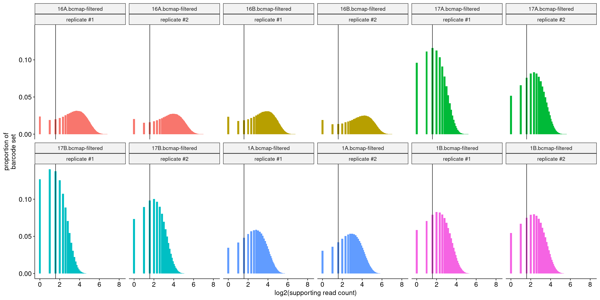
    


#### Reads Per Barcode With Binning


    
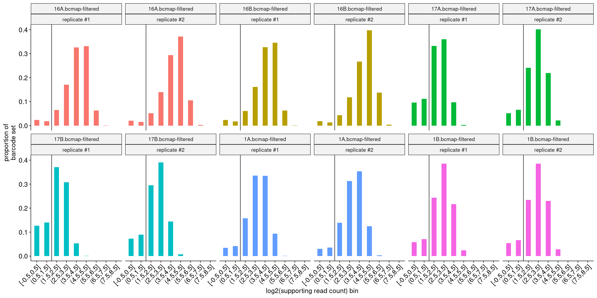
    


#### Barcode Purity Distributions


    
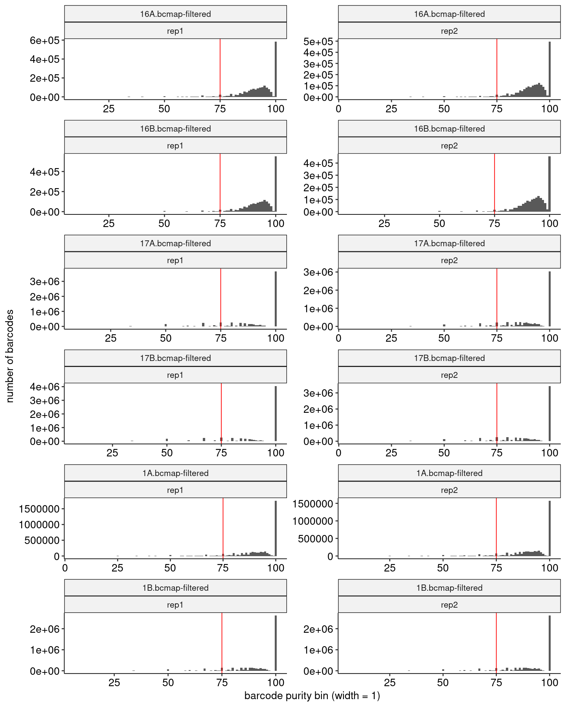
    


#### Barcode Counts Per Final Joined Map


    
    
    |sample             |final barcode count |
    |:------------------|:-------------------|
    |1.bcmap-final.tsv  |6377964             |
    |16.bcmap-final.tsv |3370364             |
    |17.bcmap-final.tsv |7528303             |


### Library Complexity and Coverage <a name="part4"></a>

#### Unique Barcodes Per Residue


    
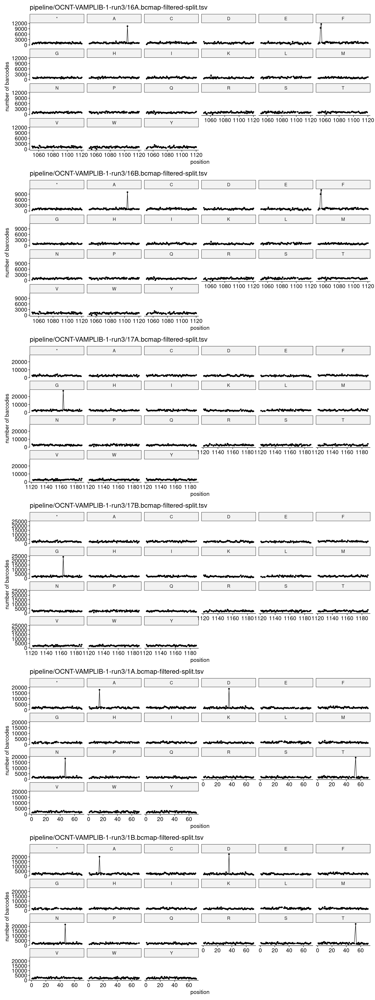
    


#### Unique Barcodes Per Residue, log10


    
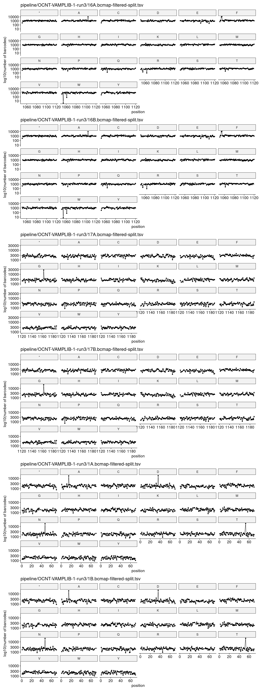
    


### RY Barcoding <a name="part5"></a>


    
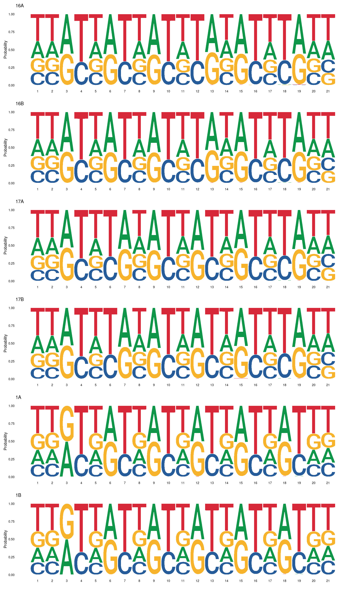
    

