```R
# Parameters
bcmap = "pipeline/OCNT-VAMPLIB-1-run4/"

```

## DMS Barcode Mapping Report

1. [Sequencing Quality Metrics](#part1)
2. [Read Sampling Distributions](#part2)
3. [Library Complexity and Coverage](#part3)
4. [RY Barcoding](#part4)

### Sequencing Quality Metrics <a name="part1"></a>

#### Sequencing Depth 


    
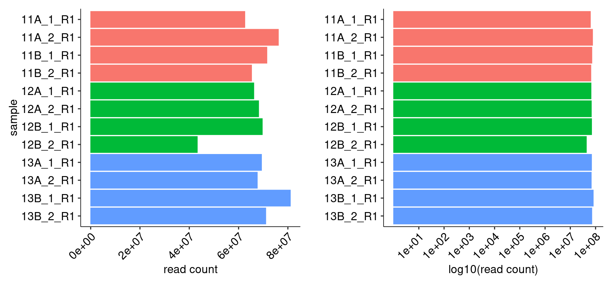
    


    
    
    |sample   | read count|
    |:--------|----------:|
    |11A_1_R1 |   62546018|
    |11A_2_R1 |   76155925|
    |11B_1_R1 |   71490828|
    |11B_2_R1 |   65277472|
    |12A_1_R1 |   66182637|
    |12A_2_R1 |   68136879|
    |12B_1_R1 |   69627169|
    |12B_2_R1 |   43261434|
    |13A_1_R1 |   69312645|
    |13A_2_R1 |   67600130|
    |13B_1_R1 |   81007324|
    |13B_2_R1 |   71035010|


#### R1/R2 Joining


    
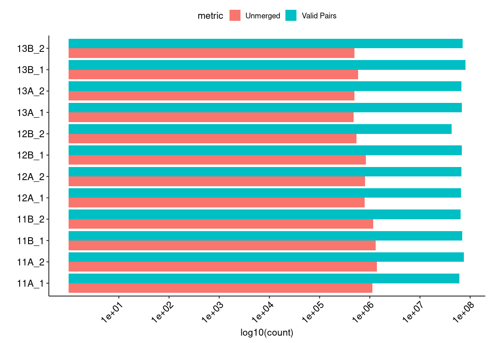
    


#### Merged Fragment Lengths


    
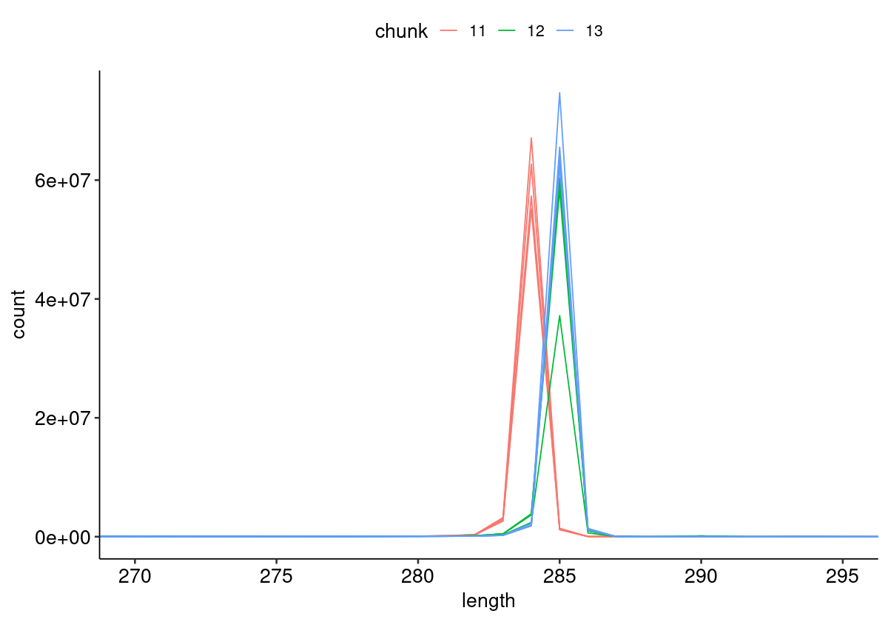
    


#### Unique Alignment Rate <a name="part2c"></a>


    
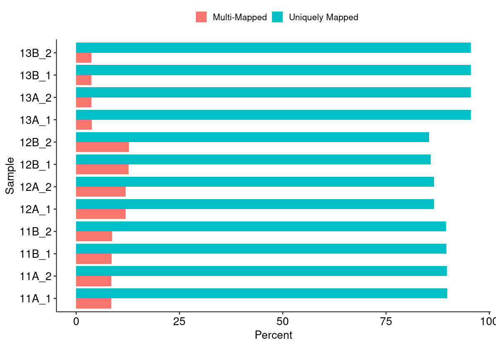
    


#### Edit Distance Distributions


    
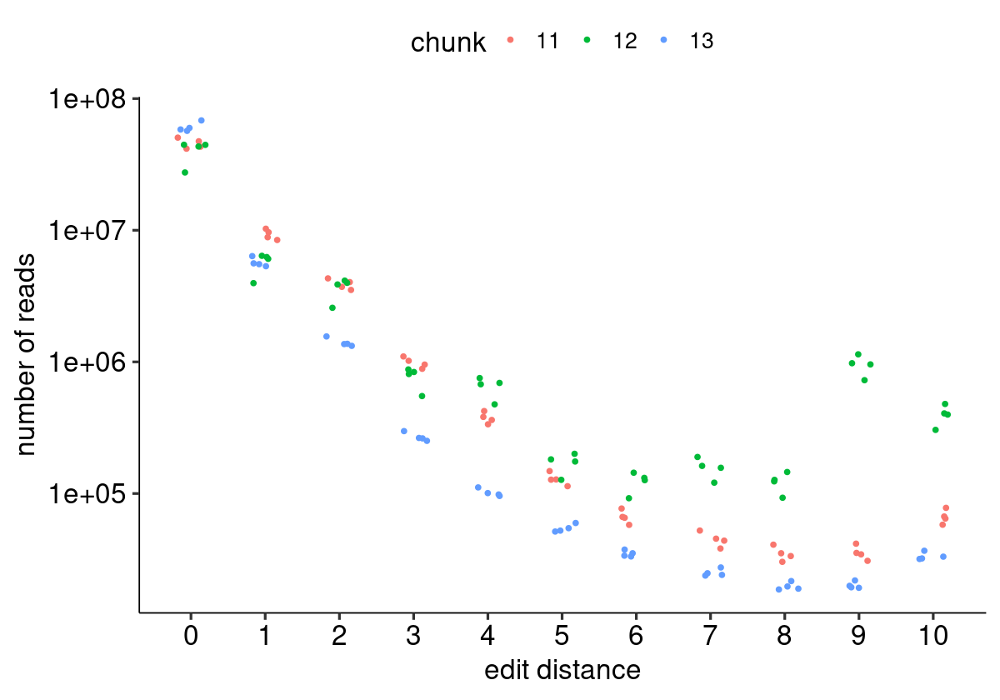
    


#### Edit Distance Proportion Distributions


    
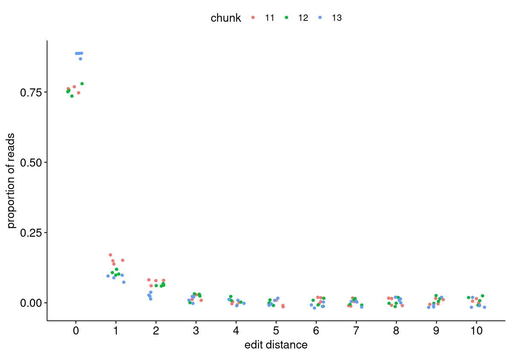
    


#### Reproduced Associations Per Barcode Sequence


    
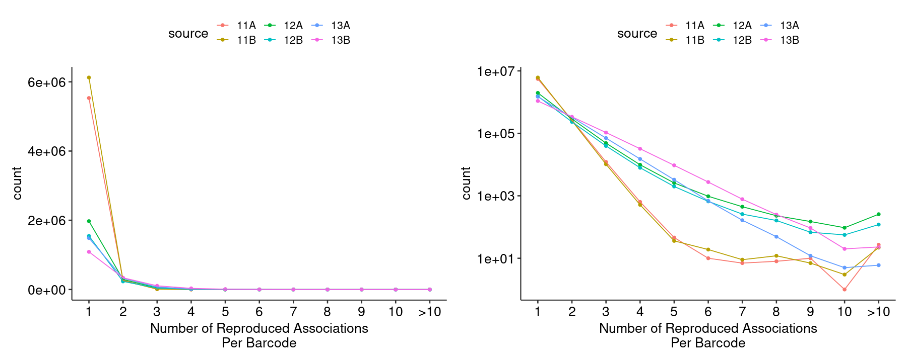
    


#### Filtered Barcode Counts Per Replicate Group


    
    
    |sample             |n       |
    |:------------------|:-------|
    |11A.bcmap-filtered |4212009 |
    |11B.bcmap-filtered |4660675 |
    |12A.bcmap-filtered |1525827 |
    |12B.bcmap-filtered |1197531 |
    |13A.bcmap-filtered |1344560 |
    |13B.bcmap-filtered |982886  |


### Read Sampling Distributions <a name="part3"></a>

#### Reads Per Barcode Without Binning


    
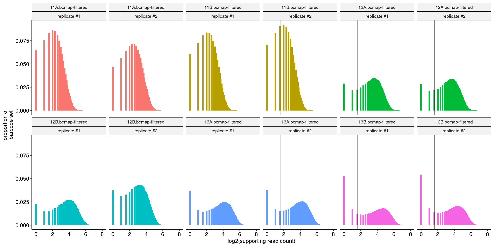
    


#### Reads Per Barcode With Binning


    
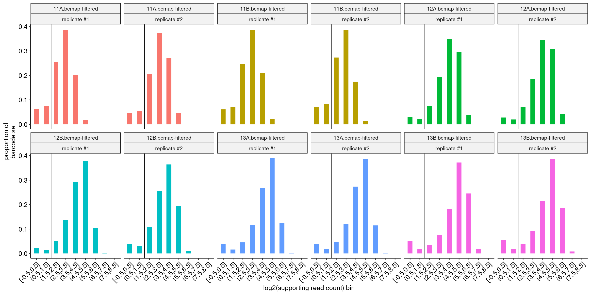
    


#### Barcode Purity Distributions


    
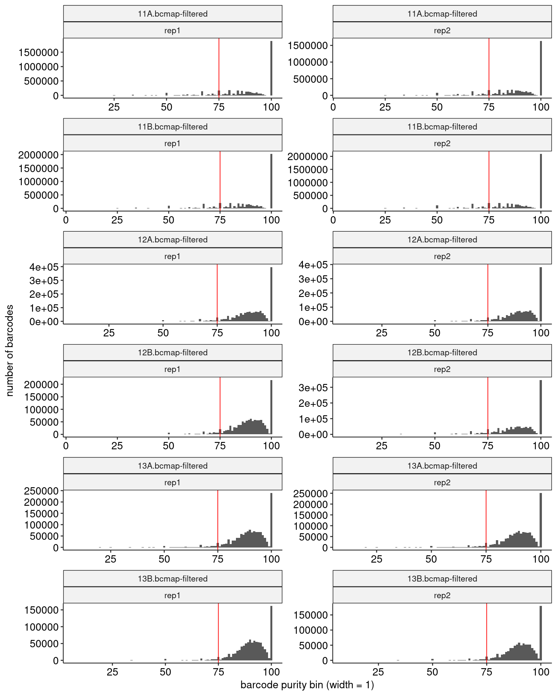
    


#### Barcode Counts Per Final Joined Map


    
    
    |sample             |final barcode count |
    |:------------------|:-------------------|
    |11.bcmap-final.tsv |5593236             |
    |12.bcmap-final.tsv |2231607             |
    |13.bcmap-final.tsv |2003971             |


### Library Complexity and Coverage <a name="part4"></a>

#### Unique Barcodes Per Residue


    
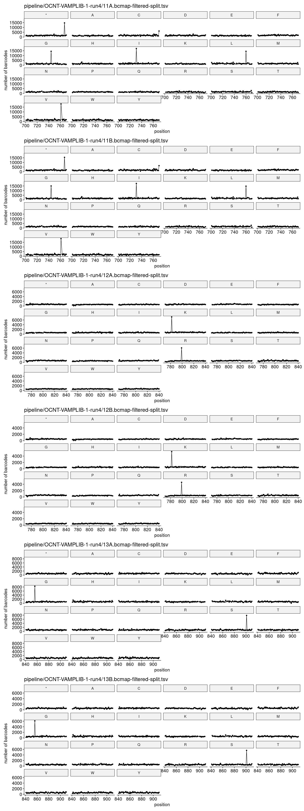
    


#### Unique Barcodes Per Residue, log10


    
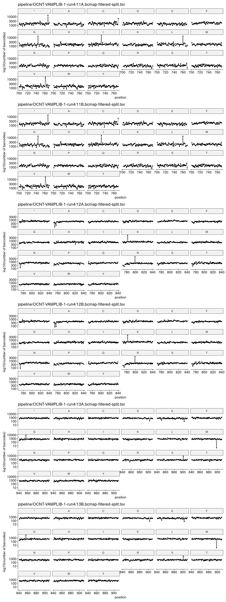
    


### RY Barcoding <a name="part5"></a>


    
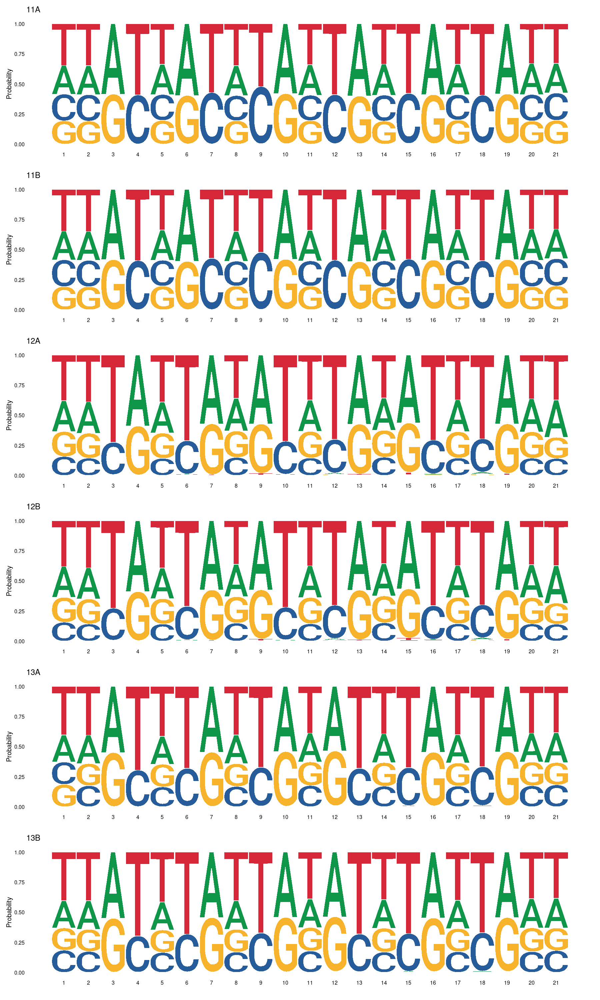
    

