```R
# Parameters
bcmap = "pipeline/OCNT-VAMPLIB-1-run5/"

```

## DMS Barcode Mapping Report

1. [Sequencing Quality Metrics](#part1)
2. [Read Sampling Distributions](#part2)
3. [Library Complexity and Coverage](#part3)
4. [RY Barcoding](#part4)

### Sequencing Quality Metrics <a name="part1"></a>

#### Sequencing Depth 


    

    


    
    
    |sample   | read count|
    |:--------|----------:|
    |15A_1_R1 |   33356096|
    |15A_2_R1 |   41571270|
    |15B_1_R1 |   36303222|
    |15B_2_R1 |   41940331|
    |7A_1_R1  |   38064612|
    |7A_2_R1  |   53867560|
    |7B_1_R1  |   37968060|
    |7B_2_R1  |   49796041|
    |8A_1_R1  |   42285630|
    |8A_2_R1  |   35500330|
    |8B_1_R1  |   27774186|
    |8B_2_R1  |   43736255|
    |9A_1_R1  |   32723740|
    |9A_2_R1  |   45616655|
    |9B_1_R1  |   29207422|
    |9B_2_R1  |   41190869|


#### R1/R2 Joining


    
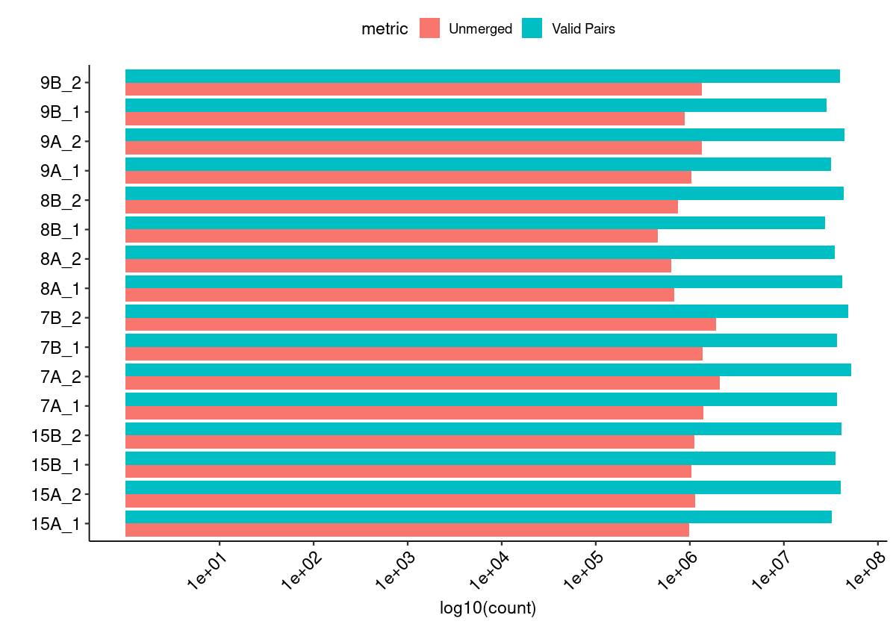
    


#### Merged Fragment Lengths


    
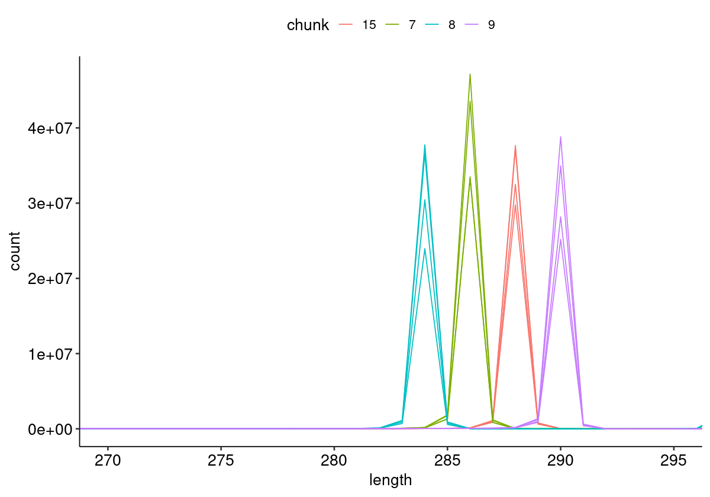
    


#### Unique Alignment Rate <a name="part2c"></a>


    
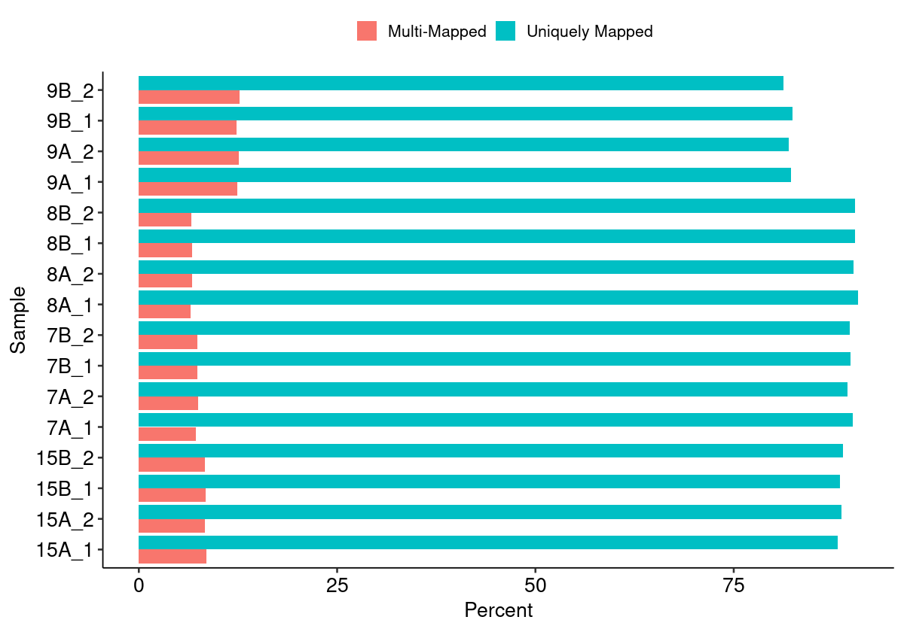
    


#### Edit Distance Distributions


    
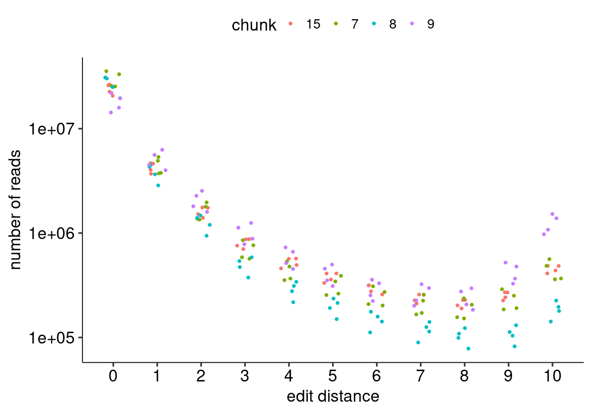
    


#### Edit Distance Proportion Distributions


    
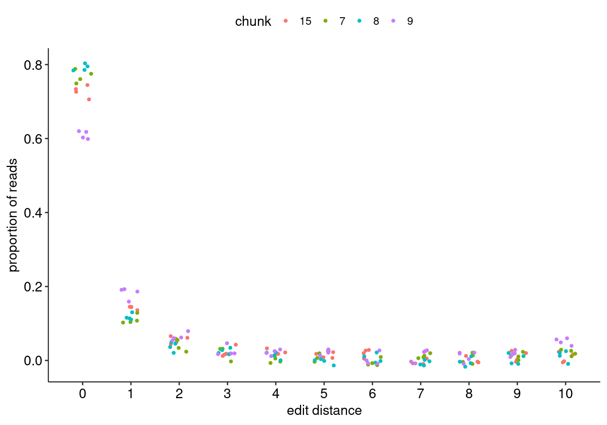
    


#### Reproduced Associations Per Barcode Sequence


    
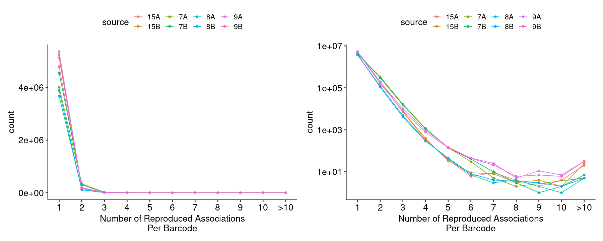
    


#### Filtered Barcode Counts Per Replicate Group


    
    
    |sample             |n       |
    |:------------------|:-------|
    |15A.bcmap-filtered |4252241 |
    |15B.bcmap-filtered |4656335 |
    |7A.bcmap-filtered  |3527920 |
    |7B.bcmap-filtered  |4012664 |
    |8A.bcmap-filtered  |3219763 |
    |8B.bcmap-filtered  |3408973 |
    |9A.bcmap-filtered  |3839779 |
    |9B.bcmap-filtered  |3660248 |


### Read Sampling Distributions <a name="part3"></a>

#### Reads Per Barcode Without Binning


    
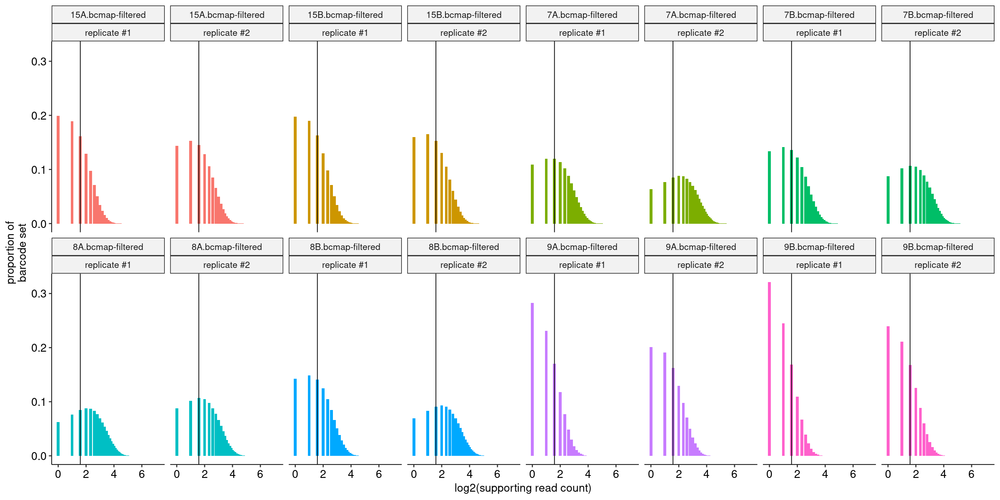
    


#### Reads Per Barcode With Binning


    
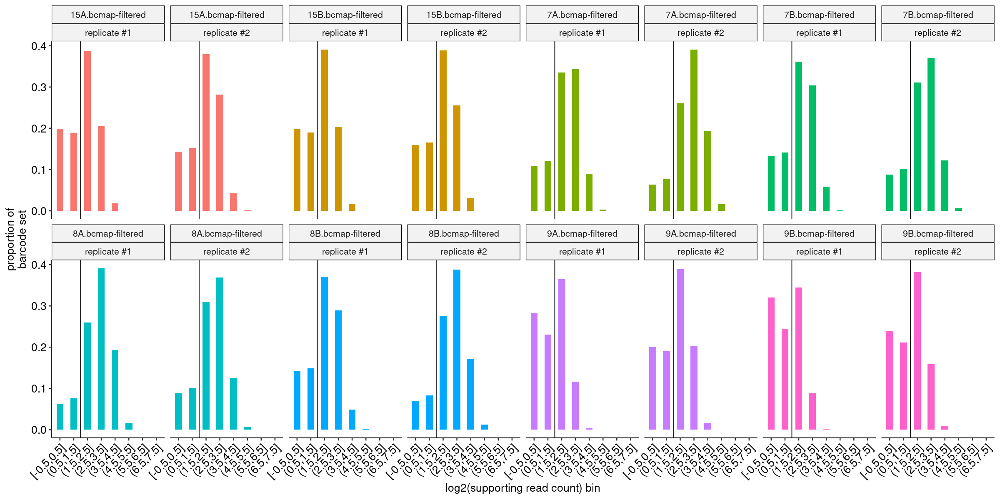
    


#### Barcode Purity Distributions


    

    


#### Barcode Counts Per Final Joined Map


    
    
    |sample             |final barcode count |
    |:------------------|:-------------------|
    |15.bcmap-final.tsv |1735721             |
    |7.bcmap-final.tsv  |2576273             |
    |8.bcmap-final.tsv  |2873893             |
    |9.bcmap-final.tsv  |1166316             |


### Library Complexity and Coverage <a name="part4"></a>

#### Unique Barcodes Per Residue


    
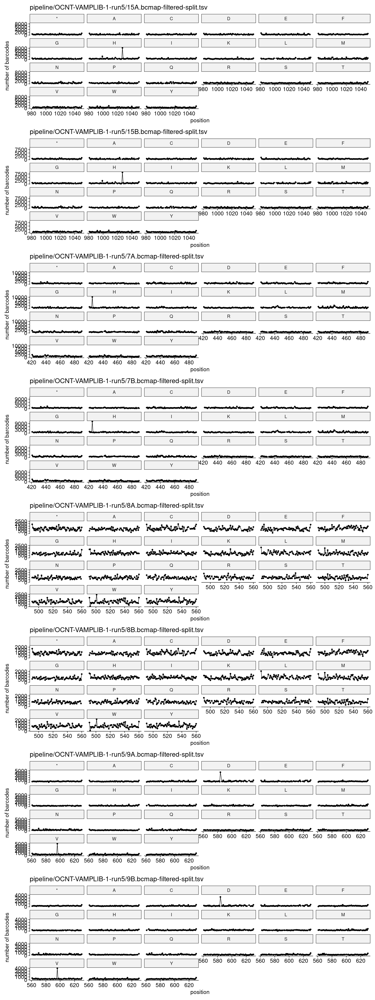
    


#### Unique Barcodes Per Residue, log10


    
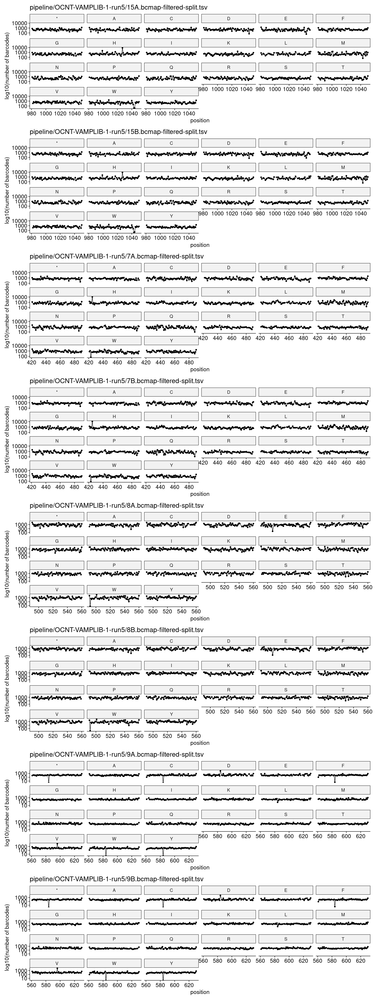
    


### RY Barcoding <a name="part5"></a>


    
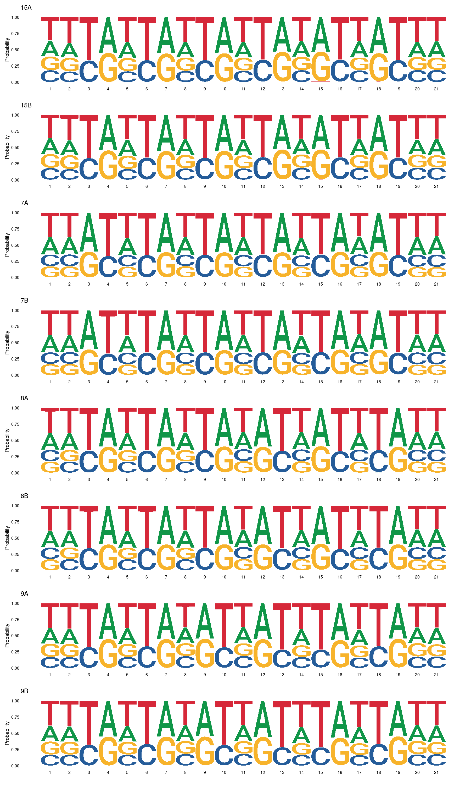
    

