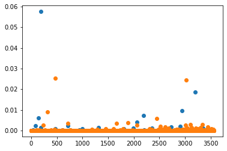
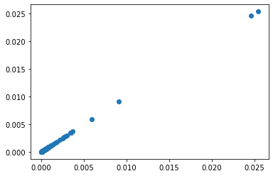
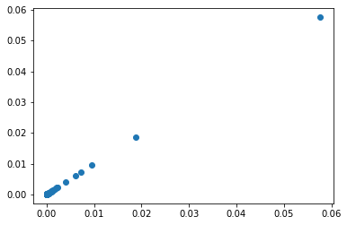

### Running SpliceAI locally on a synthetic TYK2 transcript sequence


```python
# Within DMS docker container on radula

from  tensorflow.keras.models import load_model
from pkg_resources import resource_filename
from spliceai.utils import one_hot_encode
import numpy as np
```


```python
# Input sequence
input_sequence = 'CGATCTGACGTGGGTGTCATCGCATTATCGATATTGCAT'
input_sequence = 'ATGCCTCTGCGCCACTGGGGGATGGCCAGGGGCAGTAAGCCCGTTGGGGATGGAGCCCAGCCCATGGCTGCCATGGGAGGCCTGAAGGTGCTTCTGCACTGGGCTGGTCCAGGCGGCGGGGAGCCCTGGGTCACTTTCAGTGAGTCATCGCTGACAGCTGAGGAAGTCTGCATCCACATTGCACATAAAGTTGGTATCACTCCTCCTTGCTTCAATCTCTTTGCCCTCTTCGATGCTCAGGCCCAAGTCTGGTTGCCCCCAAACCACATCCTAGAGATCCCCAGAGATGCAAGCCTGATGCTATATTTCCGCATAAGGTTTTATTTCCGGAACTGGCATGGCATGAATCCTCGGGAACCGGCTGTGTACCGTTGTGGGCCCCCAGGAACCGAGGCATCCTCAGATCAGACAGCACAGGGGATGCAACTCCTGGACCCAGCCTCATTTGAGTACCTCTTTGAGCAGGGCAAGCATGAGTTTGTGAATGACGTGGCATCACTGTGGGAGCTGTCGACCGAGGAGGAGATCCACCACTTTAAGAATGAGAGCCTGGGCATGGCCTTTCTGCACCTCTGTCACCTCGCTCTCCGCCATGGCATCCCCCTGGAGGAGGTGGCCAAGAAGACCAGCTTCAAGGACTGCATCCCGCGCTCCTTCCGCCGGCATATCCGGCAGCACAGCGCCCTGACCCGGCTGCGCCTTCGGAACGTCTTCCGCAGGTTCCTGCGGGACTTCCAGCCGGGCCGACTCTCCCAGCAGATGGTCATGGTCAAATACCTAGCCACACTCGAGCGGCTGGCACCCCGCTTCGGCACAGAGCGTGTGCCCGTGTGCCACCTGAGGCTGCTGGCCCAGGCCGAGGGGGAGCCCTGCTACATCCGGGACAGTGGGGTGGCCCCTACAGACCCTGGCCCTGAGTCTGCTGCTGGGCCCCCAACCCACGAGGTGCTGGTGACAGGCACTGGTGGCATCCAGTGGTGGCCAGTAGAGGAGGAGGTGAACAAGGAGGAGGGTTCTAGTGGCAGCAGTGGCAGGAACCCCCAAGCCAGCCTGTTTGGGAAGAAGGCCAAGGCTCACAAGGCAGTCGGCCAGCCGGCAGACAGGCCGCGGGAGCCACTGTGGGCCTACTTCTGTGACTTCCGGGACATCACCCACGTGGTGCTGAAAGAGCACTGTGTCAGCATCCACCGGCAGGACAACAAGTGCCTGGAGCTGAGCTTGCCTTCCCGGGCTGCGGCGCTGTCCTTCGTGTCGCTGGTGGACGGCTATTTCCGCCTGACGGCCGACTCCAGCCACTACCTGTGCCACGAGGTGGCTCCCCCACGGCTGGTGATGAGCATCCGGGATGGGATCCACGGACCCCTGCTGGAGCCATTTGTGCAGGCCAAGCTGCGGCCCGAGGACGGCCTGTACCTCATTCACTGGAGCACCAGCCACCCCTACCGCCTGATCCTCACAGTGGCCCAGCGTAGCCAGGCACCAGACGGCATGCAGAGCTTGCGGCTCCGAAAGTTCCCCATTGAGCAGCAGGACGGGGCCTTCGTGCTGGAGGGCTGGGGCCGGTCCTTCCCCAGCGTTCGGGAACTTGGGGCTGCCTTGCAGGGCTGCTTGCTGAGGGCCGGGGATGACTGCTTCTCTCTGCGTCGCTGTTGCCTGCCCCAACCAGGAGAAACCTCCAATCTCATCATCATGCGGGGGGCTCGGGCCAGCCCCAGGACACTCAACCTCAGCCAGCTCAGCTTCCACCGGGTTGACCAGAAGGAGATCACCCAGCTGTCCCACTTGGGCCAGGGCACAAGGACCAACGTGTATGAGGGCCGCCTGCGAGTGGAGGGCAGCGGGGACCCTGAGGAGGGCAAGATGGATGACGAGGACCCCCTCGTGCCTGGCAGGGACCGTGGGCAGGAGCTACGAGTGGTGCTCAAAGTGCTGGACCCTAGTCACCATGACATCGCCCTGGCCTTCTACGAGACAGCCAGCCTCATGAGCCAGGTCTCCCACACGCACCTGGCCTTCGTGCATGGCGTCTGTGTGCGCGGCCCTGAAAATATCATGGTGACAGAGTACGTGGAGCACGGACCCCTGGATGTGTGGCTGCGGAGGGAGCGGGGCCATGTGCCCATGGCTTGGAAGATGGTGGTGGCCCAGCAGCTGGCCAGCGCCCTCAGCTACCTGGAGAACAAGAACCTGGTTCATGGTAATGTGTGTGGCCGGAACATCCTGCTGGCCCGGCTGGGGTTGGCAGAGGGCACCAGCCCCTTCATCAAGCTGAGTGATCCTGGCGTGGGCCTGGGCGCCCTCTCCAGGGAGGAGCGGGTGGAGAGGATCCCCTGGCTGGCCCCCGAATGCCTACCAGGTGGGGCCAACAGCCTAAGCACCGCCATGGACAAGTGGGGGTTTGGCGCCACCCTCCTGGAGATCTGCTTTGACGGAGAGGCCCCTCTGCAGAGCCGCAGTCCCTCCGAGAAGGAGCATTTCTACCAGAGGCAGCACCGGCTGCCCGAGCCCTCCTGCCCACAGCTGGCCACACTCACCAGCCAGTGTCTGACCTATGAGCCAACCCAGAGGCCATCATTCCGCACCATCCTGCGTGACCTCACCCGGCTGCAGCCCCACAATCTTGCTGACGTCTTGACTGTGAACCCGGACTCACCGGCGTCGGACCCTACGGTTTTCCACAAGCGCTATTTGAAAAAGATCCGAGATCTGGGCGAGGGTCACTTCGGCAAGGTCAGCTTGTACTGCTACGATCCGACCAACGACGGCACTGGCGAGATGGTGGCGGTGAAAGCCCTCAAGGCAGACTGCGGCCCCCAGCACCGCTCGGGCTGGAAGCAGGAGATTGACATTCTGCGCACGCTCTACCACGAGCACATCATCAAGTACAAGGGCTGCTGCGAGGACCAAGGCGAGAAGTCGCTGCAGCTGGTCATGGAGTACGTGCCCCTGGGCAGCCTCCGAGACTACCTGCCCCGGCACAGCATCGGGCTGGCCCAGCTGCTGCTCTTCGCCCAGCAGATCTGCGAGGGCATGGCCTATCTGCACGCGCAGCACTACATCCACCGAGACCTAGCCGCGCGCAACGTGCTGCTGGACAACGACAGGCTGGTCAAGATCGGGGACTTTGGCCTAGCCAAGGCCGTGCCCGAAGGCCACGAGTACTACCGCGTGCGCGAGGATGGGGACAGCCCCGTGTTCTGGTATGCCCCAGAGTGCCTGAAGGAGTATAAGTTCTACTATGCGTCAGATGTCTGGTCCTTCGGGGTGACCCTGTATGAGCTGCTGACGCACTGTGACTCCAGCCAGAGCCCCCCCACGAAATTCCTTGAGCTCATAGGCATTGCTCAGGGTCAGATGACAGTTCTGAGACTCACTGAGTTGCTGGAACGAGGGGAGAGGCTGCCACGGCCCGACAAATGTCCCTGTGAGGTCTATCATCTCATGAAGAACTGCTGGGAGACAGAGGCGTCCTTTCGCCCAACCTTCGAGAACCTCATACCCATTCTGAAGACAGTCCATGAGAAGTACCAAGGCCAGGCCCCTTCAGTGTTCAGCGTGTGCTGA'

input_sequence_mut = 'ATGCCTCTGCGCCACTGGGGGATGGCCAGGGGCAGTAAGCCCGTTGGGGATGGAGCCCAGCCCATGGCTGCCATGGGAGGCCTGAAGGTGCTTCTGCACTGGGCTGGTCCAGGCGGCGGGGAGCCCTGGGTCACTTTCAGTGAGTCATCGCTGACAGCTGAGGAAGTCTGCATCCACATTGCACATAAAGTTGGTATCACTCCTCCTTGCTTCAATCTCTTTGCCCTCTTCGATGCTCAGGCCCAAGTCTGGTTGCCCCCAAACCACATCCTAGAGATCCCCAGAGATGCAAGCCTGATGCTATATTTCCGCATAAGGTTTTATTTCCGGAACTGGCATGGCATGAATCCTCGGGAACCGGCTGTGTACCGTTGTGGGCCCCCAGGAACCGAGGCATCCTCAGATCAGACAGCACAGGGGATGCAACTCCTGGACCCAGCCTCATTTGAGTACCTCTTTGAGCAGGGCAAGCATGAGTTTGTGAATGACGTGGCATCACTGTGGGAGCTGTCGACCGAGGAGGAGATCCACCACTTTAAGAATGAGAGCCTGGGCATGGCCTTTCTGCACCTCTGTCACCTCGCTCTCCGCCATGGCATCCCCCTGGAGGAGGTGGCCAAGAAGACCAGCTTCAAGGACTGCATCCCGCGCTCCTTCCGCCGGCATATCCGGCAGCACAGCGCCCTGACCCGGCTGCGCCTTCGGAACGTCTTCCGCAGGTTCCTGCGGGACTTCCAGCCGGGCCGACTCTCCCAGCAGATGGTCATGGTCAAATACCTAGCCACACTCGAGCGGCTGGCACCCCGCTTCGGCACAGAGCGTGTGCCCGTGTGCCACCTGAGGCTGCTGGCCCAGGCCGAGGGGGAGCCCTGCTACATCCGGGACAGTGGGGTGGCCCCTACAGACCCTGGCCCTGAGTCTGCTGCTGGGCCCCCAACCCACGAGGTGCTGGTGACAGGCACTGGTGGCATCCAGTGGTGGCCAGTAGAGGAGGAGGTGAACAAGGAGGAGGGTTCTAGTGGCAGCAGTGGCAGGAACCCCCAAGCCAGCCTGTTTGGGAAGAAGGCCAAGGCTCACAAGGCAGTCGGCCAGCCGGCAGACAGGCCGCGGGAGCCACTGTGGGCCTACTTCTGTGACTTCCGGGACATCACCCACGTGGTGCTGAAAGAGCACTGTGTCAGCATCCACCGGCAGGACAACAAGTGCCTGGAGCTGAGCTTGCCTTCCCGGGCTGCGGCGCTGTCCTTCGTGTCGCTGGTGGACGGCTATTTCCGCCTGACGGCCGACTCCAGCCACTACCTGTGCCACGAGGTGGCTCCCCCACGGCTGGTGATGAGCATCCGGGATGGGATCCACGGACCCCTGCTGGAGCCATTTGTGCAGGCCAAGCTGCGGCCCGAGGACGGCCTGTACCTCATTCACTGGAGCACCAGCCACCCCTACCGCCTGATCCTCACAGTGGCCCAGCGTAGCCAGGCACCAGACGGCATGCAGAGCTTGCGGCTCCGAAAGTTCCCCATTGAGCAGCAGGACGGGGCCTTCGTGCTGGAGGGCTGGGGCCGGTCCTTCCCCAGCGTTCGGGAACTTGGGGCTGCCTTGCAGGGCTGCTTGCTGAGGGCCGGGGATGACTGCTTCTCTCTGCGTCGCTGTTGCCTGCCCCAACCAGGAGAAACCTCCAATCTCATCATCATGCGGGGGGCTCGGGCCAGCCCCAGGACACTCAACCTCAGCCAGCTCAGCTTCCACCGGGTTGACCAGAAGGAGATCACCCAGCTGTCCCACTTGGGCCAGGGCACAAGGACCAACGTGTATGAGGGCCGCCTGCGAGTGGAGGGCAGCGGGGACCCTGAGGAGGGCAAGATGGATGACGAGGACCCCCTCGTGCCTGGCAGGGACCGTGGGCAGGAGCTACGAGTGGTGCTCAAAGTGCTGGACCCTAGTCACCATGACATCGCCCTGGCCTTCTACGAGACAGCCAGCCTCATGAGCCAGGTCTCCCACACGCACCTGGCCTTCGTGCATGGCGTCTGTGTGCGCGGCCCTGAAAATATCATGGTGACAGAGTACGTGGAGCACGGACCCCTGGATGTGTGGCTGCGGAGGGAGCGGGGCCATGTGCCCATGGCTTGGAAGATGGTGGTGGCCCAGCAGCTGGCCAGCGCCCTCAGCTACCTGGAGAACAAGAACCTGGTTCATGGTAATGTGTGTGGCCGGAACATCCTGCTGGCCCGGCTGGGGTTGGCAGAGGGCACCAGCCCCTTCATCAAGCTGAGTGATCCTGGCGTGGGCCTGGGCGCCCTCTCCAGGGAGGAGCGGGTGGAGAGGATCCCCTGGCTGGCCCCCGAATGCCTACCAGGTGGGGCCAACAGCCTAAGCACCGCCATGGACAAGTGGGGGTTTGGCGCCACCCTCCTGGAGATCTGCTTTGACGGAGAGGCCCCTCTGCAGAGCCGCAGTCCCTCCGAGAAGGAGCATTTCTACCAGAGGCAGCACCGGCTGCCCGAGCCCTCCTGCCCACAGCTGGCCACACTCACCAGCCAGTGTCTGACCTATGAGCCAACCCAGAGGCCATCATTCCGCACCATCCTGCGTGACCTCACCCGGCTGCAGCCCCACAATCTTGCTGACGTCTTGACTGTGAACCCGGACTCACCGGCGTCGGACCCTACGGTTTTCCACAAGCGCTATTTGAAAAAGATCCGAGATCTGGGCGAGGGTCACTTCGGCAAGGTCAGCTTGTACTGCTACGATCCGACCAACGACGGCACTGGCGAGATGGTGGCGGTGAAAGCCCTCAAGGCAGACTGCGGCCCCCAGCACCGCTCGGGCTGGAAGCAGGAGATTGACATTCTGCGCACGCTCTACCACGAGCACATCATCAAGTACAAGGGCTGCTGCGAGGACCAAGGCGAGAAGTCGCTGCAGCTGGTCATGGAGTACGTGCCCCTGGGCAGCCTCCGAGACTACCTGCCCCGGCACAGCATCGGGCTGGCCCAGCTGCTGCTCTTtGCCCAGCAGATCTGCGAGGGCATGGCCTATCTGCACGCGCAGCACTACATCCACCGAGACCTAGCCGCGCGCAACGTGCTGCTGGACAACGACAGGCTGGTCAAGATCGGGGACTTTGGCCTAGCCAAGGCCGTGCCCGAAGGCCACGAGTACTACCGCGTGCGCGAGGATGGGGACAGCCCCGTGTTCTGGTATGCCCCAGAGTGCCTGAAGGAGTATAAGTTCTACTATGCGTCAGATGTCTGGTCCTTCGGGGTGACCCTGTATGAGCTGCTGACGCACTGTGACTCCAGCCAGAGCCCCCCCACGAAATTCCTTGAGCTCATAGGCATTGCTCAGGGTCAGATGACAGTTCTGAGACTCACTGAGTTGCTGGAACGAGGGGAGAGGCTGCCACGGCCCGACAAATGTCCCTGTGAGGTCTATCATCTCATGAAGAACTGCTGGGAGACAGAGGCGTCCTTTCGCCCAACCTTCGAGAACCTCATACCCATTCTGAAGACAGTCCATGAGAAGTACCAAGGCCAGGCCCCTTCAGTGTTCAGCGTGTGCTGA'
```


```python
# Load models
context = 10000
paths = ('../SpliceAI/spliceai/models/spliceai{}.h5'.format(x) for x in range(1, 6))
models = [load_model(x) for x in paths]
```

    WARNING:tensorflow:No training configuration found in the save file, so the model was *not* compiled. Compile it manually.
    WARNING:tensorflow:No training configuration found in the save file, so the model was *not* compiled. Compile it manually.
    WARNING:tensorflow:No training configuration found in the save file, so the model was *not* compiled. Compile it manually.
    WARNING:tensorflow:No training configuration found in the save file, so the model was *not* compiled. Compile it manually.
    WARNING:tensorflow:No training configuration found in the save file, so the model was *not* compiled. Compile it manually.


```python
# One-hot encode sequence and predict

x = one_hot_encode('N'*(context//2) + input_sequence + 'N'*(context//2))[None, :]
y = np.mean([models[m].predict(x) for m in range(5)], axis=0)
```

    WARNING:tensorflow:6 out of the last 6 calls to <function Model.make_predict_function.<locals>.predict_function at 0x7fbc382ee8c0> triggered tf.function retracing. Tracing is expensive and the excessive number of tracings could be due to (1) creating @tf.function repeatedly in a loop, (2) passing tensors with different shapes, (3) passing Python objects instead of tensors. For (1), please define your @tf.function outside of the loop. For (2), @tf.function has experimental_relax_shapes=True option that relaxes argument shapes that can avoid unnecessary retracing. For (3), please refer to https://www.tensorflow.org/tutorials/customization/performance#python_or_tensor_args and https://www.tensorflow.org/api_docs/python/tf/function for  more details.
    WARNING:tensorflow:7 out of the last 7 calls to <function Model.make_predict_function.<locals>.predict_function at 0x7fbc28708440> triggered tf.function retracing. Tracing is expensive and the excessive number of tracings could be due to (1) creating @tf.function repeatedly in a loop, (2) passing tensors with different shapes, (3) passing Python objects instead of tensors. For (1), please define your @tf.function outside of the loop. For (2), @tf.function has experimental_relax_shapes=True option that relaxes argument shapes that can avoid unnecessary retracing. For (3), please refer to https://www.tensorflow.org/tutorials/customization/performance#python_or_tensor_args and https://www.tensorflow.org/api_docs/python/tf/function for  more details.
    WARNING:tensorflow:8 out of the last 8 calls to <function Model.make_predict_function.<locals>.predict_function at 0x7fbf4b992200> triggered tf.function retracing. Tracing is expensive and the excessive number of tracings could be due to (1) creating @tf.function repeatedly in a loop, (2) passing tensors with different shapes, (3) passing Python objects instead of tensors. For (1), please define your @tf.function outside of the loop. For (2), @tf.function has experimental_relax_shapes=True option that relaxes argument shapes that can avoid unnecessary retracing. For (3), please refer to https://www.tensorflow.org/tutorials/customization/performance#python_or_tensor_args and https://www.tensorflow.org/api_docs/python/tf/function for  more details.
    WARNING:tensorflow:9 out of the last 9 calls to <function Model.make_predict_function.<locals>.predict_function at 0x7fbbfc4efa70> triggered tf.function retracing. Tracing is expensive and the excessive number of tracings could be due to (1) creating @tf.function repeatedly in a loop, (2) passing tensors with different shapes, (3) passing Python objects instead of tensors. For (1), please define your @tf.function outside of the loop. For (2), @tf.function has experimental_relax_shapes=True option that relaxes argument shapes that can avoid unnecessary retracing. For (3), please refer to https://www.tensorflow.org/tutorials/customization/performance#python_or_tensor_args and https://www.tensorflow.org/api_docs/python/tf/function for  more details.
    WARNING:tensorflow:10 out of the last 10 calls to <function Model.make_predict_function.<locals>.predict_function at 0x7fbbfc1c14d0> triggered tf.function retracing. Tracing is expensive and the excessive number of tracings could be due to (1) creating @tf.function repeatedly in a loop, (2) passing tensors with different shapes, (3) passing Python objects instead of tensors. For (1), please define your @tf.function outside of the loop. For (2), @tf.function has experimental_relax_shapes=True option that relaxes argument shapes that can avoid unnecessary retracing. For (3), please refer to https://www.tensorflow.org/tutorials/customization/performance#python_or_tensor_args and https://www.tensorflow.org/api_docs/python/tf/function for  more details.


```python
x_mut = one_hot_encode('N'*(context//2) + input_sequence_mut + 'N'*(context//2))[None, :]
y_mut = np.mean([models[m].predict(x) for m in range(5)], axis=0)
```


```python
# Extract donor and acceptor probabilities from returned numpy array

acceptor_prob = y[0, :, 1]
donor_prob = y[0, :, 2]

acceptor_prob_mut = y_mut[0, :, 1]
donor_prob_mut = y_mut[0, :, 2]
```


```python
# Plot

from matplotlib import pyplot
pyplot.scatter(range(0,len(input_sequence)),donor_prob)
pyplot.scatter(range(0,len(input_sequence)),acceptor_prob)
```


    <matplotlib.collections.PathCollection at 0x7fbb7c51ef50>


    

    


```python
pyplot.scatter(acceptor_prob,acceptor_prob_mut)
pyplot.figure(0)
pyplot.scatter(donor_prob,donor_prob_mut)
```


    <matplotlib.collections.PathCollection at 0x7fbb7c3143d0>


    

    


    

    


```python

```
