### TYK2 Assay Calibration

When considering the IFN-a DMS and FlowDMS data jointly, there are two separate decisions we want to make about each variant. First, considering FlowDMS or IFN-a DMS individually, we want to classify each variant as "significant" or "non-significant" in a particular direction in each individual assay. Second, we want to classify each variant jointly as "de/stabilizing" and/or "signaling-inhibited/-competent" using the data from both assays. This notebook prototypes several approaches to making these determinations. 

  1.  [FlowDMS Midpoint Calibration](#part1)
  2.  [Joint DMS/FlowDMS Calibration: Scaling](#part2)
  3.  [Joint DMS/FlowDMS Calibration: Meta-Analysis/Meta-Regression](#part3)

#### VAMP-seq Midpoint Calibration <a name="part1"></a>

For IFN-a DMS analyses, we have tested whether the mutant effect is significantly different from zero, which seems to produce sensible results. However, for FlowDMS, there appear to be a large number of variants with significantly non-zero, but small, midpoint shifts relative to wild-type. Thus, we want to draw a line somewhere, potentially not zero, to identify significant FlowDMS effects. We start by examining the underlying summary statistics, to see if there is any obvious cutoff point:


    
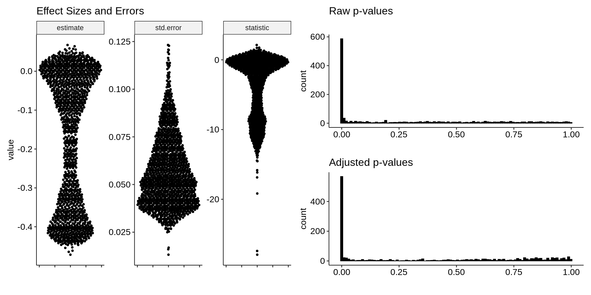
    


Given the standard error distribution, there appears to be a meaningful threshold at approximately -0.25, reflected in the bulge past that point in the distributions of both the midpoint shifts and the test statistics. Since we often use stop effects to calibrate loss-of-function effects (and we don't see much GoF here), we can see if stops are generally below -0.25:


    
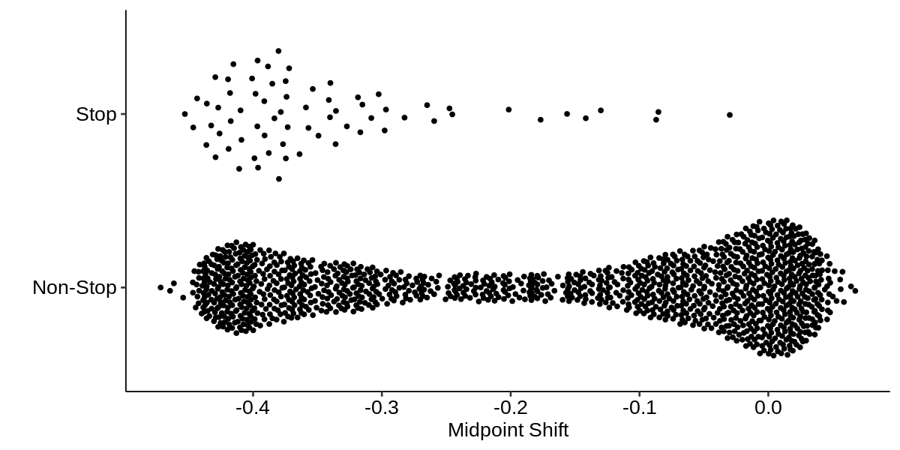
    


To see if there is anything special about the less-negative stops, we can plot them across the chunk:


    
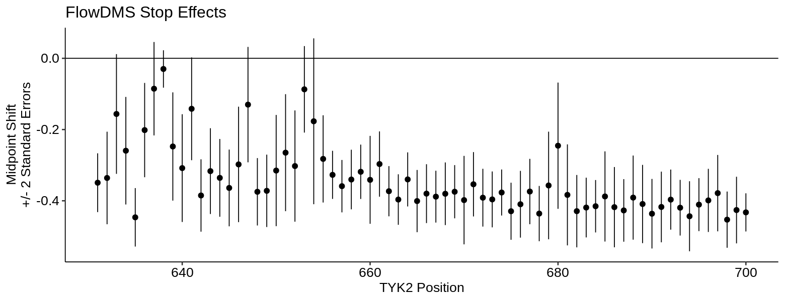
    


Generally, we test whether a variant effect (defined as a mutant compared to WT) is different from zero. Here, we can evaluate what varying that threshold would do to the resulting summary statistics. Below, we test against the indicated "expected" or "null" midpoint shifts and show the resulting `-log10(unadjusted p-value)`. This is used instead of the Z-statistic directly, since we do not want weakly positive variants to be "significant" here just because we are testing against a negative null hypothesis:


    
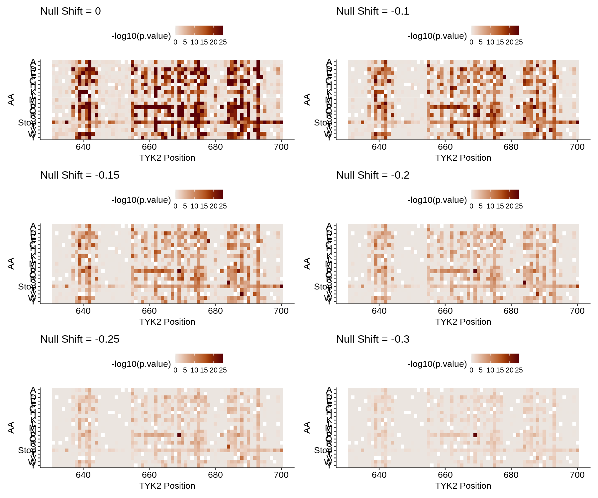
    


#### Joint DMS/FlowDMS Calibration: Scaling <a name="part2"></a>

Above, we have a knob to tune the magnitude of an effect required to achieve significance for FlowDMS. Now, we would like to jointly evaluate the relationship between these FlowDMS summary statistics and the IFN-alpha DMS dataset. If we plot the summary statistics we usually use, the log2 fold change and the midpoint shift, we get the following:


    
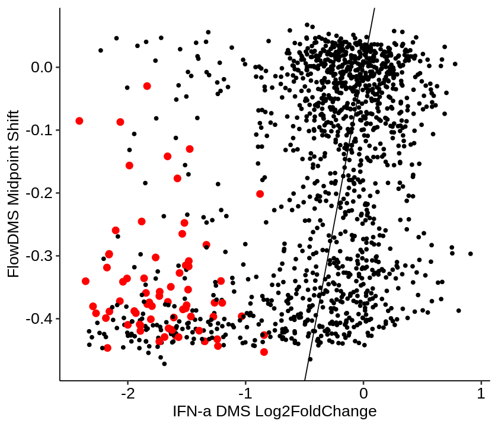
    


It makes sense that these aren't particularly well related, since they're fundamentally different quantities. We would like to rescale these values so they are more comparable. To start, since the midpoint is essentially a ratio (though not a mutant to WT ratio), we could work with the fold change itself instead of the log2 fold change. **Then, the DMS WT value becomes 1.**

Similarly, instead of the midpoint shift, we could work with the raw midpoint itself. **Then, the FlowDMS WT value becomes 0.657**


    
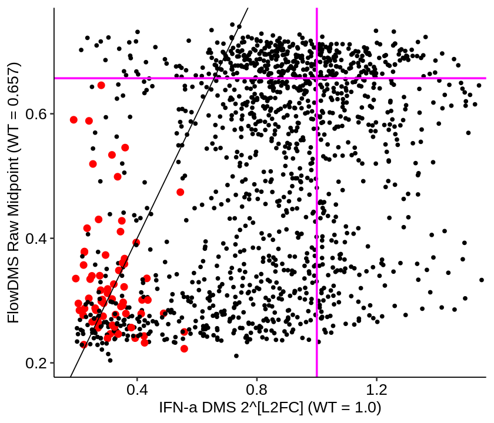
    


If we find the median stop effect for the DMS fold change and FlowDMS raw midpoint, we obtain strikingly similar values:


    
    
    | DMS Stop Median| FlowDMS Stop Median|
    |---------------:|-------------------:|
    |       0.3131436|           0.3009936|


    
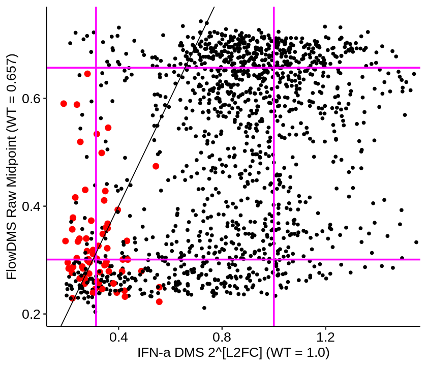
    


This is looking better - the stop effect seems naturally well calibrated between both assays. Now, we need to equalize the WT effect while holding the stop effect fixed. The easiest way to do that is by applying the following min-max transformation to each assay:

$$ \frac{value - median(stop)}{WT - median(stop)} $$

Where $WT$ and $stop$ are the point estimates of the WT and stop scores.


    
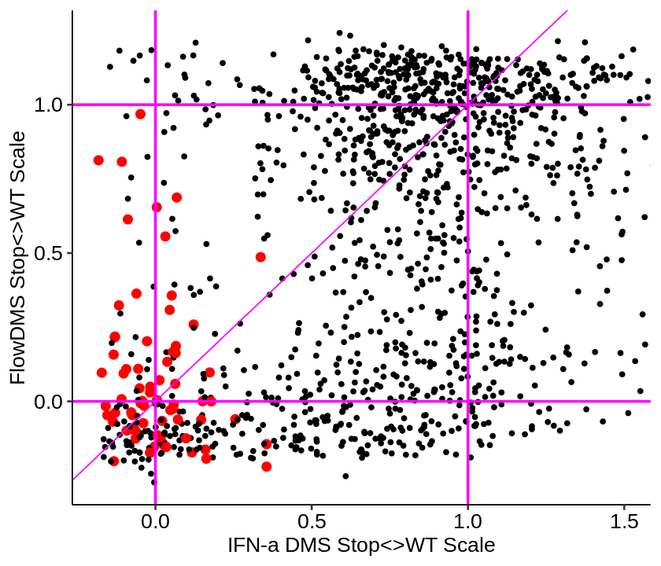
    


The remaining challenge is to propagate error sufficiently through these transformation to do inference such that we could test for a difference between these two quantities being non-zero. This may not require considering WT error since it is so small relative to the variants themselves, but exponentiation means it cannot be directly computed using the original standard errors.

#### Joint DMS/FlowDMS Calibration: Meta-Analysis/Meta-Regression <a name="part3"></a>

An alternative approach for profiling assay differences uses tools like meta-regression to model the global relationship between the estimates and errors from both assays on their own terms, and then uses that relationship to identify points which are outside the global pattern. The effect size estimates and their confidence intervals are shown below:


    
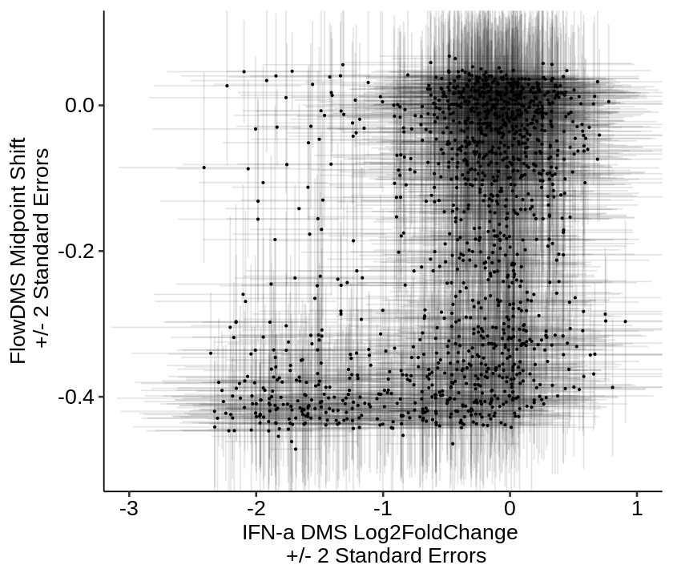
    


Since we have meaningful error bars in both directions, we need a dual error-in-predictor and error-in-response model:

$$ midpoint\ shift | error \sim L2FC | error $$

Where we consider the point estimates and their error bars jointly. This is complex analytically (but may be tractable), but straightforward using Bayesian meta-regression. The specific call to `brms` is shown below, where we have errors in both the predictor via `me()` and in the response via `se()`:


```R
priors <- prior(normal(0,1), class = b)

mod <- brm(formula = estimate.y | se(std.error.y, sigma = TRUE) ~ 0 + me(estimate.x, std.error.x),
           data = combined,
           prior = priors,
           backend = "cmdstanr",
           cores = 4,
           chains = 4)

summary(mod)
```

    Start sampling
    


     Family: gaussian 
      Links: mu = identity; sigma = identity 
    Formula: estimate.y | se(std.error.y, sigma = TRUE) ~ 0 + me(estimate.x, std.error.x) 
       Data: combined (Number of observations: 1400) 
      Draws: 4 chains, each with iter = 2000; warmup = 1000; thin = 1;
             total post-warmup draws = 4000
    
    Population-Level Effects: 
                            Estimate Est.Error l-95% CI u-95% CI Rhat Bulk_ESS
    meestimate.xstd.error.x     0.27      0.01     0.26     0.29 1.00     2641
                            Tail_ESS
    meestimate.xstd.error.x     2751
    
    Family Specific Parameters: 
          Estimate Est.Error l-95% CI u-95% CI Rhat Bulk_ESS Tail_ESS
    sigma     0.16      0.00     0.15     0.17 1.00     2695     2640
    
    Draws were sampled using sample(hmc). For each parameter, Bulk_ESS
    and Tail_ESS are effective sample size measures, and Rhat is the potential
    scale reduction factor on split chains (at convergence, Rhat = 1).


The estimated slope is 0.27, which makes sense given the previous plot. We compute the prediction intervals for each variant, meaning the prediction of the model given a particular DMS effect size and standard error. Since this is a Bayesian model, these are evaluated by sampling, so we also have a 95% confidence interval on each predicted variant:


    
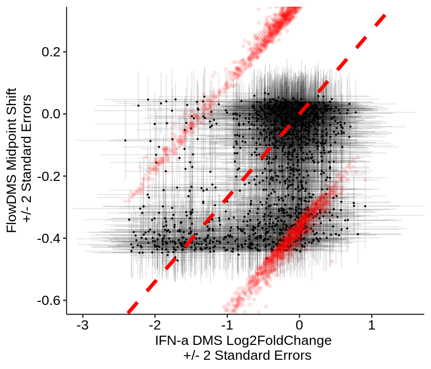
    


From the variant set, it is simple to extract those whose actual interval does not overlap the predicted interval:


    
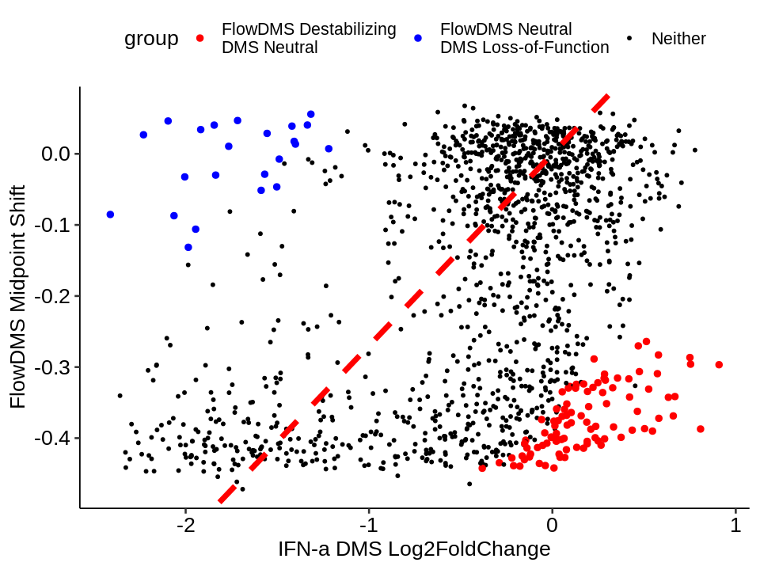
    


We can extract and pile up the variants in the upper and lower cluster, respectively, and show them on a heatmap to get a sense of their positional distribution:


    
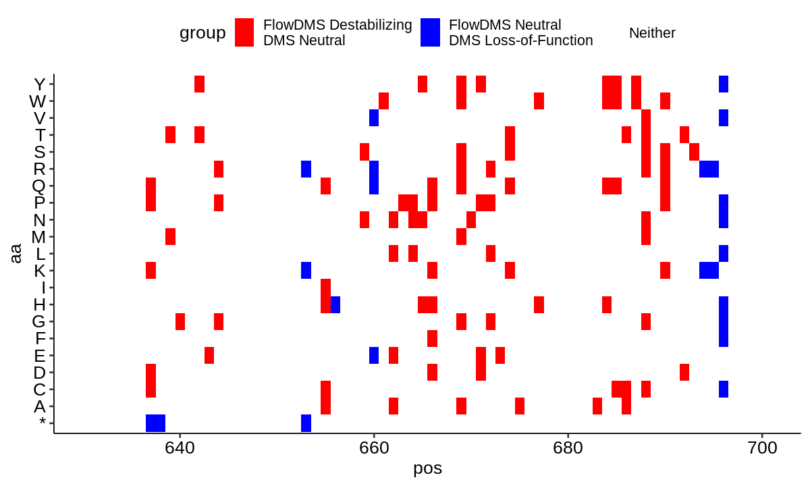
    


There are many caveats on this result, but one consistent outcome of all these approaches is that there are many more variants that show evidence of destabilization by FlowDMS, but no functional effect in the IFN-alpha DMS assay. This does not seem explicable (as of yet) as a calibration issue - examining the underlying raw data for several spike-ins in this class is very convincing. Four spike-ins provide a good way to evaluate this:


    
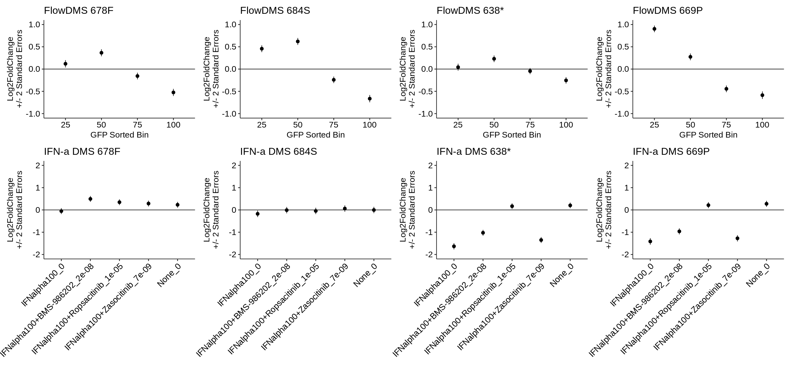
    

