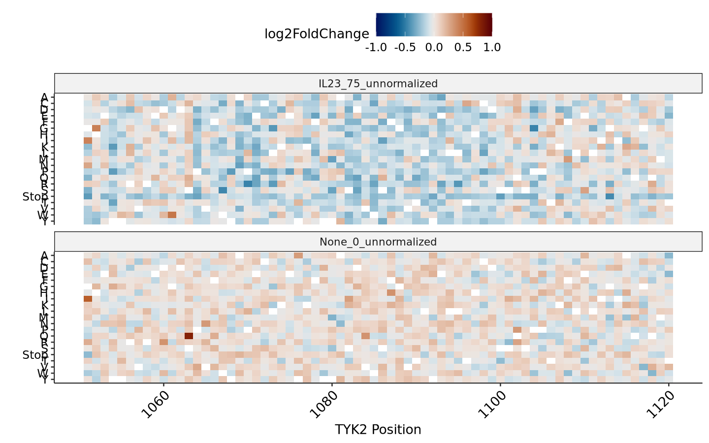
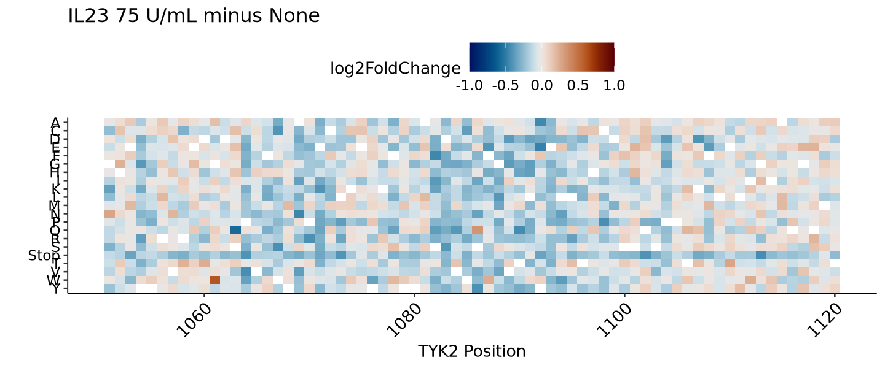
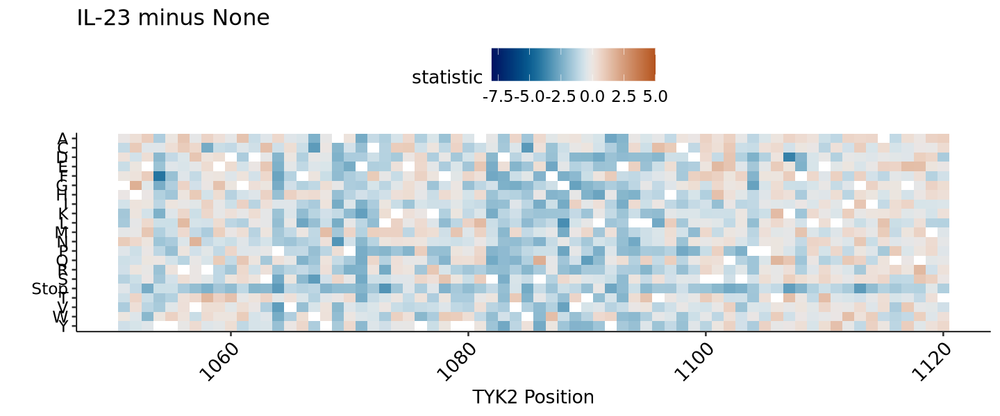
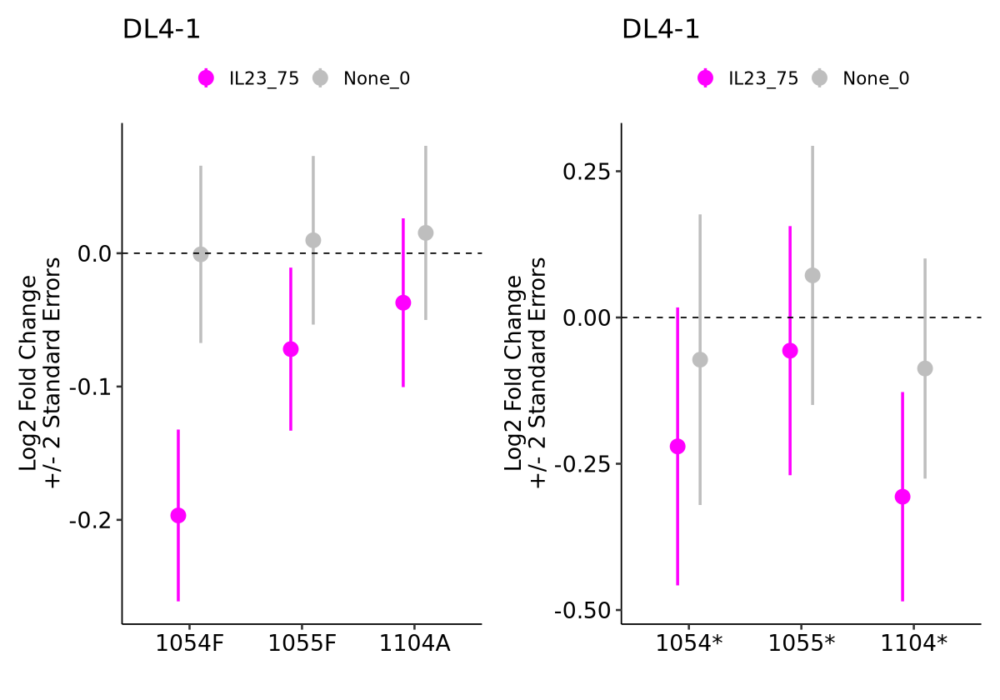
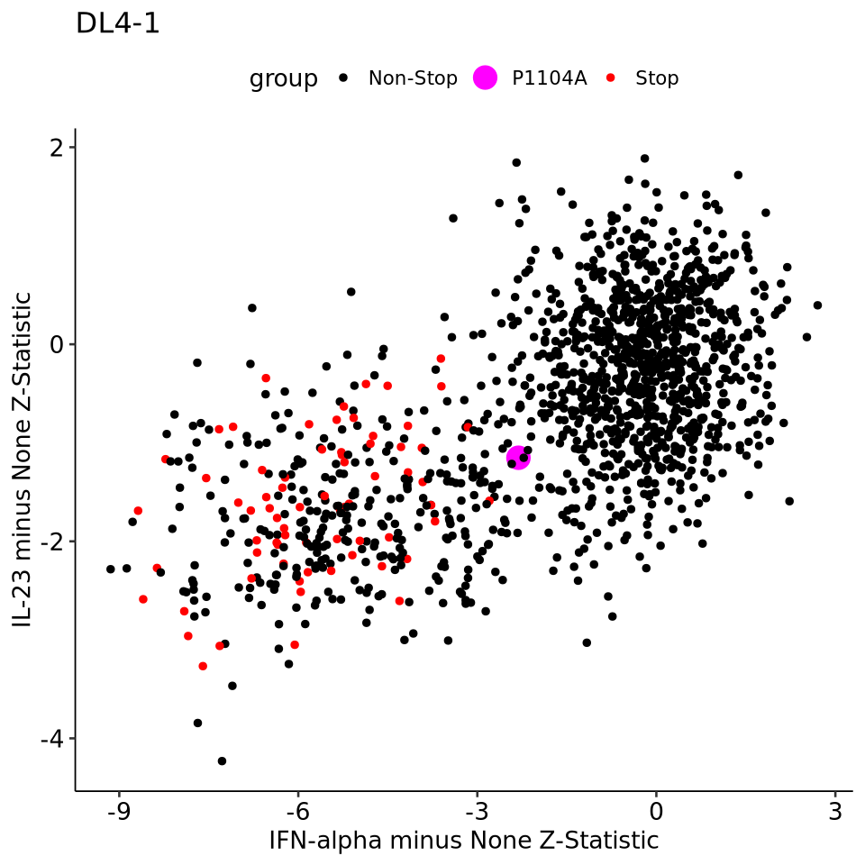

## TYK2 DMS IL-23 Assay

### Summary Statistics
  -  DL4-1: [Normalized](../sumstats/TYK2/run10/tyk2-run10-DL4_1-normalized.tsv), [Unnormalized](../sumstats/TYK2/run10/tyk2-run10-DL4_1-unnormalized.tsv)
  -  DL4-2: [Normalized](../sumstats/TYK2/run10/tyk2-run10-DL4_2-normalized.tsv), [Unnormalized](../sumstats/TYK2/run10/tyk2-run10-DL4_1-unnormalized.tsv)
  -  DL7: [Normalized](../sumstats/TYK2/run10/tyk2-run10-DL7-normalized.tsv), [Unnormalized](../sumstats/TYK2/run10/tyk2-run10-DL7-unnormalized.tsv)

### Heatmaps

    

    

    

    

    

    

    

    

### Spike-ins

    

    

    

    

### IL-23 <-> IFN-alpha Comparison

    

    

    
    
    | Position|AA | IFNalpha_log2FoldChange| IFNalpha_log2StdError| IFNalpha_Zstatistic| IL23_log2FoldChange| IL23_log2StdError| IL23_Zstatistic|
    |--------:|:--|-----------------------:|---------------------:|-------------------:|-------------------:|-----------------:|---------------:|
    |     1053|W  |              -0.0827550|             0.2978072|          -0.2778813|          -0.2754210|         0.1277546|       -2.155860|
    |     1058|C  |              -0.2016777|             0.2499065|          -0.8070123|          -0.2942338|         0.1149411|       -2.559865|
    |     1070|K  |              -0.2310286|             0.2871290|          -0.8046161|          -0.2367976|         0.1156177|       -2.048109|
    |     1078|Q  |              -0.0574185|             0.3408507|          -0.1684565|          -0.3507207|         0.1543106|       -2.272822|
    |     1091|H  |              -0.2205913|             0.2998932|          -0.7355662|          -0.3693397|         0.1336696|       -2.763079|
    |     1091|Q  |               0.2725681|             0.3518843|           0.7745959|          -0.3057679|         0.1511334|       -2.023166|
    |     1099|M  |               0.0263139|             0.3717268|           0.0707883|          -0.2966237|         0.1450674|       -2.044730|

