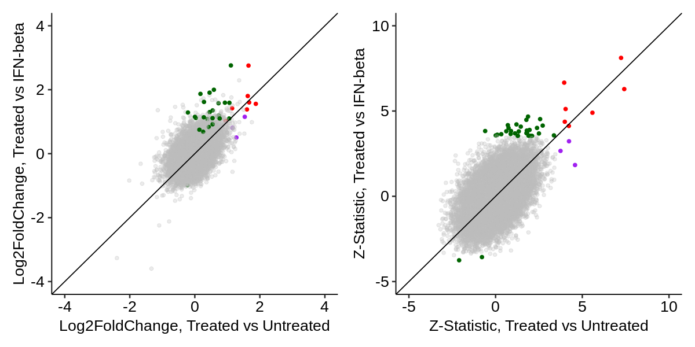
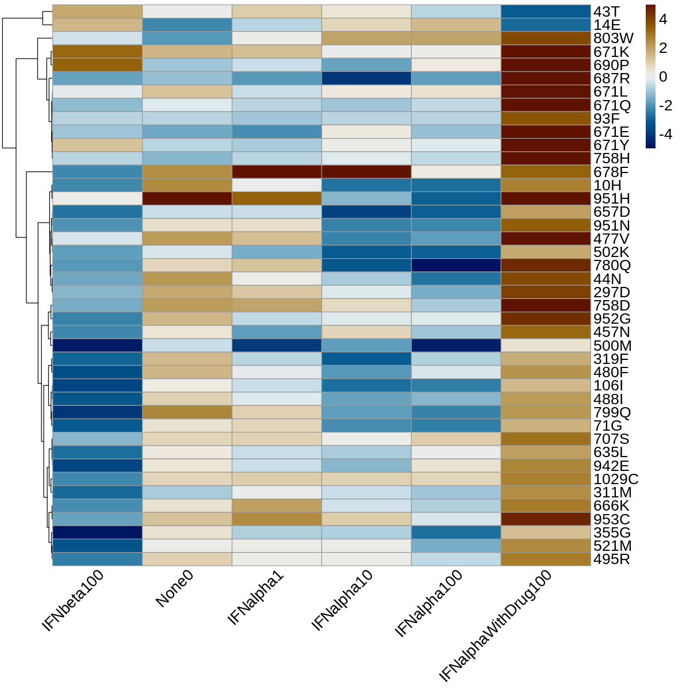

### TYK2 Normalization Condition: IFN-Beta vs Untreated

We have seen that normalizing our primary, IFN-alpha- or drug-treated samples to IFN-beta or Untreated produces meaningfully distinct results. Generally (though not perfectly), normalization to Untreated results in a significant hit list that is slightly smaller, and for drug-treated comparisons nearly a subset, than that for IFN-beta. To better understand these differences, we focus here on the comparisons involving `IFNalphaWithDrug100`, as that was the comparison that motivated this analysis. To start, let's extract all significant variants from `IFNalphaWithDrug100 - IFNbeta100` or `IFNalphaWithDrug100 - None0` and compare them:

    

    

Generally, these will be the variants that are significant in the `IFNbeta100 - None0` comparison. We can examine their trajectories by plotting their _within_ condition mutant vs WT effects across all conditions. This will make it clear why one normalization results in a significant difference, but the other does not:

    

    

There is a set of variants (the core drug binding pocket, position 671 and others) which are similarly neutral in both IFN-beta and None. However, there is another class of variants which does appear elevated in IFNalpha100withDrug comapred to the other conditions, but which is also LoF within the IFN-beta condition alone. These borderline variants are the main class captured by IFN-beta normalization, but excluded by None-normalization.

Next, let's take these same variants and compute the difference between `None0` and `IFNbeta100`. We expect that some of these will be no different (particularly for variants which were significant in both `IFNalpha100withDrug - None0` and `IFNalpha100withDrug - IFNbeta100`:

    

    

The positive effects above are significantly more active in `None0` compared to `IFNbeta100`, and thus are "basal activators" of the signaling pathway. In contrast, negative effects are much rarer and describe variants which suppress residual basal activity from WT. For TYK2, we know that residual WT basal activity is very low, so there is not much bandwidth to further lower it. That being said, 690P is notable for being both in the drug-binding area and having a borderline significant negative effect.
