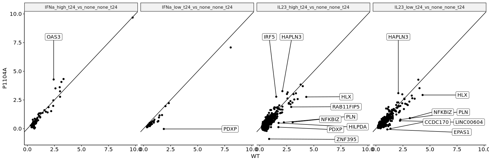
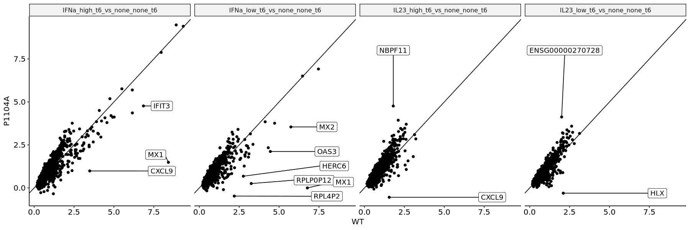

# Curated TYK2-Cytokine Differential Expression Analysis


#### Defining Cytokine Responsive Genes in WT Background

<details class="code-fold">
<summary>Code</summary>

``` r
library(ggpubr)
library(DESeq2)
library(ggrepel)
library(tidyverse)
```

</details>
<details class="code-fold">
<summary>Code</summary>

``` r
alignments <- read_tsv("../pipeline/RNASEQ/diffexp-1-2-combined/multiqc_data/multiqc_star.txt",
                       show_col_types = FALSE) %>%
    mutate(id = as.numeric(gsub("_.*", "", Sample)))

paths <- str_c("../pipeline/RNASEQ/diffexp-1-2-combined/",
                    alignments$Sample,
                    ".counts.tsv")
names(paths) <- paths

df <- map_dfr(paths,
              ~read_tsv(.x,
                        col_names = NULL,
                        skip = 2,
                        col_select = c(1,7),
                        show_col_types = FALSE),
              .id = "sample") %>%
    rename("gene" = "X1",
           "count" = "X7") %>%
    mutate(sample = gsub("../pipeline/RNASEQ/diffexp-1-2-combined/|.counts.tsv", "", sample))

df_id <- df %>%
    mutate(id = as.character(gsub("_.*", "", sample))) %>%
    select(-sample) %>%
    arrange(id)
```

</details>
<details class="code-fold">
<summary>Code</summary>

``` r
samp_prop <- read_tsv("../sumstats/RNASEQ/run2/sample-properties-il23.tsv", show_col_types = FALSE) %>%
    arrange(sample_id) %>%
    mutate(rep = rep(c(1,2), 40),
           covariate = as.factor(str_c(group, "_", cytokine, "_", dosage, "_", time)),
           sample_id = as.character(sample_id))
rownames(samp_prop) <- samp_prop$sample_id
samp_prop <- samp_prop[1:56,]

count_matrix_long <- inner_join(df_id, samp_prop, by = c("id" = "sample_id")) %>%
    filter(!is.na(covariate)) %>%
    arrange(time, group, cytokine, dosage, rep) %>%
    select(gene, covariate, rep, count)
```

</details>

    Warning message:
    “Setting row names on a tibble is deprecated.”

<details class="code-fold">
<summary>Code</summary>

``` r
de_prop <- samp_prop %>%    filter(!is.na(cytokine)) %>%
    arrange(covariate)
rownames(de_prop) <- str_c(de_prop$covariate, "_", de_prop$rep)
de_prop <- de_prop %>% filter(grepl("WT", covariate))

de_data <- df_id %>%
    inner_join(de_prop %>% select(sample_id, covariate, rep), by = c("id" = "sample_id")) %>%
    select(-id) %>%
    filter(grepl("WT", covariate)) %>%
    arrange(covariate, rep) %>%
    pivot_wider(names_from = covariate:rep, values_from = count)
```

</details>

    Warning message:
    “Setting row names on a tibble is deprecated.”

<details class="code-fold">
<summary>Code</summary>

``` r
deobj_counts <- DESeqDataSetFromMatrix(countData = de_data %>% select(-gene),
    colData = de_prop,
    design = ~ -1 + covariate)

deresult <- DESeq(deobj_counts)
```

</details>

    converting counts to integer mode

    factor levels were dropped which had no samples

    estimating size factors

    estimating dispersions

    gene-wise dispersion estimates

    mean-dispersion relationship

    final dispersion estimates

    fitting model and testing

<details class="code-fold">
<summary>Code</summary>

``` r
comparison_1 <- c("WT_IFNa_high_t24", "WT_IFNa_low_t24",
                  "WT_IL10_high_t24", "WT_IL10_low_t24",
                  "WT_IL23_high_t24", "WT_IL23_low_t24",
                  "WT_IFNa_high_t6", "WT_IFNa_low_t6",
                  "WT_IL10_high_t6", "WT_IL10_low_t6",
                  "WT_IL23_high_t6", "WT_IL23_low_t6")

comparison_2 <- c(rep("WT_none_none_t24", 6),
                  rep("WT_none_none_t6", 6))

sumstats <- map2_dfr(.x = comparison_1, .y = comparison_2,
                     .f = ~results(deresult,
                               contrast = c("covariate", .x, .y)) %>%
                         as_tibble() %>%
                         mutate("comparison" = str_c(.x, "_vs_", .y)) %>%
                         bind_cols("gene" = de_data$gene))

de_genes_by_cond <- sumstats %>%
    filter(padj < 0.01, log2FoldChange > 0) %>%
    select(comparison, gene)
```

</details>
<details class="code-fold">
<summary>Code</summary>

``` r
sumstats %>%
    filter(padj < 0.01, log2FoldChange > 0) %>%
    dplyr::count(comparison) 

de_genes_by_cond %>%
    dplyr::count(gene) %>%
    arrange(-n) %>%
    head(10)
```

</details>

A tibble: 11 × 2

| comparison \<chr\>                   | n \<int\> |
|--------------------------------------|-----------|
| WT_IFNa_high_t24_vs_WT_none_none_t24 | 68        |
| WT_IFNa_high_t6_vs_WT_none_none_t6   | 1579      |
| WT_IFNa_low_t24_vs_WT_none_none_t24  | 30        |
| WT_IFNa_low_t6_vs_WT_none_none_t6    | 1282      |
| WT_IL10_high_t24_vs_WT_none_none_t24 | 33        |
| WT_IL10_high_t6_vs_WT_none_none_t6   | 3         |
| WT_IL10_low_t6_vs_WT_none_none_t6    | 1062      |
| WT_IL23_high_t24_vs_WT_none_none_t24 | 517       |
| WT_IL23_high_t6_vs_WT_none_none_t6   | 1746      |
| WT_IL23_low_t24_vs_WT_none_none_t24  | 612       |
| WT_IL23_low_t6_vs_WT_none_none_t6    | 1744      |

A tibble: 10 × 2

| gene \<chr\> | n \<int\> |
|--------------|-----------|
| STAT1        | 10        |
| JAK3         | 8         |
| PARP9        | 8         |
| ADAM19       | 7         |
| AGPAT3       | 7         |
| ARID5A       | 7         |
| BCL3         | 7         |
| BCL6         | 7         |
| CCHCR1       | 7         |
| CFLAR        | 7         |

#### Examining P1104A Expression at These Genes

<details class="code-fold">
<summary>Code</summary>

``` r
de_prop_1104a <- samp_prop %>%
    filter(!is.na(cytokine)) %>%
    arrange(covariate)
rownames(de_prop) <- str_c(de_prop$covariate, "_", de_prop$rep)
de_prop_1104a <- de_prop_1104a %>% filter(!grepl("WT", covariate))

de_data_1104a <- df_id %>%
    inner_join(de_prop_1104a %>% select(sample_id, covariate, rep), by = c("id" = "sample_id")) %>%
    select(-id) %>%
    filter(!grepl("WT", covariate)) %>%
    arrange(covariate, rep) %>%
    pivot_wider(names_from = covariate:rep, values_from = count)
```

</details>

    Warning message:
    “Setting row names on a tibble is deprecated.”

<details class="code-fold">
<summary>Code</summary>

``` r
deobj_counts_1104a <- DESeqDataSetFromMatrix(countData = de_data_1104a %>% select(-gene),
    colData = de_prop_1104a,
    design = ~ -1 + covariate)

deresult_1104a <- DESeq(deobj_counts_1104a)
```

</details>

    converting counts to integer mode

    factor levels were dropped which had no samples

    estimating size factors

    estimating dispersions

    gene-wise dispersion estimates

    mean-dispersion relationship

    final dispersion estimates

    fitting model and testing

<details class="code-fold">
<summary>Code</summary>

``` r
comparison_1_1104a <- c("P1104A_IFNa_high_t24", "P1104A_IFNa_low_t24",
                  "P1104A_IL10_high_t24", "P1104A_IL10_low_t24",
                  "P1104A_IL23_high_t24", "P1104A_IL23_low_t24",
                  "P1104A_IFNa_high_t6", "P1104A_IFNa_low_t6",
                  "P1104A_IL10_high_t6", "P1104A_IL10_low_t6",
                  "P1104A_IL23_high_t6", "P1104A_IL23_low_t6")

comparison_2_1104a <- c(rep("P1104A_none_none_t24", 6),
                        rep("P1104A_none_none_t6", 6))

sumstats_1104a <- map2_dfr(.x = comparison_1_1104a, .y = comparison_2_1104a,
                         .f = ~results(deresult_1104a,
                                   contrast = c("covariate", .x, .y)) %>%
                             as_tibble() %>%
                             mutate("comparison" = str_c(.x, "_vs_", .y)) %>%
                             bind_cols("gene" = de_data_1104a$gene))
```

</details>
<details class="code-fold">
<summary>Code</summary>

``` r
restricted_sumstats_1104a <- inner_join(de_genes_by_cond %>% mutate(comparison = gsub("WT", "P1104A", comparison)),
                                        sumstats_1104a, by = join_by(comparison, gene)) %>%
    mutate(comparison = gsub("P1104A_|_P1104A_", "", comparison),
           genotype = "P1104A")

restricted_sumstats_wt <- inner_join(de_genes_by_cond,
                                     sumstats, by = join_by(comparison, gene)) %>%
    mutate(comparison = gsub("WT_|_WT_", "", comparison),
           genotype = "WT")

restricted_sumstats <- bind_rows(restricted_sumstats_1104a,
                                 restricted_sumstats_wt) %>%
    mutate(comparison = gsub("vs", "vs_", comparison))

effect_sizes <- restricted_sumstats %>%
    select(comparison, genotype, gene, log2FoldChange) %>%
    pivot_wider(names_from = genotype, values_from = log2FoldChange) %>%
    filter(!grepl("IL10", comparison))

logp_values <- restricted_sumstats %>%
    select(comparison, genotype, gene, padj) %>%
    mutate(padj = -log10(padj)) %>%
    pivot_wider(names_from = genotype, values_from = padj) %>%
    filter(!grepl("IL10", comparison))
```

</details>
<details class="code-fold">
<summary>Code</summary>

``` r
options(repr.plot.width = 15, repr.plot.height = 5)
es_t24 <- effect_sizes %>% filter(grepl("t24", comparison))
es_t24_diff <- es_t24 %>% filter(abs(WT-P1104A)>1)
es_t24 %>%
    ggplot() +
        geom_point(aes(x = WT, y = P1104A)) +
        geom_label_repel(data = es_t24_diff,
                         aes(x = WT, y = P1104A, label = gene),
                         nudge_x = if_else(es_t24_diff$P1104A - es_t24_diff$WT < 0, 8 - es_t24_diff$WT, 0),
                         nudge_y = if_else(es_t24_diff$P1104A - es_t24_diff$WT > 0, 8 - es_t24_diff$P1104A, 0)) +
        theme_pubr() +
        facet_wrap(~comparison, nrow = 1) +
        geom_abline(slope = 1, intercept = 0)

es_t6 <- effect_sizes %>% filter(grepl("t6", comparison))
es_t6_diff <- es_t6 %>% filter(abs(WT-P1104A)>2)
es_t6 %>%
    ggplot() +
        geom_point(aes(x = WT, y = P1104A)) +
        geom_label_repel(data = es_t6_diff,
                         aes(x = WT, y = P1104A, label = gene),
                         nudge_x = if_else(es_t6_diff$P1104A - es_t6_diff$WT < 0, 8 - es_t6_diff$WT, 0),
                         nudge_y = if_else(es_t6_diff$P1104A - es_t6_diff$WT > 0, 8 - es_t6_diff$P1104A, 0)) +
        theme_pubr() +
        facet_wrap(~comparison, nrow = 1) +
        geom_abline(slope = 1, intercept = 0)
```

</details>





<details class="code-fold">
<summary>Code</summary>

``` r
bind_rows(sumstats_1104a, sumstats) %>%
    write_tsv("../sumstats/RNASEQ/run2/combined-restricted/deseq2-within-genotype-comparisons.tsv")
```

</details>
<details class="code-fold">
<summary>Code</summary>

``` r
restricted_sumstats %>%
    write_tsv("../sumstats/RNASEQ/run2/combined-restricted/deseq2-wt-responsive-only.tsv")
```

</details>
