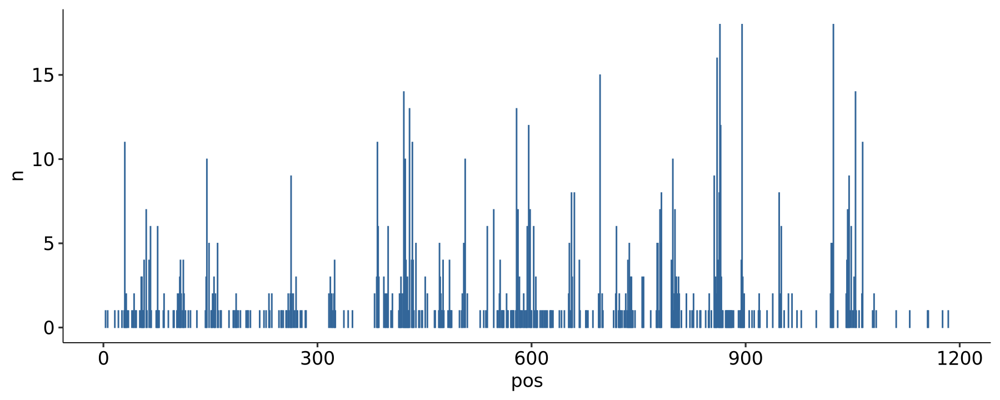

### TYK2 DMS/FlowDMS Global Rescaling

For BMS, we want to convert both the DMS and FlowDMS data to a 0-1 scale for interpretation individually, as well as for comparison on a "common" scale. For DMS, we use the normalized summary statistics from run 7, IFN-alpha 100 U/mL minus Untreated. For FlowDMS, we use the most recent midpoints computed from run 2. These formatted TSVs are located [here](../sumstats/BMS). We can make a simple plot of the relationship between the two derived scores across all variants:

    

    

