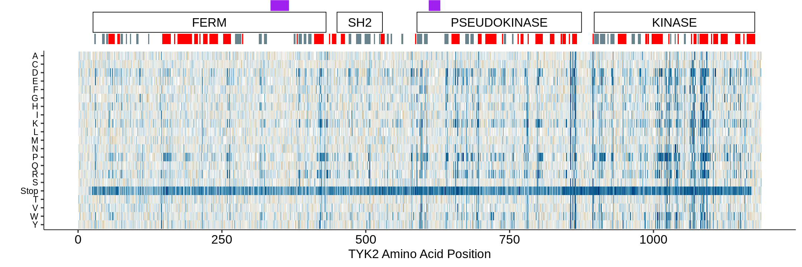
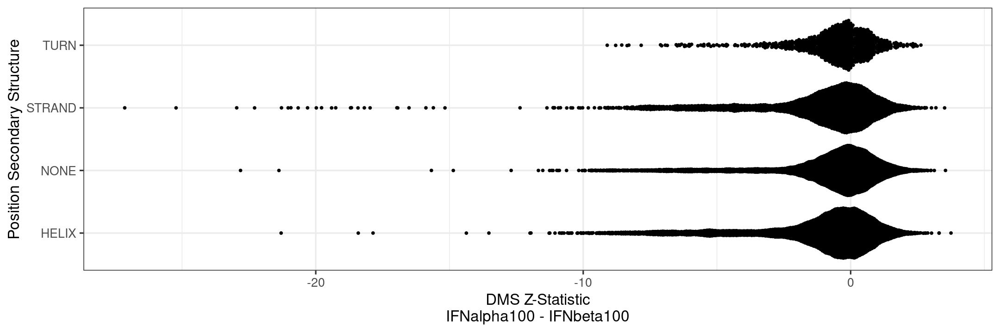

### TYK2 Structural Integration

Human and clinical genetics provides one way of interpreting functional genetic variation. However, biophysics and structural biology also provide a necessary view that considers the physical impact of amino acid substitutions on protein structure instead of evaluating mutation-phenotype links across existing populations. While there will be more, the most fundamental biophysical label to assign each residue is its' secondary structure: either `HELIX`, `STRAND` or `TURN`.

This currently shows IFN-alpha 100 U/mL normalized to Untreated from Assay 7:

    

    

For a more systematic comparison, we can compare the Z-statistic distributions among each group:

    

    

Since different residues will have very different effects on protein functino, we can stratify this by the introduced amino acid. This also helps separate out stops, which are overwhelmingly negative:

    

    

