### TYK2 Summary Statistic Aggregation Across Concentrations

When modeling DMS data, we currently consider each IFN-alpha concentration as a qualitatively distinct factor level. This enables pairwise comparisons between each tested condition and, say, a normalizer condition. However, it does not summarize trends in variant effect _across_ concentrations.

We would like to capture these trends to: i) increase power for effect detection in general, ii) interpret patterns across concentrations, and iii) generate a single variant-level score for comparison with genetic and other data types. There are a few ways we can approach this problem:

1. [Clustering](#part1)
2. [Meta-Regression](#part2)
3. [BMS-986202 Concentration Gradient](#part3)

#### Clustering <a name="part1"></a>

One approach is use clusering to group variants together with similar trajectories across concentrations or conditions. To do this, we define a vector for each variant containing either the effect size (log2FoldChange) or Z-statistic across concentrations. Across all variants, this is what all the trajectories look like: 


    

    


    
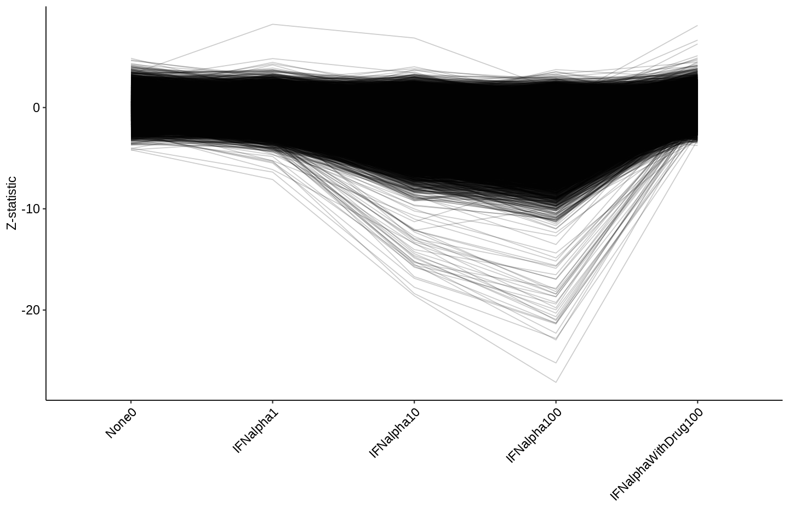
    


Now, we can cluster each of these trajectory sets to group similar variants together. The choice of clustering metric and of the number of clusters are non-trivial, but based on the above there are not _that_ many patterns we need to detect. Some manual experimentation suggested that `k=3` clusters may be the most informative:


    
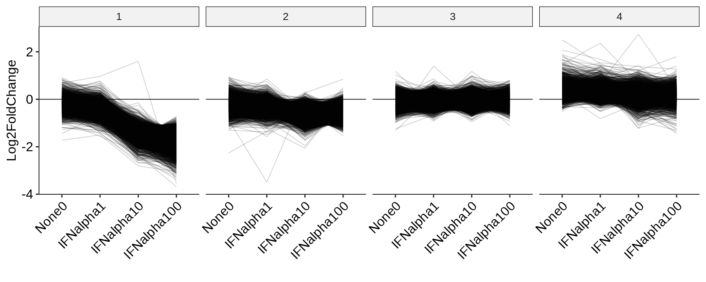
    


    
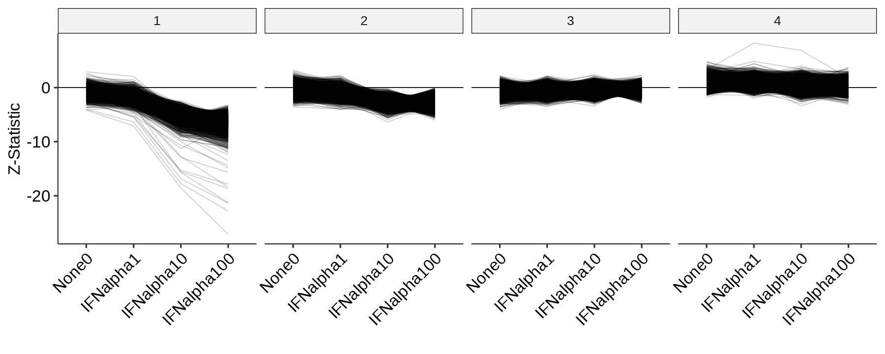
    


Immediately, clusters 1 and 2 appear to represent the strongest LoF and intermediate/partial LoF respectively. Cluster 4 is interesting, as it contains variants with mostly positive effect sizes across all conditions, meaning these are variants whose activity was lowest in the `IFNbeta100` condition (so that any other condition "looks" positive relative to `IFNbeta100`). It also contains the single significant GoF variant at the lower IFN-alpha concentrations. We can see how consistent the two clusterings are:


    
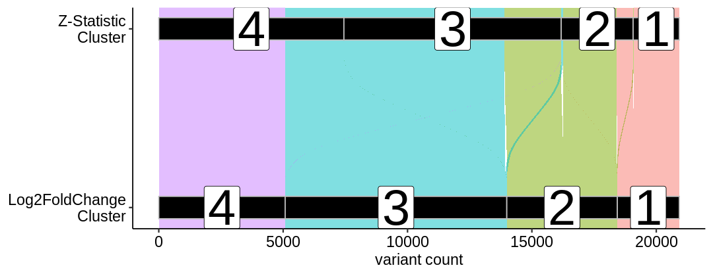
    


Clusters also allow us to modify some other visualizations to look for additional patterns, for example enrichments by residue:


    
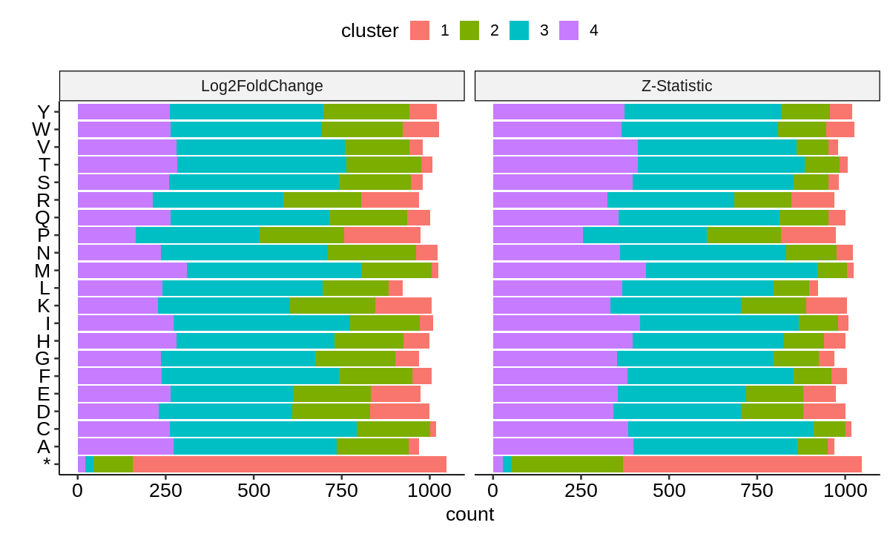
    


For positional enrichments, we can show the clusters via a heatmap, or as a count of the number of variants in each cluster at each position:


    
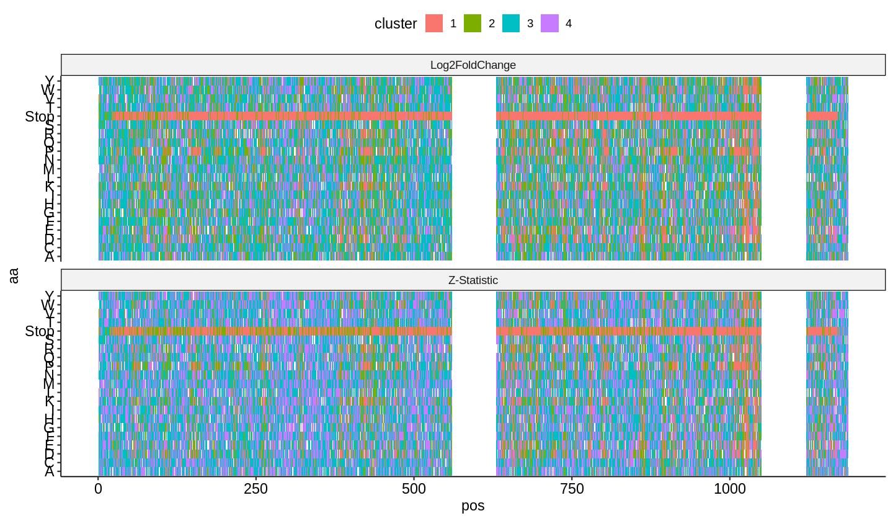
    


    
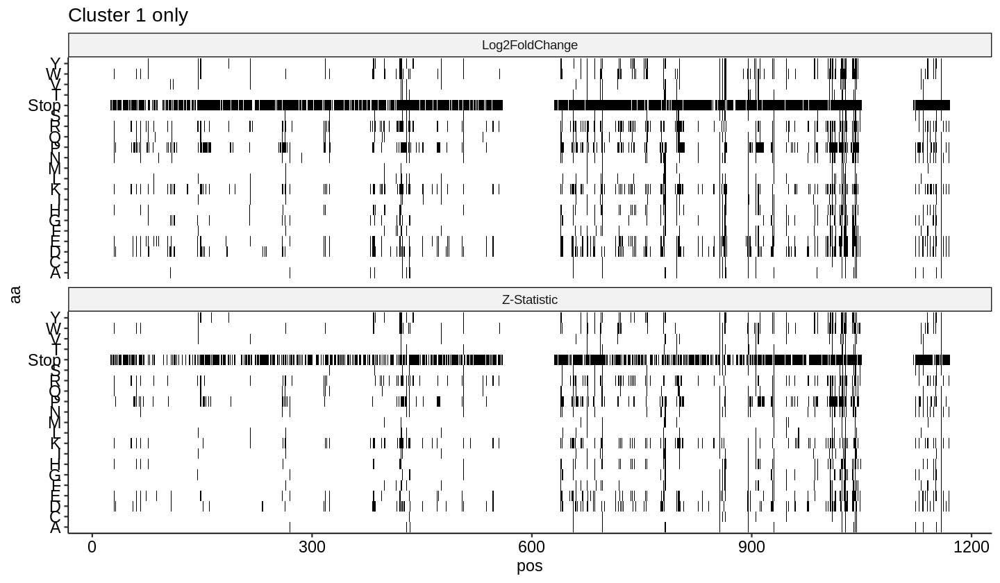
    


    
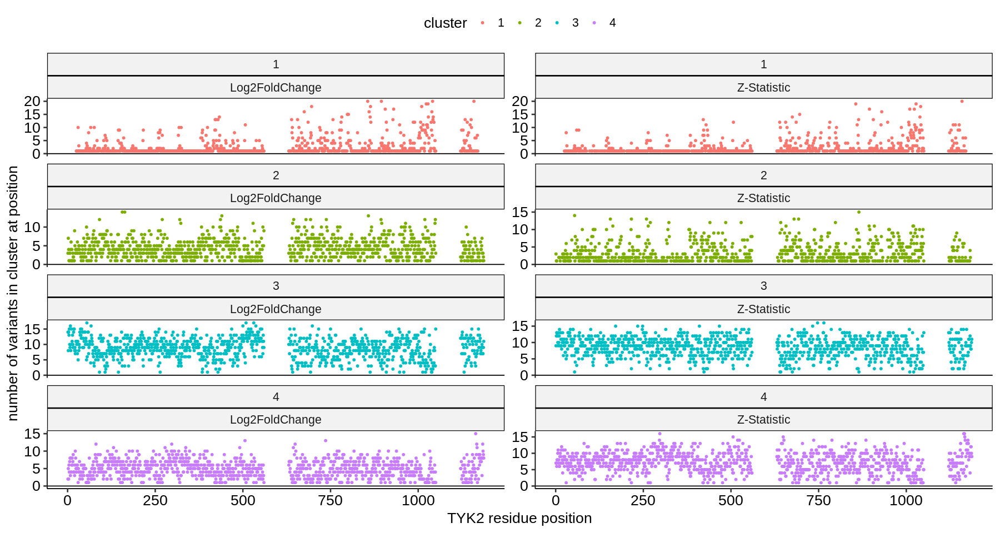
    


#### Meta-Regression <a name="part2"></a>

Alternatively, if we expect the effects to change in a monotonic (meaning always increasing or decreasing with increasing concentration) or a linear fashion, we can use Bayesian meta-regression to model this change and explicitly test whether it is significantly different from zero:


    
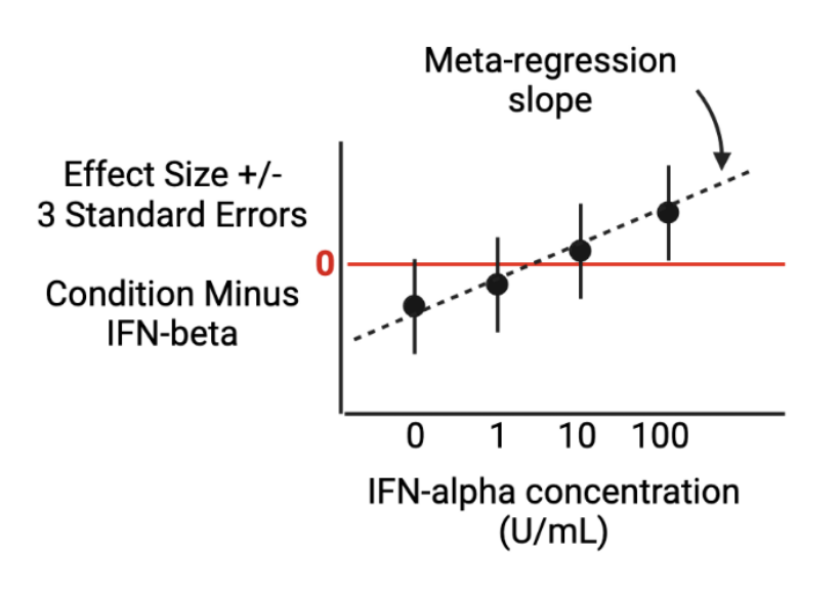
    


We can fit this model using `brms`, and one option is the linear slope shown above. Another, more flexible option available is monotonic regression (also called "isotonic" regression) that does not assume linearity, but only that the direction of the change from each lower to higher concentration step is the same (all positive or all negative).

It results in an estimate of the "general" monotonic effect, as well as a simplex that divides the maximum effect (between the largest and smallest concentrations) between each step. It is a bit easier to visualize with an example. Below, we extract one stop codon (randomly chosen at position 945) and show the monotonic model:


```R
priors <- c(prior(normal(0,1), class = Intercept),
            prior(normal(0,1), class = b),
            prior(dirichlet(c(1,1,1)), class = simo, coef = moencoding1))

mod <- brm(log2FoldChange | se(std.error) ~ 1 + mo(encoding),
           data = data,
           prior = priors,
           iter = 5000,
           cores = 10,
           refresh = 0)

summary(mod)
```

    Compiling Stan program...
    
    Start sampling
    


     Family: gaussian 
      Links: mu = identity; sigma = identity 
    Formula: log2FoldChange | se(std.error) ~ 1 + mo(encoding) 
       Data: data (Number of observations: 4) 
      Draws: 4 chains, each with iter = 5000; warmup = 2500; thin = 1;
             total post-warmup draws = 10000
    
    Population-Level Effects: 
               Estimate Est.Error l-95% CI u-95% CI Rhat Bulk_ESS Tail_ESS
    Intercept     -0.32      0.21    -0.71     0.11 1.00     4137     4783
    moencoding    -0.58      0.11    -0.79    -0.38 1.00     3942     4793
    
    Simplex Parameters: 
                   Estimate Est.Error l-95% CI u-95% CI Rhat Bulk_ESS Tail_ESS
    moencoding1[1]     0.19      0.13     0.01     0.47 1.00     5449     3839
    moencoding1[2]     0.56      0.17     0.21     0.88 1.00     5608     5598
    moencoding1[3]     0.25      0.14     0.02     0.56 1.00     5362     3651
    
    Family Specific Parameters: 
          Estimate Est.Error l-95% CI u-95% CI Rhat Bulk_ESS Tail_ESS
    sigma     0.00      0.00     0.00     0.00   NA       NA       NA
    
    Draws were sampled using sampling(NUTS). For each parameter, Bulk_ESS
    and Tail_ESS are effective sample size measures, and Rhat is the potential
    scale reduction factor on split chains (at convergence, Rhat = 1).


We obtain a general "slope" estimate of -0.58, along with the "intercept" of -0.32 and the simplex parameters that define the proportion of the maximum predicted effect within each comparison. These results imply that most of the drop occurs between IFNalpha10 to IFNalpha100, and the change between those two conditions is about 2X the magnitude of the change between the other pairs. Let's see what it looks like - the red lines show the fitted intercept and slope:


    
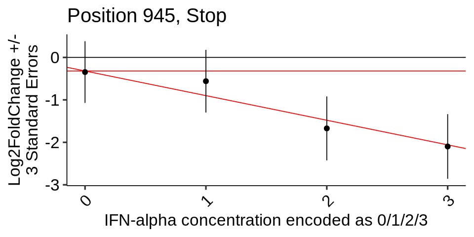
    


In ths plot, the fold change and error bars are taken from the original summary statistics, and the diagonal line is the fitted monotonic slope parameter (with an intercept through zero). Additionally, we also see that the drop between IFNalpha10 and IFNalpha100 (1 and 2 in the plot) is indeed much larger than the 0->1 or 2->3 change, as the model summary described.

Using `brms`, we fit the monotonic model across all variants using the `IFNbeta100`-normalized summary statistics. This generates a new set of summary statistics, which we can characterize with the usual tools:


    
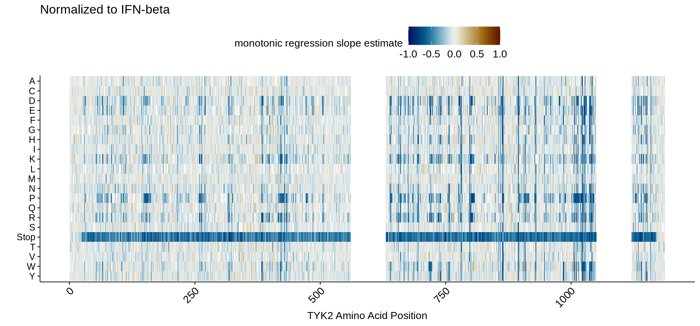
    


    
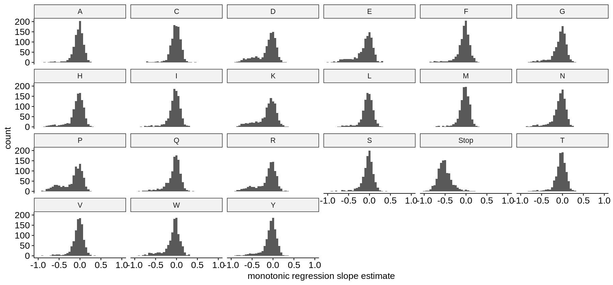
    


We can extract and look at the top gain-of-function variants by adjusted p-value:


    
    
    |term           |  estimate| std.error|aa |pos  | statistic|   p.value|     p.adj|
    |:--------------|---------:|---------:|:--|:----|---------:|---------:|---------:|
    |bsp_moencoding | 0.2865809| 0.0892444|W  |544  |  3.211193| 0.0013219| 0.0127647|
    |bsp_moencoding | 0.3035196| 0.1118880|H  |197  |  2.712710| 0.0066735| 0.0550673|
    |bsp_moencoding | 0.3853863| 0.1456305|S  |220  |  2.646330| 0.0081370| 0.0656168|
    |bsp_moencoding | 0.2605959| 0.0984989|H  |1168 |  2.645673| 0.0081529| 0.0656937|
    |bsp_moencoding | 0.4726404| 0.1842144|C  |998  |  2.565708| 0.0102965| 0.0808198|
    |bsp_moencoding | 0.1912397| 0.0795952|N  |530  |  2.402653| 0.0162766| 0.1204827|
    |bsp_moencoding | 0.2793768| 0.1207457|W  |905  |  2.313762| 0.0206808| 0.1477520|
    |bsp_moencoding | 0.2695466| 0.1169299|K  |905  |  2.305197| 0.0211555| 0.1505785|
    |bsp_moencoding | 0.3207514| 0.1391744|C  |804  |  2.304672| 0.0211850| 0.1507292|
    |bsp_moencoding | 0.1936619| 0.0845296|K  |551  |  2.291053| 0.0219603| 0.1552507|


We can see that only one is signifiant at a 5% FDR, which is 544W. Let's plot the original summary statistics, normalized to `IFNbeta100`, for these ten variants:


    
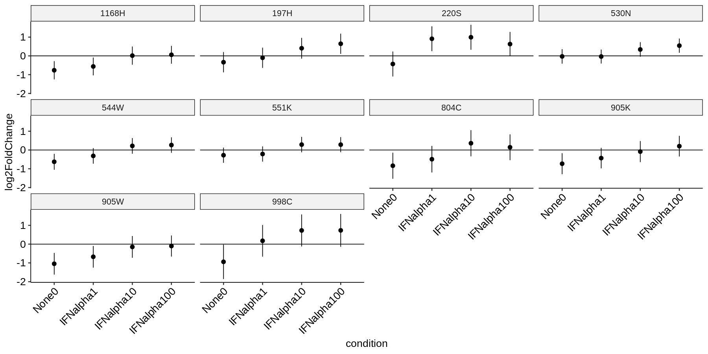
    


Indeed, these are the variants we had imagined retrieving - however, in most cases, the standard errors on the estimates result in the model being sub-significant for all gain-of-function cases except 544W, which not coincidentally has one of the smaller error bars across the shown variants.

#### BMS-986202 Concentration Gradient <a name="part3"></a>

Across several datasets, we now have variant effect profiles under varying concentrations of BMS-986202 (but the same concentration of IFN-alpha). So, we would like to view variants along the concentration axis, but aggregated in a similar way to the clustering above. 


    
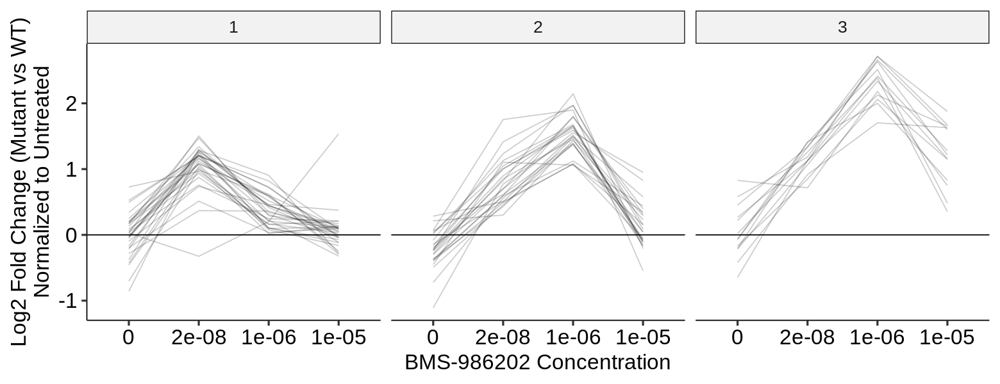
    


    
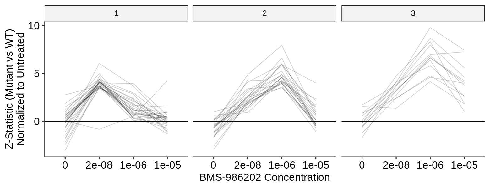
    

