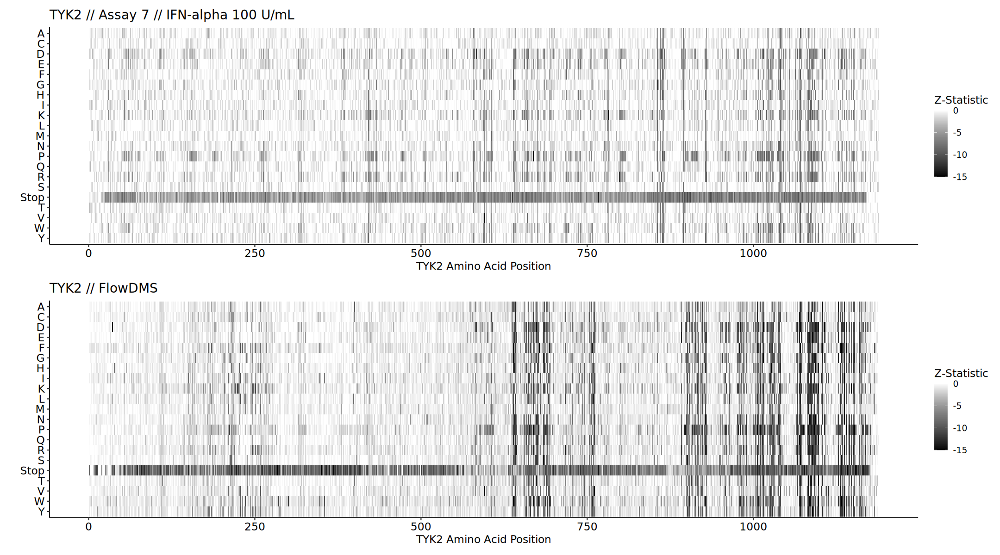
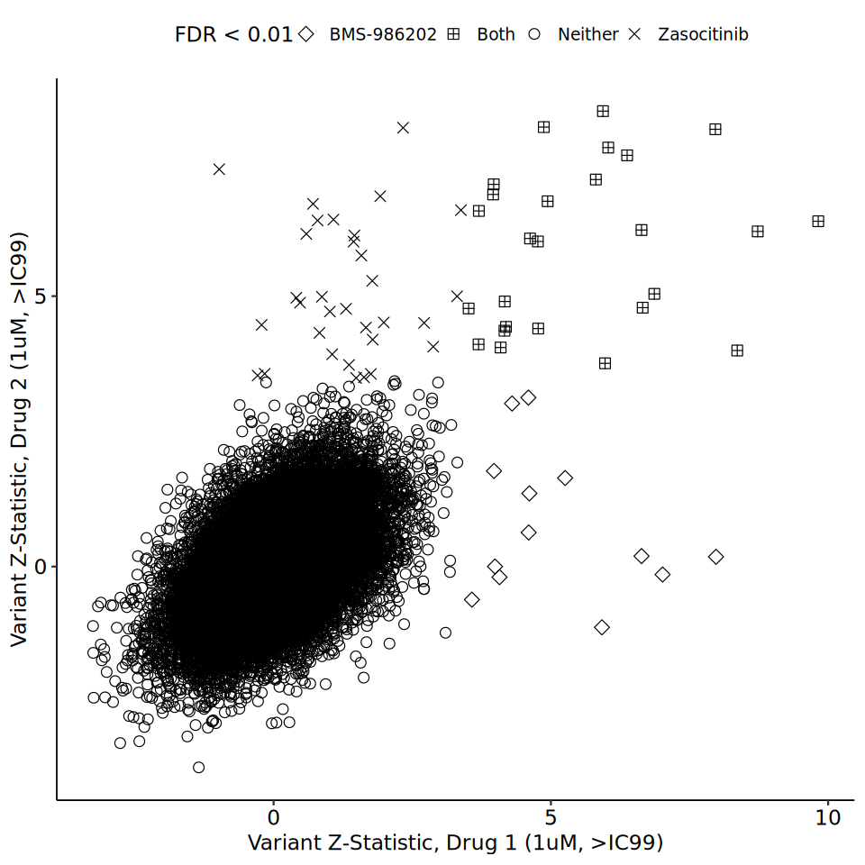
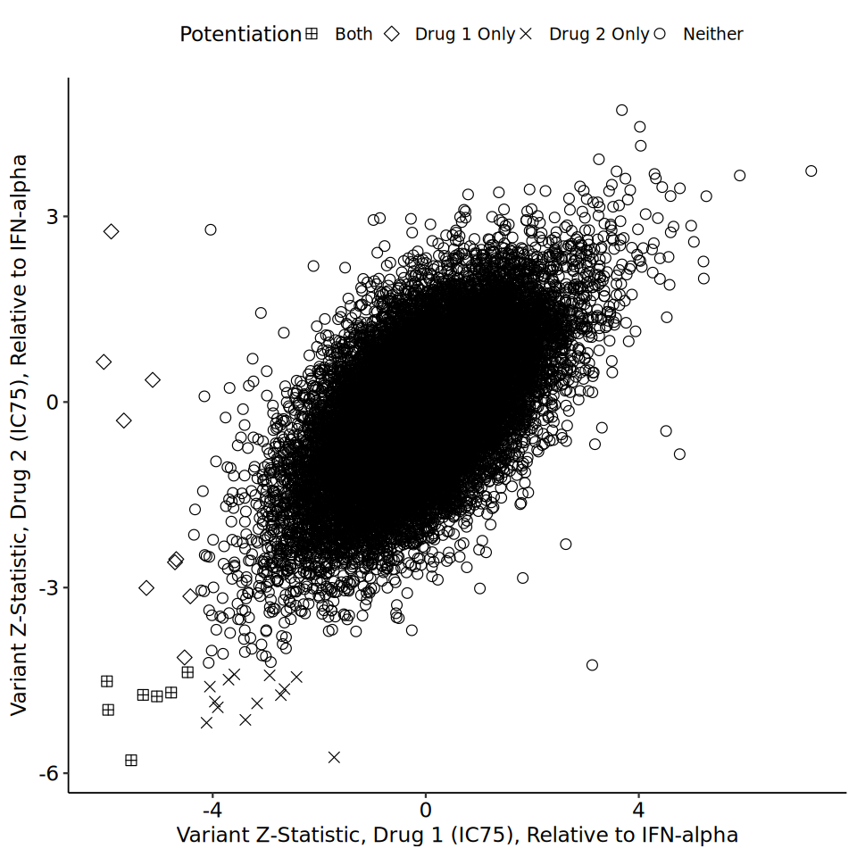
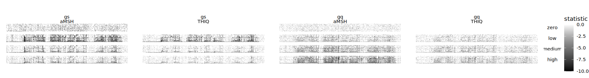
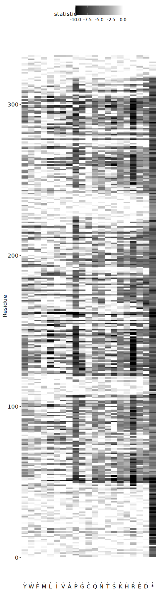

# Two-Color TYK2 Plots


<details class="code-fold">
<summary>Code</summary>

``` r
library(scales)
library(scico)
library(patchwork)
library(ggpubr)
library(tidyverse)
```

</details>

### Figure 8

<details class="code-fold">
<summary>Code</summary>

``` r
#aa_order <- c("Stop", "P", "G", "A", "M", "V", "L", "I", "T", "S",
#              "C", "Q", "N", "Y", "W", "F", "E", "D", "K", "H", "R")

ifna_signaling <- read_tsv("../paper/sumstats/TYK2-run7-combined-cleaned.sumstats.tsv", show_col_types = FALSE) %>%
    filter(condition == "IFNalpha100_0") %>%
    mutate(aa = if_else(aa %in% c("X", "Stop", "*"), "Stop", aa))
stability <- read_tsv("../paper/sumstats/TYK2-FLOW-flow-cleaned.midpoints.tsv", show_col_types = FALSE) %>%
    mutate(aa = if_else(aa %in% c("X", "Stop", "*"), "Stop", aa))

bind_heat_z <- ifna_signaling %>%
    rename("Z-Statistic" = "statistic") %>%
    ggplot() +
        geom_tile(aes(x = pos, y = fct_rev(aa), fill = `Z-Statistic`)) +
        scale_fill_scico(limits = c(-15, 0), palette = "grayC", oob = squish) +
        ylab("") + xlab("TYK2 Amino Acid Position") +
        ggtitle("TYK2 // Assay 7 // IFN-alpha 100 U/mL") +
        theme_pubr(base_size = 14, legend = "right")

stab_heat_z <- stability %>%
    rename("Z-Statistic" = "statistic") %>%
    ggplot() +
        geom_tile(aes(x = pos, y = fct_rev(aa), fill = `Z-Statistic`)) +
        scale_fill_scico(limits = c(-15, 0), palette = "grayC", oob = squish) +
        ylab("") + xlab("TYK2 Amino Acid Position") +
        ggtitle("TYK2 // FlowDMS") +
        theme_pubr(base_size = 14, legend = "right")

fig8 <- bind_heat_z / stab_heat_z
ggsave("../dataviz/patent/Fig8.pdf", fig8, width = 18, height = 10)
```

</details>
<details class="code-fold">
<summary>Code</summary>

``` r
options(repr.plot.width = 18, repr.plot.height = 10)
fig8
```

</details>



### Figure 15

<details class="code-fold">
<summary>Code</summary>

``` r
sumstats_resist <- read_tsv("../paper/sumstats/TYK2-combined-cleaned.contrast.tsv",
                            show_col_types = FALSE) %>%
    filter(assay == "assay4",
           condition %in% c("IFNalpha+BMS-986202_1e-06", "IFNalpha+Zasocitinib_1e-06"),
           aa != "*") %>%
    select(pos, condition, aa, statistic_contrast, fdr_contrast) %>%
    mutate(condition = if_else(condition == "IFNalpha+BMS-986202_1e-06", "drug1", "drug2")) %>%
    pivot_wider(names_from = condition, values_from = c(statistic_contrast, fdr_contrast)) %>%
    mutate(Resistance = case_when(fdr_contrast_drug1 < 0.01 & fdr_contrast_drug2 < 0.01 ~ "Both",
                                   fdr_contrast_drug1 < 0.01 & fdr_contrast_drug2 > 0.01 ~ "Drug 1 Only",
                                   fdr_contrast_drug1 > 0.01 & fdr_contrast_drug2 < 0.01 ~ "Drug 2 Only",
                                   TRUE ~ "Neither"),
          Resistance = if_else(statistic_contrast_drug2 < 0 & statistic_contrast_drug1 < 0,
                                "Neither",
                                Resistance))

fig15 <- ggplot(sumstats_resist) +
    geom_point(aes(x = statistic_contrast_drug1,
                   y = statistic_contrast_drug2,
                   pch = Resistance), size = 3) +
    theme_pubr(base_size = 14) +
    xlab("Variant Z-Statistic, Drug 1 (1uM, >IC99)") +
    ylab("Variant Z-Statistic, Drug 2 (1uM, >IC99)") +
    scale_shape_manual(values = c("Neither" = 1,
                                  "Drug 1 Only" = 5,
                                  "Drug 2 Only" = 4,
                                  "Both" = 12))

ggsave("../dataviz/patent/Fig15.pdf", fig15, width = 8, height = 8)
```

</details>
<details class="code-fold">
<summary>Code</summary>

``` r
options(repr.plot.width = 8, repr.plot.height = 8)
fig15
```

</details>



### Figure 16

<details class="code-fold">
<summary>Code</summary>

``` r
compute_difference <- function(test, control, sumstats) {
    
    df1 <- sumstats %>% filter(condition == test) %>% select(pos, aa, log2FoldChange, log2StdError)
    df2 <- sumstats %>% filter(condition == control) %>% select(pos, aa, log2FoldChange, log2StdError)
    
    df <- inner_join(df1, df2,
                     by = c("pos", "aa"))
    
    new_stats <- df %>%
        mutate(estimate = log2FoldChange.x - log2FoldChange.y,
               std.error = sqrt(log2StdError.x^2 + log2StdError.y^2)) %>%
        select(pos, aa, estimate, std.error) %>%
        ungroup()
    
    return(new_stats)
    
}
```

</details>
<details class="code-fold">
<summary>Code</summary>

``` r
sumstats_potentiate <- read_tsv("../paper/sumstats/TYK2-combined-cleaned.contrast.tsv",
                                show_col_types = FALSE) %>%
    filter(assay == "assay7",
           condition %in% c("IFNalpha100+BMS-986202_2e-08", "IFNalpha100+Zasocitinib_7e-09", "IFNalpha100_0"),
           aa != "*") 

bms_poten <- compute_difference(test = "IFNalpha100+BMS-986202_2e-08",
                                control = "IFNalpha100_0",
                                sumstats_potentiate) %>%
    mutate(condition = "drug1")

zaso_poten <- compute_difference(test = "IFNalpha100+Zasocitinib_7e-09",
                                control = "IFNalpha100_0",
                                sumstats_potentiate) %>%
    mutate(condition = "drug2")

contrast_potentiate <- bind_rows(bms_poten, zaso_poten) %>%
    mutate(statistic = estimate / std.error,
           p.value = pmin(pnorm(statistic, mean = 0, sd = 1)*2,
                                 (1-pnorm(statistic, sd = 1))*2),
           fdr = p.adjust(p.value, method = "BH")) %>%
    select(pos, aa, statistic, fdr, condition) %>%
    pivot_wider(names_from = condition, values_from = c(statistic, fdr)) %>%
    mutate(Potentiation = case_when(fdr_drug1 < 0.01 & fdr_drug2 > 0.01 ~ "Drug 1 Only",
                               fdr_drug1 > 0.01 & fdr_drug2 < 0.01 ~ "Drug 2 Only",
                               fdr_drug1 < 0.01 & fdr_drug2 < 0.01 ~ "Both",
                               TRUE ~ "Neither"),
           Potentiation = if_else(statistic_drug1 > 0,
                                 "Neither",
                                 Potentiation))

fig16 <- ggplot(contrast_potentiate) +
    geom_point(aes(x = statistic_drug1,
                   y = statistic_drug2,
                   pch = Potentiation), size = 3) +
    theme_pubr(base_size = 14) +
    xlab("Variant Z-Statistic, Drug 1 (IC75), Relative to IFN-alpha") +
    ylab("Variant Z-Statistic, Drug 2 (IC75), Relative to IFN-alpha") +
    scale_shape_manual(values = c("Neither" = 1,
                                  "Drug 1 Only" = 5,
                                  "Drug 2 Only" = 4,
                                  "Both" = 12))

ggsave("../dataviz/patent/Fig16.pdf", fig16, width = 8, height = 8)
```

</details>
<details class="code-fold">
<summary>Code</summary>

``` r
options(repr.plot.width = 8, repr.plot.height = 8)
fig16
```

</details>



### Figure 20A

<details class="code-fold">
<summary>Code</summary>

``` r
lehner_grouping <- c("*", "D", "E", "R", "H", "K", "S", "T", "N", "Q", "C", "G", "P", "A", "V", "I", "L", "M", "F", "W", "Y")

uas_annotation <- tribble(
  ~compound, ~concentration, ~dose,
  "aMSH", "1e-06", "high",
  "aMSH", "5e-08", "medium",
  "aMSH", "2e-08", "low",
  "None", "0", "zero",
  "THIQ", "1e-07", "high",
  "THIQ", "9e-09", "medium",
  "THIQ", "3e-09", "low",
)

cre_annotation <- tribble(
  ~compound, ~concentration, ~dose,
  "aMSH", "2e-08", "high",
  "aMSH", "5e-09", "medium",
  "aMSH", "5e-10", "low",
  "Forsk", "2.5e-05", NA,
  "None", "0", "zero",
  "THIQ", "1.2e-08", "high",
  "THIQ", "4e-09", "medium",
  "THIQ", "4e-10", "low"
)

uas_unnorm <- read_tsv("../../dms/mc4r-dms/sumstats/MC4R-DMS8-Gq-unnormalized.tsv",
                       show_col_types = FALSE) %>%
  separate(
    contrast,
    into = c("compound", "concentration", "norm"),
    remove = FALSE,
    sep = "_"
  ) %>%
  inner_join(uas_annotation, by = c("compound", "concentration"))

cre_unnorm <- read_tsv("../../dms/mc4r-dms/sumstats/MC4R-DMS5-Gs-unnormalized.tsv",
                       show_col_types = FALSE) %>%
  separate(
    contrast,
    into = c("compound", "concentration", "norm"),
    remove = FALSE,
    sep = "_"
  ) %>%
  inner_join(cre_annotation, by = c("compound", "concentration"))

unnorm_combo <- bind_rows(
  gs = cre_unnorm,
  gq = uas_unnorm,
  .id = "pathway"
) %>%
  mutate(aa = if_else(aa == "X", "*", aa))

heatmap_examples <- unnorm_combo %>%
    filter(compound != "Forsk") %>%
    mutate(
    pathway = factor(pathway, levels = c("gs", "gq")),
    aa = factor(aa, levels = lehner_grouping),
    dose = factor(dose, levels = c("zero", "low", "medium", "high")),
    compound = if_else(compound == "None", "aMSH", compound),
    compound = factor(compound, levels = c("aMSH", "THIQ", "None", "Forsk"))) %>%
        ggplot(aes(x = pos, y = aa, fill = statistic)) +
        geom_tile() +
        facet_grid(cols = vars(pathway, compound), rows = vars(dose)) +
        coord_equal() +
        scale_fill_scico(palette = "grayC", limits = c(-10, 0), oob = scales::squish) +
        theme_void() +
        theme(legend.position = "right")

ggsave("../dataviz/patent/Fig20A-1.pdf", heatmap_examples,
       width = 15, height = 2)
```

</details>
<details class="code-fold">
<summary>Code</summary>

``` r
options(repr.plot.width = 15, repr.plot.height = 2)
heatmap_examples
```

</details>



<details class="code-fold">
<summary>Code</summary>

``` r
cre_dose <- tribble(
  ~contrast, ~dose, ~compound, ~concentration,
  "None_0_minus_Forsk_2.5e-05", "zero", "None", NA,
  "aMSH_2e-08_minus_Forsk_2.5e-05", "high", "aMSH", "2e-08",
  "aMSH_5e-09_minus_Forsk_2.5e-05", "medium", "aMSH", "5e-09",
  "aMSH_5e-10_minus_Forsk_2.5e-05", "low", "aMSH", "5e-10",
  "THIQ_1.2e-08_minus_Forsk_2.5e-05", "high", "THIQ", "1.2e-08",
  "THIQ_4e-09_minus_Forsk_2.5e-05", "medium", "THIQ", "4e-09",
  "THIQ_4e-10_minus_Forsk_2.5e-05", "low", "THIQ", "4e-10"
) %>%
  mutate(dose = factor(dose, levels = c("zero", "low", "medium", "high")))

cre <- read_tsv("../../dms/mc4r-dms/sumstats/MC4R-DMS5-Gs.tsv",
                show_col_types = FALSE) %>%
  inner_join(cre_dose, by = "contrast") %>%
  rename(
    log2FoldChange = log2ContrastEstimate,
    log2StdError = log2ContrastError
  ) %>%
  mutate(
    aa = if_else(aa == "X", "*", aa),
    aa = factor(aa, levels = lehner_grouping)
  )

amsh_long <- cre %>%
    filter(dose == "low",
           compound == "aMSH") %>%    
        ggplot(aes(y = pos, x = fct_rev(aa), fill = statistic)) +
        geom_tile() +
        scale_fill_scico(palette = "grayC", limits = c(-10, 0), oob = scales::squish) +
        theme_pubr(base_size = 10) +
        theme(legend.position = "top",
              axis.line = element_blank()) +
        xlab("") +
        ylab("Residue")

ggsave("../dataviz/patent/Fig20A-2.pdf", amsh_long,
       width = 4, height = 15)
```

</details>
<details class="code-fold">
<summary>Code</summary>

``` r
options(repr.plot.width = 4, repr.plot.height = 15)
amsh_long
```

</details>


