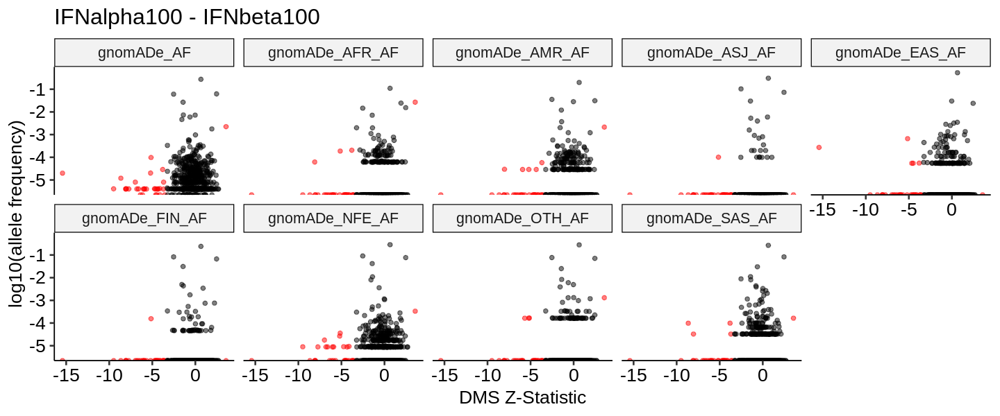
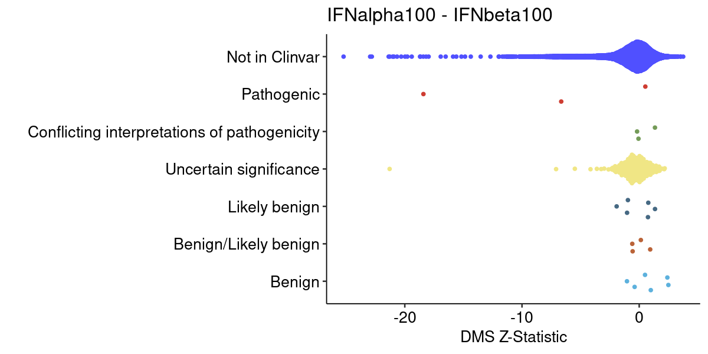
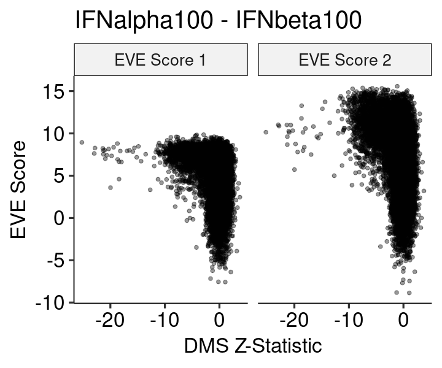
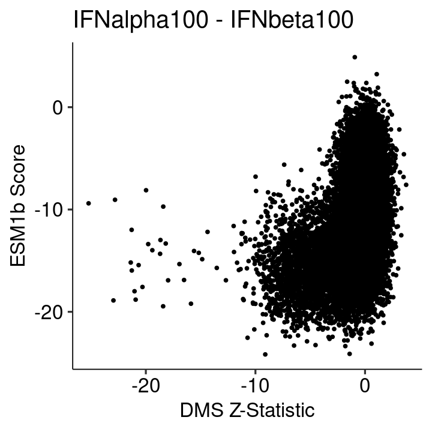
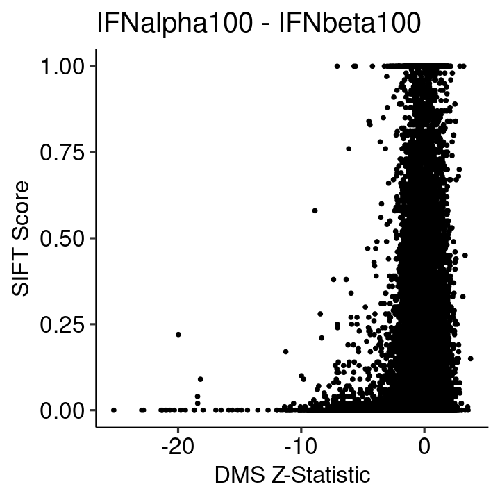
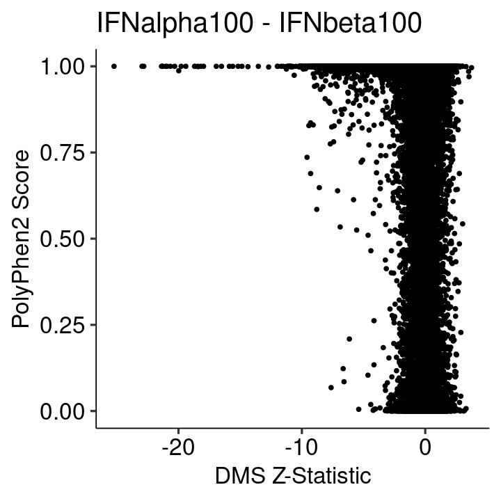
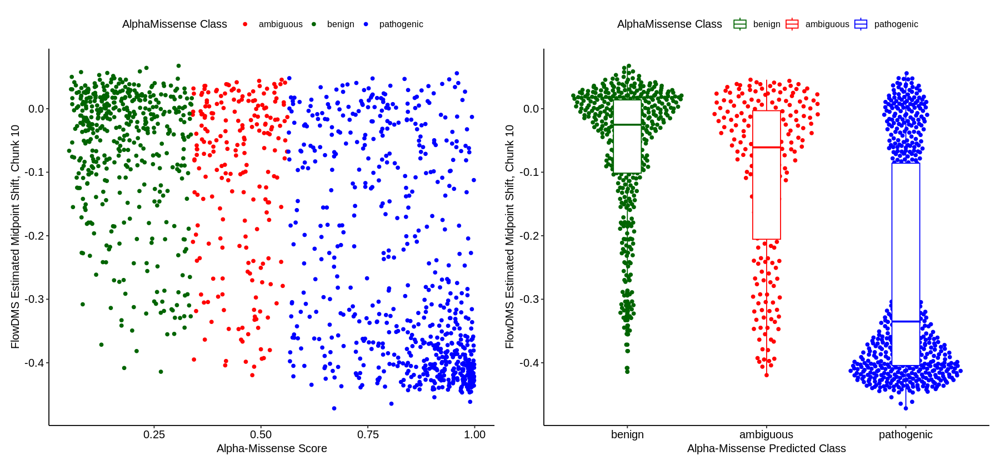

### TYK2 Full-Length DMS Variant Interpretation

1. [Allele Frequencies](#part1)
2. [ClinVar](#part2)
3. [EVE and ESM1b](#part3)
4. [SIFT and Polyphen2](#part4)
5. [AlphaMissense](#part5)

#### Allele Frequencies 

Each variant has a population-level allele frequency, which we can plot for each global population for which we have data from Gnomad. In the plots below, red points are significant in the DMS data at an adjusted p-value < 0.01:

    

    

#### ClinVar 

There are 316 missense variants in TYK2 noted in ClinVar, which we can compare to our data stratified by ClinVar classification from Benign to Pathogenic. Notably, P1104A is classified as Benign/Likely Benign, so there is not necessairly a strong expectation that our functional effects should associate strongly with a ClinVar class:

    

    

The vast majority of variants are either not in ClinVar, or are of uncertain significance. So, if we extract all variants NOT in either of those two categories, we can show them together in a table with the DMS adjusted p-value:

    
    
    |mutation   |ClinVar category                             | DMS adjusted p-value|
    |:----------|:--------------------------------------------|--------------------:|
    |Leu757Val  |Pathogenic                                   |            0.9335208|
    |Gly799Arg  |Pathogenic                                   |            0.0000000|
    |Leu1014Pro |Pathogenic                                   |            0.0000000|
    |Arg701Thr  |Conflicting interpretations of pathogenicity |            0.6937203|
    |Arg118Gln  |Conflicting interpretations of pathogenicity |            0.9815307|
    |Gly512Arg  |Conflicting interpretations of pathogenicity |            0.9939568|
    |Gly39Ser   |Likely benign                                |            0.8078417|
    |Gly634Glu  |Likely benign                                |            0.8872849|
    |Gly761Val  |Likely benign                                |            0.8803602|
    |Pro871Ser  |Likely benign                                |            0.6923552|
    |His993Tyr  |Likely benign                                |            0.4209141|
    |Val237Ile  |Likely benign                                |            0.8296934|
    |Val15Ala   |Benign/Likely benign                         |            0.8371409|
    |Pro820His  |Benign/Likely benign                         |            0.9860846|
    |Ala928Val  |Benign/Likely benign                         |            0.9269503|
    |Pro1104Ala |Benign/Likely benign                         |            0.9213050|
    |Ala53Thr   |Benign                                       |            0.9540046|
    |Ile684Ser  |Benign                                       |            0.8051791|
    |Glu1163Gly |Benign                                       |            0.9378830|
    |Arg197His  |Benign                                       |            0.2028906|
    |Val362Phe  |Benign                                       |            0.8221218|
    |Gly363Ser  |Benign                                       |            0.1702198|

#### EVE and ESM1b 

EVE (both scores from the Marks lab) and ESB1b have extremely similar patterns:

    

    

    

    

#### SIFT and PolyPhen2 

The older predictors also have L-shaped patterns, though with visibly lower resolution to distinguish between similar variants:

    

    

    

    

#### AlphaMissense 

Comparing AlphaMissense variant effect predictions with TYK2 VAMP-seq for chunk 10.

    Warning message:
    “Removed 70 rows containing missing values (`geom_point()`).”

    

    

