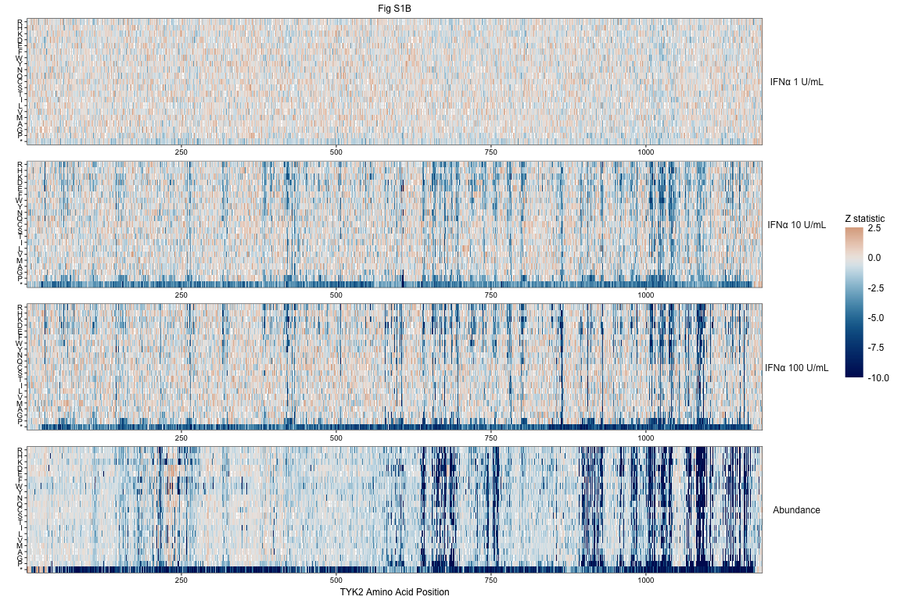

# TYK2 DMS manuscript - Fig 1 supplement -
Robert Warneford-Thomson

- [<span class="toc-section-number">1</span> I. SETUP](#i-setup)
  - [<span class="toc-section-number">1.0.1</span> Packages](#packages)
  - [<span class="toc-section-number">1.0.2</span>
    Variables](#variables)
- [<span class="toc-section-number">2</span> Functions](#functions)
  - [<span class="toc-section-number">2.1</span>
    compute_difference](#compute_difference)
  - [<span class="toc-section-number">2.2</span> theme_pub](#theme_pub)
- [<span class="toc-section-number">3</span> Load and format
  data](#load-and-format-data)
- [<span class="toc-section-number">4</span> Figures](#figures)
  - [<span class="toc-section-number">4.1</span> Fig S1B - Flow +
    IFNa-1,10,100 heatmaps](#fig-s1b---flow--ifna-110100-heatmaps)
  - [<span class="toc-section-number">4.2</span> Fig S1C - Barplots with
    LoF/GoF counts](#fig-s1c---barplots-with-lofgof-counts)
  - [<span class="toc-section-number">4.3</span> Fig S1D - stop effect
    density plots](#fig-s1d---stop-effect-density-plots)
  - [<span class="toc-section-number">4.4</span> Fig S1E - Fiducial
    variant forest plot](#fig-s1e---fiducial-variant-forest-plot)
  - [<span class="toc-section-number">4.5</span> Fig S1F - Beeswarm with
    ClinVar, ESM, AlphaMissense
    etc](#fig-s1f---beeswarm-with-clinvar-esm-alphamissense-etc)

# I. SETUP

### Packages

<details class="code-fold">
<summary>Code</summary>

``` r
pacman::p_load(
  colorspace,
  ggbeeswarm,
  ggnewscale,
  ggh4x,
  ggpubr,
  ggsci,
  magrittr,
  paletteer,
  patchwork,
  scico,
  tidyverse
)
```

</details>

### Variables

<details class="code-fold">
<summary>Code</summary>

``` r
knitr::opts_chunk$set(
  echo = FALSE,
  fig.path = "./fig-1/",
  warning = FALSE,
  message = FALSE,
  dev = c("png", "pdf")
)
setwd("~/Analyses/bms-dms/paper")

cbPalette <- c( "#0072B2","#DC5E65", "#56B4E9","#E69F00",  "#009E73", "#F0E442", "pink", "#CC79A7","lightgrey", "grey", "darkgrey")

aa_order <- c("*", "P", "G", "A", "M", "V", "L", "I", "T", "S",
              "C", "Q", "N", "Y", "W", "F", "E", "D", "K", "H", "R")

source("../../dms/src/model/dms-analysis-utils.R")
```

</details>

# Functions

## compute_difference

## theme_pub

# Load and format data

After discussing with Conor, will use 1 and 10 U/mL IFNa data from run3,
and 100 U/mL IFNa from run7

# Figures

## Fig S1B - Flow + IFNa-1,10,100 heatmaps



## Fig S1C - Barplots with LoF/GoF counts

## Fig S1D - stop effect density plots

## Fig S1E - Fiducial variant forest plot

## Fig S1F - Beeswarm with ClinVar, ESM, AlphaMissense etc
