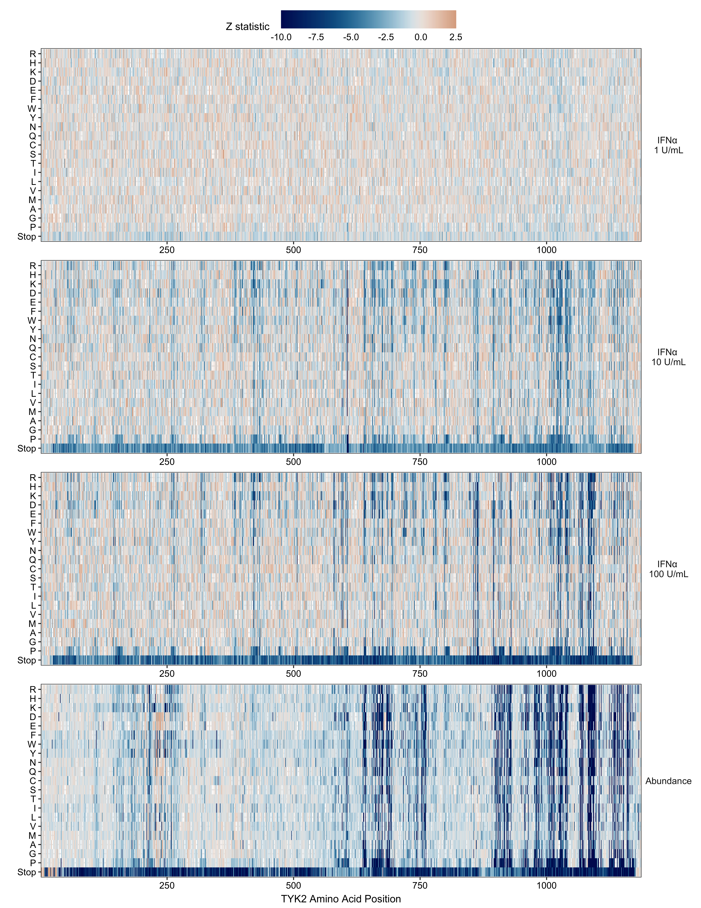
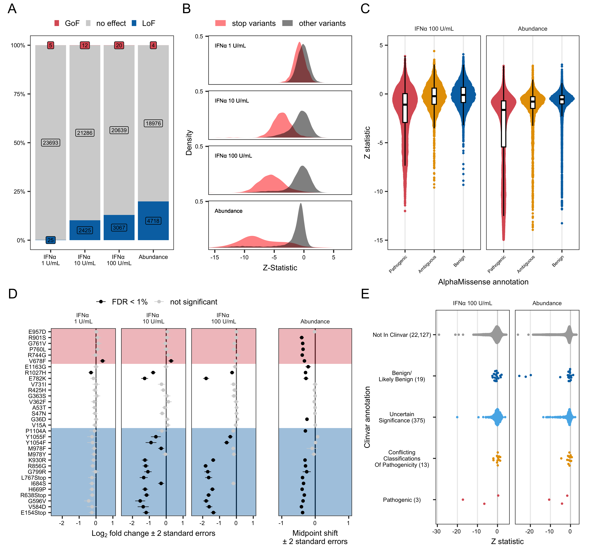

# TYK2 DMS manuscript - Fig 1 supplement -
Robert Warneford-Thomson

- [<span class="toc-section-number">1</span> I. SETUP](#i-setup)
  - [<span class="toc-section-number">1.0.1</span> Packages](#packages)
  - [<span class="toc-section-number">1.0.2</span>
    Variables](#variables)
- [<span class="toc-section-number">2</span> Functions](#functions)
  - [<span class="toc-section-number">2.1</span>
    compute_difference](#compute_difference)
  - [<span class="toc-section-number">2.2</span> theme_pub](#theme_pub)
- [<span class="toc-section-number">3</span> Load and format
  data](#load-and-format-data)
- [<span class="toc-section-number">4</span> Load
  metadata](#load-metadata)
- [<span class="toc-section-number">5</span> Figures](#figures)
  - [<span class="toc-section-number">5.1</span> Fig S1x1 - Flow +
    IFNa-1,10,100 heatmaps](#fig-s1x1---flow--ifna-110100-heatmaps)
  - [<span class="toc-section-number">5.2</span> Fig S1x2](#fig-s1x2)
    - [<span class="toc-section-number">5.2.1</span> Fig S1x2-A -
      Barplots with LoF/GoF
      counts](#fig-s1x2-a---barplots-with-lofgof-counts)
    - [<span class="toc-section-number">5.2.2</span> Fig S1x2-B - stop
      effect density plots](#fig-s1x2-b---stop-effect-density-plots)
    - [<span class="toc-section-number">5.2.3</span> Fig S1x2-C -
      AlphaMissense](#fig-s1x2-c---alphamissense)
    - [<span class="toc-section-number">5.2.4</span> Fig S1x2-D -
      Fiducial variant forest
      plot](#fig-s1x2-d---fiducial-variant-forest-plot)
    - [<span class="toc-section-number">5.2.5</span> Fig S1x2-E -
      ClinVar annotation](#fig-s1x2-e---clinvar-annotation)
  - [<span class="toc-section-number">5.3</span> Merged Figure
    S1x2](#merged-figure-s1x2)

# I. SETUP

### Packages

<details class="code-fold">
<summary>Code</summary>

``` r
pacman::p_load(
  colorspace,
  ggbeeswarm,
  ggnewscale,
  ggh4x,
  ggpubr,
  ggsci,
  ggsignif,
  magrittr,
  readxl,
  paletteer,
  patchwork,
  scico,
  tidyverse
)
```

</details>

### Variables

<details class="code-fold">
<summary>Code</summary>

``` r
knitr::opts_chunk$set(
  echo = FALSE,
  root.dir = "~/Analyses/bms-dms/paper",
  fig.path = "./fig-1/",
  fig.dpi=600,
  warning = FALSE,
  message = FALSE, 
  dev = c("png", "pdf")
)

cbPalette <- c("#DC5E65", "#E69F00", "#56B4E9", "#0072B2", "darkgrey", "#009E73", "#F0E442", "pink", "#CC79A7", "lightgrey", "grey")

aa_order <- c(
  "*", "P", "G", "A", "M", "V", "L", "I", "T", "S",
  "C", "Q", "N", "Y", "W", "F", "E", "D", "K", "H", "R"
)

setwd("~/Analyses/bms-dms/paper")

source("../../dms/src/model/dms-analysis-utils.R")
```

</details>

# Functions

## compute_difference

## theme_pub

# Load and format data

After discussing with Conor, will use 1 and 10 U/mL IFNa data from run3,
and 100 U/mL IFNa from run7

# Load metadata

# Figures

## Fig S1x1 - Flow + IFNa-1,10,100 heatmaps

<div id="fig-S1x1">




Figure 1

</div>

## Fig S1x2

### Fig S1x2-A - Barplots with LoF/GoF counts

I’m going to just use a 1% FDR to determine GoF and LoF variants with no
minimum log2fold or midpoint shift threshold

### Fig S1x2-B - stop effect density plots

### Fig S1x2-C - AlphaMissense


### Fig S1x2-D - Fiducial variant forest plot

### Fig S1x2-E - ClinVar annotation

## Merged Figure S1x2

<div id="fig-S1x2-merged">




Figure 2

</div>
