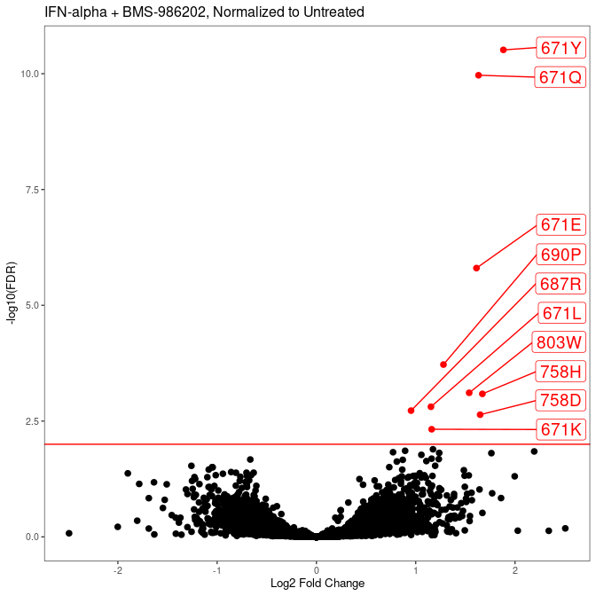

---
author:
- Nathan Abell and Conor Howard
authors:
- Nathan Abell and Conor Howard
date: June 25, 2024
title: Octant-BMS TYK2 Manuscript Data Visuals
toc-title: Table of contents
---

::: cell
:::

# Common Data Processing

::: cell
:::

# Figure 1

::: cell
:::

### Main Heatmaps

::: cell
::: cell-output-display

:::
:::

::: cell
::: cell-output-display

:::
:::

# Figure 2

::: cell
:::

### IFN-alpha Signaling vs Stability

::: cell
::: cell-output-display

:::
:::

::: cell
::: cell-output-display

:::
:::

# Figure 3

::: cell
:::

### Drug Resistance

::: cell
::: cell-output-display

:::
:::
