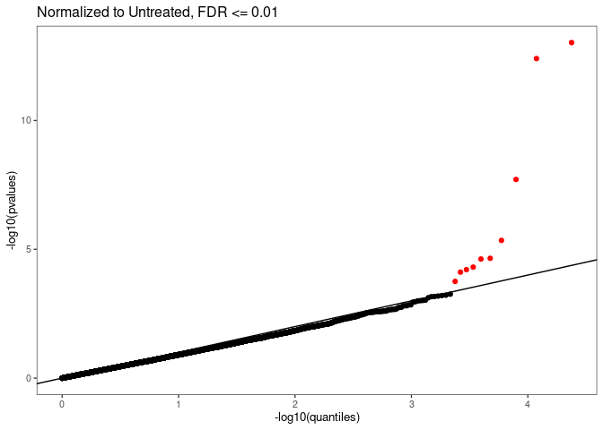
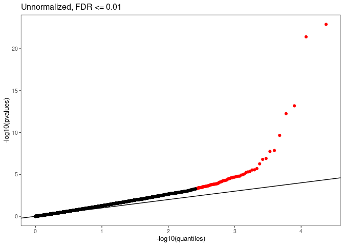

Octant-BMS TYK2 Manuscript Data Visuals
================
Nathan Abell and Conor Howard
September 03, 2024

# Common Data Processing

# Figure 1

### Main Heatmaps

<!-- -->

<!-- -->

# Figure 2

### IFN-alpha Signaling vs Stability

<!-- -->

<!-- -->

# Figure 3

### Drug Resistance

<!-- -->

### Thresholding

<!-- --><!-- -->
