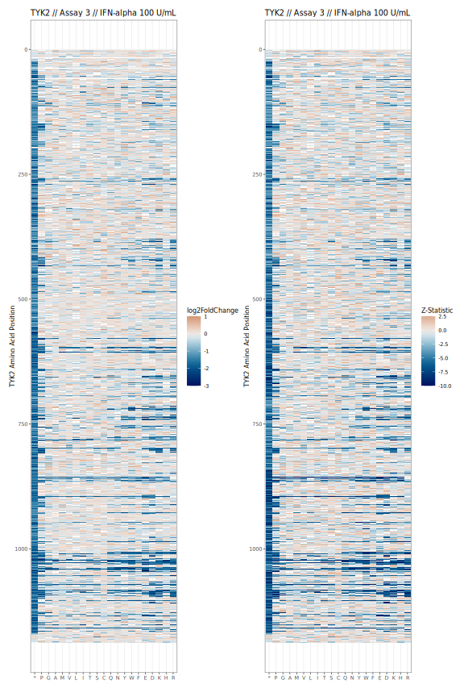
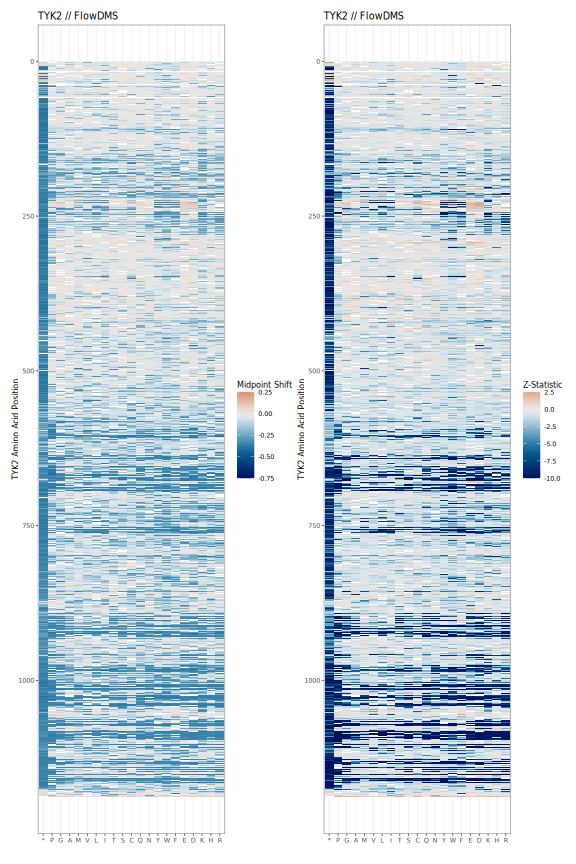
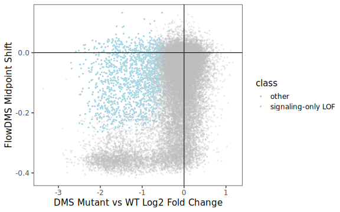
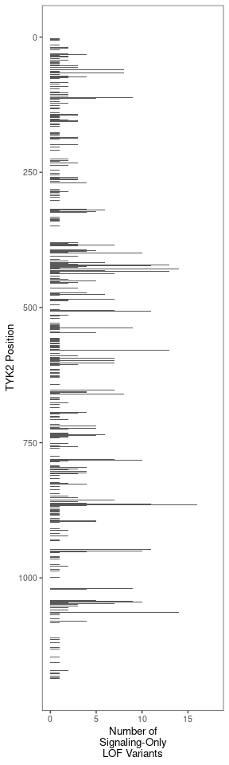
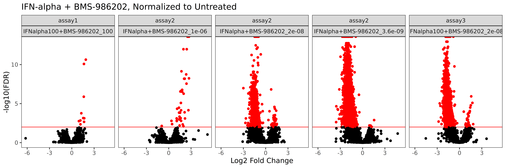
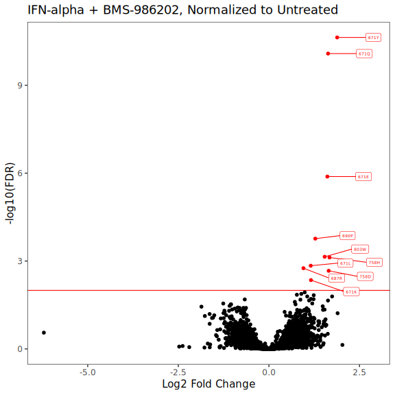

# Common Data Processing


# Figure 1


```
## Error in file(filename, "r", encoding = encoding): cannot open the connection
```

### Main Heatmaps






# Figure 2


### IFN-alpha Signaling vs Stability






# Figure 3


### Drug Resistance





### Chemical Footprints


